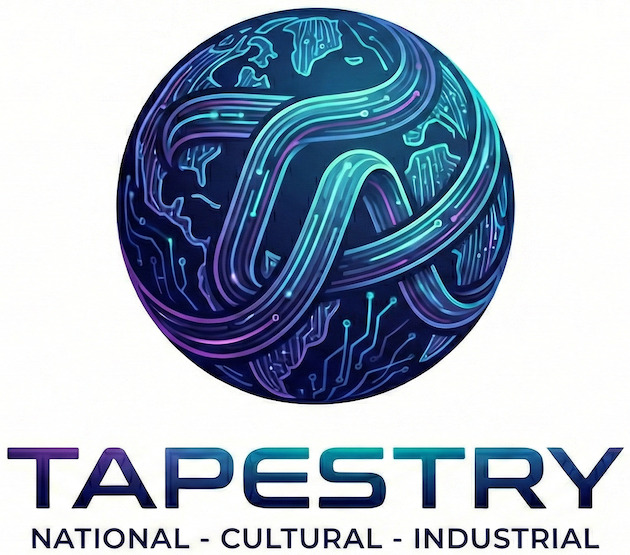

# Welcome to Project Tapestry

#### Project Tapestry is bringing together talented people, data, and compute from a global consortium of partners to build a new foundation model system trained on a larger and more diverse corpus than ever before. 

#### Tapestry will enable sovereign AI by ensuring ownership of data and compute remains with partners, and that partners can continue to train sovereign derivatives of the consortium-trained base model that they own using the Tapestry open source training platform.

Learn more from our [Kickoff Workshop Blog](https://thealliance.ai/blog/project-tapestry-the-path-to-frontier-sovereign-ai) and check out the [Project Tapestry](https://thealliance.ai/projects/tapestry/) website for more information about partnering, events, and how to support Project Tapestry.

This repo contains the code and technical documentation for the project. We invite you to jump in and help!
<p align="center">
  
</p>

<!--  -->

The rest of this README provides information for contributors and users of this repository.

## Contribute to Our First Milestones
Project Tapestry has big plans, and we're starting with some fundamental building blocks.

* [LLM Cultural Alignment and Re-alignment](https://github.com/The-AI-Alliance/tapestry/issues/22) _repository coming soon_ - help us develop techniques for cultural alignment, initially based on the [Inglehart–Welzel Cultural Map](https://en.wikipedia.org/wiki/Inglehart%E2%80%93Welzel_cultural_map_of_the_world) as a metric. This task will implement a corresponding evaluation and implement tuning experiments to understand how to shift alignment without compromising general model performance. Prior expertise in evaluation and tuning technologies are especially welcome.
* [Consortium Training](https://github.com/The-AI-Alliance/tapestry/issues/24) _repository coming soon_ - Tapestry's approach to global model development relies on a balance between centralized and distributed training that preserves use and privacy requirements for data sets. Help us adapt and develop optimal techniqes with ideas from both federated learning and the latest LLM pre-training and post-training methods. Prior expertise in large scale LLM training, distributed infrastructure, and federated learning are especially welcome.
* [Global Training Data Corpus](https://thealliance.ai/projects/tapestry/training-data-proposals) A core thesis of project Tapestry is that bringing together a much more diverse set of data can provide a path to a better frontier base model for all. What unique datasets exist that could be brought to Tapestry model training? They don't have to be fully open; we will work with you to define and enforce appropriate requirements.
* Tapestry Model Development Roadmap - _coming soon_ - we want your input!

### Quick Paths

> [!NOTE]
> Make sure to read [**Getting Involved**](#getting-involved-anchor) below for information on contribution guidelines, etc.
> 
### Working with the Source Code

The source code is under the [`src`](src/) directory.

* Use the [**`Makefile`**](Makefile) targets, e.g., `make help`. More details are in [**Development**](#development-anchor) below.
* Runnable demos in [**`examples/`**](examples/) (try `make consortium-demo`).
* Consortium training prototype in [**`src/tapestry/training/consortium/`**](src/tapestry/training/consortium/README.md) (try `make consortium-demo` and also `make consortium-tests`).

### Working with the Technical Documentation

The technical documentation lives under [**`tech-docs`**](tech-docs/README.md):

* [**Architecture**](tech-docs/architecture/README.md)
	* The _TVA methodology_: phased outputs (stakeholder map through design goals), architectural options and core thesis, plus:
		* [**Architecture Decision Records**](tech-docs/architecture/decisions/)
		* [**Diagrams**](tech-docs/architecture/diagrams/) 
* [**Governance**](tech-docs/governance/)
* [**Strategic Plan**](tech-docs/strategic-plan/)
* [**Reference Materials**](tech-docs/reference/) (e.g. [**training paradigms**](tech-docs/reference/training-approaches.md))
* [**Work Groups**](tech-docs/work-groups/)

For repo layout, conventions, and where to find implementation code, see [**`AGENTS.md`**](AGENTS.md).

<a id="development-anchor"></a>

## Development

### Setup

This project uses [`uv`](https://docs.astral.sh/uv/) for Python package management.

#### Install uv

On macOS/Linux:

```shell
curl -LsSf https://astral.sh/uv/install.sh | sh
```

On Windows:

```shell
powershell -c "irm https://astral.sh/uv/install.ps1 | iex"
```

The rest of the steps discussed next are automated using `make`. Try the following:

```shell
make one-time-setup
```

#### Create a Virtual Environment

The `one-time-setup` target runs the following command (but it only works on macOS or Linux). You can also do this manually:

On macOS/Linux:

```shell
uv venv
source .venv/bin/activate
```
On Windows:

```shell
uv venv
.venv\Scripts\activate
```

#### Install Dependencies

The `one-time-setup` target runs the first of the following commands (but it only works on macOS or Linux). You can also run either command manually:

```shell
uv pip install -e ".[dev]"  # full development dependencies
uv pip install -e .         # minimum dependencies
```

### Running Tests

We use [unittest](https://docs.python.org/3/library/unittest.html) and [hypothesis](https://hypothesis.readthedocs.io/en/latest/) for testing. The easiest way to run the test suite is using `make`:

```shell
make unit-tests # or just tests; they are currently the same.
```

This runs the following commands, which you can run yourself if you prefer:

```shell
cd src
uv run python -m unittest discover \
    --pattern 'test_*.py' \
    --start-directory tests \
    --top-level-directory .
```

### Code Formatting

Use _either_ of the following commands to format the Python code with `black`:

```shell
make format
# or
uv run black src
```

### Linting

Use _either_ of the following commands to lint the Python code with `ruff` and `pylint`:

```shell
make lint
# or
uv run ruff check src
uv pylint src
```

### Type Checking

Use _either_ of the following commands to type check the Python code with `ty`:

```shell
make type-check
# or
uv run ty src
```

There is also a "watch" option that keeps `ty` running as you fix mistakes and save the files:

```shell
make type-check-watch
# or
uv run ty --watch src
```

### Before You Submit a PR...

Before submitting a PR, please run the format, lint, and type checking commands, then run the tests. Make sure everything passes cleanly! Use the convenient `make` target `before-pr`, or run the individual commands above:

```shell
make before-pr               # Equivalent to 'make format lint type-check tests'
make format-lint-type-check  # Equivalent to 'make format lint type-check'
```

> [!NOTE]
> Make sure to read [**Getting Involved**](#getting-involved-anchor) below before submitting a PR.

## Project Code Structure

In addition to the top-level directories `tech-docs`, discussed above, `docs`, discussed below, and [`contrib`](contrib/README.md), the staging area for contributed ideas and techniques, the code structure is as follows. At this time, there are three major _subsystems_:

* `data` for all data governance and management capabilities.
* `training` for all distributed training and tuning capabilities.
* `infrastructure` for all underlying infrastructure.

```
tapestry/
├── contrib/        # Contributed ideas & techniques, proposed via PR
├── src/
│   └── tapestry/
│       └── data/
│       └── infrastructure/
│       └── training/
│   └── tests
│       └── tapestry/
│           └── data/
│           └── infrastructure/
│           └── training/
```

<a id="getting-involved-anchor"></a>

## Getting Involved

We welcome contributions as [pull requests](https://github.com/The-AI-Alliance/tapestry/pulls), [issues](https://github.com/The-AI-Alliance/tapestry/issues), and [discussions](https://github.com/The-AI-Alliance/tapestry/discussions). 

See [CONTRIBUTING.md](CONTRIBUTING.md) for guidelines. In particular, [read this section](CONTRIBUTING.md#developer-certificate-of-origin-dco) on using _DCO_ with any commits.

Have an idea, technique, or experiment you'd like the project to consider? The [**`contrib/`**](contrib/README.md) directory is a lightweight staging area where contributors can propose work via a PR into their own subdirectory. See [**`contrib/README.md`**](contrib/README.md) for the simple workflow and contribution policy.

You can also join one or more work groups that are being organized to identify requirements in several areas and to start the engineering work to prototype and test ideas, followed by the initial implementation iterations. Details are are being documented in [**`tech-docs/work-groups/`**](tech-docs/work-groups/).


### Licenses

All _code_ contributions are licensed under the [Apache 2.0 LICENSE](https://github.com/The-AI-Alliance/community/blob/main/LICENSE.Apache-2.0) (which is also in this repo, [LICENSE.Apache-2.0](LICENSE.Apache-2.0)).

All _documentation_ contributions are licensed under the [Creative Commons Attribution 4.0 International](https://github.com/The-AI-Alliance/community/blob/main/LICENSE.CC-BY-4.0) (which is also in this repo, [LICENSE.CC-BY-4.0](LICENSE.CC-BY-4.0)).

All _data_ contributions are licensed under the [Community Data License Agreement - Permissive - Version 2.0](https://github.com/The-AI-Alliance/community/blob/main/LICENSE.CDLA-2.0) (which is also in this repo, [LICENSE.CDLA-2.0](LICENSE.CDLA-2.0)).

We use the "Developer Certificate of Origin" (DCO).

> [!WARNING]
> Before you make any git commits with changes, understand what's required for DCO.

See the contributing guide [section on DCO](CONTRIBUTING.md#developer-certificate-of-origin-dco) for details. In practical terms, supporting this requirement means you must use the `-s` flag with your `git commit` commands.

## About the Technical Website (GitHub Pages)

The [website](https://the-ai-alliance.github.io/tapestry/) for this repository provides another way to discover and navigate the technical documentation content in [`tech-docs`](/tech-docs). However, at this time, the site mostly just points to the content in [`tech-docs`](tech-docs/). The website sources are in the [`docs`](docs/) directory.

The website is published using [GitHub Pages](https://pages.github.com/), where the pages are written in Markdown and served using [Jekyll](https://github.com/jekyll/jekyll). See [GITHUB_PAGES.md](GITHUB_PAGES.md) for all the details.
