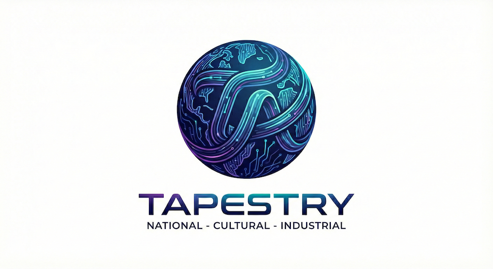
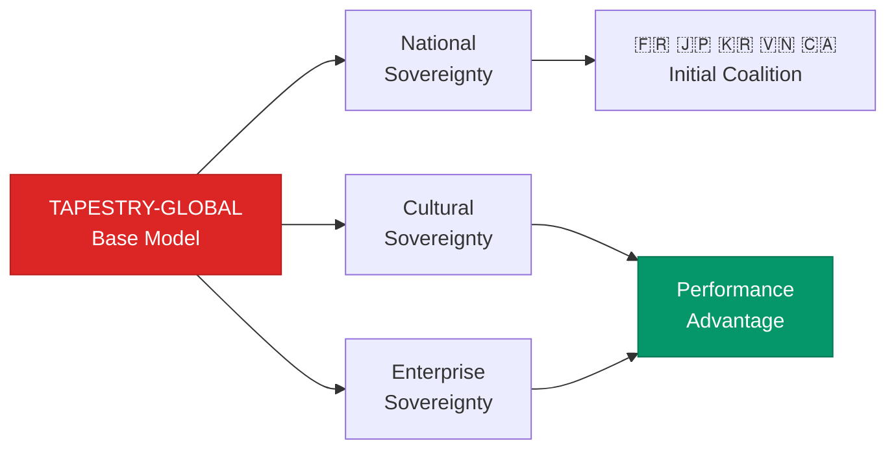

# README for Project Tapestry - Technical Repo

> [Technical website](https://the-ai-alliance.github.io/tapestry/)

This repo contains the code and technical documentation for the AI Alliance, [Project Tapestry](https://events.thealliance.ai/tapestry). 



The rest of this README provides a technical overview of Tapestry and information for contributors, developers, and users of this repository.

## What Is Project Tapestry?

The vision, motivations, and goals for Project Tapestry are described [here](https://events.thealliance.ai/tapestry). In a nutshell, Project Tapestry seeks to build a globally-distributed effort to train and tune state-of-the-art foundation models with full support for the requirements of three pillars of _sovereignty_:

1. **National Sovereignty** - *Geopolitical Control*
	* Data stays in-country
	* Compute and storage nodes operate under national law
	* Public sector data access
1. **Cultural Sovereignty** - *Values Alignment*
	* [Constitutional AI](https://constitutional.ai/) customized per culture
	* Community participation
	* Sacred knowledge protection
3. **Industrial Sovereignty** - *Domain Independence*
	* 1000+ specialized model variants
	* On-premise deployment
	* Institution-specific optimization

## 🏗️ How It Works



([JPEG]({{site.baseurl}}/assets/images/tapestry-pillars.jpg))

**Federated Training**: Data stays in-country → Encrypted updates improve global model → 15%+ gains on cultural tasks

### What Makes TAPESTRY Unbeatable

- ✅ **Unique Data Access**: Public sector data (healthcare, education, governance) that centralized models cannot legally access.
- ✅ **Performance Edge**: 15%+ gains on culturally-specific tasks through sovereign data + cultural alignment.
- ✅ **Federated Architecture**: Encrypted training without centralizing sensitive data.
- ✅ **Global Coalition**: France, Japan, South Korea, Vietnam, Canada leading initial deployment (not G7-exclusive).


## Getting Involved

Several work groups are being organized to identify requirements in several areas and to start the engineering work to prototype and test ideas, followed by the initial implementation iterations. Details are to be announced. The work group documentation is found under the [`work-groups`](work-groups) directory.

We welcome contributions as PRs, etc. See [More about Getting Involved](#getting-involved-anchor) below for details about AI Alliance contribution guidelines, licenses, etc.

## Development

### Setup

This project uses [`uv`](https://docs.astral.sh/uv/) for Python package management.

#### Install uv

On macOS/Linux:

```shell
curl -LsSf https://astral.sh/uv/install.sh | sh
```

On Windows:

```shell
powershell -c "irm https://astral.sh/uv/install.ps1 | iex"
```

The rest of the steps are partially automated using `make`. Try the following:

```shell
make one-time-setup
```

#### Create a Virtual Environment

If `make one-time-setup` didn't work or you want to set up the virtual environment manually:

On macOS/Linux:

```shell
uv venv
source .venv/bin/activate
```
On Windows:

```shell
uv venv
.venv\Scripts\activate
```

#### Install Dependencies

If `make one-time-setup` didn't work or you want to install the dependencies yourself run _one_ of the following commands:

```shell
uv pip install -e ".[dev]"  # full development dependencies
uv pip install -e .         # minimum dependencies
```

### Running Tests

We use [unittest](https://docs.python.org/3/library/unittest.html) and [hypothesis](https://hypothesis.readthedocs.io/en/latest/) for testing. The easiest way to run the test suite is using `make`:

```shell
make unit-tests # or just tests; they are currently the same.
```

This runs the following commands, which you can run yourself if you prefer:

```shell
cd src
uv run python -m unittest discover \
    --pattern 'test_*.py' \
    --start-directory tests \
    --top-level-directory .
```

### Code Formatting

Use _either_ of the following commands to format the Python code with `black`:

```shell
make format
uv run black src
```

### Linting

Use _either_ of the following commands to lint the Python code with `ruff` and `pylint`:

```shell
make lint
# or
uv run ruff check src
uv pylint src
```

### Type Checking

Use _either_ of the following commands to type check the Python code with `ty`:

```shell
make type-check
uv run ty src
```

There is also a "watch" option that keeps `ty` running as you fix mistakes and save the files:

```shell
make type-check-watch
uv run ty --watch src
```

## Project Structure

The structure is as follows, where three major _subsystems_ are managed: 
* `data` for all data governance and management capabilities.
* `training` for all distributed training and tuning capabilities.
* `infrastructure` for all underlying infrastructure.

```
tapestry/
├── src/
│   └── tapestry/
│       └── data/
│       └── training/
│       └── infrastructure/
│   └── tests
│       └── tapestry/
│           └── data/
│           └── training/
│           └── infrastructure/
```

<a id="getting-involved-anchor"></a>

## Getting Involved

We welcome contributions as PRs, either to our code examples or our user guide. Please see our [Alliance community repo](https://github.com/The-AI-Alliance/community/) for general information about contributing to any of our projects. This section provides some specific details you need to know.

In particular, see the AI Alliance [CONTRIBUTING](https://github.com/The-AI-Alliance/community/blob/main/CONTRIBUTING.md) instructions. You will need to agree with the AI Alliance [Code of Conduct](https://github.com/The-AI-Alliance/community/blob/main/CODE_OF_CONDUCT.md).

### Licenses

All _code_ contributions are licensed under the [Apache 2.0 LICENSE](https://github.com/The-AI-Alliance/community/blob/main/LICENSE.Apache-2.0) (which is also in this repo, [LICENSE.Apache-2.0](LICENSE.Apache-2.0)).

All _documentation_ contributions are licensed under the [Creative Commons Attribution 4.0 International](https://github.com/The-AI-Alliance/community/blob/main/LICENSE.CC-BY-4.0) (which is also in this repo, [LICENSE.CC-BY-4.0](LICENSE.CC-BY-4.0)).

All _data_ contributions are licensed under the [Community Data License Agreement - Permissive - Version 2.0](https://github.com/The-AI-Alliance/community/blob/main/LICENSE.CDLA-2.0) (which is also in this repo, [LICENSE.CDLA-2.0](LICENSE.CDLA-2.0)).

We use the "Developer Certificate of Origin" (DCO).

> [!WARNING]
> Before you make any git commits with changes, understand what's required for DCO.

See the Alliance contributing guide [section on DCO](https://github.com/The-AI-Alliance/community/blob/main/CONTRIBUTING.md#developer-certificate-of-origin) for details. In practical terms, supporting this requirement means you must use the `-s` flag with your `git commit` commands.

## About the Technical Website

The website for this repo is found in the `docs` directory. It is published using [GitHub Pages](https://pages.github.com/), where the pages are written in Markdown and served using [Jekyll](https://github.com/jekyll/jekyll). We use the [Just the Docs](https://just-the-docs.github.io/just-the-docs/) Jekyll theme.

See [GITHUB_PAGES.md](GITHUB_PAGES.md) for more information.

> [!NOTE]
> As described above, all documentation is licensed under Creative Commons Attribution 4.0 International. See [LICENSE.CC-BY-4.0](LICENSE.CC-BY-4.0).
