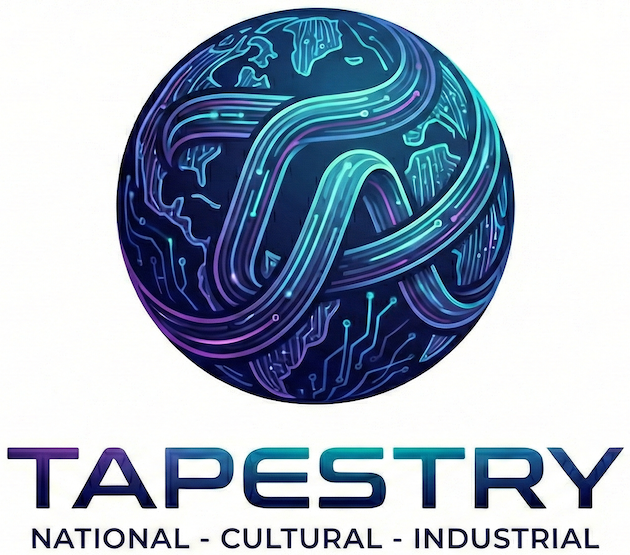

# Welcome to Project Tapestry

> [!NOTE]
> Project Tapestry is a global consortium of partner organizations and individuals who bring expertise, data sets, and compute resources together to build a new foundation model family, one that is trained on a larger and more diverse corpus than ever before.
>
> Our aim is to enable truly _sovereign AI_ by ensuring that ownership of data and compute remains with partners, and that they can build sovereign derivative models that they own, based on the consortium-trained base models and built using Tapestry's open-source training platform.

Learn more from our [Kickoff Workshop Blog](https://thealliance.ai/blog/project-tapestry-the-path-to-frontier-sovereign-ai). Check out the [Project Tapestry](https://thealliance.ai/projects/tapestry/) website for more information about partnering, events, and how to support Project Tapestry.

This repository contains the code and technical documentation for the project. Your help is most welcome!

<p align="center">
  
</p>

The rest of this README provides information for contributors and users of this repository.

## Contribute to Our First Work Streams

Project Tapestry has big plans. Here are the main areas of current focus. Note that we need help defining requirements, identifying use cases, and writing code for all these areas.

* [LLM Cultural Alignment and Re-alignment](https://github.com/The-AI-Alliance/tapestry/issues/243) - Help us develop techniques for cultural alignment, initially based on the [Inglehart–Welzel Cultural Map](https://en.wikipedia.org/wiki/Inglehart%E2%80%93Welzel_cultural_map_of_the_world) as a metric, with more approaches and metrics to be identified. This effort will continue to explore how to shift _cultural alignment_ without compromising general model performance. Prior expertise in evaluation and tuning technologies are especially welcome, as well as expertise in the ways that current AI models are not well aligned to specific cultures and uses cases in society and business.
* [Consortium Training](https://github.com/The-AI-Alliance/tapestry/issues/183) - Tapestry's approach to global model development relies on a balance between centralized and distributed training that ensures permissive use and privacy requirements for datasets. Help us adapt and develop optimal techniques with ideas from both federated learning and the latest LLM pre-training and post-training methods. Prior expertise in large scale LLM training, distributed systems and infrastructure, and federated learning are especially welcome. In particular, we are starting to create domain-specific models, and we need expertise in healthcare, finance, industrial technologies, etc.
* [Data, Responsibly Used](https://github.com/The-AI-Alliance/tapestry/issues/230) - Help us define the requirements and understand the regulations around permissive use and privacy for datasets, then implement support for them.
	* [Global Training Data Corpus](https://thealliance.ai/projects/tapestry/training-data-proposals)  - A core thesis of project Tapestry is that bringing together a much more diverse set of data can provide a path to a better frontier base model for all. What unique datasets exist that could be brought to Tapestry model training? They don't have to be fully open; we will work with you to define and enforce appropriate requirements.
* Your good ideas - Our [contribution mechanism](contrib/#how-to-contribute) provides a way for you to suggest new ideas, technologies, and solutions to design challenges we face.

### Quick Paths

> [!NOTE]
> Make sure to read [**Getting Involved**](#getting-involved-anchor) below for information on contribution guidelines, etc.
>
> We use the [`develop`](https://github.com/The-AI-Alliance/tapestry/tree/develop) branch as our default (integration) branch, reserving [`main`](https://github.com/The-AI-Alliance/tapestry/tree/main) for releases.

### Working with the Source Code

We use GNU `make` and [**`Makefile`**](Makefile) targets to run tests and other tools. While this works best on MacOS or Linux, all the Python-based commands can be executed on any platform. We'll show you both ways below. Try `make help` for more information and see the [**Development**](#development-anchor) section below.

The _production_ source code is under the [`src`](src/) directory. The automated tests are under the [`src/tests`](src/tests/) directory. For example, a consortium training prototype is in [**`src/tapestry/training/consortium/`**](src/tapestry/training/consortium/README.md). Try `make consortium-demo` and `make consortium-tests`.

There are runnable demos in [**`examples/`**](examples/). In fact, the `make consortium-demo` command uses a script in `examples`.

Outside _contributions_ are in [**`contrib/`**](contrib/), which provides a straightforward way for contributors to provide PoCs (proofs of concept), experiments, examples, and modules proposed for possible inclusion in the production code. For example, see the experiment metrics contributed for the consortium training prototype just mentioned in [**`contrib/jneums-consortium-experiment/`**](contrib/jneums-consortium-experiment/README.md). Try `make consortium-experiment`. See [Making Contributions](#making-contributions) below for more details about our contributions process.

### Working with the Technical Documentation

The technical documentation lives under [**`docs`**](docs/README.md). This is where you will find our requirements, architecture and design work, work group documents, etc.

* [**Architecture**](docs/architecture/README.md)
	* The _TVA methodology_: phased outputs (stakeholder map through design goals), architectural options and core thesis, plus:
		* [**Architecture Decision Records**](docs/architecture/decisions/)
		* [**Diagrams**](docs/architecture/diagrams/)
* [**Project Governance Principles**](docs/governance/)
* [**Strategic Plan**](docs/strategic-plan/)
* [**Reference Materials**](docs/reference/) (e.g. [**training paradigms**](docs/reference/training-approaches.md))
* [**Work Groups**](docs/work-groups/)

For repo layout, conventions, and where to find implementation code, see [**`AGENTS.md`**](AGENTS.md).

<a id="development-anchor"></a>

## Setting Up for Development

This project uses [`uv`](https://docs.astral.sh/uv/) for Python package management and [GNU `make`](https://www.gnu.org/software/make/) for running commands. GNU `make` is included with Linux and MacOS distributions. If you are on Windows, try using [Make for Windows](https://gnuwin32.sourceforge.net/packages/make.htm).

If you can't use GNU `make`, you can run the underlying `uv` commands directly, as discussed below.

If you can run GNU `make`, run the following command:

```shell
make one-time-setup
```

This command will install [`uv`](https://docs.astral.sh/uv/) and [`fswatch`](https://emcrisostomo.github.io/fswatch/) (discussed [below](#development-tasks)), if they aren't already installed _and_ you have [HomeBrew](https://brew.sh/) installed. Then the target will install the project's Python library dependencies.

If the command worked successfully, you can skip to [**Development Tasks**](#development-tasks). Otherwise, install `uv`, `fswatch`, and the Python dependencies as follows.

### Install `uv`

If you don't have `uv` installed already and you don't have [HomeBrew](https://brew.sh/) installed, run one of the following commands:

**Linux/MacOS:**

```shell
curl -LsSf https://astral.sh/uv/install.sh | sh
```

**Windows:**

```shell
powershell -c "irm https://astral.sh/uv/install.ps1 | iex"
```

### Install `fswatch`

Install the cross-platform `fswatch` as described on its [website](https://emcrisostomo.github.io/fswatch/).

### Install the Python Dependencies

After `uv` is installed, run these commands to complete the setup of your Python environment:

```shell
uv venv                     # Create the virtual environment
source .venv/bin/activate   # Activate the environment: MacOS and Linux
# .venv\Scripts\activate    # Activate the environment: Windows
uv pip install -e ".[dev]"  # Install all dependencies
```

## Development Tasks

This section discusses the common _quality_ checks automated using `make` targets, along with the `uv` commands invoked. An "umbrella" target `before-pr` invokes all of them as a gate for pull requests (see [Before You Submit a PR](#before-you-submit-a-pr)).

We will show both the GNU `make` command for a task, followed by the corresponding `uv` commands that are invoked as part of building the `make` target. Note that most of the `make` targets also do some other steps, like checking if required tools and directories exist. We recommend using the `make` commands if at all possible.

> [!TIP]
> 1. Use `make -n some_target` to see the command invocations used when `some_target` is built, without executing those commands.
> 2. _All_ the `make` targets have a `*-watch` variant, which will keep invoking the commands as files are saved. However, when a command has its own built-in watch feature, like `ruff` and `ty` (discussed below), that feature is used. Otherwise, for all other `make` targets (for example, `unit-tests`), the CLI command [`fswatch`](https://emcrisostomo.github.io/fswatch/), which we installed above, is used in an "infinite" loop to watch the file system and invoke the make target when changes are detected. `fswatch` supports almost all platforms, including Windows.

### Running Tests

We use [pytest](https://docs.pytest.org/) for testing. Using `make`:

```shell
make unit-tests   # "tests" is also defined as an alias for "unit-tests".
```

This runs `pytest` with coverage reporting, using the following commands:

```shell
cd src
uv run coverage run -m pytest -v -s .
uv run coverage report -m
```

### Code Formatting

Use _one_ of the following commands to format the Python code with `black`:

```shell
make format # makes the "black" target
make black
```

This runs `black` to format your code. Here are the equivalent commands (assuming you start back at the repo root directory, the parent of `src`):

```shell
cd src
uv run black .
```

> [!NOTE]
> Since `black` may modify your code, make sure you commit any changes made. When `black` is invoked as part of the PR `before-pr` target, a flag is used to check if this target is being built by the PR process itself or just locally on your machine. When used in the actual PR process, `black` won't modify the code. Instead, it will fail if it _wants_ to modify your code.

### Linting

Use _one_ of the following commands to lint the Python code with `ruff` and `pylint`:

```shell
make lint # makes the "ruff" and "pylint" targets
make ruff pylint
```

Or use these commands:

```shell
cd src
uv run ruff check --fix  .
uv run pylint --recursive=y --ignore=.venv --ignore-pattern='.*cache.*'  .
```

There is also a `--watch` CLI option for `ruff` that keeps it running as you fix mistakes and save the files. We have a custom `make` target for this purpose. Use _one_ of the following command choices:

```shell
make ruff-watch
# Or use the following:
cd src
uv run ruff check --watch .
```

### Type Checking

Use _one_ of the following commands to type check the Python code with `ty`:

```shell
make type-check # makes the "ty" target
make ty
```

Or use these commands:

```shell
cd src
uv run ty .
```

Like `ruff`, `ty` also has a `--watch` CLI option that keeps `ty` running as you fix mistakes and save the files. We have a custom `make` target for this purpose. Use _one_ of the following command choices:

```shell
make type-check-watch
# Or use the following:
cd src
uv run ty --watch .
```

## Making Contributions

> [!NOTE]
> Your contributions are most welcome! Make sure to read the general guidance in [**Getting Involved**](#getting-involved-anchor) below before submitting a PR.

### _Where_ to Create Your Contribution

If you are enhancing existing code, make the changes under `src`, and when appropriate, the top-level `Makefile` and supporting `.*.mk` files.

However, for everything else, including proofs of concept (PoCs), experiments, proposed additions, etc., create them under [`contrib`](contrib/README.md), the staging area for new contributions. The `contrib` [`README`](contrib/README.md) describes the requirements you must follow for new contributions.

For example, the common _quality check_ `make` targets, like `tests`, `lint`, etc. are also run for all the contributions. However, your contribution may not (yet) be production ready, so it might fail some of those checks. While you _should_ try to submit production-ready work, we don't want to discourage idea submissions. So, there is a straightforward mechanism to customize or disable any of these checks for contribution code, as needed. The `contrib` [`README`](contrib/README.md) has the details.

### Before You Submit a PR

Before submitting a PR, make sure the `make` target `before-pr` passes cleanly:

```shell
make before-pr
```

This target makes all our "quality" targets: `format` (which uses `black`), `lint` (which uses `ruff` and `pylint`), `type-check` (which uses `ty`), and `unit-tests`.

Note that `black` may reformat your code, so be sure to commit any changes. the `before-pr` target will run these checks in both the _production_ `src` tree and all the `contrib` contributions. You can also run these checks separately for the "top-level" code and for the contributions:

```shell
make before-pr-top       # The top-level code only.
make before-pr-contrib   # The contrib/* code only.
```

You can run a specific quality target on one or more contributions as follows. Let's suppose there is a `contrib/foo` contribution and you want to run `make format` on it:

```shell
# Make "format" just for "contrib/foo"
make SRC_DIR=contrib/foo SPEC_DIR=contrib/foo --include-dir=contrib/foo format
```

If you want to run `make format` for **all** `contrib/*` contributions:

```shell
make contrib-format
```

## Project Code Structure

The project code structure is still evolving, but currently it is organized into three major _subsystems_:

* `data` for all data governance and management capabilities.
* `training` for all distributed training and tuning capabilities.
* `infrastructure` for all underlying infrastructure.

```
tapestry/
├── contrib/        # Contributed ideas & techniques, proposed via PR
├── src/
│   └── tapestry/
│       └── data/
│       └── infrastructure/
│       └── training/
│   └── tests
│       └── tapestry/
│           └── data/
│           └── infrastructure/
│           └── training/
```

In addition, [`docs`](docs/) (discussed above) holds all technical documentation, and [`website`](website/) (discussed below) holds the project technical website content.

<a id="getting-involved-anchor"></a>

## Final Notes on Getting Involved

We welcome contributions as [pull requests](https://github.com/The-AI-Alliance/tapestry/pulls), [issues](https://github.com/The-AI-Alliance/tapestry/issues), and [discussions](https://github.com/The-AI-Alliance/tapestry/discussions).

See [CONTRIBUTING.md](CONTRIBUTING.md) for guidelines. In particular, [read this section](CONTRIBUTING.md#developer-certificate-of-origin-dco) on using _DCO_ with any commits.

Have an idea, technique, or experiment you'd like the project to consider? The [**`contrib/`**](contrib/README.md) directory is a lightweight staging area where contributors can propose work via a PR into their own subdirectory. See [**`contrib/README.md`**](contrib/README.md) for the simple workflow and contribution policy.

You can also join one or more work groups that are being organized to identify requirements in several areas and to start the engineering work to prototype and test ideas, followed by the initial implementation iterations. Details are being documented in [**`docs/work-groups/`**](docs/work-groups/).

### Individual vs. Organizational Participation

> [!IMPORTANT]
> Code and documentation contributions happen here on GitHub.  **Organizational participation in the Tapestry consortium starts with a Letter of Intent (LOI), which is handled by the AI Alliance, not through this repo.**

If your organization wants to join the Tapestry consortium and it intends to contribute data, compute, people, or funding, please email <a href="mailto:kbhatta@thealliance.ai?subject=Project Tapestry LOI">Kaushik Bhatta</a> for more information.

### Licenses

All _code_ contributions are licensed under the [Apache 2.0 LICENSE](https://github.com/The-AI-Alliance/community/blob/main/LICENSE.Apache-2.0) (which is also in this repo, [LICENSES/LICENSE.Apache-2.0](LICENSES/LICENSE.Apache-2.0)).

All _documentation_ contributions are licensed under the [Creative Commons Attribution 4.0 International](https://github.com/The-AI-Alliance/community/blob/main/LICENSE.CC-BY-4.0) (which is also in this repo, [LICENSES/LICENSE.CC-BY-4.0](LICENSES/LICENSE.CC-BY-4.0)).

All _data_ contributions are licensed under the [Community Data License Agreement - Permissive - Version 2.0](https://github.com/The-AI-Alliance/community/blob/main/LICENSE.CDLA-2.0) (which is also in this repo, [LICENSES/LICENSE.CDLA-2.0](LICENSES/LICENSE.CDLA-2.0)).

We use the "Developer Certificate of Origin" (DCO).

> [!WARNING]
> Before you make any git commits with changes, understand what's required for DCO.

See the contributing guide [section on DCO](CONTRIBUTING.md#developer-certificate-of-origin-dco) for details. In practical terms, supporting this requirement means you must use the `-s` flag with your `git commit` commands.

## About the Technical Website (GitHub Pages)

The [website](https://the-ai-alliance.github.io/tapestry/) for this repository provides another way to discover and navigate the technical documentation content in [`docs`](/docs). However, at this time, the site mostly just points to the content in [`docs`](docs/). Eventually, it will publish "refined" versions of the `docs` content.

The website sources are written in Markdown, etc. and are found in the [`website`](website/) directory. The website is published using [GitHub Pages](https://pages.github.com/). See [GITHUB_PAGES.md](GITHUB_PAGES.md) for all the details.

----

_Project Tapestry is an initiative of the AI Alliance Innovation Association, a 501(c)(6) non-profit._
