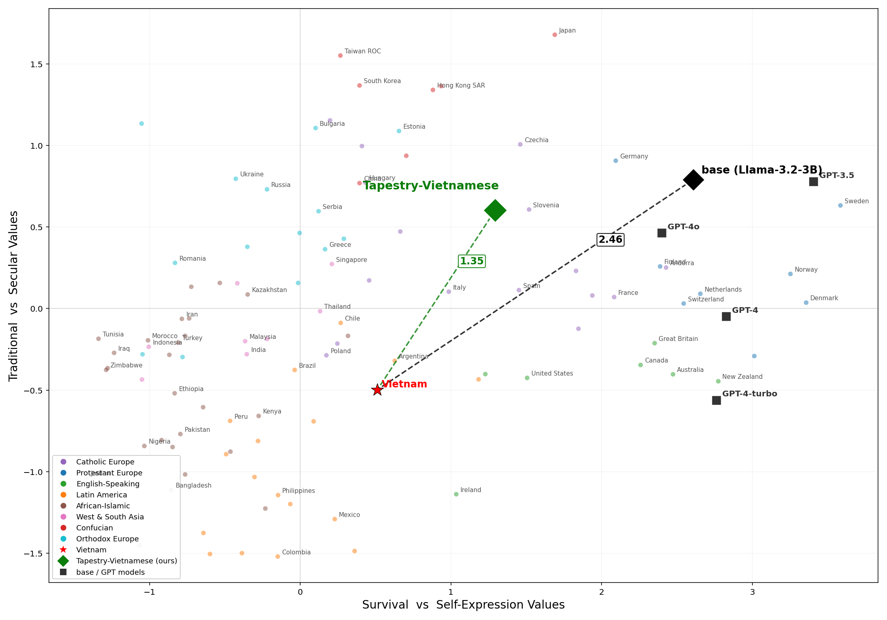

# Socio-Cultural Alignment: LoRA + Consortium Learning + Inglehart-Welzel Evaluation

A staging contribution exploring **sovereign cultural alignment** of a small open model
(Llama-3.2-3B-Instruct) toward a target culture (Vietnamese), and measuring it rigorously.
The parts are meant to be reusable beyond this case: a data-synthesis methodology, a LoRA
training pipeline, a **consortium-learning** step that fuses specialized members, and a
cultural-alignment **evaluation** harness.

> Status: preliminary / experimental. Staging-area work, not a supported package.

## Why (mission fit)

Cultural alignment is the kind of capability a community is best placed to build: it needs
local knowledge, native data, and culturally grounded evaluation. This stages a full path,
make the data then train, fuse, and measure, so others can reuse, critique, and extend the
individual pieces.

## What's here

| Directory | Role |
|---|---|
| `data_synthesis/` | Generate the cultural + capability-rehearsal training corpora. The teacher client is OpenAI-compatible and model-agnostic (we used Kimi-K2.6 and DeepSeek-V4-Pro). `core/` engine, `cultural/` corpus, `rehearsal/` corpus. |
| `training/` | LoRA SFT pipeline: `prepare_data` -> `pack_data` -> `train_rehearsal` -> `merge_ckpt`. |
| `consortium/` | **Consortium learning**: fuse independently-trained member models into one. `base.py` defines the `ConsortiumMethod` contract; `soup/` is method v1 (weight-space averaging). |
| `evaluation/` | Capability (full MMLU) + cultural alignment via the **Inglehart-Welzel cultural map** (a bit-exact Python port of Tao et al.'s projection). `api.py` is the shared entrypoint. |
| `topics/` | The cultural-coverage design and the rehearsal-data guide. |

## Approach

1. **Synthesize** a Vietnamese-cultural corpus plus a capability-rehearsal corpus (to limit forgetting).
2. **Train** member models with LoRA SFT (e.g. a culturally-aligned member and a rehearsal member).
3. **Fuse** members with a consortium method (model soup v1: `out = sum(w_i * member_i)`).
4. **Evaluate** the result on two independent axes: general capability (MMLU) and cultural
   position on the Inglehart-Welzel map (distance to the target country plus per-item shifts).

## Preliminary results

For a 50/50 soup of the culturally-aligned and rehearsal members:

*The base model (black diamond) sits in the secular, self-expression (Western) region;
Tapestry-Vietnamese (green diamond) moves toward Vietnam (red star), cutting the Euclidean
distance from 2.46 to 1.35. Tao et al.'s GPT models are shown for reference.*

- **Cultural map**: Euclidean distance to Vietnam falls from **2.46 to 1.35** (about -45%) under
  the Tao et al. projection. The shift concentrates in the survival/self-expression items; the
  strongly secular items (importance of God, attitudes toward homosexuality) move least.
- **Capability**: full-set MMLU (n=14,042, zero-shot) goes **63.2% to 62.4%**, a 0.8-point change
  that is not statistically significant (McNemar p ~ 0.07).

Treat these as directional early evidence, not benchmark claims. The IW map distance is
sensitive for out-of-distribution projections, so read the per-item table alongside it.

## How to evaluate

The harness scores any model path. See `evaluation/api.py` for the `evaluate()` contract and
`evaluation/iw/` for the cultural-map projection (`iw_project.py` + `iw_projection_final.json`
are self-contained; no survey microdata is needed at eval time).

## Status & limitations

- **Staging / preliminary**, no stability guarantees.
- **Path-portability TODO**: the training/eval scripts were developed to run in a container
  with the work tree mounted at `/workspace`. Making them fully path-portable is a known
  follow-up before any promotion out of `contrib/`.
- **Not included** (see `DATA.md`): the registration-walled WVS/EVS survey microdata (pointer
  only), model weights (derived from Llama, not redistributed here), and the raw generated
  corpora (regenerate via `data_synthesis/`).

## Data & licensing

- Data pointers, sourcing, and clearance: see `DATA.md`.
- License: code under Apache-2.0, docs under CC-BY-4.0, data/specs under CDLA-Permissive-2.0
  (Project Tapestry defaults). See `LICENSE`.

## Citations

- Inglehart-Welzel cultural map and the model-projection method: Tao et al. (2024); World
  Values Survey / European Values Study (registration required; see `DATA.md`).
- MMLU: Hendrycks et al. (2021).
- Teacher models used for synthesis: Kimi-K2.6 (Moonshot) and DeepSeek-V4-Pro; the synthesis
  client is OpenAI-compatible and model-agnostic.
