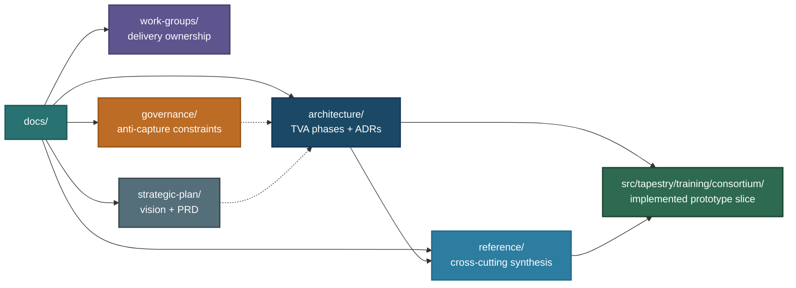

# README for the `docs` Directory

This directory organizes the technical documentation under development for Project Tapestry, including requirements analysis, architecture design, decision records, governance, and work group documentation.

## Documentation map and traceability

| Directory | Description |
| :-------- | :---------- |
| [`architecture/`](architecture/README.md) | TVA methodology, phased outputs (1–5), architectural options analysis, ADRs, diagrams — **see [Architecture documents](#architecture-documents)** |
| [`governance/`](governance/README.md) | Anti-capture principle and governance design |
| [`strategic-plan/`](strategic-plan/README.md) | Overall strategy for execution — the [vision](strategic-plan/VISION.md) and the [product requirements (PRD)](strategic-plan/PRD.md) |
| [`reference/`](reference/README.md) | Consolidated technical reference docs (e.g. training paradigms, deployment and usage material, and a single-page [architecture synthesis](reference/ARCHITECTURE.md)) |
| [`work-groups/`](work-groups/README.md) | Lifecycle work-group charters for data governance, base training, sovereign alignment, evaluation/certification, security/privacy, infrastructure, deployment, and governance participation (subject to change) |

## Architecture documents

The directory index is [`architecture/README.md`](architecture/README.md). Main artifacts under [`architecture/`](architecture/):

| Document | Description |
| :------- | :---------- |
| [`architecture/0-tva-methodology.md`](architecture/0-tva-methodology.md) | TVA design process — phases, design principles, current status |
| [`architecture/1-stakeholder-map.md`](architecture/1-stakeholder-map.md) | Phase 1 — who we serve, what they control, what they fear |
| [`architecture/2-pain-points.md`](architecture/2-pain-points.md) | Phase 2 — what's concretely broken for each layer today |
| [`architecture/3-value-propositions.md`](architecture/3-value-propositions.md) | Phase 3 — what Tapestry offers that the status quo doesn't |
| [`architecture/4-design-goals.md`](architecture/4-design-goals.md) | Phase 4 — constraints the architecture must satisfy |
| [`architecture/5-architectural-options.md`](architecture/5-architectural-options.md) | Phase 5 — option space and decision analysis toward an architectural thesis |
| [`architecture/diagrams/README.md`](architecture/diagrams/README.md) | Architecture figures (SVG in Markdown), embedding conventions, and preferred inline Mermaid style |
| [`architecture/decisions/`](architecture/decisions/README.md) | Architecture Decision Records (ADRs) |

## Reference documents

The [`reference/`](reference/README.md) directory holds material outside the TVA phase chain (comparison references, deployment notes, etc.):

| Document | Description |
| :------- | :---------- |
| [`reference/glossary.md`](reference/glossary.md) | Definitions of Tapestry-specific terms (consortium training, Shared-Base Loop, Sovereign Build, etc.) |
| [`reference/training-approaches.md`](reference/training-approaches.md) | Centralized vs. federated vs. consortium training |

Repository root [**`README.md`**](../README.md) and [**`AGENTS.md`**](../AGENTS.md) summarize how `docs/` fits with `website/`, `src/`, and contributor workflows.

## Current implementation anchor

The current code implementation is intentionally narrow and aligns most directly with the Shared-Base Loop and contribution-governance ADRs:

- Shared-base integration coordinator: [`src/tapestry/training/consortium/coordinator.py`](../src/tapestry/training/consortium/coordinator.py)
- Sovereign participant node cycle: [`src/tapestry/training/consortium/node.py`](../src/tapestry/training/consortium/node.py)
- Contribution weighting and anti-capture floor/cap mechanics: [`src/tapestry/training/consortium/policy.py`](../src/tapestry/training/consortium/policy.py)
- Message and artifact contracts: [`src/tapestry/training/consortium/messages.py`](../src/tapestry/training/consortium/messages.py)
- PoC tests and expected round behavior: [`src/tests/tapestry/training/consortium/test_consortium_training.py`](../src/tests/tapestry/training/consortium/test_consortium_training.py)

For the canonical design rationale behind this implementation slice, start with [TAP-002](architecture/decisions/adr-002-consortium-training.md), [TAP-004](architecture/decisions/adr-004-training-loop.md), and [TAP-008](architecture/decisions/adr-008-data-sovereignty.md), then use [`reference/ARCHITECTURE.md`](reference/ARCHITECTURE.md) for a single-page synthesis.

## Writing conventions

When creating or editing Markdown under `docs/`:

- **Do not hard-wrap prose.** Write each paragraph as a single logical line (or continuous soft-wrapped text in the editor). Avoid manual line breaks inside a paragraph for visual column width; let the viewer soft-wrap. Use a blank line between paragraphs, and hard breaks only where Markdown structure requires them (lists, headings, code fences, tables, etc.).
