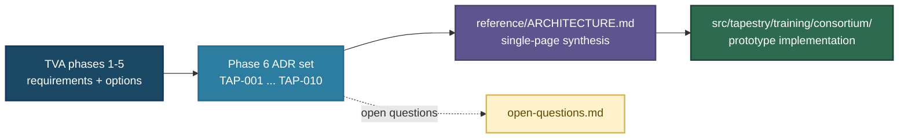

# Architecture

This directory contains the full design chain for Project Tapestry: the TVA methodology, its phase outputs (stakeholder map through design goals), architectural options analysis, and decision records.

| Document | Description |
| :------- | :---------- |
| [`0-tva-methodology.md`](0-tva-methodology.md) | The TVA design process — six phases, design principles, current status |
| [`1-stakeholder-map.md`](1-stakeholder-map.md) | Phase 1 — who we serve, what they control, what they fear |
| [`2-pain-points.md`](2-pain-points.md) | Phase 2 — what's concretely broken for each layer today |
| [`3-value-propositions.md`](3-value-propositions.md) | Phase 3 — what Tapestry offers that the status quo doesn't |
| [`4-design-goals.md`](4-design-goals.md) | Phase 4 — constraints the architecture must satisfy |
| [`5-architectural-options.md`](5-architectural-options.md) | Phase 5 — option space and decision analysis toward an architectural thesis |
| [`open-questions.md`](open-questions.md) | Index of all open questions across TVA docs, tagged for workshop / post-workshop / research |
| [`diagrams/`](diagrams/README.md) | SVG figures for docs; see [`diagrams/README.md`](diagrams/README.md) |
| [`decisions/`](decisions/) | Architecture Decision Records (ADRs) — current TAP set: [TAP-001](decisions/adr-001-core-plus-sovereign.md) through [TAP-010](decisions/adr-010-open-commons-sovereign-assets.md), all proposed |
