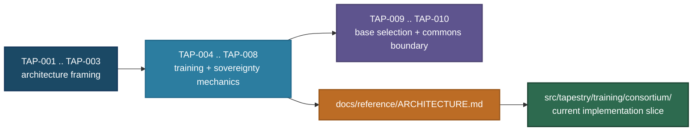

# Architecture Decision Records

This directory contains Architecture Decision Records (ADRs) for Project Tapestry. Each ADR captures a significant architectural or governance decision, its context, the alternatives considered, and the rationale for the choice made.

## Numbering Convention

ADRs use a component prefix followed by a sequential number: `{PREFIX}-NNN-short-title.md`.

**Current prefix:**

- **TAP** — overall Tapestry architecture decisions (all current ADRs)

**Future prefixes** (to be adopted as subsystem decisions begin):

| Prefix | Scope | Example |
| :----- | :---- | :------ |
| CORE | Shared base model, central training infrastructure | CORE-001-checkpoint-format |
| SOV | Sovereign pipeline, node-level decisions | SOV-001-preference-data-format |
| EVAL | Evaluation framework, benchmarks, red-teaming | EVAL-001-cultural-alignment-metrics |
| DATA | Data governance, provenance, curation tooling | DATA-001-provenance-schema |
| GOV | Consortium governance architecture | GOV-001-voting-mechanism |

Component prefixes are adopted when the first decision within that subsystem is made — not before. All existing ADRs are TAP-scope. File names retain the `adr-` prefix for backward compatibility; the TAP- designation is in the title and metadata.

## Format

ADRs are numbered sequentially (`adr-NNN-short-title.md`) and use the following status values:

- **proposed** — under discussion, inviting challenge
- **accepted** — decision made and in effect
- **superseded** — replaced by a later ADR (link to successor)
- **rejected** — was proposed, explicitly decided against (records why not)

Use a small metadata table at the top of each ADR:

| Field | Value |
| :---- | :---- |
| Status | Proposed |
| Confidence | High (5/5) |
| Date | May 7, 2026 |
| Deciders | Christopher Nguyen (proposed), workshop participants |

Avoid consecutive plain Markdown lines like `**Status:** ...` / `**Date:** ...`; GitHub renders those as one paragraph unless they use explicit hard breaks.

## Index

| ADR | Title | Status | Confidence |
| :-- | :---- | :----- | :--------- |
| [TAP-001](adr-001-core-plus-sovereign.md) | Core-plus-sovereign architecture | proposed | 5/5 |
| [TAP-002](adr-002-consortium-training.md) | Consortium training model | proposed | 5/5 |
| [TAP-003](adr-003-cultural-alignment.md) | Cultural alignment as primary differentiator | proposed | 5/5 |
| [TAP-004](adr-004-training-loop.md) | The consortium training loop | proposed | 4/5 |
| [TAP-005](adr-005-sovereign-pipeline.md) | The Sovereign Build | proposed | 4/5 |
| [TAP-006](adr-006-phased-base-model.md) | Phased base model strategy | proposed | 4/5 |
| [TAP-007](adr-007-architecture-comparison.md) | Training architecture comparison | proposed | 4/5 |
| [TAP-008](adr-008-data-sovereignty.md) | Data sovereignty | proposed | 5/5 |
| [TAP-009](adr-009-goal-derived-base-model-selection.md) | Goal-derived base model selection | proposed | 3/5 |
| [TAP-010](adr-010-open-commons-sovereign-assets.md) | Open commons and sovereign assets | proposed | 4/5 |
| [TAP-011](adr-011-central-node-infrastructure.md) | Central node infrastructure | proposed | 4/5 |

## Traceability to current implementation

The ADR set is broader than today's prototype code. The implemented `src/tapestry/training/consortium/` slice aligns most directly with:

- [TAP-002](adr-002-consortium-training.md): consortium training paradigm and vocabulary.
- [TAP-004](adr-004-training-loop.md): Shared-Base Loop mechanics and coordinator/node responsibilities.
- [TAP-008](adr-008-data-sovereignty.md): data-locality and update-sharing boundaries.

Additional supporting documentation:

- [`../../reference/ARCHITECTURE.md`](../../reference/ARCHITECTURE.md) for the consolidated architecture view.
- [`../../reference/glossary.md`](../../reference/glossary.md) for canonical terms used across ADRs and implementation.
