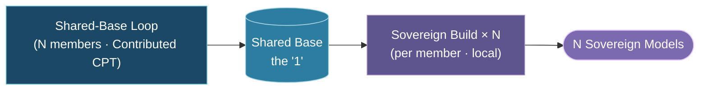
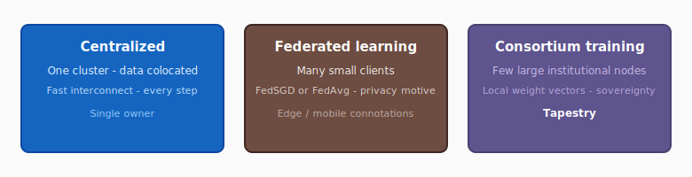

# TAP-002: Consortium Training Model

| Field | Value |
| :---- | :---- |
| Status | Proposed |
| Confidence | High (5/5) |
| Date | May 7, 2026 |
| Revised | Jun 19, 2026 — terminology aligned (Shared Base, Contributed CPT); added N+1 two-phase diagram; consolidated as the canonical definition. |
| Deciders | Christopher Nguyen (proposed), workshop participants (to ratify) |

## Context

Tapestry's training involves multiple sovereign members contributing to a shared model. The approach must be named and distinguished from existing paradigms (centralized training, federated learning) to avoid confusion and to accurately describe what Tapestry does.

See [`training-approaches.md`](../../reference/training-approaches.md) for a full comparison of centralized, federated, and consortium training.

## Decision

Tapestry uses **consortium training**: a small number of large, trusted, heterogeneous members collaboratively training a shared model, where data sovereignty is a first-order architectural constraint and cultural alignment is the goal.

*Term definitions are consolidated in [`glossary.md`](../../reference/glossary.md).*

This is distinct from federated learning (designed for millions of small edge clients with individual privacy concerns) and from centralized training (all data in one place, one organization controls everything).

*Tapestry is the third column; see [`training-approaches.md`](../../reference/training-approaches.md) for prose and the full comparison table.*

| | Centralized Training | Federated Learning | Consortium Training |
| :--- | :--- | :--- | :--- |
| **Participants** | One organization, one cluster | Many clients (phones, hospitals, edge) | Dozens of large institutional nodes |
| **Data per node** | All data centralized | Small (one user's or site's data) | Massive (national/institutional corpora) |
| **Sovereignty motive** | N/A — one owner | Individual / site-level data protection | National/institutional sovereignty + cultural alignment |
| **What crosses the network** | N/A — internal interconnect | FedSGD: per-step gradients; FedAvg: local model weight vectors after local training | Local model weight vectors after Contributed CPT |
| **Communication cadence** | Every step; fast interconnect | Varies by method and deployment | Operational choice — frequent (cluster-like) or infrequent (geo-distributed) |
| **Model scale** | Frontier | Typically small to medium | Frontier |
| **Governance** | Single owner decides all | Aggregator-driven; clients have no architectural voice | Consortium with shared ownership and governance rights |
| **Each node's outcome** | N/A — one model | Same global model (or personalized variant in PFL) | Sovereign Model: Shared Base + community-specific Sovereign Build |

Consortium training borrows techniques from the federated learning literature — FedAvg-class model averaging (default), ideas from Personalized Federated Learning (per-node model variants), and optionally DiLoCo (outer-optimizer variant). The distinction is not technical novelty in the optimization algorithm but in the *context*: who participates, at what scale, with what governance, and toward what goal. FL optimizes for privacy across many small clients. Consortium training optimizes for cultural sovereignty across few large institutions with shared governance.

## Rationale

- Tapestry's members are few (dozens) and are **collaborating institutions with governance voice** — not millions of mutually untrusted edge clients. Each member operates large nodes (national GPU clusters). See [Design principles for architecture work](../0-tva-methodology.md#design-principles-for-architecture-work).
- The sovereignty motive is national/institutional, not individual data protection. The governance model, trust assumptions, and communication patterns all differ.
- Using "federated" to describe Tapestry borrows the right principle (data stays put) but the wrong connotations (edge devices, FedAvg, cross-silo averaging). "Consortium training" accurately describes the participants, the purpose, and the governance.

## Confidence assessment

This is a framing and communication decision as much as a technical one. The term "consortium training" accurately reflects the architecture we've designed. It avoids confusion with federated learning literature and sets correct expectations for participants. The technical architecture does not change based on what we call it — but how participants understand and communicate about Tapestry does.

## Alternatives considered

- **Continue using "federated training":** Familiar term but misleading. Participants and reviewers would map Tapestry onto FedAvg/FL assumptions that don't apply.
- **"Distributed training":** Too generic. Covers everything from data-parallel training within a data center to Tapestry's cross-continent sovereignty-preserving loop.
- **"Collaborative training":** Accurate but vague. Doesn't convey the institutional, governance-heavy nature of the consortium.

## Consequences

- Requires updating all documentation and communications from "federated" to "consortium" when referring to Tapestry's own approach. (Largely complete as of May 2026.)
- The term "consortium training" is novel — it doesn't have an established literature. This is a feature (we define what it means) and a risk (no prior art to reference). FedAvg is the closest technical precedent for the default aggregation mechanism; DiLoCo is an optional outer-optimizer variant.
- References to federated learning techniques (FedAvg, DiLoCo, etc.) remain valid as technical building blocks. The distinction is between the paradigm (consortium) and the techniques it may use.

## References

- [Douillard et al. "DiLoCo: Distributed Low-Communication Training of Language Models." arXiv:2311.08105, 2023.](https://arxiv.org/abs/2311.08105)
- [McMahan et al. "Communication-Efficient Learning of Deep Networks from Decentralized Data." AISTATS 2017.](https://arxiv.org/abs/1602.05629)
- [Tan et al. "Towards Personalized Federated Learning." IEEE Trans. Neural Networks, 2023.]()
