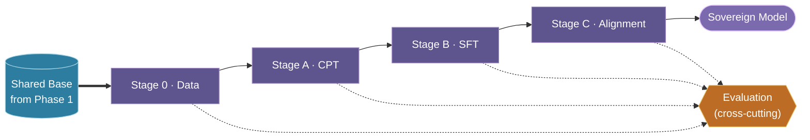
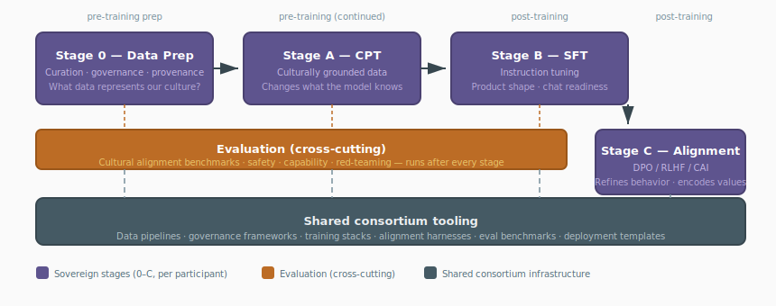

# TAP-005: The Sovereign Build

| Field | Value |
| :---- | :---- |
| Status | Proposed |
| Confidence | Strong (4/5) |
| Date | May 7, 2026 |
| Revised | Jun 19, 2026 — retitled "The Sovereign Build"; added Phase-2 boundary diagram; Stage A mapped to Contributed/Private CPT. |
| Deciders | Christopher Nguyen (proposed), workshop participants (to resolve open questions) |
| Supersedes | Original three-stage pipeline (CPT, alignment, instruction) |

## Context

Given that cultural alignment is the primary differentiator (TAP-003), the complete pipeline by which participants produce sovereign models must be defined. The original three-stage pipeline omitted two critical sovereign activities — data preparation and evaluation — and did not connect the pipeline to standard industry terminology or to the N+1 model outcome described in TAP-004.

This revision expands the pipeline to cover the full lifecycle from data curation through deployed, evaluated sovereign models.

## Standard terminology mapping

> A consolidated glossary of these and other Tapestry terms lives in [`glossary.md`](../../reference/glossary.md).

Tapestry's pipeline stages map to standard industry terms as follows:

| Tapestry Stage | Industry Term(s) | Training Phase |
| :------------- | :--------------- | :------------- |
| **Stage 0** — Data Preparation | Data curation, corpus construction, data governance | Pre-training preparation |
| **Stage A** — Continued Pre-training | CPT, domain-adaptive pre-training (DAPT) | Pre-training (continued) |
| **Stage B** — Instruction Tuning | Supervised fine-tuning (SFT), instruction tuning, chat tuning | Post-training |
| **Stage C** — Alignment | Post-training alignment: RLHF, DPO, Constitutional AI | Post-training |
| **Evaluation** | Benchmarking, red-teaming, cultural alignment measurement | Cross-cutting |

In standard usage, "pre-training" refers to the initial large-scale unsupervised training of a model from scratch, and "post-training" covers everything after: alignment, instruction tuning, and safety tuning. Our Stage A is *continued* pre-training — additional pre-training-style learning on a targeted corpus after the base model exists. Stages B and C are both forms of post-training. We distinguish them because they serve different sovereign purposes and may be performed by different teams within a participant's organization.

### Roadmap: Stage A evolves into full pre-training

In **Phase 1** (TAP-006), Stage A is continued pre-training on top of an adopted external base model — roughly 5–10% of original base pretraining cost.

In **Phase 2** (TAP-006), when the consortium trains its own base, Stage A expands to include **full pre-training from scratch**. The pipeline structure does not change; the scope and compute cost of Stage A grows by an order of magnitude. This is an explicit roadmap item, not a hypothetical — the phased strategy exists precisely to build toward consortium-owned pre-training.

## Decision

The Sovereign Build has four stages plus evaluation as a cross-cutting concern. All stages are sovereign — each participant runs them independently on their own data and according to their own cultural judgment. The *tooling* for all stages is consortium infrastructure, shared across participants.

Nothing here is contributed back to the Shared Base — this is the boundary between Phase 1 and Phase 2. Stage A run here is **Private CPT**; only a Stage A run inside the Shared-Base Loop is **Contributed CPT** ([TAP-004](adr-004-training-loop.md)).

### Stage 0: Data Preparation & Governance

**What it does:** Assembles, curates, and governs the data that drives all subsequent stages.

**Why it's sovereign:** The choice of what data represents a culture — which legal traditions, which literary canon, which medical practices, which institutional knowledge — is itself a cultural judgment. No external entity can make this choice for a community.

Activities include corpus curation (selecting culturally grounded data), quality filtering (deduplication, language identification, content quality), data governance (provenance tracking, licensing, consent, attribution), format preparation (converting diverse sources to training-ready formats), instruction data creation (for Stage B, reflecting local interaction norms), and preference data creation (for Stage C, encoding cultural values as preference pairs).

This is likely the most time-intensive stage. Communities will spend more human effort on data than on training.

### Stage A: Continued Pre-training (CPT)

**What it changes:** The model's *knowledge* — its internal representations of the world.

Training data is not just linguistically local but culturally grounded: local legal reasoning, medical practice, educational conventions, literary traditions, institutional knowledge, and community-authored content. "Fluent but Foreign" (2026) demonstrates that language-focused continued pretraining fails to shift cultural alignment. Stage A specifically targets culturally *grounded* data.

Estimated compute: 5–10% of base pretraining cost per cycle (Phase 1). See *Roadmap* above for Phase 2 evolution.

### Stage B: Instruction Tuning / Supervised Fine-Tuning (SFT)

**What it changes:** The model's *product shape* — making it capable of following instructions and producing useful responses.

Creates the foundation for chat agents, coding assistants, domain-specific tools. The model learns to follow instructions, format answers, and produce coherent responses. Instruction tuning is itself culturally loaded — formality, directness, deference to authority, humor, response length — and therefore belongs in the sovereign pipeline, not the shared base. This stage must come before alignment (Stage C) because preference optimization requires a model that already produces reasonable instruction-following outputs.

### Stage C: Alignment (DPO / RLHF / Constitutional AI)

**What it changes:** The model's *behavior and values* — refining how it responds based on community preferences.

Building on the instruction-tuned model from Stage B, the community applies preference optimization to encode what is appropriate, authoritative, respectful, and true in their context. This is where cultural value judgments are encoded. Techniques include Direct Preference Optimization (DPO), Reinforcement Learning from Human Feedback (RLHF), and Constitutional AI (using community-authored constitutions). This stage is more effective — and more stable — when applied to an already instruction-tuned model.

### Cross-cutting: Evaluation

Evaluation is not a final step but a continuous activity that runs after every stage and across the full pipeline. It is the mechanism that answers the foundational research question: *does this pipeline actually shift cultural alignment?*

**After Stage 0 (Data):** Data quality assessment, coverage analysis, bias auditing, governance compliance checks.

**After Stage A (CPT):** Did the model acquire the target cultural knowledge? Did it maintain frontier capability? Did safety properties survive continued pretraining? Measured using standard benchmarks (MMLU, etc.) for capability, WVS-based benchmarks for cultural alignment, and safety evaluation suites.

**After Stage B (SFT):** Is the model usable? Does it follow instructions? Does it interact according to community norms? User testing, task-specific benchmarks, interaction quality assessment.

**After Stage C (Alignment):** Does the model behave according to community values? Is it safe? Red-teaming for cultural blind spots. Evaluated using Inglehart-Welzel Cultural Map positioning, community-specific value surveys, and adversarial testing.

Evaluation tooling — especially cultural alignment benchmarks — is novel infrastructure that does not exist yet. This is arguably the area requiring the most original work in the entire Tapestry project.

## Diagram

*Four sovereign stages plus cross-cutting evaluation. All stages execute on sovereign data at the participant; tooling is consortium infrastructure.*

| Stage | What changes | Sovereign decision | Consortium tooling (shared) |
| :---- | :----------- | :----------------- | :-------------------------- |
| **0** — Data | Training corpora | What data represents our culture? | Pipelines, governance, provenance |
| **A** — CPT | World knowledge / representations | What should the model know about our world? | Training pipelines, checkpoint mgmt |
| **B** — SFT | Instruction-following / product shape | How should the model interact with our users? | Instruction harnesses, SFT pipelines |
| **C** — Alignment | Behavior / values | What is appropriate, respectful, true for us? | Alignment stacks, value elicitation |
| **Eval** | Validation (cross-cutting) | Did it work? Is it safe? Is it ours? | Benchmarks, red-teaming, cultural eval |

*All stages execute on **sovereign data** at the participant; tooling is consortium infrastructure.*

## The N+1 model outcome

At any point in time, the consortium produces **N+1 models**:

- **1 Shared Base** — the consortium infrastructure, frontier-competitive, continuously improved through the Shared-Base Loop (TAP-004)
- **N Sovereign Models** — the actual deployed products, one per participating community, each produced by running this Sovereign Build (Stages 0–C) on the Shared Base

The sovereign models are the value. The global base is the substrate. Each sovereign model reflects the cultural knowledge, values, and interaction norms of its community while retaining frontier capability from the shared base.

**Shared-Base Loop boundary:** Only **Contributed CPT** (Stage A) outputs are contributed to the Shared Base via the Shared-Base Loop ([TAP-004](adr-004-training-loop.md)). Stages B and C produce each participant's deployable Sovereign Model locally and are not averaged into the Shared Base.

In the two-phase terminology of [TAP-004](adr-004-training-loop.md): the Stage A run that feeds the loop is the **Contributed CPT** of the **Shared-Base Loop** (Phase 1). When a participant later runs CPT only for its own model — as part of the **Sovereign Build** (Phase 2) — that is **Private CPT** and is not contributed. So "all stages are sovereign" (each runs on the participant's own data and judgment) and "only CPT is contributed" are both true: the difference is whether a given CPT run's weights go back to the Shared Base or stay local.

This is analogous to Personalized Federated Learning (PFL) but at institutional and national scale. Where PFL produces a "personal" model for each edge device, Tapestry produces a sovereign model for each nation, institution, or cultural community. The "personalization" is not about individual preferences but about deep cultural alignment — knowledge, values, and norms that are collective and institutional.

The N+1 structure is the mechanism by which Tapestry delivers on DG1 (frontier capability with sovereign alignment): frontier capability comes from the Shared Base (the "1"), sovereign alignment comes from the Sovereign Build (the "N"). See TAP-007 for a diagrammatic treatment of the full training architecture and comparison with alternatives.

## Rationale

- "Fluent but Foreign" (2026) demonstrates that language-focused continued pretraining fails to shift cultural alignment. Stage A specifically targets culturally *grounded* data.
- Post-training alignment alone (Stage C without Stage A) fights the model's own world model — it can change surface behavior but underlying cultural dispositions leak through in edge cases.
- Without Stage C, the model is not deployable. Participants will ask "when do I get a chatbot?" and the answer must be part of the pipeline, not an afterthought.
- Data preparation (Stage 0) is the foundation. Communities will spend more time curating data than running training, and the curation itself is a sovereign act.
- Evaluation is cross-cutting because the foundational research question — "does culturally grounded CPT actually shift cultural alignment?" — must be answered at every stage, not just at the end. It is also the accountability mechanism: how participants know the investment is working.
- All stages are sovereign concerns because cultural values affect data selection, knowledge, behavior, *and* interaction style.

## Confidence assessment

The expanded pipeline is well-motivated and addresses real gaps in the original three-stage model. The 4/5 confidence reflects three open questions:

1. **Does Stage A actually work?** The hypothesis that continued pretraining on culturally *grounded* data measurably shifts cultural alignment is supported by the negative result in "Fluent but Foreign" but not yet by a positive result. This is the foundational research question.

2. **What constitutes "culturally grounded" data?** The answer varies by community. Stage 0 provides the framework, but the actual data decisions require community input that we don't yet have.

3. **How heavy is Stage 0 in practice?** Data preparation may prove to be the bottleneck — more expensive in human effort than all training stages combined. If communities lack the expertise or resources for data curation, the consortium may need to provide more support than currently envisioned.

## Alternatives considered

- **Three-stage pipeline (original version of this ADR):** Omitted data preparation and evaluation. These are critical sovereign activities that deserve explicit treatment.
- **Adapters only (LoRA/QLoRA):** Too shallow for cultural alignment. Modifies behavior without changing deep representations.
- **Post-training alignment only (no continued pretraining):** "Fluent but Foreign" shows this doesn't shift cultural values at the representation level.
- **Continued pretraining only (no post-training alignment):** The model would know the culture but might still behave according to the base alignment. Both stages needed.
- **Evaluation as a fifth sequential stage:** Considered, but evaluation is genuinely cross-cutting — it happens after every stage, not as a final step. Forcing it into a linear sequence misrepresents its role.

## Consequences

- Data preparation (Stage 0) adds significant human effort before training begins. The consortium must invest in tooling that makes this accessible to communities with limited ML expertise.
- Evaluation infrastructure — especially cultural alignment benchmarks — is novel and does not exist yet. This is the area requiring the most original work, alongside alignment tooling.
- The expanded pipeline makes the sovereign effort more visible, which helps participants justify the investment but also makes the commitment clearer.
- Safety properties from the base model may be affected by continued pretraining (unlike adapters, which leave the base frozen). Mechanisms for preserving safety through continued pretraining are an open design question (DG6).
- The pipeline as described is sequential (0 → A → B → C), but in practice Stage 0 is ongoing and Stages B and C may be interleaved. Implementors should treat the stages as logical, not strictly sequential.

## References

- ["Fluent but Foreign: Even Regional LLMs Lack Cultural Alignment." arXiv:2505.21548, 2026.](https://arxiv.org/html/2505.21548)
- [Rafailov et al. "Direct Preference Optimization: Your Language Model is Secretly a Reward Model." NeurIPS 2023.](https://arxiv.org/abs/2305.18290)
- [Bai et al. "Constitutional AI: Harmlessness from AI Feedback." arXiv:2212.08073, 2022.](https://arxiv.org/abs/2212.08073)
- [Inglehart & Welzel. "The WVS Cultural Map of the World." World Values Survey, 2005-2022.](https://www.worldvaluessurvey.org)
