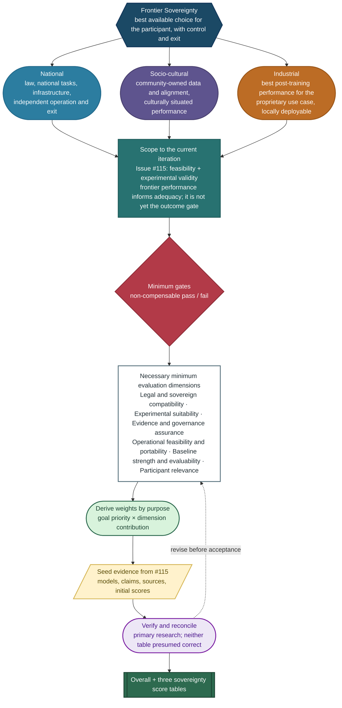

# TAP-009: Goal-Derived Base Model Selection

| Field | Value |
| :---- | :---- |
| Status | Proposed |
| Confidence | Moderate (3/5) |
| Date | July 11, 2026 |
| Scope | The bounded consortium-CPT experiment in Issues #70 and #115 |
| Deciders | Project Tapestry contributors (proposed; to verify and accept) |

## Version history

| Version | Date | Status | Evidence cutoff | Change |
| :------ | :--- | :----- | :-------------- | :----- |
| 0.1 | 2026-07-11 | Proposed | 2026-07-11 | Initial goal-derived methodology, six-dimension rubric, gates, candidate scoring, sovereignty views, purpose-specific criteria profiles, and TAP-010 reconciliation |

Versions remain `0.x` while this ADR is proposed; each published proposed revision increments the second component, and its change entry must identify any methodology-breaking change explicitly. Acceptance promotes the approved proposed revision to `1.0`. After acceptance, a minor version records an evidence refresh, rescoring, or criteria clarification that preserves the methodology, while a major version records a change to the objectives, dimensions, gates, or weighting methodology. Every scoring revision must record its evidence cutoff so later model releases do not silently rewrite an earlier assessment.

## Summary

This ADR defines a method for evaluating concrete base-model checkpoints for the two-node continued-pretraining (CPT) experiment in Issue #70. It applies non-compensable gates first and goal-derived weighted scoring second.

The July 2026 evidence snapshot identifies validation sets. Under the stated default assumptions, the three leading alternatives not presently screened out by a known gate failure in each view are:

| View | Three leading alternatives | Why these lead this view |
| :--- | :------------------------- | :----------------------- |
| Overall POC | OLMo 2 7B Base; Granite 3.3 8B Base; Qwen 2.5 7B Base | All are 7–8B clean bases with permissive terms and comparatively favorable operational priors; together they lead on experimental control, documented training practice, conventional tooling, capability, and multilingual breadth |
| National sovereignty | OLMo 2 7B Base; Granite 3.3 8B Base; Qwen 2.5 7B Base | Their terms, architectures, and toolchains support comparatively strong autonomy and portability priors, with complementary strengths in evidence assurance and national-language coverage |
| Socio-cultural sovereignty | Granite 3.3 8B Base; Qwen 2.5 7B Base; OLMo 2 7B Base | Granite balances governance evidence and multilingual support, Qwen provides the broadest language coverage among these three, and OLMo provides the strongest experimental traceability for measuring adaptation |
| Industrial sovereignty | Qwen 2.5 7B Base; OLMo 2 7B Base; Granite 3.3 8B Base | They combine commercial and derivative freedom with comparatively favorable local-CPT priors, credible base capability, and complementary strengths in production portability, reproducibility, multilingual support, and enterprise governance |

Other candidates not presently screened out remain meaningful alternatives. Llama may rise when low compute and ecosystem familiarity dominate; Gemma may rise for broad multilingual or multimodal needs; Mistral may rise when standard dense-model operations dominate and sufficient non-public provenance assurance is available; DeepSeek may rise for English-Chinese work when its actual use restrictions are immaterial; and Nemotron may rise when its documented data and hybrid architecture are advantages and its license durability and cross-vendor training path are acceptable.

K2 65B Base is screened out of this POC on likely compute grounds, not rejected as a model family. GPT-oss 20B and GLM-4-9B-0414 are screened out because the named artifacts are not clean pretrained base checkpoints for this controlled design, not because of their licenses, provider origins, or general capabilities.

No checkpoint is selected by this proposed ADR. The numerical results are comparative priors under explicit assumptions. The participating nodes make the experiment decision only after resolving the gates and replacing generic relevance estimates with their actual requirements.



*Frontier Sovereignty determines the purposes; the current iteration determines the minimum gates, dimensions, weights, and evidence needed for the decision.*

## Context and sequence of logic

This ADR memoizes the reasoning developed in [Issue #115](https://github.com/The-AI-Alliance/tapestry/issues/115), which asks the project to select a base model for the experiment described by [Issue #70](https://github.com/The-AI-Alliance/tapestry/issues/70). It complements, but does not replace, [TAP-006](adr-006-phased-base-model.md) and the longer-term model-family selection work in Issue #25.

The reasoning proceeded as follows:

1. Issue #70 defines a bounded two-node consortium-training experiment: nodes perform CPT on local data, model updates are integrated, and the result is evaluated for improvement and regression.
2. Issue #115 asks for a model small enough to control resource requirements, capable enough to produce meaningful results, legally usable for the work, and sufficiently documented for CPT.
3. The initial Issue #115 analysis applied the model-family requirements BMS-R1–R5: open weights, size range, active development, competitive performance, and cultural alignability.
4. Review of the decision scope showed that BMS-R1–R5 was designed principally for longer-term family selection. It does not fully cover a concrete checkpoint used in a bounded CPT experiment.
5. The experiment's objectives and Tapestry's anti-capture constraints were translated into failure modes. Those failure modes were factored into independently measurable dimensions.
6. Non-compensable requirements became gates. Candidates that pass are compared using weights derived from the applicable goals.
7. National, socio-cultural, and industrial sovereignty emphasize different goals. The ADR therefore records an overall POC view and three sensitivity views rather than presenting one weighting as universally correct.
8. The resulting tables were compared with the Issue #115 BMS-R1–R5 table as a sanity check. Differences remain open reconciliation items; this proposed ADR does not assume which table is correct.

## Decision methodology

### Start from Frontier Sovereignty, then scope the iteration

The end goal is **Frontier Sovereignty**: each participant can independently operate a model that is the best available choice for its users and use case, while retaining control of its data, alignment, infrastructure, derivatives, and exit. "Frontier" does not mean winning general-purpose leaderboards. It means matching or exceeding the best available alternative on the tasks that matter after the participant's sovereign training and alignment have been applied.

Frontier Sovereignty has three related forms:

| Sovereignty objective | Frontier outcome |
| :-------------------- | :--------------- |
| **National** | A nation can independently operate a model that is competitive with the best available alternative on its public-sector, national-language, and nationally situated tasks, under its own law and infrastructure. |
| **Socio-cultural** | A community controls its data and alignment and obtains the best available performance for its language, knowledge, values, and culturally situated tasks without unacceptable general-capability regression. |
| **Industrial** | An organization can fine-tune or continue training locally on proprietary data and obtain the best performance for its proprietary use case, without exposing that data or depending on an external provider at runtime. General leaderboard rank is secondary to post-training performance, cost, and deployability for that use case. |

These outcomes specialize existing load-bearing requirements rather than introducing a new definition of sovereignty:

| Source requirement | Methodological implication |
| :----------------- | :------------------------- |
| DG1 and PRD G1: frontier capability with sovereign alignment | Measure performance on culturally situated and domain-specific target tasks, not only general benchmarks |
| PRD G2 and SR-1–SR-3: verifiable data locality, independent operation, and exit | Treat locality, island-mode operation, durable artifact possession, and exit-enabling rights as gates |
| TAP-003 and PRD SR-5–SR-8: community-owned alignment and governance | Let communities define cultural goals, data consent, and evaluation evidence |
| PRD SR-9–SR-11: on-premise industrial specialization | Evaluate post-training performance, confidentiality, cost, and deployability for the proprietary use case |
| TAP-006 and the anti-capture principle | Bound pragmatic dependencies and require them to be visible, replaceable, and non-exclusive |
| TAP-010: open commons and sovereign assets | Require openness and non-encumbrance for the Shared Commons without penalizing participants for retaining control of sovereign data, provenance details, or downstream variants |

This is a staged destination, not a requirement that every early experiment already be frontier-class. Early iterations reduce uncertainty in sequence:

1. **Feasibility:** prove that two sovereign nodes can run CPT, integrate model updates, and evaluate the result while keeping data local.
2. **Experimental validity:** compare integration methods, tune hyperparameters, and measure improvement and regression on a tractable base.
3. **Sovereign usefulness:** demonstrate participant-specific gains for national, socio-cultural, or industrial tasks while preserving required general capability.
4. **Frontier Sovereignty:** match or exceed the best available alternative for each target use case with verifiable independence and exit capability.

Issue #115 selects a checkpoint for the first two stages. Frontier performance therefore informs experimental adequacy but is not yet a gate. The checkpoint must be capable enough to generate meaningful evidence and must not create a dependency that prevents later stages.

The method is therefore:

1. Define the Frontier Sovereignty outcome and its national, socio-cultural, and industrial purposes.
2. Scope the outcome to the maturity and learning goals of the current iteration.
3. Derive the **necessary minimum set of dimensions** that can determine success or failure for those goals.
4. Derive weights from how strongly each dimension contributes to each purpose, rather than assigning weights directly from intuition.
5. Use the research assembled in Issue #115 to seed candidate evidence and initial scores.
6. Verify each checkpoint-specific claim against primary sources and further research, then reconcile inconsistencies without presuming that either the Issue #115 table or this ADR's initial table is correct.

### Derive dimensions from the scoped objectives

For the current iteration, the selection dimensions follow this chain:

> Frontier Sovereignty → national, socio-cultural, and industrial outcomes → current iteration goals → failure modes → required properties → independently measurable dimensions

A dimension belongs in the minimum set only when it is necessary to distinguish an important failure mode, is not already represented by another dimension or gate, can be assessed with evidence, and could change the decision. Dimensions that describe the long-term family strategy but cannot affect this checkpoint choice remain context rather than receiving weight.

| Objective | Failure to prevent | Selection dimensions |
| :-------- | :----------------- | :------------------- |
| Demonstrate consortium CPT | The checkpoint cannot support full-weight CPT or reliable integration | Experimental suitability; operational feasibility and portability |
| Compare integration algorithms | Architecture or setup creates uncontrolled differences | Experimental suitability; baseline strength and evaluability |
| Optimize hyperparameters | Results cannot be interpreted or reproduced | Experimental suitability; operational feasibility and portability |
| Produce meaningful improvement | Changes cannot be distinguished from noise or are irrelevant to participants | Baseline strength and evaluability; participant relevance |
| Preserve sovereignty | A provider controls use, derivatives, infrastructure, or continued operation | Legal and sovereign compatibility; operational feasibility and portability |
| Use local data responsibly | Baseline or local data cannot be understood or governed | Evidence and governance assurance; participant relevance |
| Leave reusable evidence | Code, configuration, artifacts, and results cannot be reproduced | Experimental suitability; evidence and governance assurance |

### Dimensions

| Dimension | Question answered |
| :-------- | :---------------- |
| **Legal and sovereign compatibility** | Do the checkpoint's actual terms permit the intended Tapestry lifecycle and participant activities without materially impairing sovereignty, downstream autonomy, replaceability, artifact handling, or exit? |
| **Experimental suitability** | Is this exact base checkpoint an appropriate, sufficiently characterized, and reproducible subject for full-weight CPT and integration experiments? |
| **Evidence and governance assurance** | Is there sufficient evidence to assess rights, consent, provenance, quality, safety, risks, and lineage at the disclosure level appropriate to the artifact and threat model? |
| **Operational feasibility and portability** | Can every node afford, train, move, and evaluate the checkpoint on participant-controlled hardware and toolchains within its memory, time, network, and financial budget? |
| **Baseline strength and evaluability** | How strong is this exact checkpoint out of the box, before Tapestry CPT, and is it characterized well enough to measure improvement and regression credibly? |
| **Participant relevance** | Does the checkpoint support the actual languages, cultures, knowledge, and industrial domains in scope? |

These six dimensions are the minimum set for this decision. Training transparency belongs in experimental suitability when it helps reproduce the POC, while provenance disclosure belongs in evidence and governance assurance. Compute, cost, hardware support, and toolchain portability are combined because they answer the same decision question: whether every node can execute independently. Legal permission remains separate from evidence sufficiency because a permitted model can still have inadequately supported provenance, consent, or safety claims.

The dimensions still separate facts that can vary independently. A model may be permissively licensed but operationally dependent, multilingual but not culturally suitable, experimentally well characterized but insufficiently evidenced for provenance, or highly capable but unsuitable for controlled CPT.

### Purpose-specific criteria profiles

The six dimensions remain stable, but the criteria used to score each dimension may vary by sovereignty purpose. This prevents the top-level rubric from expanding whenever a participant introduces a material requirement while still making the numerical treatment auditable.

| Dimension | Overall POC criteria | National criteria | Socio-cultural criteria | Industrial criteria |
| :-------- | :------------------- | :---------------- | :---------------------- | :------------------ |
| Legal and sovereign compatibility | Rights for CPT, integration, evaluation, artifact handling, and exit | Jurisdiction, procurement, restricted national uses, durable possession, and independent operation | Community authority, consent-related obligations, derivative governance, and exit | Commercial and derivative rights, private adaptation, tool-connected deployment, no contribution-back, and no mandatory provider runtime |
| Experimental suitability | Clean base, full-weight CPT, comparable node execution, integration, and reproducibility | Reproducibility under nationally controlled infrastructure and data constraints | Cultural adaptation, local-effect retention through integration, and culturally valid experimental design | Reproducible domain-adaptation experiments and controlled comparison of integration methods |
| Evidence and governance assurance | Evidence sufficient for the POC threat model | National security, supply-chain, provenance, legal, and audit assurance | Consent, cultural authority, provenance, safety, and community-governed assurance | Data and model provenance, safety, security, auditability, and evidence for tool-mediated actions |
| Operational feasibility and portability | Fit on the weakest node, cross-node training, cost, and common toolchain | Island-mode operation, nationally controlled hardware, supply-chain resilience, and exit | Feasibility on community-accessible infrastructure and preservation of local control | Training and serving cost, latency, deployment portability, schema and API compatibility, and local tool execution |
| Baseline strength and evaluability | Exact-checkpoint baseline strength and measurable improvement or regression | National-language and nationally situated task baselines | Language, cultural-knowledge, and non-regression baselines | Domain-task, code, structured-output, and production-quality baselines |
| Participant relevance | Breadth relevant to the participating POC nodes | Actual national languages, public functions, law, and institutions | Actual languages, culture, knowledge, values, and demonstrated cultural adaptability | Actual domain and workflow fit, including tool-use learnability when tool-mediated work is material |

Criteria that influence a numeric result must be declared before candidate scoring and assigned to one dimension to avoid double-counting. A purpose-specific dimension score is:

```
dimension_score(m, d, p) = sum(criterion_weight(c, d, p) * criterion_score(m, c, p))
```

Criterion weights within each dimension sum to 100%. A criterion may be out of scope for one purpose and material for another. Unweighted observations may be recorded as context but do not alter the numeric score. A pass/fail criterion remains a gate and cannot be compensated by either criterion or dimension weights.

For the July 2026 snapshot, the dimension scores remain explicitly provisional aggregates pending participant-defined criteria. The same six dimensions and one score per dimension are retained in every view; purpose-specific criteria explain what evidence should replace each prior before a participant decision.

### Apply TAP-010 purpose-driven openness

TAP-009 evaluates an outside checkpoint as a dependency used by Tapestry, not as though the checkpoint were itself a Tapestry-created Shared Commons artifact. TAP-010 does not require every outside base to be restriction-free. A restriction matters only to the extent that it affects the intended Tapestry stage, participant sovereignty, the rights needed for CPT and integration, downstream artifact handling, replaceability, or exit.

The open-commons destination remains relevant: Tapestry-created shared artifacts should be open and non-captured. However, TAP-006 expressly permits an acknowledged, bounded, and replaceable dependency on an adopted outside base during earlier phases. The outside base may retain its own terms so long as Tapestry accurately represents those terms, does not claim broader rights than it has, and does not allow the dependency to become permanent or grant the provider unilateral control over Tapestry's sovereign work.

The same presumption does not apply to Participant Sovereign Assets. A node is not scored lower merely because it keeps raw data, source identities, private training artifacts, or downstream Sovereign Models confidential, proprietary, or commercially licensed. Evidence is scored by whether it is sufficient for the applicable governance purpose, not by whether it is public.

For provenance and reproducibility, acceptable evidence may be public, consortium-confidential, independently attested, technically evaluated, or contractually represented, as defined by TAP-010. Publicness receives no additional evidence-sufficiency credit when a non-public mechanism provides equivalent assurance. Broad public reproducibility may be scored separately only when the evaluated artifact belongs to the Shared Commons or broad reproduction is an explicit goal. Public disclosure is not a proxy for sovereignty and is not required when a narrower governed disclosure satisfies the goal and threat model.

The scoring rubric must therefore keep separate:

- **Current-stage permission:** whether the outside checkpoint permits the exact POC, CPT, integration, evaluation, and artifact handling currently intended.
- **Restriction materiality:** whether a restriction actually impairs a Tapestry goal or participant right, rather than merely existing in the license.
- **Propagation:** whether and how an outside restriction attaches to Tapestry-created shared artifacts or participant derivatives.
- **Replaceability:** whether the dependency and any restriction are acknowledged, bounded, portable, and removable in a later phase.
- **Evidence sufficiency:** whether rights, consent, quality, safety, provenance, and experimental claims can be verified by an appropriate audience and mechanism.
- **Participant disclosure choice:** whether sovereign assets are public, confidential, proprietary, or commercial; this is not itself a positive or negative score.
- **Downstream autonomy:** whether participants can keep, deploy, license, sell, or otherwise commercialize permitted sovereign variants without mandatory contribution-back or provider dependence.

License conditions should be classified by effect:

| Classification | Treatment |
| :------------- | :-------- |
| **Irrelevant to scope** | Record for transparency; no score penalty when the condition cannot affect the intended Tapestry activity or outcome |
| **Compatible and purpose-aligned** | No automatic penalty; evaluate any compliance cost or governance dependency actually introduced |
| **Bounded dependency** | May be acceptable for the current phase; score material portability, durability, and exit costs and require a replacement path |
| **Material impairment** | Penalize or fail the applicable gate when the condition restricts required CPT, integration, participant use, commercialization, contribution handling, or exit |
| **Propagating encumbrance** | Determine whether the affected artifact can enter the Shared Commons as intended; limit its role or reject it when the encumbrance would contradict the declared release terms |

For example, an outside-base condition directed at a class of proprietary frontier labs may be compatible with the current POC if it does not restrict any participating sovereign node, required Tapestry activity, participant downstream use, or intended artifact handling. It should not receive the same treatment as a condition that limits sovereign-node possession, CPT, commercial deployment, or exit. The label is not dispositive, however: Tapestry must verify the definition and enforcement of the restricted class, account for sovereign participants that are themselves commercial organizations, and determine whether the condition propagates into any artifact Tapestry intends to release openly.

### Derive weights from each purpose

Weights are a function of goals. Let `priority(g, p)` be the agreed priority of goal `g` for purpose `p`, and `contribution(g, d)` be how strongly dimension `d` supports that goal. The unnormalized weight of dimension `d` is:

```
weight(d, p) = sum(priority(g, p) * contribution(g, d))
```

The weights are then normalized to 100% for each of the overall POC, national, socio-cultural, and industrial views. This exposes disagreements at the goal level and avoids presenting one weighting as universally correct.

For this July 2026 snapshot, the scoped objective supplies the priority and each dimension's necessity for that objective supplies the contribution. The resulting normalized weights are:

| Dimension | Overall POC | National | Socio-cultural | Industrial |
| :-------- | ----------: | -------: | -------------: | ---------: |
| Legal and sovereign compatibility | 15% | 25% | 15% | 20% |
| Experimental suitability | 25% | 15% | 10% | 15% |
| Evidence and governance assurance | 15% | 15% | 20% | 5% |
| Operational feasibility and portability | 25% | 20% | 5% | 25% |
| Baseline strength and evaluability | 15% | 10% | 15% | 20% |
| Participant relevance | 5% | 15% | 35% | 15% |

The overall POC prioritizes controlled experimental validity and execution on both nodes. The national view increases legal autonomy, infrastructure control, and national relevance. The socio-cultural view makes community relevance and adequate governance evidence dominant while treating raw compute as a feasibility gate rather than a differentiator. The industrial view prioritizes independent commercial operation, production economics, portability, post-training capability, and domain fit. These are default priorities for sensitivity analysis; named participants may replace them before selection.

### Gates before scores

A weighted score cannot compensate for a failed gate.

| Common gate | Pass condition |
| :---------- | :------------- |
| Legal permission | The license permits the intended CPT, integration, evaluation, artifact handling, and any intended distribution |
| Current-stage legal compatibility | The checkpoint's restrictions do not materially prevent the intended POC, CPT, integration, evaluation, participant use, or artifact handling at this stage |
| Propagation and exit | Any restriction that propagates to Tapestry artifacts is accurately identified and compatible with their intended handling, and the outside dependency remains bounded and replaceable without loss of participant sovereign work |
| Base checkpoint | A pretrained/base checkpoint exists, not only an instruction-tuned or post-trained artifact |
| Node feasibility | Full training state fits the weakest participating node within the agreed budget |
| Cross-node execution | The same checkpoint and compatible training implementation run on every node |
| Integration compatibility | Nodes exchange and integrate identical, compatible parameter structures |
| Experimental adequacy | The checkpoint is capable enough for meaningful improvement and regression measurements |
| Evidence sufficiency | Required legal, consent, provenance, quality, and safety claims can be verified through a disclosure and assurance mechanism appropriate to the stated threat model |
| Evaluation readiness | Baseline and participant-relevant evaluations can be run consistently |

Each sovereignty perspective may add gates. National sovereignty may add jurisdiction, infrastructure-control, and national-language gates. Socio-cultural sovereignty may add community consent, language viability, cultural measurement, and result-governance gates. Industrial sovereignty adds independent commercial operation, confidentiality, deployment, cost, security, and domain-performance gates. When a participant declares tool-mediated work essential, industrial sovereignty also adds minimum reliability, authorization-safety, and local tool-execution gates.

For industrial sovereignty, "commercial use allowed" is necessary but not sufficient. The right must not require later provider permission, negotiation, fees, a mandatory provider service, or contribution-back of private downstream work. This gate concerns freedom to use the shared checkpoint and resulting permitted derivatives; it does not require participants to open or freely license their own data or sovereign variants.

### Scoring

Every scored dimension uses a 0–100 evidence-based scale. If weights are expressed as percentages, the score for model `m` is:

```
score(m) = sum(weight(d) * score(m, d)) / 100
```

Weights sum to 100%. Scores use five anchor meanings: 100 means directly evidenced and fully satisfies the dimension for the stated scope; 75 means materially satisfies it with a bounded gap; 50 means mixed, incomplete, or materially uncertain evidence; 25 means a serious deficiency; and 0 means the dimension is not satisfied. Intermediate multiples of five express evidence-supported distinctions, not measurement precision.

Unknown evidence does not receive a favorable score. It is scored conservatively with an explicit confidence level or made a gate blocker. A failed gate makes an aggregate diagnostic only; it cannot be offset by a high score elsewhere.

### July 2026 component scores

The component scores below are comparative priors for the exact named checkpoints. `L` is legal and sovereign compatibility, `X` experimental suitability, `A` evidence and governance assurance, `O` operational feasibility and portability, `C` baseline strength and evaluability, and `R` participant relevance.

| Checkpoint | L | X | A | O | C | R | Confidence | Common-gate status |
| :--------- | -: | -: | -: | -: | -: | -: | :--------- | :----------------- |
| OLMo 2 7B Base | 100 | 100 | 90 | 85 | 80 | 45 | High | Resolve node budget and participant relevance |
| Granite 3.3 8B Base | 100 | 90 | 75 | 80 | 75 | 65 | Moderate-high | Resolve node budget and participant relevance |
| Qwen 2.5 7B Base | 100 | 85 | 50 | 85 | 85 | 75 | Moderate | Resolve evidence assurance, node budget, and participant relevance |
| Llama 3.2 3B Base | 70 | 85 | 55 | 95 | 65 | 65 | Moderate | Resolve license applicability, artifact handling, and participant relevance |
| Mistral 7B v0.3 Base | 100 | 85 | 30 | 85 | 75 | 50 | Moderate | Resolve sufficient provenance assurance and participant relevance |
| Gemma 3 4B PT | 65 | 70 | 60 | 90 | 75 | 80 | Moderate | Resolve propagating terms, artifact handling, and multimodal design complexity |
| DeepSeek LLM 7B Base | 70 | 80 | 45 | 85 | 65 | 60 | Moderate-low | Resolve restriction applicability, artifact handling, and participant relevance |
| Nemotron Nano 9B v2 Base | 65 | 65 | 85 | 65 | 75 | 70 | Moderate | Resolve license durability, propagation, and cross-vendor full-weight CPT |
| K2 65B Base | 100 | 70 | 90 | 15 | 80 | 45 | High | **Likely fails current node-feasibility gate** |
| GLM-4-9B-0414 | 95 | 30 | 40 | 75 | 75 | 60 | Low | **Fails clean-base gate unless a distinct 9B base artifact is verified** |
| GPT-oss 20B | 100 | 25 | 50 | 50 | 90 | 50 | High | **Fails clean-base gate for this controlled design** |

Participant relevance is necessarily low-confidence until the nodes identify their actual languages, communities, national functions, industrial domains, and tool-mediated workflows. The current `R` score is only a prior based on official language coverage and available adaptation evidence. Architecture and size are excluded because experimental suitability and operational feasibility already score them. The relevance prior does not prove cultural alignability, domain-specific post-training performance, or tool-use learnability.

The `A` score measures the assurance currently supported by available evidence; it does not equate publication with proof of lawful sourcing, consent, safety, or complete lineage. Even OLMo and K2 remain below 100 because unusually strong transparency and reproducibility do not establish every governance claim without further review.

### Industrial tool-use learnability criterion

Tool-use learnability asks whether a base can efficiently acquire accurate tool selection, schema-valid arguments, multi-step behavior, and error recovery for the participant's actual workflows. It is a purpose-specific criterion within Participant relevance, not a seventh dimension and not out-of-the-box tool-calling performance.

The July 2026 numerical scores do not include a tool-use adjustment. Available evidence comes from non-comparable post-trained artifacts, broader or parallel model families, or provider-specific interfaces; it can identify candidates and protocols to test but cannot establish equal-budget learnability of the exact bases. The reevaluation therefore records tool-use learnability as unknown rather than converting incomparable evidence into a ranking.

Once an industrial participant supplies actual tools, every candidate still under consideration should receive the same tool descriptions, examples, adaptation dataset, token and compute budget, and evaluation suite. The suite should measure tool selection, argument and schema validity, required-tool recall, unnecessary-tool avoidance, multi-step completion, error recovery, latency, and unsafe or unauthorized actions. If the participant declares tool-mediated work essential, minimum reliability, authorization-safety, and local-execution thresholds become gates.

### Evidence rationale by checkpoint

| Checkpoint | July 2026 evidence-based rationale |
| :--------- | :--------------------------------- |
| OLMo 2 7B Base | Apache-2.0 clean base checkpoint; Ai2 publishes data, code, recipes, evaluations, logs or checkpoints, and intermediate artifacts. Its standard dense architecture and repeated CPT precedents make it a strong experimental control, while its documented baseline is principally English. |
| Granite 3.3 8B Base | Apache-2.0 dense base checkpoint with 12 documented languages, a conventional Transformers path, 12T training tokens, and a documented three-stage process. IBM identifies data domains and governance practices, but the mix includes proprietary data and is not fully reproducible. |
| Qwen 2.5 7B Base | Apache-2.0 dense base checkpoint with a mature Transformers ecosystem, 128K context, and more than 29 documented languages. Dataset-source and pipeline evidence is materially thinner than OLMo or Granite, so multilingual breadth does not by itself prove cultural or provenance suitability. |
| Llama 3.2 3B Base | Small, conventional, widely supported base checkpoint with eight officially supported languages and strong ecosystem precedent. The custom license and use policy impose attribution, naming, redistribution, use, and scale conditions that must be tested against the actual participants and artifact plan rather than treated as an automatic rejection. |
| Mistral 7B v0.3 Base | Apache-2.0 conventional dense base with extensive ecosystem support and low implementation risk. Mistral states that it does not disclose its training datasets, training logic, or training resources; absent equivalent non-public assurance, that is an evidence gap rather than a penalty for non-publicness itself. |
| Gemma 3 4B PT | Efficient pretrained checkpoint with more than 140 documented languages, but its multimodal architecture adds an experimental variable that the text CPT POC does not need. Gemma terms allow commercial derivatives but propagate use restrictions and include enforcement and breach-termination provisions that require artifact-specific review. |
| DeepSeek LLM 7B Base | Conventional commercial-use base checkpoint trained on 2T English and Chinese tokens with broad ecosystem support. It is an older baseline with limited source-data disclosure, and its custom license restrictions matter only where they apply to a participant, intended use, or distributed derivative. |
| Nemotron Nano 9B v2 Base | Commercial-use base checkpoint with 16 documented languages and unusually strong published dataset evidence. Its hybrid Mamba-2/attention architecture is a less controlled comparison subject, official testing is NVIDIA-centered, and the current NVIDIA license requires adoption of certain future legal updates or cessation, creating a durability issue independent of commercial intent. |
| K2 65B Base | Apache-2.0, English-only, fully documented base with code, data, checkpoints, and training artifacts. Its 65B dense size is outside the expected resource envelope for the initial full-weight CPT experiment. |
| GLM-4-9B-0414 | MIT terms are broadly compatible, but the official card presents the exact 9B artifact as a chat/post-trained model and does not establish a corresponding clean 9B pretrained base checkpoint. Family-level claims about 32B base models do not cure that checkpoint mismatch. |
| GPT-oss 20B | Apache-2.0 and operationally accessible for inference and fine-tuning, but the released artifact is a post-trained, harmony-formatted, MXFP4 MoE model rather than a clean pretrained base. Its strong downstream capability therefore cannot compensate for the experimental-design gate. |

These are policy and technical assessments, not legal opinions or completed node benchmarks. Legal counsel or an authorized reviewer should confirm custom-license applicability before distribution, and both nodes must run the same minimal CPT smoke test before selection.

## July 2026 overall POC assessment

The overall score is its own goal-derived view, not an average of the three sovereignty scores. The table includes every candidate from Issue #115. Scores for gate-failed candidates are shown only to expose the calculation and do not make those candidates eligible.

| Rank | Candidate | Score | Gate or evidence still to resolve |
| ---: | :-------- | ----: | :-------------------------------- |
| 1 | OLMo 2 7B Base | **89.0** | Node budget and actual participant relevance |
| 2 | Granite 3.3 8B Base | **83.3** | Node budget and actual participant relevance |
| 3 | Qwen 2.5 7B Base | **81.5** | Evidence assurance, node budget, and actual participant relevance |
| 4 | Llama 3.2 3B Base | **76.8** | License applicability and intended artifact handling |
| 5 | Mistral 7B v0.3 Base | **75.8** | Sufficient provenance assurance |
| 6 | Gemma 3 4B PT | **74.0** | Propagating terms and unnecessary multimodal complexity |
| 7 | DeepSeek LLM 7B Base | **71.3** | Restriction applicability and older baseline |
| 8 | Nemotron Nano 9B v2 Base | **69.8** | License durability and cross-vendor CPT portability |
| 9 | K2 65B Base | **64.0** | **Likely fails node-feasibility gate** |
| 10 | GLM-4-9B-0414 | **60.8** | **Fails clean-base gate unless corrected** |
| 11 | GPT-oss 20B | **57.3** | **Fails clean-base gate for this design** |

## National-sovereignty view

This view emphasizes legal autonomy, independent operation, durable derivative rights, infrastructure portability, evidence assurance, and national-language viability. Provider origin is not scored by itself; concrete sanctions, procurement, security, supply-chain, jurisdiction, or restricted-use requirements may become gates for a named nation.

| Rank | Candidate | Score | Gate or evidence still to resolve |
| ---: | :-------- | ----: | :-------------------------------- |
| 1 | OLMo 2 7B Base | **85.3** | National-language adequacy and infrastructure budget |
| 2 | Granite 3.3 8B Base | **83.0** | National-language adequacy and infrastructure budget |
| 3 | Qwen 2.5 7B Base | **82.0** | National provenance, procurement, and language requirements |
| 4 | Mistral 7B v0.3 Base | **74.3** | National provenance assurance and language fit |
| 5 | Llama 3.2 3B Base | **73.8** | License and national-use applicability |
| 6 | Gemma 3 4B PT | **73.3** | License propagation and national-use applicability |
| 7 | Nemotron Nano 9B v2 Base | **69.8** | License durability and non-NVIDIA infrastructure path |
| 8 | DeepSeek LLM 7B Base | **68.8** | Restricted-use, procurement, and jurisdiction applicability |
| 9 | K2 65B Base | **66.8** | **Likely fails node-feasibility gate** |
| 10 | GLM-4-9B-0414 | **65.8** | **Fails clean-base gate unless corrected** |
| 11 | GPT-oss 20B | **62.8** | **Fails clean-base gate for this design** |

## Socio-cultural-sovereignty view

This view emphasizes language viability, cultural measurability, community control, proportionate provenance and consent assurance, retention of local effects through integration, and cultural/capability non-regression.

| Rank | Candidate | Score | Gate or evidence still to resolve |
| ---: | :-------- | ----: | :-------------------------------- |
| 1 | Granite 3.3 8B Base | **77.0** | Community-specific language, consent, and cultural evaluation |
| 2 | Qwen 2.5 7B Base | **76.8** | Community-specific provenance and demonstrated adaptability |
| 3 | OLMo 2 7B Base | **75.0** | English-centered baseline and target-language viability |
| 4 | Gemma 3 4B PT | **72.5** | Community fit, license propagation, and architecture scope |
| 5 | Nemotron Nano 9B v2 Base | **72.3** | Community fit, license durability, and CPT portability |
| 6 | K2 65B Base | **68.5** | **Likely fails node-feasibility gate; English-only prior** |
| 7 | Llama 3.2 3B Base | **67.3** | Applicability of preliminary alignment evidence and license terms |
| 8 | Mistral 7B v0.3 Base | **62.5** | Community-specific fit and sufficient provenance assurance |
| 8 | DeepSeek LLM 7B Base | **62.5** | Community-specific fit, evidence, and restriction applicability |
| 10 | GLM-4-9B-0414 | **61.3** | **Fails clean-base gate unless corrected** |
| 11 | GPT-oss 20B | **61.0** | **Fails clean-base gate for this design** |

Generic multilingual coverage is not proof of cultural suitability. These rankings must be recalculated after the affected communities define their languages, cultural goals, consent conditions, and evaluation protocol. A confidential or independently attested evidence path receives the same score as public evidence when it supplies equivalent assurance.

## Industrial-sovereignty view

This view emphasizes independent commercial operation, proprietary-data control, total cost, production portability, toolchain maturity, post-training capability, domain and workflow fit, tool-use learnability, and time to a useful result. Tool-use learnability is currently unknown and does not alter the July 2026 scores.

| Rank | Candidate | Score | Gate or evidence still to resolve |
| ---: | :-------- | ----: | :-------------------------------- |
| 1 | Qwen 2.5 7B Base | **84.8** | Proprietary-domain benchmark, production profile, and tool-use adaptation test |
| 2 | OLMo 2 7B Base | **83.5** | Proprietary-domain benchmark, production fit, and tool-use adaptation test |
| 3 | Granite 3.3 8B Base | **82.0** | Proprietary-domain benchmark, total cost, and tool-use adaptation test |
| 4 | Mistral 7B v0.3 Base | **78.0** | Sufficient assurance, domain benchmark, and tool-use adaptation test |
| 5 | Llama 3.2 3B Base | **76.0** | Commercial artifact obligations, domain benchmark, and tool-use adaptation test |
| 5 | Gemma 3 4B PT | **76.0** | Propagating terms, domain benchmark, architecture scope, and tool-use adaptation test |
| 7 | DeepSeek LLM 7B Base | **71.5** | Restricted-use applicability, domain benchmark, and tool-use adaptation test |
| 8 | Nemotron Nano 9B v2 Base | **68.8** | License durability, cross-vendor CPT, domain benchmark, and tool-use adaptation test |
| 9 | GLM-4-9B-0414 | **68.3** | **Fails clean-base gate unless corrected** |
| 10 | GPT-oss 20B | **64.3** | **Fails clean-base gate for this design** |
| 11 | K2 65B Base | **61.5** | **Likely fails node-feasibility gate** |

Nemotron's position is not a judgment against commercial use: its license expressly permits commercial use and derivatives. Its lower score comes from the current license-update dependency, the need to verify how terms propagate to intended artifacts, and the unproven cost and portability of full-weight CPT for its hybrid architecture outside the NVIDIA-centered reference path.

## Reconciliation with BMS-R1–R5

The [Base Model Selection](../../work-groups/base-model-training/base-model-selection.md) requirements and the Issue #115 table remain useful evidence. They do not map one-to-one onto this ADR.

| BMS requirement | Closest TAP-009 dimension | Reconciliation status |
| :-------------- | :------------------------ | :-------------------- |
| R1: Weights are open | Legal and sovereign compatibility | Strongly relevant because an adopted checkpoint may seed a Shared Base; it does not imply that participant data or sovereign derivatives must be open |
| R1A: Zero restrictions | Legal compatibility, restriction materiality, propagation, and downstream autonomy | Zero restrictions is not itself the objective; reconcile each term by whether it materially affects the intended Tapestry stage, participant sovereignty, artifact handling, replaceability, or exit |
| R2: Multiple sizes | Operational feasibility and portability | Weak correspondence; family breadth is not exact-checkpoint feasibility |
| R2A: Largest sizes open | Long-term family strategy | Outside the primary POC score |
| R3: Active development | Long-term continuity | Context for Issue #25; not a primary bounded-POC score |
| R4: Competitive performance | Baseline strength and evaluability | Conceptual match, but the Issue #115 table often uses flagship family variants rather than the candidate small base checkpoint |
| R5: Culturally alignable | Participant relevance | Partial match; language/domain fit is not demonstrated cultural alignment |

The current sanity check identifies questions, not corrections:

- The BMS table and this ADR may apply different interpretations of zero-restriction use to DeepSeek, Gemma, and Nemotron.
- The BMS R4 evidence and this ADR often evaluate different checkpoint sizes or stages within a family.
- This ADR's participant-relevance estimates must not be interpreted as proven cultural alignability.
- R2, R2A, and R3 may be correct for Issue #25 while being weak predictors of suitability for Issue #115.
- Training-data disclosure must be reconciled under TAP-010: lack of public source disclosure is not automatically a sovereignty defect, but insufficient legal, consent, provenance, quality, or safety assurance remains a material evidence gap.

Each discrepancy must be classified before acceptance as one of:

1. confirmed agreement;
2. expected scope difference;
3. evidence gap;
4. source-table correction; or
5. TAP-009 correction.

## Acceptance criteria and open work

Before changing this ADR from proposed to accepted:

1. Record each participating node's accelerators, usable memory, supported software, target sequence length, token volume, wall-clock budget, and cost budget.
2. Name the actual national languages, socio-cultural communities, industrial domains, and evaluation protocols in scope.
3. Verify every gate against the exact checkpoint and version.
4. Attach a source, permitted audience, assurance mechanism, and confidence level to every score that remains decision-relevant after the nodes identify their scope.
5. Replace the generic participant-relevance priors with participant-defined language, cultural, national-function, industrial-domain, workflow, and tool-use evidence.
6. Validate experimental suitability and operational feasibility by running the same minimal full-weight CPT smoke test on both nodes.
7. For industrial participants with material tool-mediated workflows, run the same tool-use adaptation and evaluation protocol against every candidate still under consideration and incorporate the measured result into the participant-defined industrial `R` score.
8. Classify every outside-base license condition by scope, materiality, propagation, and replaceability; do not penalize conditions that do not affect a Tapestry goal or intended activity.
9. Reconcile every comparable cell with BMS-R1–R5 without assuming either table is authoritative.
10. Run sensitivity analysis over reasonable weight changes and at least a ±10-point range for moderate- or low-confidence component scores.
11. Have the participating nodes approve the applicable national, socio-cultural, and industrial gates.
12. Record the checkpoint decision, exact revision, participant assumptions, resolved gates, and rationale in Issue #115 or in a successor ADR.

## Alternatives considered

- **Use BMS-R1–R5 unchanged.** Rejected for this POC because family breadth and long-term development do not answer several checkpoint-specific experimental questions.
- **Choose the strongest benchmark model.** Rejected because capability cannot compensate for failed legal, compute, portability, or experimental gates.
- **Choose the model with the most public disclosure without scoring.** Rejected because public disclosure is not the objective, may conflict with participant sovereignty, and cannot compensate for participant-language, hardware, cost, capability, or evidence-sufficiency failures.
- **Use one universal sovereignty weighting.** Rejected because national, socio-cultural, and industrial sovereignty express materially different objectives.
- **Select separate models for every sovereignty perspective.** Not chosen for the initial controlled experiment because changing the base model introduces another experimental variable. The three views are sensitivity analyses.

## Consequences

- Model selection becomes traceable to explicit goals rather than implicit preferences.
- Gates prevent high aggregate scores from concealing non-negotiable failures.
- The same evidence can produce different legitimate rankings when sovereignty goals differ.
- Exact checkpoint versions, not family names, are the unit of POC selection.
- Scores remain revisable as evidence, participants, or goals change.
- The methodology requires more documentation than a simple pass/warn/fail table, including confidence and source provenance for each score.
- The proposed ADR preserves disagreements with Issue #115 for review rather than prematurely declaring either analysis correct.

## References

- [Issue #70: Two-node consortium pre-training experiment](https://github.com/The-AI-Alliance/tapestry/issues/70)
- [Issue #115: Pick base model for the Issue #70 POC](https://github.com/The-AI-Alliance/tapestry/issues/115)
- [Project Vision](../../strategic-plan/VISION.md)
- [Product Requirements](../../strategic-plan/PRD.md)
- [Design Goals](../4-design-goals.md)
- [Base Model Selection](../../work-groups/base-model-training/base-model-selection.md)
- [State of Open-Weight Model Training](../../work-groups/base-model-training/state-of-open-weight-model-training.md)
- [The Anti-Capture Principle](../../governance/anti-capture-principle.md)
- [TAP-002: Consortium Training Model](adr-002-consortium-training.md)
- [TAP-003: Cultural Alignment as the Primary Differentiator](adr-003-cultural-alignment.md)
- [TAP-004: The Consortium Training Loop](adr-004-training-loop.md)
- [TAP-006: Phased Base Model Strategy](adr-006-phased-base-model.md)
- [TAP-008: Data Sovereignty](adr-008-data-sovereignty.md)
- [TAP-010: Open Commons and Sovereign Assets](adr-010-open-commons-sovereign-assets.md)
- [Apache License 2.0](https://www.apache.org/licenses/LICENSE-2.0)
- [MIT License](https://opensource.org/license/mit)
- [OLMo 2 7B Base model card](https://huggingface.co/allenai/OLMo-2-1124-7B)
- [OLMo 2 release and training artifacts](https://allenai.org/blog/olmo2)
- [Granite 3.3 8B Base model card](https://huggingface.co/ibm-granite/granite-3.3-8b-base)
- [Granite Code training and function-calling adaptation data](https://github.com/ibm-granite/granite-code-models)
- [Qwen 2.5 7B Base model card](https://huggingface.co/Qwen/Qwen2.5-7B)
- [Qwen 2.5 release](https://qwenlm.github.io/blog/qwen2.5/)
- [Qwen function-calling documentation](https://qwen.readthedocs.io/en/v2.0/framework/function_call.html)
- [Llama 3.2 3B Base model card and license](https://huggingface.co/meta-llama/Llama-3.2-3B)
- [Mistral 7B v0.3 Base model card](https://huggingface.co/mistralai/Mistral-7B-v0.3)
- [Mistral function-calling documentation](https://docs.mistral.ai/studio-api/conversations/function-calling)
- [Mistral training-dataset disclosure policy](https://help.mistral.ai/en/articles/347390-does-mistral-ai-disclose-its-training-datasets)
- [Gemma 3 4B PT model card](https://huggingface.co/google/gemma-3-4b-pt)
- [FunctionGemma overview](https://ai.google.dev/gemma/docs/functiongemma)
- [Gemma Terms of Use](https://ai.google.dev/gemma/terms)
- [DeepSeek LLM 7B Base model card and license](https://huggingface.co/deepseek-ai/deepseek-llm-7b-base)
- [Nemotron Nano 9B v2 Base model card](https://huggingface.co/nvidia/NVIDIA-Nemotron-Nano-9B-v2-Base)
- [Nemotron Nano 9B v2 post-trained model card and BFCL result](https://huggingface.co/nvidia/NVIDIA-Nemotron-Nano-9B-v2)
- [NVIDIA Open Model License Agreement](https://www.nvidia.com/en-us/agreements/enterprise-software/nvidia-open-model-license/)
- [K2 65B Base model card](https://huggingface.co/LLM360/K2)
- [K2-Chat function-calling adaptation](https://huggingface.co/LLM360/K2-Chat)
- [GLM-4-9B-0414 model card](https://huggingface.co/zai-org/GLM-4-9B-0414)
- [GPT-oss 20B model card](https://huggingface.co/openai/gpt-oss-20b)
