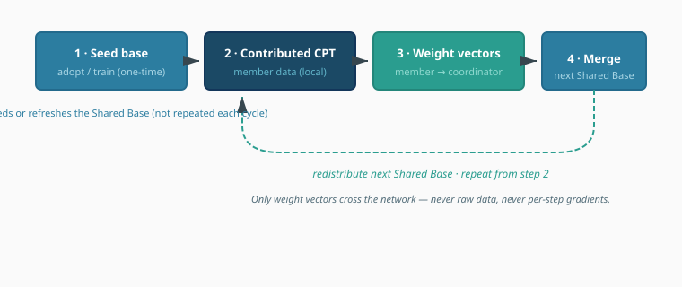

# Architecture diagrams

This directory holds **shared visual assets** for architecture docs: exported figures, optional diagram sources, and (when useful) **reusable** Mermaid sources. Narrative docs live next door under [`../`](README.md); this folder is for artifacts that are **referenced**, not the primary prose.

## What belongs here

| Kind | Use when | Example names |
| :--- | :------- | :------------ |
| **Vector exports** | Tooling outside GitHub’s Mermaid renderer (Excalidraw, draw.io, Figma, OmniGraffle), detailed topology, branding | `system-context.svg`, `consortium-training-loop.svg` |
| **Reusable Mermaid source** | Same diagram embedded in **multiple** `.md` files; you want one file to edit | `consortium-loop.mmd` (see below) |
| **Companion sources** | Round-trip editing | `system-context.drawio`, `system-context.excalidraw` |

Avoid dumping every inline diagram here unless there is no shared asset yet.

## Canonical figures (SVG in Markdown)

ADRs and [`training-approaches.md`](../../reference/training-approaches.md) embed **``**. Commit **`*.svg`** whenever the graphic changes.

| SVG (embedded in Markdown; edit here) | Referenced from |
| :------------------------------------ | :-------------- |
| [`consortium-training-loop.svg`](consortium-training-loop.svg) | [`training-approaches.md`](../../reference/training-approaches.md) |
| [`core-plus-sovereign-stack.svg`](core-plus-sovereign-stack.svg) | [TAP-001](../decisions/adr-001-core-plus-sovereign.md) |
| [`data-sovereignty.svg`](data-sovereignty.svg) ([draw.io](data-sovereignty.drawio)) | [TAP-008](../decisions/adr-008-data-sovereignty.md) |
| [`training-paradigms-comparison.svg`](training-paradigms-comparison.svg) | [TAP-002](../decisions/adr-002-consortium-training.md) |
| [`cultural-alignment-framing.svg`](cultural-alignment-framing.svg) | [TAP-003](../decisions/adr-003-cultural-alignment.md) |
| [`sovereign-model-pipeline.svg`](sovereign-model-pipeline.svg) | [TAP-005](../decisions/adr-005-sovereign-pipeline.md) |
| [`phased-base-model-strategy.svg`](phased-base-model-strategy.svg) | [TAP-006](../decisions/adr-006-phased-base-model.md) |

Phase docs (`0-tva-methodology.md`, …) may keep **inline Mermaid** where figures are tightly coupled to narrative and not reused.

## How inclusion works in Markdown

Markdown has no standard `#include`. Embedding is always:

1. **Images** — relative URL from the **file that references them**:

   From [`decisions/adr-004-training-loop.md`](../decisions/adr-004-training-loop.md):

   ```markdown
   
   ```

   That path is wrong from `decisions/` — you must walk up one level:

   ```markdown
   
   ```

   From [`5-architectural-options.md`](../5-architectural-options.md) (same folder as `diagrams/`):

   ```markdown
   
   ```

2. **Mermaid** — GitHub (and many editors) render fenced ` ```mermaid ` blocks **inside** the `.md` file. Putting only `.mmd` text here does **not** auto-render; you either paste the contents into the consuming doc or rely on a site build that inlines it (this repo does not require such a build today).

**Rule of thumb:** embed **``** from `decisions/` (GitHub renders SVG). From [`reference/`](../../reference/), use `../architecture/diagrams/name.svg`. Prefer **one SVG linked from many Markdown files** instead of duplicating Mermaid. Keep **inline Mermaid** only where the diagram is not reused (see **Canonical figures** above).

## Same diagram in two documents

Pick one:

- **Preferred for simplicity:** One **SVG** path under `diagrams/`, shared across markdown files (adjust `../` counts per location).
- **Text stays in git together:** Duplicate a short Mermaid block in both places (acceptable when the figure rarely changes).
- **Advanced:** Maintain `diagrams/foo.mmd` as source of truth; when it changes, paste into consuming docs or add a small script later — only worth it if duplication becomes painful.

## Publishing note

The GitHub Pages site under [`website/`](../../../website/) does not automatically mirror `docs/`. If architecture HTML or mirrored Markdown is published later, copy or generate assets into whatever directory that site serves, or add Jekyll includes — the relative paths above are for the **repo / GitHub** view of `docs/`.

## Naming

Use **kebab-case**, short topic-first names. One **`basename.svg`** per figure.

## Inline Mermaid style (preferred)

New inline Mermaid in architecture/reference docs should follow one of two reference patterns, chosen by diagram job:

| Job | Reference | Use for |
| :--- | :-------- | :------ |
| **Decision / purpose flow** | [TAP-009](../decisions/adr-009-goal-derived-base-model-selection.md), also [`training-approaches.md`](../../reference/training-approaches.md) | Sovereignty views, gates, evidence → outcome, consortium phases as purpose layers |
| **Phased process / status** | [`0-tva-methodology.md`](../0-tva-methodology.md) | Methodology or lifecycle stages, complete/next/pending status, forward flow with revision loops |

Do not invent a parallel palette for the same roles. Older diagrams need not be rewritten unless you are already editing them.

### Mechanics

- Prefer **`classDef` + `class`** over repeated per-node `style` statements (TVA’s older `style P1 …` form is fine when few nodes share a status).
- Set **`stroke-width:2px`** on class defs when using the TAP-009-style palettes.
- Put **dark text on light fills** and **white text on saturated fills** (`color:#fff` or a dark near-black).
- Use **`<br/>`** or `\n` for multi-line node labels; keep labels short enough to read in GitHub’s renderer.
- Keep high-level diagrams compact enough to scan without excessive horizontal or vertical scrolling. Prefer a balanced aspect ratio, short labels, and grouped concepts; if a diagram remains overwide or overtall, split supporting detail into a second diagram.
- Choose **shapes by role**, not decoration — for example in TAP-009: hexagon for the top concept, stadiums for sovereignty views, diamond for a non-compensable gate, parallelogram for seeded evidence, double-border rectangle for score-table outputs.

### Edges and structure

From both references:

- **Solid arrows** (`-->`) for the primary forward path.
- **Dashed labeled arrows** (`-.->|"label"|`) for feedback, revision, or “ripples back” links — never draw revision as if it were the main sequence.
- **Subgraphs** for named movements or groupings (e.g. Requirements vs Architecture in TVA), with a clear subgraph title.

### Phased process / status palette

Reuse when nodes are stages whose color means progress (as in [`0-tva-methodology.md`](../0-tva-methodology.md)):

| Role | `classDef` name | Fill | Stroke | Text |
| :--- | :-------------- | :--- | :----- | :--- |
| Complete / done | `complete` | `#2e7d32` | `#1b5e20` | `#fff` |
| Next / active | `next` | `#1565c0` | `#0d47a1` | `#fff` |
| Pending | (default / omit class) | — | — | — |

Follow the diagram with a short **legend** when status colors are used (e.g. Complete · Next · Pending).

### Sovereignty palette

Reuse these when a diagram distinguishes frontier / national / socio-cultural / industrial purposes:

| Role | `classDef` name | Fill | Stroke | Text |
| :--- | :-------------- | :--- | :----- | :--- |
| Frontier / collective framing | `frontier` / `collective` | `#1b4965` | `#13365a` (or lighter accent `#62b6cb`) | `#fff` |
| National | `national` / `base` | `#2c7da0` | `#236a8c` | `#fff` |
| Socio-cultural | `sociocultural` / `sovereign` | `#5e548e` | `#4a4170` | `#fff` |
| Industrial | `industrial` | `#bc6c25` | `#9a5619` | `#fff` |

### Decision / evaluation palette

Use when a flowchart moves through scope → gates → evidence → outcome (as in TAP-009):

| Role | `classDef` name | Fill | Stroke | Text |
| :--- | :-------------- | :--- | :----- | :--- |
| Scope / iteration bound | `scope` | `#287271` | `#1e5a59` | `#fff` |
| Non-compensable gate (blocking) | `gate` | `#b23a48` | `#8e2e39` | `#fff` |
| Neutral evaluation dimensions | `dimensions` | `#fff` | `#546e7a` | `#263238` |
| Derived weights / positive path | `weights` | `#d8f3dc` | `#2d6a4f` | `#1b4332` |
| Seeded / provisional evidence | `evidence` | `#fff2cc` | `#d6b656` | `#5d4b00` |
| Verify / reconcile | `verify` | `#ede7f6` | `#7b1fa2` | `#4a148c` |
| Accepted / output artifact | `output` | `#2d6a4f` | `#1b4332` | `#fff` |

Copy only the classes a diagram needs.
