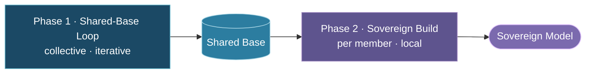
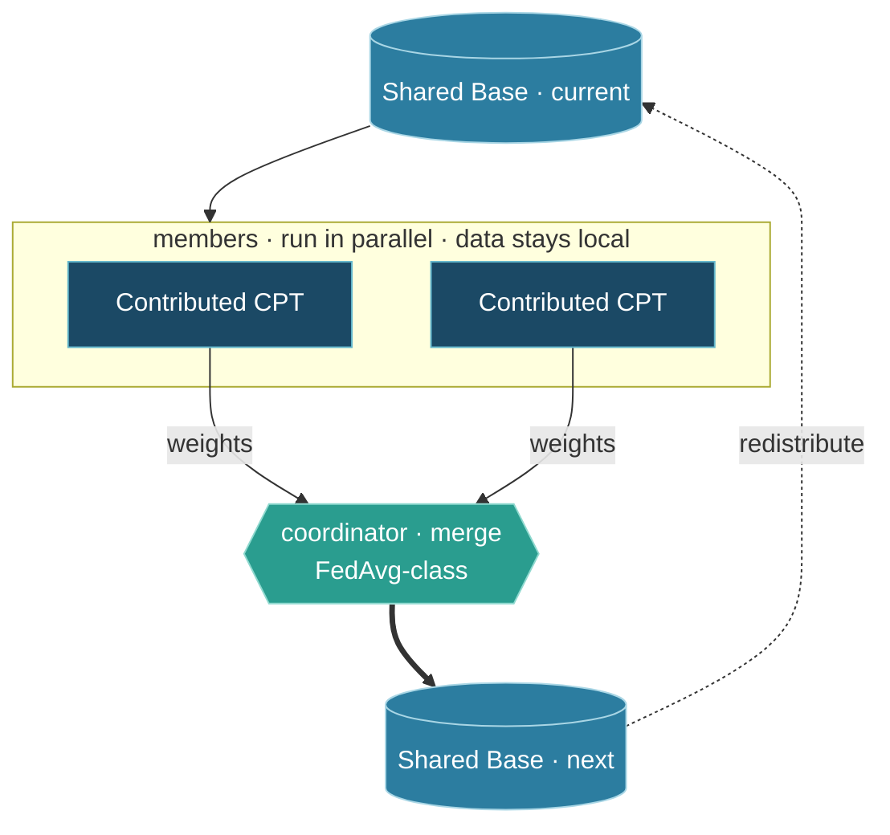

# Tapestry Architecture Reference

A single-page synthesis of Tapestry's architecture — the structural decisions every work group should understand and respect. Each section summarizes one or more Architectural Decision Records (ADRs); follow the links for the full context, rationale, alternatives, and open questions.

> **Status:** The ADRs this reference summarizes are currently **proposed** (to be ratified at the design workshop). Treat this document as the consolidated view of the current design, not a frozen specification. The ADRs under [`../architecture/decisions/`](../architecture/decisions/README.md) are the source of truth; where this page and an ADR disagree, the ADR wins.

---

## Core-Plus-Sovereign Architecture

Tapestry's foundational decision ([TAP-001](../architecture/decisions/adr-001-core-plus-sovereign.md)) is a **core-plus-sovereign** architecture: a frontier-competitive **shared base model** enriched by **sovereign layers** (continued pre-training, post-training alignment, domain adapters) produced by each participating member. Data and values stay local; frontier capability is shared.

| Layer | Who owns it | What it provides |
| :---- | :---------- | :--------------- |
| **Shared base** | Consortium — adopted, then consortium-evolved ([TAP-006](../architecture/decisions/adr-006-phased-base-model.md)) | Frontier-class starting capability; improved via the Shared-Base Loop |
| **Safety alignment** | Consortium (shared) | Baseline safety properties (preservation through CPT is open question DG6) |
| **Sovereign layers** | Each participating member | Cultural alignment, domain fit, instruction norms — data stays local |

The ratio starts at roughly **80/20** centralized-to-sovereign and shifts toward sovereign over time as the consortium matures. (This is develop's current framing — not a fixed "70/30" split.)

---

## Consortium Training — Not Federated Learning

Tapestry uses **consortium training** ([TAP-002](../architecture/decisions/adr-002-consortium-training.md)) — the paradigm defined there and contrasted in full with centralized and federated training in [`training-approaches.md`](training-approaches.md). In brief: a small number of large, trusted, heterogeneous members collaboratively train a shared model, where data sovereignty is a first-order constraint and cultural alignment is the goal. It is deliberately distinguished from federated learning. *Tapestry-specific term definitions are consolidated in [`glossary.md`](glossary.md).*

Consortium training has two phases, run in order:



---

## The Shared-Base Loop (Phase 1)

The Shared Base improves through a four-step loop ([TAP-004](../architecture/decisions/adr-004-training-loop.md)):



| Step | Where it runs | Member data | What crosses the network |
| :--- | :------------ | :---------- | :----------------------- |
| 1. Base training | Central / global pipeline | N/A (open data) | Global model checkpoint |
| 2. Contributed CPT | Each member node | Stays on node | Nothing raw |
| 3. Weight-vector contribution | Node → coordinator | Stays on node | Local model weights (post–Contributed CPT) |
| 4. Integration | Coordinator | — | Updated Shared Base back to nodes |

**Loop boundary:** only **Contributed CPT** weights feed the Shared Base. Everything in the Sovereign Build (below) runs locally and is *not* averaged into the global model. The aggregation mechanism is modular and replaceable.

---

## The Sovereign Build (Phase 2)

Each participant turns the Shared Base into its deployable **Sovereign Model** with a four-stage pipeline plus cross-cutting evaluation ([TAP-005](../architecture/decisions/adr-005-sovereign-pipeline.md)). All stages run on member data at the participant; the *tooling* is shared consortium infrastructure. The Stage A CPT here is **Private CPT** — kept local, in contrast to the Shared-Base Loop's Contributed CPT.

| Stage | What changes | Sovereign decision | Maps to industry term |
| :---- | :----------- | :----------------- | :-------------------- |
| **0 — Data** | Training corpora | What data represents our culture? | Data curation / governance |
| **A — CPT** | World knowledge / representations | What should the model know about our world? | Continued pre-training (DAPT) |
| **B — SFT** | Instruction-following / product shape | How should it interact with our users? | Supervised fine-tuning |
| **C — Alignment** | Behavior / values | What is appropriate, respectful, true for us? | RLHF / DPO / Constitutional AI |
| **Eval** (cross-cutting) | Validation after every stage | Did it work? Is it safe? Is it ours? | Benchmarking, red-teaming, cultural eval |

**N+1 model outcome:** at any time the consortium produces **1 Shared Base** (the substrate) and **N Sovereign Models** (the deployed products — one per community). The Sovereign Models are the value; the Shared Base is the substrate.

---

## Phased Base Model Strategy

Where the base model comes from is a phased decision ([TAP-006](../architecture/decisions/adr-006-phased-base-model.md)):

- **Phase 1 (now):** adopt the best available **open-weights** model as the starting base; build sovereign layers on top. An honest, acknowledged dependency.
- **Phase 2 (when ready):** transition to a **consortium-trained** base once the organization has the maturity, compute, data, and governance.

Sovereign contributions are designed to be **portable across base models**, so the Phase 1 → Phase 2 transition does not discard participants' work. This satisfies anti-capture (DG3) in the temporal sense — "we can switch" — even before instantaneous independence.

---

## Cultural Alignment Is the Differentiator

Tapestry's primary differentiator is **sovereign cultural alignment** ([TAP-003](../architecture/decisions/adr-003-cultural-alignment.md)) — the one thing a centralized lab structurally cannot replicate, because it requires local legitimacy and participation. Multilingual capability is explicitly *not* the moat ("a model that speaks Yoruba with Silicon Valley values is not a sovereign model"). This makes cultural alignment measurable (Inglehart-Welzel / World Values Survey positioning) rather than aspirational, and makes evaluation tooling first-class, novel work.

---

## Data Sovereignty

Tapestry fully supports a spectrum of data-use constraints ([TAP-008](../architecture/decisions/adr-008-data-sovereignty.md)) rather than restricting itself to fully-open data. A governance-enforcement capability categorizes and manages every dataset:

| Category | Constraint | Typical use |
| :------- | :--------- | :---------- |
| **Fully-open** | None (curated, openly licensed) | Base + consortium training |
| **Unique-open** | Open but not generally accessible | Node-local now; may migrate to core later |
| **Controlled** | Licensed for Tapestry use | Training/tuning with governance + anti-memorization care |
| **Sovereign** | Must stay within a jurisdiction/firewall | Node-local only, within the boundary |
| **Private** | Legally protected / proprietary | Node-local; differential privacy where applicable |

**Only model weight updates cross the network — never raw data.** Each node is responsible for enforcing the requirements of the data it manages and auditing that enforcement. Dataset *metadata* is published even when the data itself cannot be.

---

## Source Code Structure

The Python package is organized around three subsystems, matching the architecture:

```
src/tapestry/
├── data/              # Data governance, sovereignty enforcement, consent/provenance
├── training/          # Consortium training and the sovereign pipeline
│   └── consortium/    # Implemented slice: coordinator, node, policy, messages, model
└── infrastructure/    # Supporting infrastructure for sovereign nodes
```

The implemented slice today is `training/consortium/` (governed shared-base integration, sovereign training nodes, anti-capture contribution weighting). New code should stay aligned with the data / training / infrastructure split.

---

## Design Goals and Invariants

The architecture serves a set of design goals ([`../architecture/4-design-goals.md`](../architecture/4-design-goals.md)). The load-bearing ones:

- **DG1 — Frontier capability with sovereign alignment.** The Shared Base provides capability (the "1"); the Sovereign Build provides alignment (the "N").
- **DG2 — Sovereignty enforced where it matters.** Data never leaves the node; only Contributed CPT weight vectors cross the wire.
- **DG3 — Anti-capture.** No participant's sovereignty may be compromised by another's power, and Tapestry must never become the dependency it was built to replace (see [`../governance/anti-capture-principle.md`](../governance/anti-capture-principle.md)). Mitigated by portable sovereign layers, influence caps, and standards-based certification.
- **DG6 — Safety in the shared base.** Baseline safety lives in the shared base; preserving it through continued pre-training, and drawing the contested "safety vs. alignment" line, is an open governance question.

Every design doc, PR, and implementation decision should be checked against these invariants:

1. **No raw data crosses node boundaries** — only model weight vectors after Contributed CPT.
2. **Sovereign layers are portable across base models** — no provider-specific lock-in.
3. **Only Contributed CPT feeds the Shared Base** — the rest of the Sovereign Build stays local.
4. **Cultural alignment is measured, not assumed** — every stage is evaluated, including cultural-alignment benchmarks.
5. **Performance claims are domain- and culture-specific** — Tapestry competes on culturally-situated tasks, not general English academic benchmarks.

---

*For the strategic framing behind these decisions, see [`../strategic-plan/VISION.md`](../strategic-plan/VISION.md) and [`../strategic-plan/PRD.md`](../strategic-plan/PRD.md). For the full design chain (TVA methodology through architectural options), see [`../architecture/README.md`](../architecture/README.md).*
