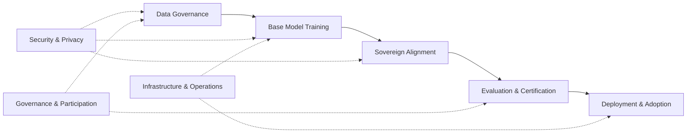

# Work Groups

This directory organizes Project Tapestry work groups by durable lifecycle responsibility, not by a repeated requirements/engineering split. Each work group owns its requirements discovery, technical exploration, implementation notes, open questions, and delivery artifacts in one place.

The structure is meant to be necessary and sufficient for the current architecture: sovereign data enters the system; base models and sovereign alignment pipelines transform it; evaluation, security, and governance constrain what can ship; infrastructure and deployment make it usable.

## Work group map

| Work group | Directory | Owns |
| :--------- | :-------- | :--- |
| Data Governance | [`data-governance/`](data-governance/README.md) | Sovereign data sourcing, licensing, stewardship, residency, provenance, and contribution rights |
| Base Model Training | [`base-model-training/`](base-model-training/README.md) | Adopted-base strategy, consortium training loop, shared-base continued pretraining, aggregation, and transition to consortium-owned bases |
| Sovereign Alignment | [`sovereign-alignment/`](sovereign-alignment/README.md) | Participant-owned continued pretraining, post-training alignment, instruction tuning, and portability of sovereign layers |
| Evaluation & Certification | [`evaluation-certification/`](evaluation-certification/README.md) | Capability, cultural alignment, safety, benchmark design, certification criteria, audit evidence, and release gates |
| Security & Privacy | [`security-privacy/`](security-privacy/README.md) | Privacy tiers, secure aggregation, differential privacy, TEEs, threat models, model-update leakage, and safety-preservation constraints |
| Infrastructure & Operations | [`infrastructure-operations/`](infrastructure-operations/README.md) | Heterogeneous compute, orchestration, node operations, observability, fault tolerance, platform operations, and cost/accounting plumbing |
| Deployment & Adoption | [`deployment-adoption/`](deployment-adoption/README.md) | Serving, chat/product harnesses, integration patterns, participant rollout, developer experience, and adoption feedback loops |
| Governance & Participation | [`governance-participation/`](governance-participation/README.md) | Anti-capture mechanics, contribution credit, decision rights, consortium process, and interfaces with [`../governance/`](../governance/README.md) |

## Lifecycle view

## Charter template

Each work-group README should stay short and concrete:

- **Purpose:** what the group owns.
- **Why it exists:** the architecture goals, ADRs, pain points, or value propositions that make the group necessary.
- **Scope:** responsibilities included and explicitly out of scope.
- **Initial questions:** workshop or research questions the group must resolve.
- **Early deliverables:** artifacts expected before the work group can be considered operational.
- **Interfaces:** other work groups it must coordinate with.
