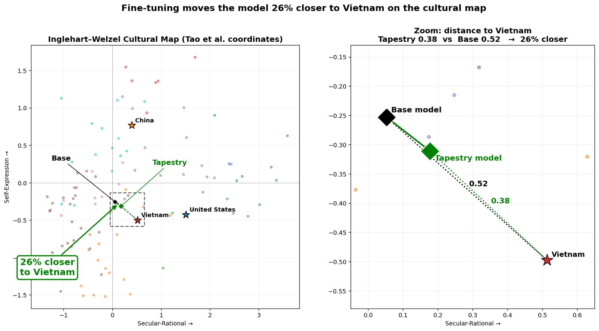

# Base Model Selection

| Field       | Value           |
| :---------- | :-------------- |
| Status      | Proposed        |
| Confidence  | High (5/5)      |
| Created     | July 09, 2026   |
| Last Update | August 28, 2026 |

## Purpose

This document focuses on the selection of an open-weights base model family (or perhaps more than one), which is covered by [Issue #25: Select the initial base model](https://github.com/The-AI-Alliance/tapestry/issues/25), part of [TAP-006: Phased Base Model Strategy](../../architecture/decisions/adr-006-phased-base-model.md) and [TAP-009: Goal-Derived Base Model Selection](../../architecture/decisions/adr-009-goal-derived-base-model-selection.md)

> [!NOTE]
> Some of the following content is taken and adapted from the above sources, as well as discussions in various project issues and pull requests. As always, please suggest improvements!

## References

* A comprehensive list of models (open and closed) and details about them: [https://models.dev/](https://models.dev/) ([GitHub repo](https://github.com/anomalyco/models.dev))
* The [Best Open Source AI Models for Coding](https://kilo.ai/open-source-models#best-models-ranked). While Kilo ranks the models specifically on coding ability, it's one of the few sources found on the Web that list the necessary characteristics for comparison all in one place.
* Apertus model cards: [Apertus v1.5 8B](https://huggingface.co/swiss-ai/Apertus-v1.5-8B), [Apertus v1.5 70B](https://huggingface.co/swiss-ai/Apertus-v1.5-70B), and [Apertus 70B 2509](https://huggingface.co/swiss-ai/Apertus-70B-2509).

## Requirements

What are the requirements the choice has to meet? 

It's important to remember that we intend for the choice of a third-party base model to be temporary while we develop our own FMs (foundation models) from scratch. It's also true that the techniques for downstream model improvements, continued pre-training (CPT), fine tuning (FT), and reinforcement learning (RL - and variants), should be relatively portable to other models.

However, what is unknown is how long it will take for us to create our own competitive FMs, and therefore how long will we need to use the third-party models? Hence, we need to be somewhat deliberate about our choices.

> [!NOTE]
> The requirements use a trial numbering scheme **BMS-R#**, for _Base Model Selection, Requirement #_. The intent is support a possible need to aggregate all requirements into one place. Feedback welcome.

### BMS-R1: Weights Are Open

How is _open weights_ (OW) defined exactly? For example,

* BMS-R1A: There are zero restrictions on any use.

For BMS-R1A, will we instead accept a model with some restrictions on use? It's useful to consider the [gpt-oss usage policy](https://github.com/openai/gpt-oss/blob/main/USAGE_POLICY), which states:

> We aim for our tools to be used safely, responsibly, and democratically, while maximizing your control over how you use them. By using OpenAI gpt-oss-120b and gpt-oss-20b, you agree to comply with all applicable law.

Most of the models, even those with Apache 2.0 licenses, have policies like this one that explicitly prohibit use of the models to violate any laws. Many also prohibit uses like defamation, misrepresentation, unauthorized impersonation, etc., which may or may not be covered by applicable law. The Java license in the 1990's famously disallowed use of Java to manage nuclear power plants!

For our purposes, we consider restrictions related to law abiding to be equivalent to "zero restrictions", because a reasonable baseline assumption is that no model, nor any other software, can be used to violate any laws of the jurisdiction where it is used, even if the model family has no such explicitly-stated policy limitations. We consider "nonzero restrictions" to include prohibitions against unrestricted use of models commercially, in military applications, etc., which would otherwise be legal. For example, some models may only allow unrestricted, non-commercial use, whereas commercial use requires a contract of some kind with the model developer.

For reference, here is a summary of kinds of restrictions to consider, adapted from the [this DeepWiki page on IBM Granite Code models](https://deepwiki.com/ibm-granite/granite-code-models/1.2-licensing-and-intended-use). It is similar to other categorizations of model openness:

#### Permissions

| Permission | Description |
| :--------- | :---------- |
| **Commercial Use** | The Models can be used in commercial products and services |
| **Modification** | Users can modify the models (e.g., fine-tuning) |
| **Distribution** | Modified versions of the models can be distributed |
| **Patent** | The license provides express grant of patent rights from contributors |
| **Private** | The models can be used and modified privately without distribution |

#### Conditions

| Condition | Description |
| :-------- | :---------- |
| **License and Copyright Notice** | A copy of the license and copyright notice must be included with the models |
| **State Changes** | Significant changes made to the models must be documented |

#### Limitations

| Limitation | Description |
| :--------- | :---------- |
| **Trademark Use** | The license does not grant trademark rights |
| **Liability** | There is no liability for damages arising from use |
| **Warranty**  | There is no warranty provided |

### BMS-R2: Multiple Sizes Are Available

Ultimately, models will be needed that span deployments from edge devices to large data center clusters, with their corresponding application requirements. 

Some open questions:

* BMS-R2A: All model sizes available are open weight.

For BMS-R2A, what if a desirable model family keeps its largest-sized models closed? Could the open-weight versions still be worth consideration?

### BMS-R3: Under Active Development

Given the possibility that we may have to use this model choice for several years, we should focus on candidate model families that remain under active development with no known plans to change to closed weight licensing.

This is somewhat tricky because there are many open-weight models with currently very good performance, but development of them has stopped, slowed down, or appear to be at risk of losing development. In part, the answer comes down to timing:

* How long do we have to rely on the selected model family before we transition to our own models?
* Since we will use the selected model family for improvements through continued pre-training and post-training, how long with those processes keep our developed models competitive, even if the original model developer is no longer improving the base models?

### BMS-R4: Performance Is Competitive

We don't require models to be the very best at all the common, general-purpose benchmarks, but they should be competitive in the areas we care about, as one of the general problems Project Tapestry seeks to solve is the challenge previous sovereign models have faced when adoption was poor in part due to insufficiently-strong benchmark performance.

There is a maturation of public opinion involved here, too. For most of the few years since ChatGPT emerged, model selection has been driven heavily by benchmark performance and general perception through use of chat interfaces. Those criteria are still important, especially chat efficacy for the general public, it is also true that increasingly, perceptions are being shaped by how well models and the agent systems that use them perform in particular domains and use cases, like software development.

So, competitive performance has to be judged in the context of Tapestry's goals for target use cases and domains!

### BMS-R5: Can Be Culturally Aligned

The work of [Issue #22: PoC for alignment based on Inglehart-Welzel Cultural Map](https://github.com/The-AI-Alliance/tapestry/issues/22) (part of [TAP-003: Cultural Alignment as the Primary Differentiator](../../architecture/decisions/adr-003-cultural-alignment.md)) and some follow-on PoCs provided an initial exploration of the feasibility of tuning for cultural alignment. We anticipate that some model families or architectures will respond better than others at this form of post-training alignment that is a key capability for Project Tapestry.

For example, it has been suggested that models using a mixture of experts (MoE) architecture may be harder to tune, because LoRA is harder to use with this architecture. Such questions require more investigation.
 
## Selection Notes

The candidate table below records current observations against BMS-R1 through
BMS-R5 for [issue #25](https://github.com/The-AI-Alliance/tapestry/issues/25), with input from the _M0_ model selection ([issue 115](https://github.com/The-AI-Alliance/tapestry/issues/115)), which had a smaller set of acceptance criteria that reflected its short-term focus.

- Defer selection gates, evaluation dimensions, weights, purpose-specific
  scoring, and tie-breakers to
  [TAP-009](../../architecture/decisions/adr-009-goal-derived-base-model-selection.md).
- Defer openness, licensing, evidence-disclosure, participant-control, and
  Shared Commons boundary rules to
  [TAP-010](../../architecture/decisions/adr-010-open-commons-and-sovereign-assets.md).
- Use this document as the working evidence inventory for candidate model
  families, including known uncertainties and follow-up questions.

For each candidate family, record evidence and uncertainty for:

- BMS-R1: whether weights are available and what usage or redistribution terms
  apply;
- BMS-R2: what model sizes are available and whether those sizes fit likely
  Tapestry environments;
- BMS-R3: whether the family appears to be under active development;
- BMS-R4: whether public or internally measured performance appears competitive
  enough for the relevant experiment;
- BMS-R5: whether there is evidence, uncertainty, or an experiment plan for
  cultural-alignment tractability.

The [issue #25](https://github.com/The-AI-Alliance/tapestry/issues/25) decision record should stay concise:

- candidate family and version considered;
- evidence or source used for each BMS-R1 through BMS-R5 observation;
- unresolved uncertainties and who should resolve them;
- selected family or families for the immediate experiment;
- fallback family or families to reduce dependency and lock-in;
- references to the TAP-009 selection method and TAP-010 openness and
  participant-control boundaries used for the final decision.

## Candidate Model Families

Some of the requirements imply that research model projects will usually be poor candidates, because they are usually designed to explore specific pioneering ideas and are not often engineered for general-purpose _production_ use, e.g., a wide range of sizes, extensive post training for safety and use case alignment, etc. On the other hand, they tend to be the most open model families, not just open weights, but often include open-source tool chains, datasets, etc.

Here is a starting list of candidates, listed alphabetically. _Please use PRs to correct any errors, add additional model families, etc.!_

Key for icons:
| Icon  | Description |
| :---: | :---------- |
| ✅    | Satisfied |
| ⚠️    | Some limitations  |
| ❌    | Requirement not satisfied |
| **?** | To be determined (either we need to find the answer or determine it experimentally) |

| Family    | [R1](#bms-r1-weights-are-open "BMS-R1: Weights Are Open") | [R1A](#bms-r1-weights-are-open "BMS-R1A: Zero restrictions on any use") | [R2](#bms-r2-multiple-sizes-are-available "BMS-R2: Multiple Sizes Are Available") | [R2A](#bms-r2-multiple-sizes-are-available "BMS-R2A: All model sizes available are open weight") | [R3](#bms-r3-under-active-development "BMS-R3: Under Active Development") | [R4](#bms-r4-performance-is-competitive "BMS-R4: Performance Is Competitive") | [R5](#bms-r5-can-be-culturally-aligned "BMS-R5: Can Be Culturally Aligned") | Comments |
| :-------- | :--- | :--- | :--- | :--- | :--- | :--- | :--- | :------- |
| Apertus   | ✅ | ⚠️ Apache 2.0 weights with AUP and access acknowledgement to review | ✅ | ✅ | ✅ | ✅ | **?** | Built by the Swiss AI Initiative. Relevant because it emphasizes fully open training data, training recipes, transparency, and broad multilingual coverage; verify whether the access gate, AUP, and multimodal/checkpoint variants fit Tapestry participant-control and long-term base-model requirements. |
| DeepSeek  | ✅ | ✅ | ❌ Large only[^1] | ✅ | ✅ | ✅ | **?** | Built by DeepSeek in China; possible geopolitical concerns. |
| Gemma 4   | ✅ | ✅ | ⚠️ Smaller sizes only today; will Google expand the size choices? | ❌ Larger Google models are proprietary | ⚠️ Will Google keep releasing updated versions of OW Gemma? | ✅ | **?** | Excellent performance. Will Google continue to develop open-weight models and expand the size options? |
| GLM       | ✅ | ✅ | ❌ Large only | ✅ | ✅ | ✅ | **?** | Built by Z.ai in China; possible geopolitical concerns. |
| GPT OSS   | ✅ | ✅ | ❌ Limited size choices | ⚠️ Larger models not in this family are proprietary | Will OpenAI keep releasing open-weight versions of GPT OSS? | ✅ | **?** | Excellent performance. Is GPT OSS a "one-shot" release or a longer-term strategy? |
| Granite   | ✅ | ✅ | ⚠️ Smaller sizes currently | ✅ | ✅ | ⚠️ Larger sizes not available, but coming | **?** | Built by IBM - Good performance and strong data governance, with active development continuing. |
| K2        | ✅ | ✅ | ✅ | **?** | ✅ | **?** | **?** | Built by MBZUI. Strong on Middle East languages. Future development plans are TBD. |
| Llama/Muse[^2] | ✅ | ⚠️ Some limitations on use | ✅ | ⚠️ Largest Llama4 models not OW. Plans for the [new Muse family](https://research.meta.ai/blog/introducing-muse-glimmer-open-agentic-model) are TBD. | ⚠️ Meta stopped developing Llama, but recently started providing open-weight _Muse_ models. | ✅ | ✅[^3] - See [here](#feasibility-study-on-cultural-alignment-shift) | Very familiar and widely used, but Muse's future is TBD. |
| Mistral   | ✅ | ✅ | ✅ | ✅ | ✅ | ✅ | **?** | Built in the EU with strong EU alignment. |
| Nemotron  | ✅ | ✅ | ✅ | ✅ | ✅ | ✅ | **?** | Built by NVIDIA. Excellent performance and variety, but can they only be used on NVIDIA hardware? (TBD) |
| Olmo      | ✅ | ✅ | ⚠️ Smaller model sizes only | ✅ | ⚠️ Turnover at Ai2 makes the future of Olmo unclear | ✅ | **?** | A state-of-the-art research model family, among the most open and transparent available. See in particular [FlexOlmo](https://huggingface.co/allenai/FlexOlmo-7x7B-1T), which has data management features relevant to our needs. However, is the Olmo family otherwise suitable for production use and Tapestry requirements, and will Ai2 continue active development? Even if not, it might be a very good starting point for our own models that are built from scratch. |
| Qwen      | ✅ | ✅ | ✅ | ✅ | ✅ | ✅ | **?** | Built by Alibaba in China; possible geopolitical concerns. |

[^1]: When only large-size models are listed as available, third-party quantized and distilled variants may also be available.
[^2]: Meta has discontinued the Llama model family, while the recently announced Muse family is a separate model line.
[^3]: Alignment has only been tested for Llama3 so far. Limitations for the other candidates remain unverified; in general, MoE models may be more complicated to post-train than dense models.

### Milestone Zero (M0) Model Choice

This section preserves the M0 model choice from [issue #115](https://github.com/The-AI-Alliance/tapestry/issues/115). Its rankings reflect the short-term focus of M0 and not the longer-term focus of [issue #25](https://github.com/The-AI-Alliance/tapestry/issues/25). For example, a wide range of model sizes was not important for M0; only a small model was needed.

For M0, the [Kilo AI model list](https://kilo.ai/open-source-models#best-models-ranked) (June 2026), and other community sources were used for information. The following criteria were emphasized:

1. **Well-known, well-characterized, reasonably well-adopted** — not obscure; has community usage, papers, third-party CPT examples, etc.
2. **Multi-size family** — multiple sizes (especially in the 1B-10B parameter range), so nodes with different resource capacities and budgets can potentially participate.
3. **Open Source** - As much of the data pipeline, training code, and stack open-sourced as possible.
4. **Size: 1B–10B params** — below 1B is sub-optimal for meaningful CPT experiments; above 10B pushes POC resource costs without adding to the POC validity.

The best candidates identified had these properties:

| Model Family | Sizes | Best POC Size | Lab | License | Code Open? | Data Open? | Pipeline Open? | Community CPT? |
|---|---|---|---|---|---|---|---|---|
| **OLMo 2** | 1B, 7B, 13B | **7B** | AI2 | Apache 2.0 | ✅ Yes | ✅ Yes (Dolma) | ✅ Yes | ✅ Yes |
| **Granite 3.x** | 1B, 2B, 3B, 8B | **3B or 8B** | IBM Research | Apache 2.0 | ✅ Yes | ⚠️ Partial | ✅ Yes | ✅ Yes |
| **Llama 3.2 / 3.1** | 1B, 3B, 8B, 70B | **3B or 8B** | Meta AI | Llama 3 Community | ⚠️ Partial | ❌ No | ❌ No | ✅ Extensive |
| **Qwen 2.5** | 0.5B, 1.5B, 3B, 7B, 14B… | **3B or 7B** | Alibaba | Apache 2.0 | ⚠️ Partial | ❌ No | ❌ No | ✅ Yes |
| **Mistral 7B v0.3** | 7B | **7B** | Mistral AI | Apache 2.0 | ❌ No | ❌ No | ❌ No | ✅ Extensive |

> [!NOTE]
> 1. **OLMo 2** — Top pick. Only family with fully open weights + training code + data (Dolma) + pipeline (dolma-toolkit). AI2 publishes hyperparams and training configs. 7B fits a single p5.48xlarge comfortably.
> 1. **Granite 3.x** — IBM publishes training data mix, hyperparams, and eval methodology. Apache 2.0. 3B for resource-constrained nodes; 8B for stronger baseline capability.
> 1. **Llama 3.2 / 3.1** — Largest CPT recipe library in the field. 8B is the de-facto POC standard. License permits research CPT; verify redistribution rights for consortium weight sharing.
> 1. **Qwen 2.5** — Apache 2.0; widest size range; strongest multilingual baseline for non-English sovereign nodes.
> 1. **Mistral 7B** — Single size (weak on criterion 2), but enormous CPT literature makes it easy to find published baselines and community help.

#### M0 Model Ranking

| Priority | Family | POC Size | Key Reason |
| :--- | :--- | :--- | :--- |
| 🥇 First choice | **OLMo 2** | 7B | Fully open stack — weights, code, data, pipeline. Best CPT reproducibility. |
| 🥈 Second choice | **Granite 3.x** | 3B or 8B | Apache 2.0; IBM publishes training details; multiple sizes for varied node capacity. |
| 🥉 Third choice | **Llama 3.2** | 3B or 8B | Largest community CPT recipe library; 8B is field-standard POC baseline. |
| **Multilingual bonus** | **Qwen 2.5** | 3B or 7B | Apache 2.0; widest size range; **strongest non-English baseline for sovereign nodes.** |

> [!NOTE]
> Given the sovereign AI requirement of diverse cultural mapping capability, Qwen 2.5 should be given special consideration in the M0 analysis. This note does not alter the separate long-term selection process.

The following models were on criterion 2 (openness or multi-size):

| Model Family | Sizes | Best POC Size | Lab | License | Code Open? | Data Open? | Gap |
| :---| :---| :---| :---| :---| :---| :---| :---|
| **Gemma 4** | E2B, E4B, 12B, 26B, 31B | E2B or E4B | Google DeepMind | Apache 2.0 | ❌ No | ❌ No | Training stack and data set not open. |
| **Nemotron (Nano/Super)** | 8B, 120B | 8B Nano | NVIDIA | NVIDIA Nemotron Open | ❌ No | ❌ No | Hybrid Mamba arch may complicate CPT tooling. Custom license — verify. |
| **SmolLM2** | 135M, 360M, 1.7B | 1.7B | HuggingFace | Apache 2.0 | ✅ Yes | ✅ Yes | All sizes sub-2B — below useful minimum per criterion 3. Hello-world iteration only. |

The following models were filtered out:

| Model | Reason |
| :---- | :----- |
| DeepSeek V4-Pro / Flash | 49B / 13B active params — exceeds POC resource budget |
| Kimi K2.6 | 32B active; no small-size family; frontier scale |
| GLM-5.1 | 40B active; no small-size variants |
| Qwen3-Coder-Next | MoE 80B total / 3B active; coding-specific; CPT on MoE non-trivial |
| Devstral 2 | 123B total; coding-specific |
| StarCoder2 15B | Exceeds 10B; coding-domain only |

## Feasibility Study on Cultural Alignment Shift

[Issue #22: PoC for alignment based on Inglehart-Welzel Cultural Map](https://github.com/The-AI-Alliance/tapestry/issues/22), part of 
[TAP-003: Cultural Alignment as the Primary Differentiator](../../architecture/decisions/adr-003-cultural-alignment.md), used the `Llama-3.2-3B-Instruct` model for its experiments, with the goal of producing a feasibility study paper that demonstrated simultaneous (a) socio-cultural alignment shift and (b) no performance loss in general capabilities (e.g., as measured by benchmarks like MMLU (see below). The team chose Llama because it is available and is simple to post-train, due to its permissive license and the fact it is a dense model (not MoE - mixture of experts - which is a harder architecture to tune), etc.

More generally, the longer-term model choice will be based in part on which options give us the lowest resistance path towards the strategic objectives of (a) high/leading performance while (b) affording sovereignty (national, socio-cultural, industrial). Medium-term, we aim to perform CPT (continued pre-training) and ultimately PT of models from scratch.

Here are some [interesting preliminary results](../../../contrib/nguyennm1024-sociocultural-alignment/) (as of June 2026) from work performed by [@nguyennm1024](https://github.com/nguyennm1024), which used a capability-rehearsal corpus to limit catastrophic forgetting, with the culturally-aligned and rehearsal members fused via weight-space averaging (50/50). Cultural position was measured via the Inglehart-Welzel projection method (Tao, Y. et al., *Cultural Bias and Cultural Alignment of Large Language Models*, 2024, [arxiv](https://arxiv.org/abs/2311.14096v2)) and capability was measured using MMLU (Hendrycks, D. et al., *Measuring Massive Multitask Language Understanding*, 2021, [arxiv](https://arxiv.org/abs/2009.03300)).

Here are preliminary tuning results showing a 26% improvement:

Here is the final, different representation at the end of the tuning experiment showing a 45% improvement:

| Model | Distance to Vietnam (Inglehart-Welzel) | Capability (full MMLU, n=14,042, zero-shot) |
| :---- | :-------------------------------------- | :------------------------------------------- |
| Base  | 2.46 | 63.2% |
| Tuned | 1.35 - 45% closer | 62.4% (not statistically significant, McNemar p ≈ 0.07) |

The non-significance finding is a direct quote from the [Preliminary results](../../../contrib/nguyennm1024-sociocultural-alignment/README.md#preliminary-results) section of the README. One model, one culture, staging-quality code — but a positive directional result on the axis [TAP-003](../../architecture/decisions/adr-003-cultural-alignment.md) identified as the differentiator: a measurable cultural shift with no significant capability drop.

## Appendix 1: Performance Reference (R4)

The performance data is sourced from the [Onyx Open Source LLM Leaderboard](https://onyx.app/open-llm-leaderboard). [R4](#bms-r4-performance-is-competitive "BMS-R4: Performance Is Competitive") asks only for "competitive," not best-in-class.

| Model Family (variant) | MMLU-Pro | GPQA-D | SWE-bench V. |
| :--------------------- | -------: | -----: | -----------: |
| Qwen 3.5               |     87.8 |   88.4 |         76.4 |
| GLM-5                  |     70.4 |   86.0 |         77.8 |
| DeepSeek V3.2          |     85.0 |   79.9 |         67.8 |
| GPT-oss 120B           |     90.0 |   80.9 |         62.4 |
| Nemotron Super         |     79.5 |   72.0 |            — |
| Llama 4 Maverick       |     80.5 |   69.8 |            — |

> [!NOTE]
> MBZUAI's K2 and IBM's larger Granite models are not yet ranked at this tier; absence is not disqualifying under [R4](#bms-r4-performance-is-competitive "BMS-R4: Performance Is Competitive").

## Appendix 2: Training-data Transparency (Supplementary Consideration)

The transparency of the training data set used for each model is not a BMS requirement but a separate strategic input drawn from the work group's companion survey, [The State of Open Weight Models](state-of-open-weight-model-training.md), whose stated purpose is to inform Tapestry's training direction rather than to gate model choice. It matters mainly for [_Phase 2_](https://github.com/The-AI-Alliance/tapestry/blob/develop/docs/reference/ARCHITECTURE.md#the-sovereign-build-phase-2), training a base model from scratch, where a partner whose data engineering is legible is worth more than its benchmark score alone. [The State of Open Weight Models](state-of-open-weight-model-training.md) survey sorts the field into three descriptive tiers:

| Tier | Families |
| :--- | :------- |
| Documented thoroughly (named datasets / published pipelines) | Nemotron, Granite, OLMo, K2 |
| Documented poorly (methodology only, no named corpora) | Qwen, GLM, DeepSeek, Gemma, GPT-oss, Kimi, MiniMax, MiMo, Step3 |
| Explicitly non-disclosing | Mistral |

The survey's own recommendation [2] is to engage the four thoroughly-documented teams (Nemotron, Granite, OLMo, K2) as potential Phase-2 collaborators, which reframes selection from "which weights to adopt" toward "whose data practice to build on." Because it is a consideration and not a requirement, no model family passes or fails on it — the tiering is descriptive.

See also [Training Approaches: Centralized, Federated, and Consortium](../../reference/training-approaches.md).

## Appendix 3: Tool Chain Constraints (Supplementary Consideration)

Whichever base is chosen must train across the consortium's heterogeneous hardware, per [Model Training Toolkits](training-toolkits.md). PyTorch has the widest accelerator support and is the path of least resistance; a model family whose only mature toolchain is vendor-locked carries a portability cost.

| Framework  | NVIDIA | AMD ROCm | TPU | Trainium |
| :--------- | :----: | :------: | :-: | :------: |
| PyTorch    |   ✅   |    ✅    |  ✅  |    ✅    |
| JAX        |   ✅   |    ⚠️    |  ✅  |    ❌    |
| TensorFlow |   ✅   |    ⚠️    |  ✅  |    ⚠️    |

## Appendix 4: Open vs. Closed Capability Gap (Context for R4)

Two independent May 2026 analyses found that open-weight models are lagging behind closed-weight models:

1. Edwards, J. & Emberson, L. (2026), ["Open models lag state-of-the-art closed models by 4 months."](https://epoch.ai/data-insights/open-closed-eci-gap) Epoch AI Data Insight, May 29, 2026.
2. Ihle, H. T. (2026), ["How far behind are open models?"](https://www.lesswrong.com/posts/rJcCrXyEsJKmmDpWG/how-far-behind-are-open-models) LessWrong, May 28, 2026.

This doesn't change the recommendation, but it's useful context for R4: model families that are "competitive" today are, on average, several months to under a year behind the closed frontier, and that gap has been widening rather than narrowing since early 2025.

Ihle also examines Chinese open-weight models alone and finds that they lagged more than other open models before mid-2024, but since then, Chinese open models like Qwen, DeepSeek, and GLM have been just as competitive as open models from anywhere else.

## Appendix 5: Regulatory Exposure

Some organizations that produce open-weight models may be subject to US or other international regulatory restrictions. Relevant sources include the US Bureau of Industry and Security's [Entity List](https://www.bis.gov/entity-list), section 1260H of the [William M. (Mac) Thornberry National Defense Authorization Act for Fiscal Year 2021](https://www.congress.gov/116/plaws/publ283/PLAW-116publ283.pdf), and the National Science Foundation's [Proposal and Award Policies and Procedures Guide](https://new.nsf.gov/policies/pappg).

These materials are inputs to legal, compliance, and governance review. They do not automatically exclude a model family. Any exclusion or restriction must be tied to an applicable requirement, the relevant jurisdiction, the participants and funding involved, and an authoritative source.
