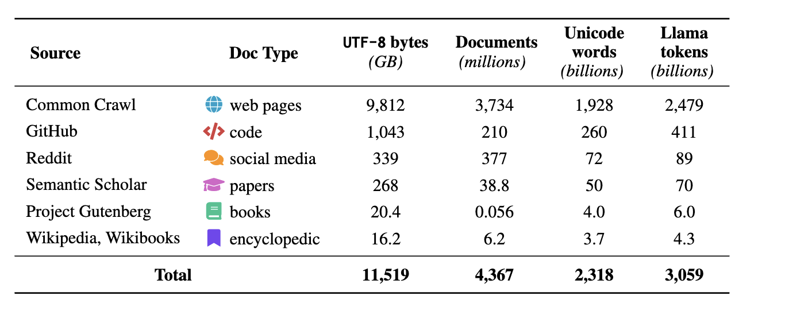

# Introduction

The purpose of this paper is to determine the data sets and data pipelines that are used to train the top rated open weight large language models (LLM). This will be used as inputs to give options as to the strategic direction the Tapestry training might take.  
 

# Open Weight Models

The following open weight models were analyzed, based on the open weight leaderboards at [Onyx.app](https://onyx.app/llm-leaderboard), [Vellum.ai](https://www.vellum.ai/llm-leaderboard) and HuggingFace:

 

| Model Family | Source |
| ----- | ----- |
| [DeepSeek](#deepseek) | DeepSeek |
| [Gemma](#gemma) | Google |
| [GLM](#glm) | Zhipu AI |
| [GPT-oss](#gpt-oss) | OpenAI |
| [Granite](#granite) | IBM |
| [K2](#k2) | Mohamed Bin Zayed University of Artificial Intelligence |
| [Kimi](#kimi) | Moonshot AI |
| [MiMo](#mimo) | Xaiomi |
| [MiniMax](#minimax) | MiniMax |
| [Mistral](#mistral) | Mistral AI |
| [Olmo](#olmo) | Allen AI |
| [Nemotron](#nemotron) | Nvidia |
| [Qwen](#qwen) | Alibaba |
| [Step 3](#step3) | StepFun |

 

# Summary

The open weight models can be divided into three categories:  

1. **Data / training pipeline documented extremely well**: Nemotron, Granite, Olmo, K2  
2. **Data / training pipeline documented poorly**: Kimi, Qwen, DeepSeek, GPT-oss, Gemma, MiniMax, Step 3, GLM, MiMo  
3. **Anti-documentation:** "It is our policy not to disclose anything" \- Mistral

 

Eliminating the last two categories, the recommendation is to engage with the Granite, Olmo, Nemotron, and K2 data engineering teams and understand what direction their data engineering is going. All four are extremely open and have published the datasets they have used (Nemotron, K2, and Olmo), or their data pipeline (all four). They have the required data engineering experience needed, and may be open to collaboration with a wider Tapestry initiative.

# Model Family Details  

## 1. DeepSeek

### Pretraining data — largely undisclosed composition

For the core DeepSeek LLM models (7B and 67B), the company has said only that they were trained on an extensive dataset comprising 2 trillion tokens in both English and Chinese, without naming specific corpora. Independent analysis confirms this gap: the pre-training dataset composition, a hybrid of synthetic and organic data, remains proprietary, obscuring potential biases and ethical sourcing practices, and similarly the RLHF pipeline lacks detailed documentation of preference model architecture and alignment protocols. For DeepSeek-V2, it's even thinner: an undisclosed MoE architecture with proprietary optimizations and training-efficiency claims that omit hardware and data details. [Inferless](https://www.inferless.com/learn/the-ultimate-guide-to-deepseek-models)  
One specific, lower-level data point that is public: the original DeepSeek LLM's pretraining text was sourced from books and Wikipedia content up to 2023, though without multilingual breakdowns or detailed provenance. [arxiv](https://arxiv.org/pdf/2502.18505)  
It's also worth noting DeepSeek's pretraining corpus, like most large models, draws heavily on Common Crawl — this surfaced in a security research context when a separate audit scanned Common Crawl, the massive web-crawl dataset used to train LLMs including DeepSeek, and found roughly 12,000 hardcoded live API keys and passwords across 400TB of web data, illustrating one of the practical risks of training on largely unfiltered web text. [Truffle Security](https://trufflesecurity.com/blog/research-finds-12-000-live-api-keys-and-passwords-in-deepseek-s-training-data)

### DeepSeek-Coder is more specific

The coding-focused models have more disclosed detail than the general LLM line. DeepSeek-Coder was trained on 2 trillion tokens, with the training dataset consisting of 87% source code, about 10% English code-related text, and 3% Chinese text. The later DeepSeek-Coder-V2 added a math/reasoning-focused continuation: it underwent continuous pre-training on roughly 120 billion math-related tokens sourced from Common Crawl, along with natural language and code data. [ScienceDirect](https://www.sciencedirect.com/science/article/pii/S2666764925000451)[Inferless](https://www.inferless.com/learn/the-ultimate-guide-to-deepseek-models)

### Post-training data — DeepSeek is actually unusually transparent

This is the standout part. For DeepSeek-R1 and V3, the company disclosed concrete sizes for its post-training datasets, more so than most labs do: 600,000 reasoning examples, 200,000 non-reasoning SFT examples, an undisclosed-size human preference (RLHF) dataset, and human-processed synthetic data used for "cold-start" training. DeepSeek-V3, distilled from R1, was separately trained on an instruction-tuning dataset of 1.5 million samples — for comparison, that's larger than Qwen-2.5's 1 million SFT samples, and far larger than the 30K SFT / 3M RLHF samples Meta disclosed for Llama 2\. [X](https://x.com/alexandr_wang/status/1884440764677251515)  
DeepSeek also drew attention for emphasizing human data annotation more than is typical for Chinese labs: the DeepSeek-V3 paper includes a dedicated acknowledgement section for data annotation, and according to Chinese AI engineers, DeepSeek values data annotation work highly enough that its CEO has personally labeled data for the model. [X](https://x.com/alexandr_wang/status/1884440764677251515)  
Methodologically, the R1 pipeline used a staged approach: starting from a small LLM-generated and human-curated set of demonstrations to first train on high-quality reasoning data in math and code, aimed at improving the consistency and readability of reasoning trajectories rather than reasoning ability itself, which helped speed convergence in the reinforcement learning stage that followed and delivered the largest performance gains. [Toloka](https://toloka.ai/blog/the-data-behind-deepseek-s-success/)

### Downstream ecosystem effect

Because DeepSeek-R1's outputs were released openly, an entire secondary ecosystem of "distilled" datasets has sprung up, built by third parties prompting R1 and collecting its reasoning traces — e.g., a community-built 1.4-million-example reasoning dataset where 0.9 million entries were distilled directly from DeepSeek-R1's outputs. This is a direct consequence of DeepSeek's open-weight release strategy, distinct from disclosure about DeepSeek's own original training data. [arxiv](https://arxiv.org/pdf/2503.19633)

2. ## Gemma

### Scale and broad composition

For Gemma 2, the disclosed figure is that it was trained on 8 trillion tokens, with the training data filtered to remove personal information, harmful content, and other sensitive or high-risk data. That's a token count plus a description of what was filtered *out*, but not what the data actually consists of by source. [arxiv](https://arxiv.org/pdf/2505.16467)  
For Gemma 3, Google didn't even repeat a token count in most public summaries — instead the emphasis was on relative composition changes from the prior generation: the Gemma 3 dataset has double the amount of multilingual data compared to its predecessor to improve language coverage, paired with a new SentencePiece tokenizer (262K entries, shared with Gemini 2.0) that significantly improves encoding for Chinese, Japanese, and Korean text, at a slight cost to English/code token efficiency. Again, this tells you about the *language mix* and tokenizer choices, not what corpora the text was pulled from. [Hugging Face](https://huggingface.co/blog/gemma3)

### No named sources

I didn't find any Google disclosure naming actual datasets (no "Common Crawl," "Wikipedia," "GitHub," etc. called out explicitly for Gemma, unlike Granite or Nemotron). The official Gemma model cards on Hugging Face and Kaggle focus almost entirely on the safety and evaluation side rather than data composition — describing things like benchmarking for representational harms against datasets like WinoBias and BBQ, automated evaluation of memorization risk including PII exposure, and testing for dangerous capabilities such as CBRN risks, with results reported against standard safety benchmarks like BBQ, BOLD, Winogender, and RealToxicity. This is useful information about how the model was evaluated, but it's not a data-source disclosure. [Hugging Face](https://huggingface.co/google/gemma-7b)

### Post-training/alignment data

On the instruction-tuning and alignment side, Google has described intent and method more than specific data: the Gemma team has said they release checkpoints fine-tuned for dialogue, instruction-following, helpfulness, and safety, with different prompt sets constructed to highlight specific capabilities such as instruction following, factuality, creativity, and safety, and that they generally follow methodology established by the Gemini team. For Gemma 2 specifically, the stated goal was that the final data mixtures and post-training recipe were chosen on the basis of improving helpfulness while minimizing harms related to safety and hallucinations. None of this names actual datasets or discloses sizes, and unlike DeepSeek, Google hasn't published SFT/RLHF sample counts for Gemma. [arxivarxiv](https://arxiv.org/pdf/2508.16982)

 

3. ## GLM

### Scale disclosures

GLM-5 was trained on 28.5 trillion tokens, one of the largest pretraining datasets globally — roughly double that used for Llama-3. On what that volume is meant to convey, the same source offers only a high-level gesture: it encompasses rare languages, specialized academic papers, and a large amount of high-quality code, without naming actual corpora. [Atlas Cloud](https://www.atlascloud.ai/collections/glm)

### No named pretraining sources found

I did not find any Zhipu disclosure naming specific datasets the way IBM did for Granite (arXiv, FreeLaw, Stack Exchange, etc.) or the way Ai2 does for OLMo's Dolma. Broader surveys of the Chinese LLM landscape describe GLM only in the most general terms, noting that companies like Zhipu AI's GLM-4 leveraged extensive Chinese language data in training — useful as a directional statement, but not a dataset manifest. [nih](https://www.ncbi.nlm.nih.gov/pmc/articles/PMC10981296/)

### One notable, less-flattering data point that surfaced in coverage

A recent review of GLM-5.2 raised a concern that's worth noting since it's specific to the Chinese-lab context rather than a generic transparency complaint: significant portions of AI training material reflect national propaganda, raising concerns about the influence of state media on LLM responses. This is more of an inferred/observed concern from outside analysis than something Zhipu itself disclosed, but it's a relevant data point on what's likely present in the training mix given the regulatory and media environment these models are built in. [DeepLearning.AI](https://www.deeplearning.ai/the-batch/zhipus-glm-5-2-is-the-new-top-open-model)

### Training infrastructure, which is unusually disclosed

One area where Zhipu has actually been quite forthcoming is *hardware*, not data: GLM-5 was trained on 100,000 Huawei Ascend 910B chips, demonstrating that frontier AI training is possible without Nvidia hardware, using the MindSpore framework, achieving full independence from US-manufactured hardware. This is interesting context (and somewhat geopolitically significant) but doesn't tell you anything about dataset composition. [WaveSpeedAI](https://wavespeed.ai/blog/posts/glm-5-1-vs-claude-gpt-gemini-deepseek-llm-comparison/)[GLM 5](https://glm-5.org/)

### Post-training methodology — some process detail, similar to peers

For alignment, Zhipu has described their pipeline at a conceptual level: a "progressive alignment" pipeline involving multi-task SFT, multi-stage RL, and cross-stage distillation, which they credit for meaningful coding-performance gains between GLM-5 and GLM-5.1 even on an unchanged base model. That's a methodology description, not a dataset disclosure, but it's consistent with the level of detail Qwen, DeepSeek, and MiniMax typically provide for their own post-training stages. [WaveSpeedAI](https://wavespeed.ai/blog/posts/glm-5-1-vs-claude-gpt-gemini-deepseek-llm-comparison/)

4. ## GPT-oss

### What OpenAI actually says

The official announcement and model card give only a brief, generic description: the models were trained on a mostly English, text-only dataset, with a focus on STEM, coding, and general knowledge, and tokenized using o200k\_harmony, a superset of the tokenizer used for OpenAI o4-mini and GPT-4o. The official model card itself is even thinner, saying only that the training dataset consists of a wide range of problems from coding, math, science, and more. [OpenAI](https://openai.com/index/introducing-gpt-oss/)[OpenAI](https://cdn.openai.com/pdf/419b6906-9da6-406c-a19d-1bb078ac7637/oai_gpt-oss_model_card.pdf)  
That's it. No named corpora, no token count breakdown by domain, no disclosed proportions of web text vs. code vs. licensed data. As one technical analysis bluntly summarized it: OpenAI avoided talking about one important aspect of these models — the data. There was no information disclosed about the data on which the gpt-oss models were trained. The same analysis notes the vagueness extends even to scale: the pretraining dataset is described only as containing "trillions of tokens," which provides little concrete information since most open LLMs in this class are trained on 15–20 trillion tokens, so the phrase doesn't actually narrow anything down. [Substack](https://cameronrwolfe.substack.com/p/gpt-oss)  
    
A separate independent write-up makes the same point: while gpt-oss's weights are openly available, the sources of training data are not clearly described in the model card, beyond the statement that it's a "text-only dataset with trillions of tokens, with a focus on STEM, coding, and general knowledge". That piece goes on to try reverse-engineering clues about the training data from the model's tokenizer and embeddings instead — which tells you how little was officially provided. [LessWrong](https://www.lesswrong.com/posts/iY9584TRhqrzawhZg/what-gpt-oss-leaks-about-openai-s-training-data)

### The one specific, disclosed detail: safety filtering

The single concrete claim OpenAI makes about the pretraining data concerns what was *removed*, not what was included: during pre-training, harmful data related to Chemical, Biological, Radiological, and Nuclear (CBRN) topics was filtered out, and during post-training, an instruction hierarchy was used to teach the model to refuse unsafe requests. Independent analysis confirms this filtering reused existing infrastructure: gpt-oss re-uses the safety filters from GPT-4o to remove harmful data, especially in the CBRN domain, with those filters built on OpenAI's LLM-based moderation API. [OpenAI](https://openai.com/index/introducing-gpt-oss/)

### Why OpenAI doesn't disclose more

This fits a broader, well-documented trend at OpenAI rather than something specific to gpt-oss. Historically OpenAI was far more open: from GPT-1 to GPT-3, OpenAI published papers detailing datasets and even token counts from each source, but with GPT-4 they reversed course, explicitly stating the report would contain no further details about architecture, hardware, training compute, or dataset construction, citing competitive landscape and safety implications. That shift has held since — even GPT-4o's documentation describes only broad categories like "publicly available data" and "proprietary data from data partnerships" such as the Shutterstock partnership for images, without naming specific datasets or proportions. [TTMS](https://ttms.com/gpt-5-training-data-evolution-sources-and-ethical-concerns/)  
    
One commentator's explanation for *why* data specifically (more than architecture) is the thing OpenAI guards most closely: there are legal reasons to avoid disclosure, but the primary reason is technical — data is the key differentiator, since collecting and optimizing data tends to have the largest impact on model quality, more than architecture or training algorithms. [Substack](https://cameronrwolfe.substack.com/p/gpt-oss)

 

5. ## Granite

### Original Granite 13B (the base model)

The original release was trained on a dataset of 1 trillion tokens derived from 14 distinct datasets across various domains, and IBM disclosed the specifics. The corpus totaled 6.48TB of data, which was reduced to 2.07TB after pre-processing — a 68% decrease — to ensure a high-quality, unbiased, ethical, and legal dataset for enterprise use cases. The named sources included: [Red Hat](https://www.redhat.com/en/blog/ibms-granite-foundation-model-detailed-look-its-training-data)[LinkedIn](https://www.linkedin.com/posts/armand-ruiz_at-ibm-we-curated-648tb-of-data-to-train-activity-7168213293994590209-IR-F)

* arXiv — over 1.8 million scientific paper pre-prints (later reports cite over 2.4 million) [LinkedIn](https://www.linkedin.com/posts/armand-ruiz_at-ibm-we-curated-648tb-of-data-to-train-activity-7168213293994590209-IR-F)  
* Common Crawl — open repository of web crawl data [LinkedIn](https://www.linkedin.com/posts/armand-ruiz_at-ibm-we-curated-648tb-of-data-to-train-activity-7168213293994590209-IR-F)  
* DeepMind Mathematics — mathematical question and answer pairs [LinkedIn](https://www.linkedin.com/posts/armand-ruiz_at-ibm-we-curated-648tb-of-data-to-train-activity-7168213293994590209-IR-F)  
* FreeLaw — public-domain legal opinions from US federal and state courts [LinkedIn](https://www.linkedin.com/posts/armand-ruiz_at-ibm-we-curated-648tb-of-data-to-train-activity-7168213293994590209-IR-F)  
* GitHub Clean — code data from CodeParrot covering a variety of coding languages [LinkedIn](https://www.linkedin.com/posts/armand-ruiz_at-ibm-we-curated-648tb-of-data-to-train-activity-7168213293994590209-IR-F)  
* Hacker News — computer science and entrepreneurship news from 2007–2018 [LinkedIn](https://www.linkedin.com/posts/armand-ruiz_at-ibm-we-curated-648tb-of-data-to-train-activity-7168213293994590209-IR-F)  
* OpenWeb Text — an open-source version of OpenAI's WebText corpus, containing web pages up to 2019 [Red Hat](https://www.redhat.com/en/blog/ibms-granite-foundation-model-detailed-look-its-training-data)  
* Project Gutenberg (PG-19) — free e-books, mostly older works with expired US copyrights [Red Hat](https://www.redhat.com/en/blog/ibms-granite-foundation-model-detailed-look-its-training-data)  
* Stack Exchange — anonymized user-contributed Q\&A content from the Stack Exchange network [Red Hat](https://www.redhat.com/en/blog/ibms-granite-foundation-model-detailed-look-its-training-data)  
* Webhose — unstructured web content converted into machine-readable feeds, acquired by IBM [Red Hat](https://www.redhat.com/en/blog/ibms-granite-foundation-model-detailed-look-its-training-data)  
* Wikimedia — plain text extracted from eight English Wikimedia projects (Wikipedia, Wikibooks, Wikinews, Wikiquote, Wikisource, Wikiversity, Wikivoyage, Wiktionary) [Red Hat](https://www.redhat.com/en/blog/ibms-granite-foundation-model-detailed-look-its-training-data)  
* Additional sources per IBM's own technical report: PubMed Central for biomedical papers, plus US SEC filings and USPTO patent data

   
IBM has described the overall sourcing strategy as pulling unstructured language data from sources across academia, the internet, enterprise domains like financial and legal, and code, built as a proprietary alternative to commonly used open compilations like "The Pile" or C4, since domains key to enterprise NLP are under-represented in those compilations.  
 

### Newer Granite models (e.g., Granite 4.1) — instruction tuning data

For the fine-tuning/instruct stage of recent models, IBM describes the SFT data as largely comprised of three sources: publicly available datasets with permissive licenses, internal synthetic data targeting specific capabilities, and a select set of human-curated data.

6. ## K2

   K2 is explicitly built around a "360-Open" philosophy, meaning full disclosure isn't a side detail, it's the entire point of the project.

   ### Original K2-65B

   The first K2 was built as a transparency demonstration against a specific closed benchmark: LLM360 demystifies the training recipe used for Llama 2 70B with K2, and K2 is fully transparent, meaning they've open-sourced all artifacts, including code, data, model checkpoints, and intermediate results. For the chat/instruction-tuning stage, the named datasets include:  
* OpenHermes-2.5 — 1 million samples, primarily derived from GPT-4-generated entries and filtered for quality, comprising diverse instruction-following tasks like general queries, role-play, and coding problems, with contributions traced back to GPTeacher's General Instruct and WizardLM's evol-instruct datasets  
* FLAN, developed by Google Research, containing 3 million samples covering tasks such as translation, summarization, and question-answering, designed for few-shot learning  
* MathInstruct, a composite dataset combining 13 math-focused resources, blending chain-of-thought and program-of-thought reasoning for complex mathematical problems  
* For safety alignment specifically: 2,700 samples from the Do-Not-Answer dataset, combined with cultural alignment prompts, to discourage harmful behavior and ensure adherence to ethical guidelines

  ### K2-V2 (the newer reasoning-focused release)

  This generation goes even further, introducing original named pretraining corpora built specifically for this release. The technical report states the goal directly: by fully releasing the training data, K2 allows the community to gain a deeper understanding of the dependencies linking post-training outcomes to pre-training signals, building on their earlier TxT360 dataset, a widely adopted corpus featuring innovative upsampling methodologies. New companion datasets introduced for K2-V2 include: [arxiv](https://arxiv.org/pdf/2408.15696)  
* **TxT360-Midas**: an open mid-training dataset designed to shape reasoning behaviors and extend context lengths [arxiv](https://arxiv.org/pdf/2408.15696)  
* **TxT360-3efforts**: a supervised fine-tuning dataset curated with mixed reasoning efforts [arxiv](https://arxiv.org/pdf/2408.15696)  
  Coverage of the release confirms the scope of what's published: K2 V2 publishes its complete pre-training corpus composition, mid-training datasets including the TxT360-Midas reasoning corpus, supervised fine-tuning data, training logs, hyperparameters, and infrastructure details for full reproducibility. The model itself is trained in three distinct phases — pre-training for breadth and fluency, mid-training to infuse long-context skills up to 512,000 tokens and explicit reasoning, and a further stage beyond that. [arxiv](https://arxiv.org/pdf/2308.10620)

  ### K2 Think (the reasoning-RL variant)

  For the RL-focused K2 Think model, the data lineage is disclosed down to provenance and deduplication practice: data were selected mainly from specific domains, carefully deduplicated from the data used for K2-V2 Instruct, and fully decontaminated from downstream evaluations, with the resulting filtered dataset — an expanded version called Guru v1.5 — uploaded publicly to Hugging Face. The training code itself is also public: all code used for training is fully available on GitHub via the Reasoning360 repository. [Inferless](https://www.inferless.com/learn/the-ultimate-guide-to-qwen-model)

  ### Practical reproducibility

  You can literally go run the pipeline yourself. The GitHub training repo specifies exactly which dataset feeds which stage: the data for pre-training and mid-training can be obtained through TxT360-Midas, with the datasets organized as subsets corresponding to each stage, while the SFT stage uses the TxT360-3efforts dataset, organized as typical chat templates.

7. ## Kimi

**Kimi K2** (the flagship model) was pre-trained on 15.5 trillion tokens of data, likely including a diverse mixture of web text, books, code, and multilingual content, though Moonshot has not publicly listed the exact sources. The technical report similarly describes it only as a large "high-quality" pretraining dataset without naming specific sources. [IntuitionLabs](https://intuitionlabs.ai/articles/kimi-k2-open-weight-llm-analysis)[IntuitionLabs](https://intuitionlabs.ai/articles/kimi-k2-technical-deep-dive)  
    
What Moonshot has been more specific about is the *methodology* rather than the *sources*: they've discussed using an architecture similar to DeepSeek-V3, with scaling-law analysis used to tune model configuration, and a token-efficient optimizer (MuonClip) to get more out of a roughly fixed-size pretraining corpus. They've also emphasized post-training approaches that lean on self-generated data and reinforcement learning rather than purely human-curated datasets, in what they call the "Era of Experience," where LLMs increasingly learn from their own self-generated interactions and rewards rather than being limited to human data. [Moonshotai](https://moonshotai.github.io/Kimi-K2/)  
   
For the newer multimodal version, **Kimi K2.5**, Moonshot has said the training dataset included multimodal files in addition to text, which is why the model is better at processing things like charts, but again without specifics on sources or proportions. [SiliconANGLE](https://siliconangle.com/2026/01/27/moonshot-ai-releases-open-source-kimi-k2-5-model-1t-parameters/)  
   
The one place Moonshot has been genuinely detailed is **Kimi-Audio**, a separate audio-focused model, where they disclosed curating a pre-training dataset of more than 13 million hours of audio data covering speech, sound, and music, built via a custom data crawling and processing pipeline

8. ## MiMo

### Pretraining scale and broad categories

The flagship MiMo-7B-Base was pre-trained on approximately 25 trillion tokens using web pages, academic papers, books, and synthetic reasoning data. The official technical report adds a bit more on methodology: Xiaomi optimized the data preprocessing pipeline, enhancing text extraction toolkits and applying multi-dimensional data filtering to increase reasoning pattern density in the pretraining data, while also employing multiple strategies to generate massive diverse synthetic reasoning data, and used a three-stage data mixture strategy for pretraining. Independent coverage adds one more specific figure: the model was trained on a specially curated dataset of 200 billion reasoning tokens, out of a total of 25 trillion tokens across three training phases. [Wikipedia](https://en.wikipedia.org/wiki/Xiaomi_MiMo)  
    
For the newer MiMo-V2-Flash, the disclosed composition stays similarly broad: the pre-training corpus consists of 27 trillion tokens drawn from a diverse collection of high-quality sources, including public web content, books, academic papers, code, and mathematics, with a stated shift toward data exhibiting long-range dependencies to support long-context capability. The most recent multimodal model, MiMo-V2.5, is described at an even higher level of abstraction: trained on a total of \~48 trillion tokens, with diverse text data collected for pretraining the LLM backbone, plus separately staged multimodal pretraining and projector warmup phases — again, no named corpora. [arXiv](https://arxiv.org/pdf/2601.02780)[Hugging Face](https://huggingface.co/XiaomiMiMo/MiMo-V2.5)

### Post-training data — more concrete numbers

This is where MiMo gets specific, much like DeepSeek did. For reinforcement learning, Xiaomi curated a dataset of 130,000 verifiable mathematics and programming problems for reinforcement learning, integrating a test-difficulty-driven code-reward scheme to address sparse-reward issues. They later scaled this up substantially: the SFT dataset was scaled from approximately 500,000 to 6 million instances, and the RL training context window was expanded from 32K to 48K tokens, which they report drove continued AIME 2024 performance improvements past DeepSeek-R1's score. [arXiv](https://arxiv.org/abs/2505.07608)[GitHub](https://github.com/xiaomimimo/mimo)

### Specialized modalities — audio

For their audio model MiMo-Audio (built on top of MiMo-7B-Base), Xiaomi discloses unusually large, specific figures: the training data was scaled to over 11 million hours total, with an initial stage using a dataset of 2.6 trillion tokens, consisting of 1.2 trillion text tokens and 1.4 trillion speech-related tokens. The data construction pipeline is described as an efficient, scalable automated pipeline incorporating audio normalization, speaker diarization, voice activity detection, and automatic speech recognition as preprocessing steps. A separate Xiaomi audio model, MiDashengLM-7B, was trained on a 38,662-hour dataset using a "general audio caption" approach rather than the narrower speech-recognition-only approach used by most voice AI systems. [arXiv](https://arxiv.org/pdf/2512.23808)

### Home/vision-specific data

For their home-environment vision-language variant, MiMo-VL-Miloco, Xiaomi describes a more bespoke collection effort: noting a scarcity of open-source data for common home scenarios and gesture recognition, they established a strict internal data collection pipeline covering daily activities like esports, workouts, watching TV, reading, and phone use, plus gesture recognition for signs like thumbs-up, V-sign, and open palm, blended with general visual-understanding data inherited from the base MiMo-VL training corpus. [arXiv](https://arxiv.org/pdf/2512.17436)

### Notably candid acknowledgment of the gap

Unlike companies that simply stay silent, one of Xiaomi's own MiMo-focused resource pages directly flags the limitation: full dataset composition and cost breakdown remain internal; Xiaomi MiMo is iterating responsibly. That's a fairly explicit, self-aware statement of exactly what isn't being shared, alongside the team's own claim of being more open about progress generally. [Xiaomi-mimo-ai](https://www.xiaomi-mimo-ai.com/)

9. ## MiniMax

### Pretraining data

For MiniMax-Text-01, the disclosed figure is that the training dataset encompasses approximately 14.8 trillion tokens from publicly available texts and code repositories. On composition, the disclosure stays at the broad-category level: the model was trained on a diverse dataset that includes a variety of programming languages and general knowledge sources, with the company stating that the training data was curated to minimize biases while maximizing diversity in topics and styles. No named corpora (no "Common Crawl," "Wikipedia," etc. specified), similar to Qwen and Kimi. [Best AI API](https://aimlapi.com/models/minimax-text-01-api)

### Post-training data — more procedural detail

Where MiniMax gets more specific is in describing *how* post-training data is constructed, particularly for their agentic coding model M2.1. They describe building agent-driven automated data pipelines based on raw GitHub data to produce diverse, verifiable software-engineering-style datasets and environments, including runnable Docker environments used for both supervised fine-tuning and reinforcement learning. They also describe a hybrid expert-and-automation approach for app-development training data: internal specialists in frontend, backend, Android, and iOS development help design prompts, meta-queries, and rubric-based rewards that can't be fully automated, with experts injecting best practices through system prompts that get distilled into the model's default behavior during training. Verification of this data uses what they call "Agent-as-a-Verifier," where the agent deploys the app in a sandbox and interacts with it via tools like Playwright, scoring performance against rubrics, which requires multi-step tool-based interaction rather than a single LLM-as-judge call. [MiniMax](https://www.minimax.io/news/post-training-experience-and-insights-for-agent-models)  
One specific dataset element they've actually open-sourced: the VIBE dataset, used as part of their internal benchmarking/training pipeline for coding agents. [MiniMax](https://www.minimax.io/news/post-training-experience-and-insights-for-agent-models)

### Caveat on overall transparency claims

I'd flag that one third-party review claims MiniMax's infrastructure transparency exceeds many competitors, with the company publishing detailed technical reports documenting training procedures, dataset composition, and compute resources — but in practice, what I found backing that claim is mostly procedural/methodological detail (how data pipelines work, what verification looks like) rather than an itemized list of named source datasets the way Granite or Nemotron provide. So I'd treat that "transparency" framing with some skepticism; it's transparency about *process*, not about *provenance*. [Advenboost](https://advenboost.com/minimax-2-5-review-setup-guide/)

10. ## Mistral

### Mistral's own policy

Straight from their help center: we do not disclose the datasets used to train our models. Keeping these elements private helps us protect our intellectual property and maintain model quality. That's the company's direct, official answer — no hedging or partial disclosure, just a blanket policy. [Mistral AI](https://help.mistral.ai/en/articles/347390-does-mistral-ai-disclose-its-training-datasets)

### What that means in practice across the model line

This holds consistently across releases. For the original Mistral 7B, independent surveys note it was trained on openly available but undisclosed text sources — meaning the underlying data is presumed to be public web-scale text, but no specific corpora are named, and the company hasn't confirmed sources. The instruction-tuned variant was then fine-tuned on instruction datasets from Hugging Face, which is at least somewhat more concrete, though still generic. [arxivarxiv](https://arxiv.org/pdf/2502.20647)  
For later, larger models, the pattern repeats. Researchers cataloguing pretraining disclosures across major LLMs found that for Mistral 24B, the official technical report and available documentation do not provide explicit details about the pre-training corpus, though Mistral's models are generally known to be trained on large-scale, diverse datasets, often including filtered web data, code, and other standard sources, with no specifics publicly disclosed. [arxiv](https://arxiv.org/pdf/2509.04304)  
The most recent flagship, Mistral Large 3, gets the same treatment: Mistral does not publicly disclose its dataset composition, which is common practice; however, given the model's strong multilingual performance, it likely included diverse sources — web text, books, code, etc., in many languages. Even for the multimodal capability, the same analysis can only infer rather than confirm: Large 3 presumably trained on vast multilingual text corpora as well as image-text pairs, given its vision capabilities, but this is speculation based on capability, not anything Mistral has stated. [IntuitionLabs](https://intuitionlabs.ai/articles/mistral-large-3-moe-llm-explained)

11. ## Olmo

### Original OLMo — Dolma

The original training corpus, [Dolma](https://arxiv.org/pdf/2402.00159), is an open dataset of 3 trillion tokens from a diverse mix of web content, academic publications, code, books, and encyclopedic materials, created specifically as a training corpus for OLMo, and downloadable directly from Hugging Face under an ODC-BY license. The named sources are explicit: a web scrape, scientific content extracted from academic PDFs and their associated metadata, code across a variety of programming languages, reference material from Wikipedia and Wikibooks, and public domain books from Project Gutenberg. A separate technical breakdown adds the specific named corpora behind those categories: processed Common Crawl dumps for web content, the S2ORC dataset for academic publications, The Stack for code, Project Gutenberg for books, and Wikipedia/Wikibooks for encyclopedic material. [Dolma](https://allenai.github.io/dolma/)  
Crucially, AI2 didn't just describe the mixture — they published the actual curation software: they kept documents from each source separate both during curation and in the final release, and open-sourced their high-performance data curation tools, plus the WIMBD tool for dataset analysis, so anyone can inspect, reproduce, or modify the pipeline. [arxiv](https://arxiv.org/pdf/2402.00838)

### OLMo 1.7 — Dolma 1.7 expansion

For the 1.7 update, AI2 diversified the mix further. Dolma 1.7 features 2.3 trillion tokens from sources including Dolma CC, Refined Web, StarCoder, C4, Stack Exchange, OpenWebMath, Project Gutenberg, Wikipedia, and others, moving beyond the largely web-only composition of the earlier 1.5 version to add more specialized knowledge, reasoning, and coding content. They also disclosed the quality-filtering mechanics in detail: a FastText classifier sorts documents into high-quality (well-formatted text covering useful domains like Wikipedia, small web RSS feeds, and Semantic Scholar) versus low-quality (including adult entertainment and fake news sites), with deduplication performed via a document-level duplication score threshold calculated from paragraph-level scores. [VentureBeat](https://venturebeat.com/ai/ai2s-open-source-olmo-model-gets-a-more-diversified-dataset-two-stage-curriculum)

### OLMo 2 — refined mixture, named per-component sources

For OLMo 2, the paper provides a literal table mapping each component to its source: the OLMo 2 1124 Mix is composed of StarCoder, peS2o, web text from DCLM, and Wiki content all drawn from Dolma 1.7; arXiv content comes from RedPajama; and OpenWebMath and Algebraic Stack come from ProofPile II. The full mix totals approximately 3.9 trillion tokens, with over 95% derived from web data. They also introduced a separate curated mid-training mixture, Dolmino Mix 1124, specifically to imbue the model with domain knowledge beyond the base web-scale mix. [arXiv](https://arxiv.org/pdf/2501.00656)

### OLMo 3 — newest and largest, with separate post-training data suite

The most recent generation scales this up substantially. Olmo 3 is pretrained on Dolma 3, a new \~9.3 trillion token corpus drawn from web pages, science PDFs processed with their olmOCR tool, codebases, math problems and solutions, and encyclopedic text. From that pool, they construct a refined training mixture: Dolma 3 Mix, a 5.9 trillion token pretraining mix with a higher proportion of coding and math data than earlier Dolma releases, plus stronger decontamination via deduplication, quality filtering, and careful mixing control. [Allen AI](https://allenai.org/blog/olmo3)  
They also separated out specialized later-stage mixtures: Dolma 3 Dolmino, a mid-training mix of 100B tokens sampled from a \~2.2T-token pool of high-quality math, science, code, instruction-following, and reading-comprehension data, including reasoning traces enabling RL directly on the base model; and Dolma 3 Longmino, a long-context mix of \~50B tokens drawn from a 639B-token pool of long documents, designed to teach the model to track information across long inputs like reports and multi-chapter documents. [Allen AI](https://allenai.org/blog/olmo3)  
For post-training, they introduced a fully separate, named dataset suite: Dolci, tailored specifically for reasoning, tool use, and instruction following, providing separate mixes for each post-training stage — SFT, DPO, and RLVR — with the SFT mix aggregating datasets for step-by-step reasoning, tool use, and conversational quality, and the DPO mix supplying preference data. [Allen AI](https://allenai.org/blog/olmo3)  
AI2 states the underlying motivation directly: anyone can see exactly what data shaped the model's capabilities, reproduce the results, and reuse the datasets to train their own AI systems.

12. ## Nemotron

NVIDIA's Nemotron family is actually one of the most documented. NVIDIA doesn't just describe the data, it publishes the datasets themselves on Hugging Face as standalone, citable artifacts. Their stated philosophy is explicit about this: NVIDIA Nemotron models aren't just open, but truly open source — NVIDIA publishes the training datasets, techniques, and model weights so the open-source community can benefit and build their own models. [NVIDIA](https://www.nvidia.com/en-us/ai-data-science/foundation-models/nemotron/)

### Pretraining data

The core pretraining corpus is the **Nemotron-Pretraining-Dataset-v1**, a 6.6 trillion token collection of premium web crawl, math, code, SFT, and multilingual Q\&A data, organized into four categories, used to train models like Nemotron Nano 2\. Within that collection: [NVIDIA Research](https://research.nvidia.com/labs/adlr/NVIDIA-Nemotron-Nano-2/)

* **Nemotron-CC**: a large web-text corpus built specifically from Common Crawl. The original release was a 6.3 trillion token English-language Common Crawl dataset, refined using classifier ensembling and synthetic rephrasing rather than relying solely on heuristic filtering. NVIDIA describes generating synthetic variants of the raw text — diverse question-answer pairs, distilled rewrites, extracted-knowledge rewrites, and organized knowledge lists, generated by running four different LLMs over the source text with different prompts — and reports this approach improved a Llama 3.1 8B model's MMLU score by 5.6 points over the same model trained on the DCLM dataset. [NVIDIA Developer](https://developer.nvidia.com/blog/building-nemotron-cc-a-high-quality-trillion-token-dataset-for-llm-pretraining-from-common-crawl-using-nvidia-nemo-curator/)  
* **Nemotron-CC-v2**: a follow-up using eight additional Common Crawl snapshots, again emphasizing synthetic QA generation from high-quality web crawl data as one of the most effective ways to boost general capability benchmarks like MMLU. [NVIDIA Research](https://research.nvidia.com/labs/adlr/NVIDIA-Nemotron-Nano-2/)  
* **Nemotron-CC-Math**: a specialized math/code extraction pipeline that uses a text browser (Lynx) to render web pages, then post-processes with an LLM (phi-4), making it the first pipeline able to correctly preserve equations and code across the long tail of math formats found at web scale, yielding reported gains of \+4.8 to \+12.6 points on MATH and \+4.6 to \+14.3 points on MBPP+ for code generation in internal experiments. [NVIDIA Research](https://research.nvidia.com/labs/adlr/NVIDIA-Nemotron-Nano-2/)  
    

For the newer Nemotron 3 generation, NVIDIA released an extension, **Nemotron-Pretraining-Dataset-v2.1**, which adds refreshed, higher-quality, more diverse data across math, code, English Common Crawl, and large-scale synthetic corpora, including new Common Crawl code extraction, 2.5 trillion new English web tokens, updated GitHub-sourced code corpora, and specialized STEM reasoning datasets, meant to supplement rather than replace the v1 collection. [Hugging Face](https://huggingface.co/datasets/nvidia/Nemotron-Pretraining-Code-v2)  
    
Notably, a lot of this synthetic data is itself generated by other named models. NVIDIA discloses, for example, that **Nemotron-CC-v2** contains synthetic data created using DeepSeek-R1, DeepSeek-V3, Mistral-Nemo-12B-Instruct, Mixtral 8x22B, Nemotron-4-340B-Instruct, and several Qwen2.5/Qwen3 variants — which also means any model trained on it inherits licensing obligations from those upstream models' license agreements. [Hugging Face](https://huggingface.co/datasets/nvidia/Nemotron-CC-v2)

### Post-training data

For instruction tuning and alignment, NVIDIA also publishes named, downloadable datasets:

* **Llama-Nemotron-Post-Training-Dataset**: a comprehensive set of synthetic SFT and RL samples designed to bolster reasoning, code, math, science, chat, and safety capabilities, including over 33 million SFT examples and 56K instruction-following RL examples, sourced from public corpora or synthetically generated and filtered for quality and complexity. [arxiv](https://arxiv.org/pdf/2510.09316)  
* **Nemotron-RL-Super-Training-Blends**: the collection of datasets used in the post-training phase of the Nemotron Nano, Super, and Ultra v3 models, broken into RLVR (reasoning/verification), software-engineering, and RLHF subsets. [Hugging Face](https://huggingface.co/datasets/nvidia/Nemotron-RL-Super-Training-Blends)  
    

### Caveats worth knowing

The very transparency that makes Nemotron datasets useful also surfaces known issues openly. For instance, NVIDIA's own model card for Nemotron-3-Nano discloses representational skews in document-based subsets like FinePDFs and EssentialWeb, including "male" references outnumbering "female" ones, and "White" being the most frequent ethnic identifier mentioned, at 43-44% of such mentions — the kind of detail most labs wouldn't volunteer.

13. ## Qwen

### Scale over time

The token counts have grown rapidly across generations: early Qwen models were trained on 3 trillion tokens comprising Chinese, English, and multilingual text, plus code, mathematics, and other fields. By Qwen2.5, that had grown to 18 trillion tokens of large-scale multilingual data. Qwen3 doubled it again, training on 36 trillion tokens — twice the size used for Qwen2.5. [arxiv](https://arxiv.org/pdf/2408.15696)

### What's actually in the data (broad categories, not named sources)

For the original Qwen-7B, Alibaba described the corpus as a large-scale, high-quality multilingual pretraining corpus including web texts, academic books, code, and other resources, learned via self-supervised learning. That's about as specific as the early disclosures get — no named corpora like "Common Crawl" or "PG-19" the way IBM specified for Granite. [arxiv](https://arxiv.org/pdf/2311.11608)

### Data curation methodology (this is where Alibaba is more detailed)

For Qwen3, rather than naming sources, Alibaba has described a sophisticated labeling/filtering pipeline: a multilingual data annotation system that labels over 30 trillion tokens across dimensions like educational value, fields/domains, and safety, with those labels used to optimize the data mixture at the instance level using ablations on small proxy models. The framing is that pretraining is treated as a mixture-optimization problem rather than simple "crawl and train." [Kili Technology](https://kili-technology.com/blog/data-story-qwen3)  
    
Alibaba's own documentation for post-training data describes a similar granular approach: a labeling system covering educational value, domain distribution, language types, reasoning complexity, and safety levels, with high-quality data selected via this framework and synthetic data from Alibaba's own specialized models (Qwen-Math, Qwen-Coder) injected to strengthen multilingual understanding, complex reasoning, and long-context performance. For multimodal versions, they also describe high-precision OCR and document structure parsing, 2D/3D spatial semantic annotation, and timestamp alignment between video frames and text, plus large-scale synthetic multimodal datasets built to strengthen vision-language alignment.

14. ## Step3

### What's officially disclosed: token counts and pipeline mechanics

StepFun's own technical write-up on Step3 describes a two-stage multimodal training process with specific token counts: the first stage jointly optimizes the vision encoder with a compact LLM via next-token prediction on 3.5 trillion tokens from a "Paired" dataset and a subset of "Multi-Task" data, while the second stage freezes the vision encoder and trains the Connector and LLM on the full dataset, totaling 1.4 trillion tokens. Note that "Paired" and "Multi-Task" appear to be StepFun's own internal dataset names rather than references to known public corpora — so this is specific in terms of numbers but opaque in terms of what's actually in those datasets. [StepFun](https://stepfun.ai/research/en/step3)

### Data curation methodology — fairly detailed

This is where StepFun gives more insight than most labs, though still without naming raw sources. For fine-tuning data quality control, they describe a lightweight quality scorer that integrates signals of toxicity, factuality, and length, serving as the final filter before samples are admitted into the fine-tuning dataset. [StepFun](https://stepfun.ai/research/en/step3)  
For agentic/reasoning capability, they describe a synthetic-data generation pipeline: a reverse synthesis process generates complex queries involving reasoning and tool use, which are then refined using a Directed Acyclic Graph (DAG), rejection sampling, and difficulty-based filtering, with the resulting verifiable prompts feeding into the RL phase. For the reinforcement learning stage itself, an internal multimodal reasoning model predicts solution steps and assigns difficulty labels, ensuring training includes a balanced mix of easy, medium, and hard cases, spanning mathematics, programming, logic, and complex problem-solving from elementary level to frontier-level difficulty, plus specialized multimodal perception tasks designed to support agentic interaction. [Stepfun](https://chat.stepfun.com/research/en/step3)[StepFun](https://stepfun.ai/research/en/step3)  
They also mention the overall data strategy was empirically tuned: large-scale case studies and extensive ablation experiments were used to refine filtering thresholds and sampling strategies, ultimately shaping the final training "data recipe". [Stepfun](https://chat.stepfun.com/research/en/step3)

### Newer Step models: essentially undisclosed

For the more recent Step 3.5 Flash release, the official model card is explicit about withholding this information entirely — its standardized disclosure fields read: Training Data Collection: Undisclosed; Training Labeling: Undisclosed; Training Properties: Undisclosed, with the same "Undisclosed" status applied to testing data as well. Only the evaluation methodology is disclosed in any detail, describing benchmark suites used (SWE-bench Verified, AIME 2025, GAIA, etc.) and noting evaluation labeling is a hybrid of automated and human evaluation. [NVIDIA](https://build.nvidia.com/stepfun-ai/step-3.5-flash/modelcard)

### Where this leaves Step 3

So Step3's original technical report is genuinely informative about *process* — token counts per training stage, the synthetic data generation pipeline, the difficulty-grading and RL curriculum design — but contains zero named source datasets (no "Common Crawl," no "Wikipedia," etc.), and the newer Step 3.5 model card formally marks training data as undisclosed.  

[image1]: <data:image/png;base64,iVBORw0KGgoAAAANSUhEUgAAAeAAAADDCAYAAABam8K5AAA0G0lEQVR4Xu2d2c9Vxbru1z+wbr3yal144QUXJuSQkJUQEuJmG44hROMmEo0ejLiFKEYQsmAB0tjRBMGGRbMRjrIVkMYjx4MKCG6Qxk0rHHoXjSIiPQiic++nWM/wne+sMef8vjm/b4wxv+eXVEbVWzXmHFVjjHqrG/X+oSSEEEKITucPXiCEEEKIjkcKWAghhMgAKWAhhBAiA6SAhRBCiAyQAhZCCCEyQApYCCGEyAApYCGEECIDpICFEEKIDJACFkIIITJAClgIIYTIgLoU8B/+8Ac5OTk5ObmWcHkhP1cihBBCdCGkgIUQQogMkAIWQgghMkAKWAghhMgAKWAhhOhA7rrrrmTxz+DBg4Ps7rvvrrkYqJEFQ3379m33uY3wxz/+sSKvpJH8tCoqDSGE6GBiyufZZ58tC3ti57SFRs5thLTrpnIWv6PSEEKIDiamlMaOHVu6fv166cSJE8GBuXPnhuOpU6eCDEeyc+fO0tq1a5MwWLBgQenWrVtlsoULF4aj/b8bN26U5s+fH/6vo4nlFdxxxx1l8g0bNpQWLVqUhG05vPfee4n8o48+Kssjz7t8+XIiKyqVpSSEEKKpxJQSFLCNg7LFsV+/fmVy+n/55Zdw7NWrVyLj8cknn0z8ffr0KW3cuDGJ37p1a1naX3/9Nfg7ilhegVXAOI4fP7504MCB4P/yyy8Teffu3Uv9+/cP/lWrVpUmTZpU87yiUllKQgghmkpMKXkFXMtveeCBBxIZFZuVAf87UNw4Dho0KEnTEcTyCqwC/vrrr0s//fRT6cUXXwyy0aNHBznj0cuN5SXtvKJSWUpCCCGaSkwpffjhhxVxMf/PP/9cca5dZEXF9uc//zmqtGL/3ZHE/m/Tpk1lChi9XHt99SrgtPOKSufdFSFaGFQG99xzT/APGzYsqYS8Y1ovS2PAgAEhTWzBTj3nW95//30v6lDuvPPOcH1QIHv27An+ju59NcLUqVO9qGnwXv34448hjGFiH1ePH3O4UGSU8fjSSy8lQ9RQzq+//nrwnzx5srRmzZrk/KVLlwbl1pHY62bYy+lnr3zo0KGJHHlcsWJFkvbixYs1zysq9b+9QohUUBlwHm7IkCEhvG7duuCsn2kxlEaXxqVLl8oqHg8ro3o4f/583WmbxYQJE8r+8+rVqyGMyjVv4Lo6UgETKEosKmoPeH7soiywfPny0m+//ZaEMb/LRVhQyASLmLBwyS/YygpcM+apwZIlS4KSrQd7Hsqi3vPySue+kUK0KDEFbOMsPpzGrl276lLAdLt37y6T088FOVZ+3333lX0WwgVAcOylNYpXwMBew6xZs5IwVumCmzdvJrJp06ZV5MX7d+zYEY6PPvpoqXfv3sH/1FNP3f4zdw4bANYBKEWGP/vss9KIESOCH+WzcuXK5LeEaDaVb7UQos2gwm6LAqZDJe9lcFAWVo7hXA/jvJ8bP1AO7Jwae+VM27NnzxDGJy2gMxTwN998k8T98MMPFdfr8wZmz55d9nvwo0eE4XnK0fuz523btq30wQcfpP7u5s2bEz8UPv3oKZ45c0YKWHQo5W+HEKJdoNJuiwKuh9deey2kxfeOOGL1p8UrE/+f6BFTmVoF/Kc//Sn4Bw4cmDgq4XqvrR6qKWBeg5XjWn16xoGYAgZcEQu2bNmS+HFEr5h5pMzGf/zxx4nfKmA6O7wrRLOpfNqFEG3GV+xYPGXjLD6cBtLZHvKYMWMq4u1/2t/1YauAMURr47DohYu8IH/wwQeTuEbwCvjChQtJ+C9/+UvF9fK4ffv2RG7j2qOAe/ToEfycD7XlgmNMAWMeld+ZsvyF6AjqqwnaACoePLR+GbloDbCKEpUnHL5j9ItC2gN/z7sigV2GWLn7575WOA0Mg6b9JqD82rVr4Thq1Kgk7tixY+GTDYKenP0d+7vnzp0LR5yDI+djG4W/j5GBhx56KPjtwiCEsdAMq8ep9O11pQ3Pjxs3rjRjxozgx4Im9qYxUsBvYZEXfKLCc3B/7G9xzhsrhq0cu03hyDI9cuTI7YvNOVnt/dwe/OdSXZmmloIt1JkzZ6qQWxRWVgDDovA30lNAhQrwO/yUR89O+3n77bc7fLcjkS/QyMnDO4Npj1rX8fzzz9dM01VoaimgUE+fPl0WFq2HVcCxcHuxCrgZPeuuCsoRvUKRX/jO4BMc+u2nYlSoDF+5ciX4rbUhgPcF/kceeST6Tg4fPjyRdQb8X16LHXnhyIpVwIxDOn7H7OMmT54cjvz+GQvnGNetW7cgKyqN15oGX/gEnzxg2AELPeBsWuu3N8vHHz16NByxOnTkyJGh4LEydP369cn/iM7B32OGOWxs7yWH8Hjv7HkexFEBM8z0uNf4RGXevHllzwfjOWeHT1vsJgddkc7YcF80BhaF8dm1z/E777yTTGcA7Jbl033++efhyE+wAIf4mQ7mDkFnK2A7Hw/gxygZV7ofOnQoUcCoI/D5mE0L2dNPP12Wl4cffjjx87hv377glwJ28CGB8zu20I/FJFDKtkDpx1wQ/bxpDNvhSVTssAxif1t0DvaeALbCsYm8jaMfGxxQxmciBtJYBUylyjhC/9///vey+Mcee6wirRB5Bc8pFNL06dODf9myZYmczzB2svLvE7E2he0QNBaWMW1nWwyKKWDrx2dvVMBwXCTHeLsyn7K//vWviR/YUQDUEUWmqTUVFi4Au3gE+JuAVks9CtjHWVl7d5MRjePvCcNcxOPvK7ckrAXSWAVMGZ4Xv3jH+2PnCpFnYu8KgFKin1t4+jQAvUeGrQLmN+M+fWdQSwG/+uqriQL+6quvwpGfysHPUTSO4kDmFTC2VMVwdivYF27q1dvC4F6dlGMOg9/5oaK2itY+KF4Bs5BpBxOK16aHIhediy1/H7bfd1LOOZtvv/02yNNarUiDFrLFW3gBDGPjCP9fgJ+WFA30VuwmGDC1hjzhiwLbYAWsfPmtsCWv367660wDPTtukAFzdHZqg8CPKYlGybKsYPuWnz7hPvpGJudEMYJkp+d8OjRQGcc9oFevXl26//77O33/b/ToeS0A00GYdrQr3Vmnc14bDsYakJZhfIo2ZcqU4MeoGet95AfHs2fPhq8wMFxdZOp7I+qENhxRYPgAnvjJdUIZHCoUzOdaGeENs8OXPo3oHOxLAvfcc8/5JIkSRkuXcF4nrZdqf9PfV/9dKuKfeeaZcMRnLFYO19nDbs3CNj5iXxHYMBq4gwcPTuSY+yaNrEjvKHxe6sXmpb2/UY08lpXoOjT/iRaiSaDCxTyvpyMq4qyxeeIcXjVsvE/rw1mDhjMbF3YLShzRs7GL87iegMT8OFo55guxuQgX3/E7U/9JDBpytXYpE6Iz0dMncouvaAGHoLBhQivhlYLPt4dpYulisizB9XzxxRdlYfTgMcSOFb92MRHjvR9zfhhSBfgKgnJY+OEGJJB9//33iX/ixInR34rJhMgCPX1C5ACvFLxiQJgLD72B9ljaPOGvxypC7GhlZfj+G/P+AD1jfF4DoLC5uQjSYltKex79MO+IuUH7HwTTYn6Ngb82IToTPX1C5AA7F0mzehYbxqIbzq/ziwOLD2eNvR4MQXPhpFeewK7z8J+oeD93YQPYxCK2ixrL1VqXsvhwR4KVvfjkqBpr1qwJZYTGBub1m7mIqiNtAeNeYMShGtjGlqMYzGez6Mi8dSSd9/QJIVLxPTNsoADlAMVBP+AqU1Rk/OTDbjsJ5WZXyeaBmPK0fqyAZf4hoxxHu5eA/TbUfmoDrLlGyjBiwI0a7G+SziorDJMT+/9WZjessfKYvxGwiUczqXWNaETZvH366aeJn9j8N0Kz89YZVJaYEKLTiVVe7cEr8jzQrLw1m84oK593H/Z4xdRsmvmb/reqbbIDipS3zqJ4VyxEC8Kt9RqhMxRKe8CcNb/jzwudUVbvvfde6YUXXkjC+KYZW6n+7W9/S5QF9oLm9ryAcnwXvG3btoo0+HYYO87ZtBgNwWYVscVsGB2xw9jNUlLe+AM+R8Q95rf56NFevHgxSYNvtnndoFb+bd7g57fOaem8vygU74qFEKIAeIWAMOwV2zgoTQ6DT5o0Kex8ZeN9mpjCwdGabvTxlpisPeB30JCwYczDA2wcMnfu3ODndWFdA6dKbD7ryRsNi/h4LLizNCtvnUnxrlgIIQqAVwhegaTJ0vzoFT/xxBMVchyxUxYUHO0bA/Qa8U20xV9Te8HvYD2CDXv/4sWLEyUdi6/HjyMX4/l4nxcfLgLFu2IhhCgAViG89NJLSRhba7L3BhnsN9NPc67wc2MRpkEvEgZqALbqxBA34wGGeKGIsdkIFujZOIBV2HaHwkbwyo5hKHy/QI5+LpLy+bT5B7G8AcwxI2/YmtXHNTNvnYkUsBBCdADdu3dP/J988klQGHCYEydeSXF/ay+3fgzr7t+/P4QPHjwYesYAw7k0XIBhWzgOeQOvNBvB/hZ63sybBWHkm34rj+UTn5HBxfIGmBaKGGWArY99XNEo5lULIUTOydO3qVh0FtvWtb1gkZWdA84SfIPczLx1JlLAQgjRQWDVcquSF6tjHJYvIlLAQgghRAZIAQshhBAZIAUshBBCZEBdCpir0+Tk5OTk5Iru8kJdClgIIYQQzUUKWAghhMgAKWAhhBAiA6SAhRBCiAyQAhZCCCEyQApYCCGEyAAp4C7OPy34j9Kpyz+Ho3VCCCE6lqYpYFiooEWMBx980EfngitXriTXCDdgwACfpM0MGzYs/NapU6d8VO7xSpeKt9lKGAa3lyxZ4sXCMH78eC9KQPmNGzcuMWhuuXz5clkY1mdWrFhRJisS2F9469atXhz49ttvyxzZsWNHafny5Sbl78D0XxF45513vChh7dq1iVUhcvbs2dKrr75aJrtw4UJ4jnbv3l0mz5Jdu3aV5s2b58UVjB07NhxhwMLeYzz7pNo7UlSaooChgKzljzwW1Pbt2ytMVjXLfuS9995bOAVMJTtpy9EyBTzz628T/4ubj/jT2sUbb7xRevnll71Y/AOYVgOwo3r16tWyONh3ZdnBvBx59NFHw/NMu6oAYViGYQOzaPCae/bsmVTIlvvvv780d+7c4Ji2V69e4bho0aKKPK9atapCljdef/31cN/TrtPK6ccRjZQJEyYksgMHDgQ7ugCWij799NPkvKyABaaTJ0+GjS/S8gfs84oj7APjHnfr1i1JU+0dKTLppVInqFyrFS5atIifOHFiCMNw8pNPPhnsQUKOCgM2LO1v8OWDDC2oOXPmBP+ePXuSND169Ag3mCDuvvvuCwah+/btm8gJzo/1IMDq1avDEWlQ4b3//vvBv2DBgiDHf+E3EYYfld+XX34Z/ABxRVLAN279lijZ76/dKFPA97+3rTT00/0N94J//PHHxP/BBx8EJZJW/uTGjRteFEYt6sH+H4j9Vh4ZOnRoYnz80qVLFe/Szp07k8rHx8HeLBUwf4P4tEXi+++/r9prQgUcyx8NwRP0HGPp8sbo0aOj17l06dIyeSwNZbNmzUrqI9S5ebBUhEYBiV07wD174IEHovGU1XpHikzDOUFh8MZ7tm3bVlq4cGHwjxgxotSvX7/gjz1UMLwMxUdZzGAz/V6G3i1MUmEY3MeTmIwgDjcYwzoM2yMqQFZ09ndQUYCiKeB/23e6TMFaBQz3ytZjVRWwL3/yyiuvhCPuu42DAoYfjRYc7bAS06GM161bF/zr168P/rfeeis0iOx9xTNy5syZ4N+7d2/ZNIK/b9XueV4YNWpU2dZ4sWuGDM4acgdWAVvQ0GnG9EoWwK5r7BmxIH7NmjVJGGkhQ2PdprHHPJOmgJFHK4+l8fFwUNx5I3btNNWYpoDxfIN63pGi0nBOqg2foNBspRF7KehHLxRDKmnx1u9l/B/epNj1xGSEFbzFtp7379+f9LYhw3zTypUrk7RFU8B7frySKNifb/1apnz/+Z0tpVFfHKqqgEeOHFmaOnVq8LOM2GB66KGHSs8991xwiMPQIBQwR0DQWHvkkUeCn7CHB3AOHBpDtPNp7/vFixcrZPb/bJyfI8srvF4MscaeU5Q35LacQJoCtkN3RePgwYPJM5CGjzt69GhZPYRRNU6J+bR5JE0BA8jffffd8Nz7NGh4oJFKMBVWq+yyAPUl31sLrzOmgA8dOhSeBVLrHSkqDecEvZW0AsFLYRdHMJ1NT38jCrh///51KeDFixd7ccAr4LT/wdAXW9s2rmgKuBkg/8uWLSv16dMnKIFYmREOQQMsrOC8HbGKhZUI8Eekgx/3AOlsnIU9ZKYpCngOOapCMIz30ksvBT/y9NVXXyVxMQWMigvTPEUndl9J2iJPnIN6hO+ndXmmmgK2+DT2+cb0GEaYABae+bRZ4heQATYovCNp1x97R4pMPJdtBIVlW90c/kIrlAU5bdq0sEqP6Qn9qKTR0k+Lt34cjx07ViY7f/586e677y6TWTAsBzlay4TXjIqdQ15UsNeuXQtHXjMqO/v/dtEZFo3Y3y0Cxy9eDz3cvv+2uawH/NPPv1Tt/RKUgZ2bxIgBQGuWcgwJTp8+vUwB4x77oVTfA96wYUM4+mF/3AM/t4s4zjVxCPK7775L4ooC5rBtOXz22WfhiMU2bDhikQ0X2gCvgPEOnDt3LgnXmnPPM/be2Txh/UUasfsdk+UNr4D9ynZg43GfbX2LxXkYkTp+/Hgiy0u+sZiKcB7Xr3IfNGhQxfX6MPDvSCtQmcsGQEWBFrjniy++8KKGgQKMPai1wHAyFILvOViQBvieBIdRoJxbgefW/f+gaJ/9/ECidBfsvT0//PdL1XtRdnGUf1k4HGgrToThYs8HXiq+hFTOGIJGmL1ZKBNMA/B37H8yzP9DOjTGuKYg7+DaqXCtDI1WgMoWeUJDj+BLA1sOWENhy8aWT1HgdWM6gfjVzT5fHBXhfKHHp88bH330UZJvKlU8u7xu9Pb94rK0+4zeoT03a2LXyY6NxStgrOK2DU2AeP+OtAL5uFMiU878YyX03h+vlNad+MlHdzj1tmq5yIu0SkMoBhaeiNtwvUFXAQ19LEZrVThSKaSARcZwaiCtB2OxrWmuWBdCiKIiBSyEEEJkgBSwEEIIkQFSwEIIIUQGSAELIYQQGSAFLIQQQmSAFLBI+I/7+gQnhBCi42maArabJGA3JG6Sgb07va1LbJjAtLNnzw4yhtO+CYVFDP8Bt2guUsBCCNF5NEWjYQcWa60CYX5Ijm0B/faBACYHrULFpuK1FGyteNE2rLL9YdPGED79f29bmdn5zNAkrlGeffZZ3bsawIxmGtjaFfuNDxw40EeVlSu3fm2lso7lB8YWfEOdZeTTFg2a24vl48UXXyzbxAJbO6Le9XvZFwGYjrXEnn9r/7pVqbzLbYRbBXrsVmI0oGzTYY9g++DQBm81GF/NVJmoza83bya9XSrhmH/rvzxgT2uIWve2q5NWPvv27SsNHjw4+LEtIZQPgdF1e97zzz8fjjgnVqEVDSpZNOJ9+diwLSMfVzRgSAGMGzeuLB/wwzSnhfEwy0kb6kUAitUr4Ng9i8lajYZziP1LqxUULN/ErBxBAeMFQ4UCN2fOnIoHzh7px96w3P9VtJ0b/13WMQXrh5+9gvag5W33qEWjCPcF5ggJemS9e/dOpicIwnhu1JD6nbTn2cqxN7kNr1ixInoe9okusiGGGD6fvl6w+HBRYT4mT55cYQUI9afdorMoeaZZVyng2zScQyhYX1CoXIcPHx78q1atSlXA1XrA9Mdk3i/qxypW9ITBb/+tKBHeOexfk3RnNqxPVcAse1gfgilI3MvYvakmw7oA3cPfSSsLL/flGIuHe+qpp8rkRQbWf2BAxRJ7ttLCRQSNKNrYRn5oiIB5Q2PXmvkrQp5xzezFSwHfpuEcwhScL6h+/folSlcKOH9sG/QviXK9cuxY6T+fHnJb0f6j17R/0oupyhf4skfYzk0hvHv37tKwYcPKZPYoykkrFy9HGMoVtl/hEKYdWJ+uVYjNBVarC3y4iNASFrD5wXoKTDXg3Zo/f340TR6BhSM+s3DoCR88eDCJj11/TNZqNCWHqHztoggMTVLpwkSht/OL4WaYHLMFjAcu9lLhSDuvlMFkHVqIov38cuVKULC3rl+vULYnPvj3VOUL7H3Ci+SnBOA/fPhwhcweRTlp5TJx4sTSu+++G/xvvvlmsAiFXgSGmGnIIjbcnPZ7RcPWK5jrJDZ/tox8XBGxoxczZswI+aGZTgxHr169OnxlwikgPgd5h88snHrAt2lqDtGywcKQNPAQxSqLGDDJhTmvPXv2lMm9nUjROF4B14Lz/vYFQUWJUYwnn3wysbXMNJwD7tOnTzJlAYeREnEblAeGWm2YQ4ws51iFRBmMlcOP9w+rgVsBPif+WaMNXQvD6Axw6LaIpOU59gzAj3UUviyKgFXAWKSLPNjnHzB/rUzx7pxoKte//y4o30MzZ/ioquzYscOLojZMmc6+SF9//XXdDbGuyokTJ0orV65Mwlh8WAusBt6wYYMXdxlQRnaVeKuBz448y5cvb3kl1cpIAYvSmXWfe5HIGK4WFUK0LlLAQgghRAZIAQshhBAZIAUshBBCZIAUsBBCCJEBUsBCCCFEBkgBCyGEEBkgBdxFub7r7dKFN/9Hmbv0v+vfjEMIIURjNEUBY8eSuXPnhp2N6t2VBdtL+rSQYX/oDz/8MIR9vGgOXvF611Fgt6xDhw55cWDQoEFNv9/YbYe/iQ1BrPWmPMOtPe02jLSXbWXYkhLvS7PLLU8gb373J+tGjBiR7AJmXdFJyxNNUBY9j9jlrUePHhX5YN66ykY9TbmLthDhR2VaD77wAfY6pQK2xNKK9uEVrndX1vyv0q/XfvCndTgdcY874jc7Ers9Z+zaIaOtX//etRo9e/YMR2xhy/x9/vnvm8bQ4prP+8CBA8vCRSQtT9ghDcRsJBcJe+28z63+PMdoSi59wa1bt64sPGTIkKT3gY3EIVu2bFnFeZRBAT/66KNJPHvWU6ZMSdKL9uMVrndXPh2a+GNgf27cD6ssHnvssSCj4Qxw//33B9nSpUtDGM/F+vXrg5/Wr2BXmMReOmy/9+233waLOC+++GKQYZeoUaNGJWm6d+8ezkWvgeB5s88Q95sF2Gcc/tj/5YnY9UHG3oGNh3/mzJlJuJWA0j1z5owXR8sHRl5ajbQ8xfJfFHDtaEwMGDAgsXPsn+euQFNyicLiBv209whgnB0Pj7V8FCtkK7M9YMqptEVz8ArXu19OfZn4r6673cuw8F5Qefp7eu3atQoZwMgIFTBlMN5w9uzZMpkF53APXMTDOgz99lhLZv1WZs0o5oXHH388XKMvD8poLcfn7bXXXkvCrQLzHLtPMaMTvsxagVieYjaSi4a/rwhTf8Ty3Io0JZe2YluzZk2F3OIrDS+TAu54vMK1rnTr50qZA/eCw0YMk6FDh4Z5udj9QkOMChjQjBpsSoPYObB7Snu3iN+4cWPi5xE9bTobV82PHjF6znZONW/gelGWXsZ8YFiSYTgYY2hFYutFYBXN94oh8+lagVieYrIi0b9//9KFCxdCPvbv3x9kb7zxRgh786atTFNy6Su5W7duBT8KkibVAMwL+rT2CKSAO55b536vqG+e3FC6eex2o+nCWz0qlO+lD/5nktZCs4LA3pt33nmnNGvWrOj9sgqY8TAw3qgCtqAFHXvGrN/K8qyAASoqj88zrEvFjNa3Ej7PPkzZyZMnvbjQbNmypSJPWHhXdGLvJaFi7go0nMsrV66UVYxYbYowzYLBD8c5YIa5QhUOlbKXMS24dOlS8GOYWzQfr3Sr9X6BXwSEY0wGh8YUZYMHDw62XGnDlItrILPnWnCOVdo+LY6okDZt2lQmw/wSeoTw00yijQdPP/108OfJfuz06dOTYThM4RDmG7IlS5YkcsyPx8qtFcC6AoJ1JOSrr76K5jkmKzo+TwhjCgKO71wRsfmyDQq7VqMr0HVyKqriFe+lRb1vH1O+DbZDyWTnzp1l4aNHjybDSx7I8bIBLsJoL4cPH674n2p2cTESw1EaKO68gVGE06dPl8lWrFhRIRs/fnxZuNU4depU2ZQWQa/QG2/HdIaXFR3kCXltVTCyefz48SQ8cuTILmfbWApYCCGEyAApYCGEECIDpICFEEKIDJACFkIIITJAClgIIYTIAClgIYQQIgOkgIUQQogMkAIWQgghMqApChg7l+CDamyH19m7mOD/Fi9e7MUVwFIOdlzBZhE459577/VJAsuXL687D/g9WPUpKjcv/1LaNvTL0tZ/3VTmdv11h08qOhEYp3j55ZeTjUos27ZtCzt4kbVr15bmz59vUrQOCxYsqNh8BIY5Vq5cWSaztFp5YKczuAceeCCRLVq0KGqytUgwX3QE+34XPW9toT5NUwOrsOpVXo0AM3NtBddl91Stdp3V4iyvvPJK4RTwofkHKhRuLSc6DyidrVu3lvbu3RueQ6uE/XPZ2e9dZ4L9rQHyha1o6Sex/NaKLxrIA3aHgsP+yJTZ+CKCrVaxlebcuXODYz4efPDB0rFjx4K/qHlrK03JJQqLG+rbFiseHMRxezGYnsO+uzBjhz1+ucczt5BD4WPPaLtBPmy/vvvuuyEdtqYD8Pfo0SP4x44dW5owYUKSHudaSz3EGg8AR44cSfy4Hu5VDZAOFaFNjzyg14xeL/cO9goY/21/B2mxD3GeHiavXOtxovOwzwr2feZ2k5D7bQlboTKOgR4emTZtWpkyJrH81oovGrXMLRY1j6hbCbbbpL3wVshbW2lKLjEshgJLK0D6vYz78fp4bKQPKzlWFktHPxUw5Riu4UtroZkrKE7CczD0QcszlMEQOEzWWZn1WwVMGYbIsG8vZTdu3KiwZpI1UKqX/345OvxMt3vif/rTAhgeRb5QOeDIfGOIH+WOViw2y8coBeLGjBlTlg5xMByPcJ8+fUpz5sxJ4uHQMMMQK+9/V2bUqFHJs4OyQYMOxz179gTZ66+/HsKY+oEN5laEzw3gFBcchpo9jGuF8sD+5va9ANhb3XZOILfDt0XEGmKw97oV8lYPv+e4CdiHxRYm8QUc86Pixmb0Dz/8cEVc7LfhhwJG73j06NGJPA1a24j9FrEyPPBQGt5wNCpB3wNGLxs9cgyrMF0egYI9v/encDzw5jdBhqHpi4culC4dvlj6+oWvStuf2+zO+h1f/oAmAwFfKp8ODS4cYZawX79+0XsAP0YkxO/lApOeLFNYGfPlBYeGUSuBESfaAaadZ8D8ouHmOXfuXEuWB0b0YGcbjXuO/AGMDtaz/iXP+GeZtELe6qFhDYFWuMVWqr7nl1bY9hzwww8/tFkBe/njjz+e+IFtOSIu9lu46V6G8zDk7P8TxHrAWEBQBAXMYzWXRqwsAMuYRxuH4XuvPIiX4T54WVfDPq+YxrD2fmPPLvwYbWlFfH6x4DP2fPjyaCVgirWaresiguHnN998Mwm3Ut7qpeFcYqgHhXXo0KEwXMuhQ865wqG3A+DnfDD8WFjAXhFlcFC+VgZ8Osy1sjfL3inPj908yNCSRE8Zfqx2Bniw/Tn0Y7Ul/Ry+/u677xI7nDh34MCByTlwVO40Kp23lvitn28F5Xp8+bEKhetdGrGysrKYArbpuLAIc/s+HRtBsBUcm8vvCli71+zppZWlleXJrnEzwYgJ8Pn11IovKjC1ae2rk6Ln0a6XAa2Ut3rpGrkUCRf2nw/Kdd/U3SF8bte50s4x24Nsx4gtpWP/fqR081L1ihwvBxpb9iXZsWNHCKMXZhXEoEGDwhEKFTCeIwucK7ZKm64rYvMPxwYe5tgps3ZvKbN2VYvO7t27k3xZe8BY4Ek5hyffeuut0qxZs4KfK2pboTywSph5wdA64fsDx3eqqCAPnlbJW71UloAQNYi9ODHqTSeEEF0R1ZCizdSrWH3rXQghxO/UV5MKIYQQoqlIAQshhBAZIAUshBBCZIAUsBBCCJEBUsBdmJPXzpde/eb/pTohhBAdhxRwF+XWb7+VHl43s6pbcWKXP00IIUSTaFgBW5uO2CqtLWB3K5heaxbY3eqNN94I/ilTprjYxrh8+XLYVKJV8Mo25laclAIWQoiOomEFDPhdKLaZrPcbUYItLNsCNqb3XL9+vex/0/aKtbTVWgos/dT6zSJhFe2qk7vL3OOb3k5VwLBU1Ug5YAejRs5vZbAvLncCsmVEf7Vyw0b91eKLAIyewHoWLAG9+uqrPjpYK8O+2Nia0u+N7cuMcmt2tGjAfKvPE0A51fNM5Jlq96boeWsLTcmhryyeeeaZ4Eev0RLrIV+5ciXxc59oC41xg6lTp5bZ/iX4T38uzQjG2LRpU8XNxVZ/Fq+gYSLPn0N8vpBvez00u5gnfG835mIKGKSVQ700en6rAitghGWEvdW57SIUtDd+QjZv3lz4cvX1iDcp6uMBNvS/ePFiIieI9+9lkcC1r1u3LnpPIeNWmzD/6csp71S7N9jXv8h5ayuVd7cdxF4MHOHQWrX7A0+aNCnxw9i237h/5MiRpfvuuy/42cpF3OzZs0urV6+uUMDDhw+PPqQErWlv09db5YE9YxvPlicaB5RRAcPsHo4IgxkzZiTnorHAvY1pQo3nI58wVZgXvLKNuWoKmM7bJ7UGLADM6FE50FoP47dv31564oknEhkNe4jy9ygmj8licUXCXj/81Tbrh4EXGPPgyBTczp07QxymtSizZkSLBK6be2J7rAx1ly+nPFPr3hQ5b+2h8u62AxQahsAwNEJoPBzAMpC1bAM5rXugAkdrCAUNpUXnzQmCmAJGuNpDCiVaTQHj/+3/YvP3zz//vDRixIiyc3wPGH5slG/PxbAZhlUGDBhQlg7AosnkyZMTedZ4ZRtz1RSw91sZrFmxEWPvo02LcreWohgXG3rsamAECa1/4J9tH6alMeDjioZ/rmwYQ882DPu4gwcPTsLoCTMeNnNpEnTcuHFlRt+LAK+3HgUM62yxNHml1r0pct7aQ1NyFyskq4CPHj1algZxHIJARYwhW98agtI8cOBAEkb6mAKG1Qz8NmwIW/h/tRSwv3b8Z70KGL+Lh4Rg6MQrYFoJ8v+TNV7Zxlx7FTAqSzSoIMO8HbFp4WBPmZw5cybIYDe4KwNTjdaSjy1XPOu+R8CytK6o+OfKN8JtPEyCHjt27PfI0u147D2Oxh86BFZeJPz99Ndvw6irfDnlmVr3psh5aw9NeTJ9IQKrgEGa3w9BUwZD95RBqU2fPr308ccfJ7ZBLeiJ+mtgGCbv6OeRtnoBhrB4Dbt27Qr/U48CxoOBFddWht6IV8DV5qKzxCvbmDt+JW5IIXYvcUQvH2COffz48UGWlhZzmf6e+cV0XRE7pI/h/IkTJyZ2kzEHbBstAD0/OpQdjkXFPyuYurD4eA9la9euLfTIAO8nOgOxewoZvjoBGCnx5ZRnat2b3r17FzZv7aHhJ5OVrC1IroaGW7BgQZBxOAEteLtAiRXOvHnzKn4Hc8EI+6HK2KKLU6dOlV2LXVSFMBsEnNTH/9L4O3trtNzD38DDwnNxzeilIwxbneSee+4JMvb0eC6UOcB/2OvKC1SyaVSLQz7Q+Pjwww8rFg75lfDwY94cDRE0hmy8XTjkj10R+5zAYcSHcnv0/mqyIoF3Bg1dPC+jR48OMjSGmS/EYUQJ6yxswx1p8Ykg1xhQjjUZfoizSBw8eDB6z1FOsWeiKMTuTSyfRcxbW8k8h608xIBFZLbHwgo1D1y4eb2ix+td2hC0EEKIxslMAaN10+otnPPnzyf5bPW8CiGEaBvSCkIIIUQGSAELIYQQGSAFLIQQQmSAFLAQQgiRAVLAQgghRAZIAXdhhv3TmVQ34bFy4xRCCCGaS8MKmLaAsVmGtQ3s47HDFNmzZ0/iJ9jlqhEWLlwYjtiNyVtGqgZ2X+I1YscZnwfrp4EFwL16LdZesN2CsT3Efr/ZeKXrnRBCiI6jYQUMYruY+DC2lvQyCy0StRf+Jnbcsjvi1AN21am2PRobDzANR3waAEtOwG4M314aPb8evML1LitwL5qdf/wedu6iP694S11k48aNQY5tVD38ztzvp95KLFq0KOychN3UPMy/N39aZJinWEOccXQfffSRT1IIYs85QH2MuPXr1/uoliNeAm0EhcVdnrCXpzWW3a1bt8RP0gre91xjitRvQ8l9Uu1vYkN7i//dGPZ8+Ln/7syZ8S0Z0/JAGO/tCtdLrd9vBl7hepclzc4/LFFRAecdn3coni1btpTJiH9u/bPfCiBf3CbWw/z7LVCLjDfx6Tl58mTij9WvRYBK1lOtI9SKNCWHGPZlYeFIv9/Dma1XxsNsHRUoKhm2eBCPG2QNUmNXKbT+be/SVz6gV69eicUkWEyBFSW0nmkCKw2cj+Fo0KdPn4r/WLVqVfT/YMwBYFjdx6NXjz2Q/W999tlniR8vEC1D+fMBfx97ZSNvAGa8moFXuN5VA/cLjS2AfbhxbbT1SZAvyFmhwBQZHIB5Svppd3nIkCHJufZ3aDCDFq9Y2T700ENlldWtW7eC3O7Vja1OIYP5OipgO5UQ+++ssXlHgxPhehTrI488Ujp06JAXFxoY9kD+ab60GrbcWgFaCKtGrfg88s0334RjrWunXfhWpnoJtAEWprUQZC0BQdFYBYxKm4YRAKwcUQH7FiAqVsiQBo6/b28g/VCUVMBvv/12OH7//fdhA/dq4Pf79u0bKnfbmoY1GuL/zz9APt77vQxzy15m/TY8derUJNysPaW9wvUuDZsf2IDGCwX/tGnTQuNl1KhRZemWL18eyhf3m7LDhw8n9lzTygdAcWLjdspgIeaDDz5I/Djyfvvfwab+tKaC/4cCto262Dl5wF4LGioIYyiy1jXWii8iyBMc3s1a+asVXyRYB8HYSzXyam2tGvW8c4gbO3asF7cc6SXQRviiAPRs4beK1CtgmOyzLZw0BQz7sLF5MfSuvaIGVgGjRwtrROg54Zqqgd6azQOOMdur1u+vycdbvzWLCGAXE8PcVoahey74iv0+08NMXTPwCte7NHAN6EXCceEZrxUjFJiLhK3W2HXa8gUYnbCWq4hPB2hZysvhx/3D/eJ1rVmzpiyNHYKu9d9Z4/PGaYxly5aVPfMW5Hnp0qVeXHhsWQwbNiwZEfIU2epRGng2kf+03r83TVkEYDqW2Hsbo1Z8K9C0HH7yyScVFYede4UC5pyurUQ5ZDZ8+PDQOwExxYoXjK1Bzs/6/wOo9GGL1sowRM7FDNXmAZGew6rWZrCNt34/5FrLX6+Mfvv7dljVX1d78QrXuzTs/7NyoIwKGKva7apwMmfOnNCoQi8WvPDCC2F43RMrn8ceeywqhx8LcOwiJPaOSUwBp/131tjrRiN1+/bt0TgCk32tis0v7il6wh7c21YFI0w7d+704kDsWcg7uGbv0tAQdBvBC0KsEj1x4kRS2Jx8h8OwMI601Qu3ZMmSkAaVN8I///xz2W9Cxp40bNHa89nL5E2FLWL6/TGGXQAA7KdTsetnowMO82/2v3lNtDkMkBf+hm3VMi0bLLHfhwLGeXCYG2oGVtlOH36uTQoYn1lhtGHx4sWJDGCunovwIEPeMDT93nvvlZ1vQXj27NllZcU0qHC5uhwyrgJm/JgxY5LVr5BhfhwNMPQa8d/8TZQbe0/2/2P/nTWx8gEY2vf5h81YDOXj+YDz5xYd3EfWJRxuhYz5RKOKecf7mzZCUCQwOkb8s2rxI3RFI5Y31LmxNTGtSi5z2JEvUVe4qfUSU7Sb/s/VqNyD+dV62LdvX/JCkdg9wGKbavjFRfgN9A48n376aVn46NGjpb1794ZjGrX+Ow+woUO6wicaFkwXWLCQsVXBwkCsm/BgJI9wQWqrsGPHjsSPjlVXobImzBiuci7i4oKicf1q+gu8c9PtFeHNBAu07LfUjRBT4kIIUSRUi4lOA0qzGYqTi/yqzecLIUTeabw2FEIIIUSbkQIWQgghMkAKWAghhMgAKWAhhBAiA+pSwFw8IycnJycnV3SXF/JzJUIIIUQXQgpYCCGEyAApYCGEECIDpICFEEKIDJACFkIIITJAClgIIYTIAClgIYQQIgOkgDPEf5vWyDdq3333XTi3W7duPkrkFNgn9vf7iy++CDJvfpHY52Tq1KlBdu7cuRCGfW2bbunSpRW/XwSef/756HXDBCbzTpvThLa/YQt6zZo1ZeUU+628ABvqvMYZM2b46NKNGzeSeNrFtnILwiyHXbt2lcVlRdr9IoyHPXUvg+MzDhO1MNHo81x0Wis3BaNXr17hyIeN/jRq2UnGuVLAxQD30t53L4sp4NOnT5dVTgDmHRmmAt6zZ0/Z81QEe8cWXy6kX79+wVauj4cBexseMGBAWTn17ds3icsb9jpjebb30fr5rJC77747Cb/22mvR3+pscI2//PJLat4QP3DgwPB82nhfHlevXi3L++TJk5O0RaeyVESnYx82PlyHDx8ubd68uSLNiRMnQvjy5cul6dOnh6NNIwVcHGIV09NPPx1kMQWMCssaZSenTp0K51AB29+N/Uee4fVWu2Yb//HHH1ektWEfl1c2bNhQ9VpjZeLzCQd76o8//njNxnpnwmfaA9nChQsT/5AhQ0q3bt0qbdy4sSxdz549k/Nj5VBkWicnBcY/VPBPmDAhKNfYg3fkyJEyOYbm6JcCLg7+voNqCpjp/XleAdvekE+bZzB8DKpds8+/LxP0lnz6IjB//vzUa/V5tnIfjqXLEtRHadcE2fvvv5/44ahs7Tkc5bHpWoXWyUmBsQ/V7Nmzg//48eNJHFq1/sHDXA/meSAbPXp0klYKuDj4ewqqKWAyc+bMkAbDe8ArYMDfhrvjjjsSeZ5ZtWpVOMbKxYL8IH7dunVlaf15U6ZMCeWZd3744Yeq+QVPPPFERRobxoiZvec+bZZwiBn3ywKZV8DEP+N2eiZPeWuU1slJgbEP1SuvvBL8qFQZ59NcuHChTC4FXExilUk9Chj0798/8ccUMPj6668rfj/PsDysSwNxN2/eLEvnz6l2fp7o06dP4h83bpyJKcfnx+d12rRpwd+7d++KtFnD++Vlc+fOLf3222/B7xeh2WccXLp0KaTDMHWrkK+71EWJVRwTJ04sXbx4saJyQS/hrrvuCv5t27aF49ChQ5M0eZr7EdXx9x1wyG716tVlaVhJofd37dq1svPwTCB8zz33JLKjR48GWRErK1su9GOuEMd9+/aFxgnj8Z7YtCtWrCj7nbzD/MXyzJ7+mDFjwv3v0aNHct7Zs2dD3E8//RTCeO850gF/HuoBXB9XPzNvUKr0YwEWhpz5/DIdnH/GufgOK/5bifw/oS1O7AW08uvXr4cwFiYg3L1790QxDxo0KEl38ODBit8Q+SV2371s2bJlZYuMKLcVMRbc2HPQOLvzzjtDxVZUbJlgLYTP/6RJk2zyMOcN5cMhbDBv3rzcjwZx3tc6AKUFP4em4Wwv2Z+DTxC9PA+wAWGnQDhUzqFlXu+WLVtCmCNA/hnHc92K5ONOCSFSyUuFmhV56M11NlA6rUpXf54tKgkhcszOnTu9qEvhP0npCqCX2KpwbYu4jRSwEEIIkQFSwEIIIUQGSAELIYQQGSAFLIQQQmSAFLAQQgiRAXUpYP/dmZycnJycXFFdXsjPlQghhBBdCClgIYQQIgOkgIUQQogMkAIWQgghMkAKWAghhMgAKWAhhBAiA6SAhRBCiAyQAhZCCCEyQApYCCGEyAApYCGEECIDpICFEEKIDJACFkIIITJAClgIIYTIAClgIYQQIgOkgIUQQogM+C/u1gcl9cKuHQAAAABJRU5ErkJggg==>