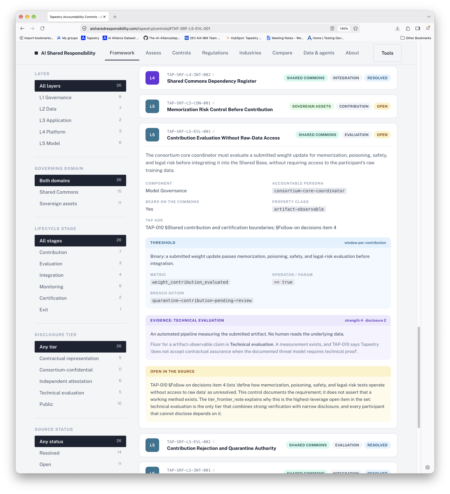

# AI Shared Responsibility Considerations

| Field       | Value                       |
| :---------- | :-------------------------- |
| Status      | Draft                       |
| Confidence  | High (4/5)                  |
| Created     | September 23, 2026          |
| Last Update | September 23, 2026          |
| Versions    | V0.0.1 - September 23, 2026 |

_This content was originally posted by Bill Stout in the AI Alliance Slack work space. It has been lightly edited by Dean Wampler. The proposal is to integrate this content into our data governance requirements._

For [issue #200](https://github.com/The-AI-Alliance/tapestry/issues/200), [several goals have been specified](https://github.com/The-AI-Alliance/tapestry/blob/develop/docs/work-groups/base-model-training/making-a-decision-on-issue-200-for-M1.md#goals), including one we have often repeated, that each sovereign node keeps local training data local and only exchanges model weight updates with other consortium members (goal 2)

For that to work, the epic should say who answers for what: each participant training node for its local data, local compute, and any rights declaration on a contribution; the central coordinator / merge node for aggregation boundaries and shared-base release checks. AI Alliance Tapestry defines this in [ADRs](https://github.com/The-AI-Alliance/tapestry/blob/develop/docs/architecture/decisions/README.md): [TAP-001](https://github.com/The-AI-Alliance/tapestry/blob/develop/docs/architecture/decisions/adr-001-core-plus-sovereign.md) (concerning the _core plus sovereign_ training architecture), [TAP-008](https://github.com/The-AI-Alliance/tapestry/blob/develop/docs/architecture/decisions/adr-008-data-sovereignty.md) (concerning the data sovereignty), and [TAP-010](https://github.com/The-AI-Alliance/tapestry/blob/develop/docs/architecture/decisions/adr-010-open-commons-sovereign-assets.md) (concerning open commons and sovereign assets). In short, there is a shared commons for collective open artifacts, and sovereign assets for what a partner has not contributed.

Bill Stout created a page on [aisharedresponsibility.com](https://aisharedresponsibility.com/) which maps those ADRs into an accountability checklist by layers of Governance -> Data -> Application -> Platform -> Model: [Federated consortium accountability controls](https://aisharedresponsibility.com/tapestry/controls/). This crosswalks TAP to the AI Shared Responsibility Framework which maps a component into a layer and identifies the accountable party.

Useful named accountability mapping:

* Weight-only data-rights: [TAP-SRF-L2-CON-001](https://aisharedresponsibility.com/tapestry/controls/#TAP-SRF-L1-CON-001)
* Sovereign data boundary: [TAP-SRF-L2-CON-003](https://aisharedresponsibility.com/tapestry/controls/#TAP-SRF-L2-CON-003)
* Node-local training compute: [TAP-SRF-L4-CON-001](https://aisharedresponsibility.com/tapestry/controls/#TAP-SRF-L4-CON-001)
* Core aggregation boundary: [TAP-SRF-L4-INT-001](https://aisharedresponsibility.com/tapestry/controls/#TAP-SRF-L4-INT-001)
* Memorization risk before contribution: [TAP-SRF-L5-CON-001](https://aisharedresponsibility.com/tapestry/controls/#TAP-SRF-L5-CON-001)
* Valuation of a contribution without raw-data access: [TAP-SRF-L5-EVL-001](https://aisharedresponsibility.com/tapestry/controls/#TAP-SRF-L5-EVL-001)

For example, the last link shows this information:

