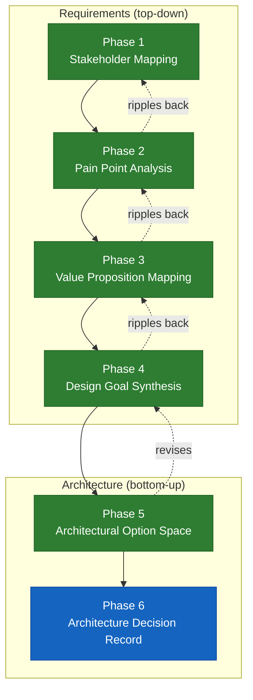

# Tapestry Vision Architecture (TVA) Methodology

*Christopher Nguyen — May 2026*

---

## Purpose

TVA is the structured requirements-to-architecture methodology used to develop Tapestry's design. It exists because Tapestry is not a conventional system with a known problem space — it is an attempt to build a global consortium-trained, frontier-class, open foundation model that preserves sovereignty for participating nations, cultures, industries, and individuals. The design space is wide, the stakeholders are heterogeneous, and premature architectural commitment is the primary risk. TVA is how we avoid that.

## Structure

TVA runs in six phases, organized into two movements:

**Requirements (Phases 1–4)** derive design goals from stakeholder needs, working top-down from the people the system must serve to the constraints the architecture must satisfy.

**Architecture (Phases 5–6)** explore the option space and commit to decisions, working bottom-up — letting technical realities reshape goals where necessary.

The process is explicitly bidirectional. Insights from later phases revise earlier ones. This is intentional, not a failure of the process.

## Workflow: Iterate for Consistency

The six phases are not a waterfall. After the initial pass through Phases 1–5, the process requires iterative review:

1. **Forward pass.** Work through Phases 1–5 sequentially, producing draft outputs.

2. **Bottom-up revision.** Architectural choices in Phase 5 create pressure on Phase 4 (design goals). A goal that seemed right in the abstract may be technically infeasible, or a technical opportunity may reshape what's worth optimizing for. When Phase 5 revises Phase 4, the revision must ripple back: does it change what value propositions are credible (Phase 3)? Does it reframe which pain points are primary (Phase 2)? Does it change what success looks like for a stakeholder layer (Phase 1)?

3. **Consistency check.** After each revision, verify bidirectional traceability across all phases. Every pain point should trace forward to a value proposition. Every value proposition should trace to a design goal. Every design goal should have architectural options. Orphaned items — pain points with no value proposition, value propositions with no design goal, architectural features with no traced requirement — are either gaps to fill or features to cut.

4. **Surface tensions.** Where goals conflict, where assumptions are unvalidated, or where participant interests diverge, the tension is named explicitly as an open question — not papered over. Open questions are assigned to specific people or forums for resolution (e.g., the workshop, a work group, a governance vote).

5. **Repeat until stable.** The process converges when a full consistency pass produces no new revisions. In practice, 2–3 iterations are typical.

The diagram below shows the primary forward flow and the revision feedback loops:

**Legend:** 🟩 Complete · 🟦 Next · ⬜ Pending

## The Six Phases

### Phase 1 — Stakeholder Mapping

Identify who Tapestry must serve, what they control, what they fear, and what success looks like for them. Participation decisions are made at the entity level, not the country level.

**Output:** A stakeholder map organized by layer, with leverage, fears, and success criteria for each.

### Phase 2 — Pain Point Analysis

For each stakeholder layer, identify the specific, concrete failures of the current AI ecosystem. Not abstract ("they lack sovereignty") but operational ("a hospital in Nairobi cannot deploy medical AI because..."). Specificity is what makes pain points architecturally generative — vague pain points produce vague architectures.

This phase also serves as a check on whether "frontier-class performance" and "sovereignty" are correctly identified as the two primary design goals, or whether they need refinement.

**Output:** Per-layer operational failure statements grounded in real scenarios.

### Phase 3 — Value Proposition Mapping

For each stakeholder layer, articulate what Tapestry specifically offers that the current ecosystem does not. Each value proposition must trace back to one or more pain points from Phase 2 — if it doesn't address a real failure, it's a feature in search of a problem.

**Output:** Per-layer value propositions with explicit traceability to pain points.

### Phase 4 — Design Goal Synthesis

Synthesize the pain points and value propositions into a minimal set of design goals that the architecture must satisfy. These are the constraints that Phase 5 must work within. Where goals conflict (e.g., sovereignty vs. training efficiency), the conflict is named explicitly and the priority is stated.

**Output:** Ranked design goals with conflict annotations.

### Phase 5 — Architectural Option Space

Explore the technical options for satisfying each design goal. For each major architectural decision, enumerate alternatives, evaluate them against the design goals, and identify the key unknowns. This phase feeds directly into the Architecture Decision Records in [`decisions/`](decisions/).

This is where bottom-up pressure enters: if a design goal from Phase 4 turns out to be technically impossible or unreasonably expensive, Phase 4 is revised. The revision is documented.

**Output:** Architectural options analysis, with identified decision points.

### Phase 6 — Architecture Decision Record

Commit to decisions. Each significant choice becomes an ADR with context, alternatives considered, rationale, and status. The collection of accepted ADRs, together with the Architectural Thesis, constitutes Tapestry's architecture.

**Output:** Accepted ADRs and the Architectural Thesis document.

## Current Status

| Phase | Status |
| :---- | :----- |
| Phase 1 — Stakeholder Mapping | ✅ Complete |
| Phase 2 — Pain Point Analysis | ✅ Complete |
| Phase 3 — Value Proposition Mapping | ✅ Complete |
| Phase 4 — Design Goal Synthesis | ✅ Complete |
| Phase 5 — Architectural Option Space | ✅ Complete |
| Phase 6 — Architecture Decision Record | ⬜ Next |
