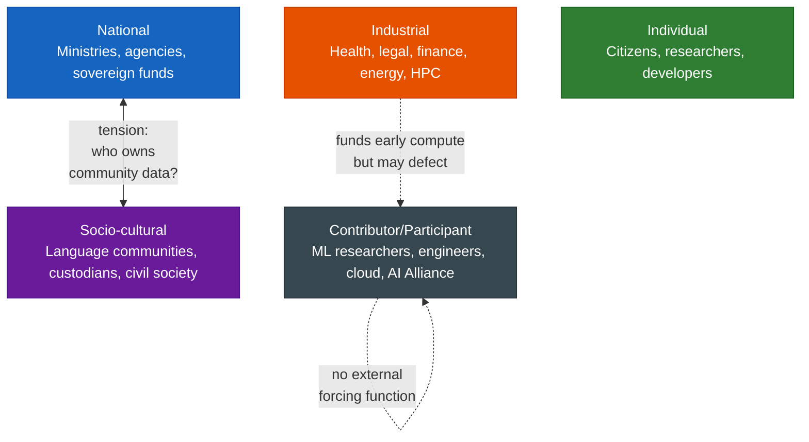

# Phase 1 — Stakeholder Map

*May 2026*

---

## Framing

Participation decisions in Tapestry are made at the entity level, not the country level. The relevant questions are always: what is this entity's structural interest, and does its mandate allow it to be a trustworthy participant in a sovereignty-preserving commons?

## Five Stakeholder Layers

### National

Ministries, AI agencies, sovereign funds.

**Leverage:** Control compute budgets and state data.
**Fears:** Infrastructure dependency on foreign platforms. Permanent capability lag.
**Success criteria:** A credible path to owning frontier models. Data residency guarantees.

### Socio-cultural

Language communities, knowledge custodians, civil society.

**Leverage:** Control unique corpora that exist nowhere else.
**Fears:** Cultural homogenization. Extraction without reciprocity.
**Success criteria:** Cultural parity. Data royalties. Their own alignment layer.

### Industrial

Health, legal, finance, energy, sovereign cloud, HPC centers.

**Leverage:** Control sensitive domain data and idle compute.
**Fears:** Data leakage to rivals. Platform deprecation.
**Success criteria:** Sovereign alignment layers. A compute-for-access model.

### Individual

Citizens, researchers, developers, end users.

**Leverage:** Control personal data in aggregate and adoption/political voice.
**Fears:** Surveillance, manipulation, AI that ignores their context.
**Success criteria:** Cultural fit. Privacy. Agency.

### Contributor/Participant

ML researchers, systems engineers, HPC nodes, cloud providers, AI Alliance itself.

**Leverage:** Control architecture decisions and training runs.
**Fears:** Technical failure. Governance capture.
**Success criteria:** Clear architecture. Credit. A working system.

## Key Tensions

- **National vs. socio-cultural:** Who owns community data?
- **Industrial:** Most likely to fund early compute, most likely to defect if performance or security fails.
- **Contributor layer** has no external forcing function — incentives must be designed explicitly.
