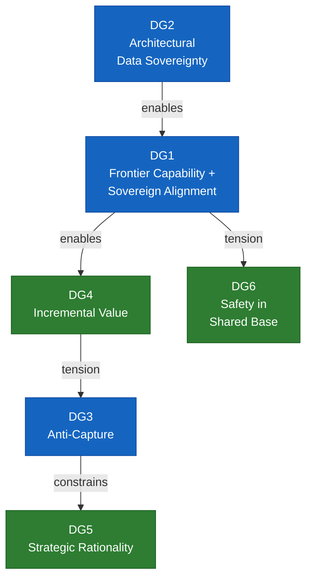

# Phase 4 — Design Goal Synthesis

*May 2026*

---

## Purpose

This document distills the pain points (Phase 2) and value propositions (Phase 3) into a minimal set of design goals — the constraints the architecture must satisfy. Where goals conflict, the conflict is named and the priority is stated. These goals are the contract between the requirements process (Phases 1–3) and the architectural process (Phases 5–6): every architectural decision must trace back to at least one design goal, and every design goal must trace back to documented pain points.

Design goals are ranked. Rank determines what wins when goals conflict. The ranking is itself a design decision and should be debated.

---

## Primary Design Goals

These are non-negotiable. The architecture fails if any of these is unmet.

### DG1. Frontier capability with sovereign alignment

**Derives from:** N4 (sovereign models nobody uses), N5 (frontier capital requirements), SC1 (alignment is inherently local), SC3 (multilingual ≠ multicultural), IN3 (models assume the wrong world), IN4 (no alignment agency), VP-N1 (sovereignty without sacrificing capability), VP-SC1 (community alignment)

Every participant ends up with a frontier-competitive model aligned to their own cultural, industrial, or national sensibilities. This is one goal, not two — capability and alignment are inseparable because a capable model with the wrong alignment is unusable, and a well-aligned model without frontier capability loses to commercial alternatives.

Sovereign cultural alignment is Tapestry's deepest differentiator. The big labs will solve multilingual capability. They cannot solve multicultural alignment, because it requires local value judgments that only the community can make. No external lab can decide what is appropriate, authoritative, respectful, or true for a community it doesn't belong to. This is the one thing Tapestry offers that is structurally impossible to replicate through centralized development.

For a country like Vietnam — or dozens of others — a frontier-class model that reflects their cultural and institutional context is virtually unreachable alone. The capital requirement ($200M+) puts it out of range. Tapestry makes it reachable through shared infrastructure: frontier capability from the consortium, sovereign alignment from the participant.

**Architectural implication:** Core-plus-sovereign architecture. A frontier-competitive base (initially from existing open weights, eventually consortium-trained) with modular sovereign alignment layers produced by each participating community. The alignment pipeline is as well-engineered as the training pipeline — it is a core architectural component, not a downstream fine-tuning step. Tooling for alignment data collection, training pipelines for alignment layers, and evaluation frameworks that test cultural appropriateness (not just accuracy) are first-class infrastructure.

**Success test:** For each participating community, the Tapestry-derived model outperforms both (a) the base model alone on culturally and domain-specific tasks, and (b) any locally-trained sovereign alternative on general capability tasks. Users in that community prefer it over commercial alternatives for tasks where cultural context matters. Cultural alignment is measured using frameworks like the [Inglehart-Welzel Cultural Map](https://www.worldvaluessurvey.org/WVSContents.jsp?CMSID=Findings) (World Values Survey): a model's cultural positioning should match its target community, not cluster with the base model's culture of origin.

### DG2. Sovereignty enforced where it matters

**Derives from:** N2 (data residency unenforceable), SC2 (cultural extraction), SC4 (locked corpora), I1 (compliance walls), VP-N3 (data stays), VP-SC2 (architectural data sovereignty)

Data sovereignty must be real and enforceable — not merely promised. The appropriate mix of **technical, legal, and organizational** mechanisms depends on the dataset, the participant, and the threat model. Tapestry does not require maximum technical overhead for every sovereignty claim when collaborative agreements and governance suffice (see [Design principles for architecture work](0-tva-methodology.md#design-principles-for-architecture-work)).

Where technical guarantees are required, they must be verifiable under a clearly stated threat model. Data that a participant designates as sovereign must not leave the participant's infrastructure in raw form unless an explicit, governed exception applies.

**Architectural implication:** Consortium training where nodes share local model weight vectors (Stage A CPT) or optional domain adapter parameters, not data. Tiered sovereignty spectrum from provenance-only (Tier 0) through TEE-based full privacy (Tier 4). The tier is a per-node, per-dataset property — matched to need, not maximized by default.

**Success test:** For each dataset at its assigned tier, sovereignty requirements are met by the chosen mechanism (agreement, operational control, or technical guarantee). Where a technical tier applies, a participant's sovereign data cannot be reconstructed from the information that leaves their node under the stated threat model.

### DG3. Anti-capture

**Derives from:** N1 (dependency without recourse), I2 (platform deprecation), I4 (fine-tuning is not sovereignty), CP3 (first-mover architecture), the anti-capture principle

The anti-capture principle is primarily an organizational governance constraint: no single entity — including founding members, major contributors, or Tapestry itself — can acquire unilateral control over the project's direction, the model weights, or the governance structure.

However, organizational capture often enters through architectural choices that seem purely technical. A training stack that only runs on one vendor's hardware is a capture vector. A sovereign layer format that only works with one base model is a capture vector. A governance model where influence scales linearly with compute contribution is a capture vector. Architecture must be reviewed for capture risk, even when capture is not the architect's intent.

**Organizational implication:** Governance caps on influence concentration. Transparent decision-making. Balanced representation across stakeholder layers. No single entity — including the AI Alliance — holds a permanent veto.

**Architectural awareness:** The architecture should not *create* capture vectors where none need exist. Specifically: sovereign contributions (alignment layers, adapters, domain experts) should be portable across base models, so participants are not locked to a single base provider. And participants should be able to exit the consortium with their sovereign work intact. But anti-capture is not a reason to over-engineer the architecture — pragmatic dependencies (e.g., starting with an existing open-weights base) are acceptable if they are acknowledged, bounded, and designed to be replaceable.

**Success test:** Any participant can leave the consortium and retain their sovereign contributions in a usable form. No single participant's departure or defection makes the consortium non-functional. Governance decisions require broad consensus, not unilateral authority.

---

## Secondary Design Goals

These are important and should be satisfied where possible, but yield to primary goals when in conflict.

### DG4. Deliver value incrementally

**Derives from:** N4 (sovereign models nobody uses), CP4 (incentives misaligned with sustainability)

Tapestry must deliver usable value at each stage of the roadmap, not just at the end. The MVP must be useful to participants before the hard distributed pretraining problem is fully solved. Each subsequent stage should build on the last without requiring participants to discard prior work.

**Architectural implication:** Phased roadmap: (1) sovereign alignment and adaptation on top of existing open-weights bases, (2) distributed continued pretraining and expert training, (3) consortium pretraining of consortium-owned bases. Each phase is independently useful.

**Conflicts with:** Purity of the anti-capture principle. Phase 1 depends on an external base model, creating a temporary dependency. This is acceptable if the architecture ensures the dependency is replaceable (DG3).

### DG5. Make participation strategically rational

**Derives from:** I3 (idle compute has no market), I5 (no legitimacy mechanism), CP4 (unsustainable incentives), N5 (frontier capital requirements), VP-I3 (compute as currency), VP-I5 (certification), VP-CP3 (shared economics)

Every participant must receive value commensurate with their contribution — and that value must be legible to their board, their funder, or their government. For many participants, the value proposition is access to frontier capability they could never afford alone. But access alone is not enough. Participants also need strategic positioning: the ability to build commercial offerings, earn certification marks, gain governance voice, and be recognized as founding members of a global initiative.

Real participants have board-level objectives. FPT wants to be "the sovereign AI provider for Vietnam." NVIDIA wants Tapestry nodes running on its hardware. Current.AI wants to fund infrastructure that proves public-interest AI works. BharatGen wants their $120M investment to produce an actually-adopted model. Tapestry must deliver something each of these boards can justify — not just something their engineers admire.

**Architectural implication:** Compute-for-access model. Certification standards (ISO/UL-style) that participants can earn and market. Governance rights linked to contribution. Transparent accounting of contribution and benefit. Revenue or access-sharing mechanisms for downstream commercial use. The certification framework is a governance design task, not an architectural one, but the architecture must support it (e.g., auditable training provenance, measurable alignment quality).

**Conflicts with:** DG3 (anti-capture). Participants who invest the most will expect the most influence. The governance model must reward participation without allowing any single participant to dominate. Certification must be standards-based, not relationship-based — any entity that meets the criteria gets certified, regardless of their relationship to the founding consortium.

### DG6. Safety in the shared base

**Derives from:** the modular alignment architecture in DG1

Sovereign alignment layers enable cultural sovereignty, but they also create the theoretical possibility of removing safety constraints from the base model. The shared base must include baseline safety alignment that sovereign layers add to but cannot subtract from.

**Architectural implication:** Safety properties are embedded in the base model and technically enforced — not just by policy. The mechanism for this enforcement (frozen safety layers, constitutional constraints, evaluation gates) is an open design question.

**Conflicts with:** DG1 (sovereign alignment). Who defines "safety" when the whole point is that different communities have different values? The line between "safety" (universal) and "alignment" (sovereign) is itself a culturally contested boundary. This tension cannot be resolved architecturally; it requires governance.

---

## Tertiary Design Goals

Desirable properties that inform architectural choices but do not override primary or secondary goals.

### DG7. Hardware-agnostic by default

**Derives from:** N3 (hardware heterogeneity), VP-N4 (hardware flexibility)

The training and inference stack should run on any major accelerator platform (NVIDIA, AMD, Intel, and future entrants) without requiring participants to adopt a specific vendor's ecosystem. This supports both sovereignty (nations choose their hardware for their own reasons) and the anti-capture principle (no hardware vendor lock-in).

### DG8. Transparent and auditable

**Derives from:** CP1 (contribution without governance), DG3 (anti-capture)

All architectural decisions, training runs, data governance actions, and governance votes are logged and auditable. Participants can verify that the system is operating as designed. This is the operational form of the anti-capture principle — capture is harder when everything is visible.

### DG9. Extensible to new modalities and architectures

**Derives from:** CP3 (first-mover architecture)

The architecture should not lock the consortium into a single model architecture (transformer, MoE, JEPA, or future alternatives). The consortium training protocol and sovereignty infrastructure should be modality-agnostic and architecture-agnostic where possible, so that the consortium can adopt better approaches as they emerge.

---

## Goal Interactions and Conflicts

**Legend:** 🟦 Primary · 🟩 Secondary

**Key conflicts to resolve in Phase 5:**

1. **DG4 vs. DG3 (incremental value vs. anti-capture).** Delivering value fast means starting with an external base model, which creates a dependency. Acceptable if the dependency is acknowledged, bounded, and designed to be replaceable.

2. **DG5 vs. DG3 (economic rationality vs. anti-capture).** Contribution-proportional benefits create capture risk from large contributors. Resolve with influence caps and minimum thresholds.

3. **DG1 vs. DG6 (sovereign alignment vs. safety).** Modular alignment enables cultural sovereignty but creates the possibility of de-aligning safety properties. The line between "safety" (shared) and "alignment" (sovereign) is itself culturally contested. This is ultimately a governance question, not an architectural one — but the architecture must support whatever governance boundary is drawn.

---

## Validation Questions for the Workshop

These questions test whether the design goals are correctly identified and correctly ranked:

1. **Is DG1 achievable?** Can a core-plus-sovereign architecture actually deliver frontier capability with meaningful cultural alignment? Is the sovereign alignment layer deep enough to matter, or is it cosmetic?

2. **Where is the safety/sovereignty line?** DG6 says the shared base includes safety that sovereign layers cannot subtract. But who defines safety? Western AI safety norms are themselves culturally situated. How do we draw this line without imposing one culture's safety framework on everyone?

3. **Is the shared-resources model compelling enough?** For a country like Vietnam, Tapestry is the difference between having a frontier-class sovereign model and not having one. But is that argument clear to potential participants, or does it sound like "use someone else's model with extra steps"?

4. **What's missing?** Is there a design goal that would appear obvious to a participant — around interoperability with existing infrastructure, around specific industrial use cases, around speed of deployment — that we've failed to name?
