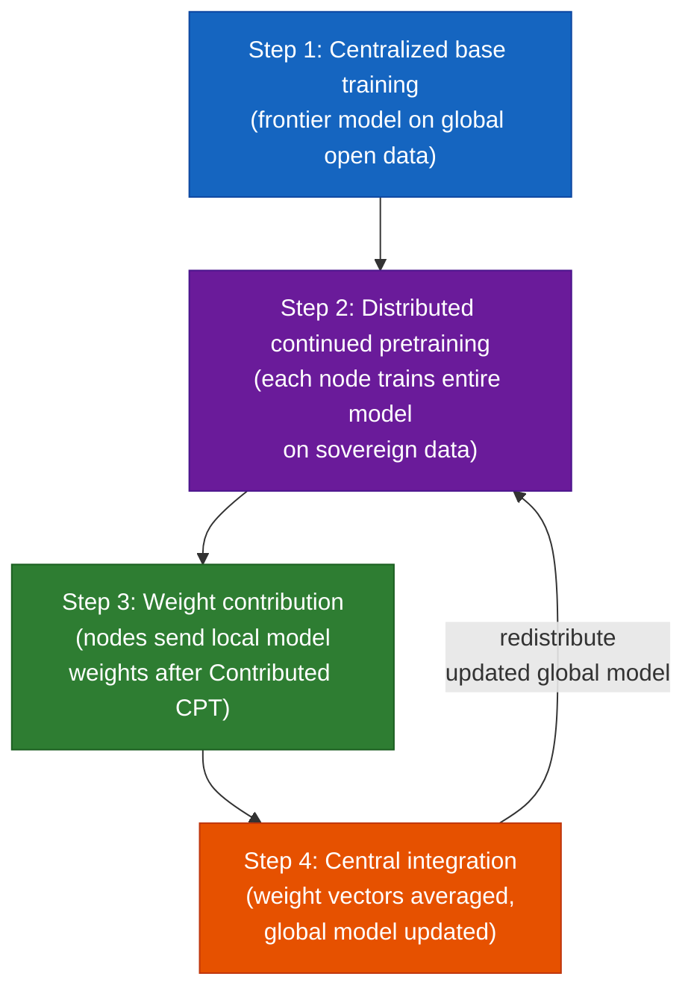
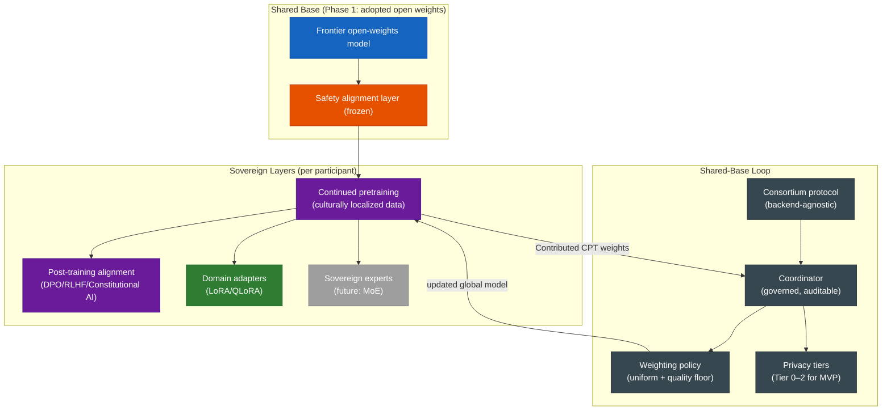

# Phase 5 — Architectural Option Space

*May 2026*

---

## Purpose

For each major architectural decision, this document enumerates the options, evaluates them against the design goals (Phase 4), and identifies what must be decided now versus what can be deferred. Each decision point is a candidate for an Architecture Decision Record (ADR) in Phase 6.

This is where bottom-up pressure meets top-down requirements. Where a design goal turns out to be technically infeasible or unreasonably expensive, we say so and propose a revision.

---

## Decision 1: Base Model Strategy

**Design goals served:** DG1 (frontier capability + sovereign alignment), DG4 (incremental value), DG3 (anti-capture)

### The question

Where does the frontier-competitive base model come from?

### Options

**Option A: Adopt existing open weights.**
Use the best available open-weights model (Llama, Mistral, Qwen, or similar) as the starting base. Sovereign layers are built on top.

- *For:* Immediate frontier-class capability. Delivers value in months, not years. Low upfront cost. Proven quality.
- *Against:* Creates a dependency on the base provider (DG3 tension). The base provider's architectural choices constrain sovereign extensions. License terms may restrict certain uses or participants.
- *DG4 assessment:* Strong. This is the fastest path to a useful system.
- *DG3 assessment:* Weak, but manageable if sovereign layers are designed to be portable across bases.

**Option B: Train a consortium base from scratch.**
The Tapestry consortium trains its own base model using pooled compute and open data.

- *For:* Full sovereignty. No external dependency. Architecture decisions are collective.
- *Against:* Requires $200M+ in compute, 12–18 months minimum, and organizational maturity that doesn't yet exist. Delays all value delivery until the base is trained. High risk of producing a sub-frontier model that nobody uses (N4).
- *DG4 assessment:* Weak. Nothing ships until the base is done.
- *DG1 assessment:* Risky. Matching frontier quality on a first attempt with a new consortium is unlikely.

**Option C: Phased — adopt first, train later.**
Start with Option A for the MVP. Use the early phases to build consortium infrastructure, attract participants, and pool resources. Transition to a consortium-trained base when the organization has the maturity, compute, and data to do it well. Design sovereign layers to be portable across bases so the transition doesn't discard participants' work.

- *For:* Gets the benefits of both without the risks of either. Pragmatic.
- *Against:* The transition from adopted base to consortium base is a major engineering effort that may never happen if participants are satisfied with the status quo. The "eventually" may become "never."
- *DG3 assessment:* Honest. Acknowledges the dependency, designs it to be replaceable, commits to a timeline.

### Recommendation

**Option C.** The workshop should debate which base model to start with and what the criteria are for transitioning to a consortium base.

### Workshop decision needed

Which open-weights model family to start with, and under what conditions the consortium commits to training its own base.

---

## Decision 2: Sovereign Layer Architecture

**Design goals served:** DG1 (sovereign alignment), DG2 (data sovereignty), DG6 (safety)

### The question

How do participants produce sovereign models from the shared base? What is the technical mechanism for cultural alignment and domain specialization?

### Options

**Option A: Adapter-based (LoRA/QLoRA).**
Each participant trains lightweight adapter layers on their sovereign data. The base model is frozen. The adapter encodes cultural alignment and domain specialization.

- *For:* Low compute requirement. Well-understood technique. Participants can train adapters on modest hardware. Multiple adapters can coexist.
- *Against:* Adapters are shallow — they modify the model's behavior but not its deep representations. For cultural alignment that requires fundamentally different world knowledge (not just different style), adapters may not be sufficient. "Fine-tuning is not sovereignty" (I4) applies here too, at a smaller scale.

**Option B: Sovereign expert modules (MoE).**
The model uses a Mixture-of-Experts architecture. Some experts are shared (trained on the common base), others are sovereign (trained by participants on their data). Routing directs inputs to the appropriate experts based on context.

- *For:* Deeper sovereignty than adapters — sovereign experts can encode fundamentally different knowledge, not just behavioral modifications. Scales naturally: new participants add new experts without retraining the base. Aligns well with the core-plus-sovereign architecture.
- *Against:* MoE architectures are more complex to train and serve. Routing decisions may leak information about what data a node has (a privacy concern). Requires the base model to be MoE from the start, constraining the base model choice.
- *DG2 assessment:* Routing patterns are a potential sovereignty leak. Needs analysis.

**Option C: Continued pretraining on culturally localized data.**
Participants do additional pretraining rounds on the base model using their sovereign data — not just language data, but culturally grounded corpora: local legal reasoning, medical practice, educational conventions, literary traditions, institutional knowledge, and community-authored content that embeds cultural values in the training signal itself.

- *For:* Changes the model's deep representations, not just its behavior. This is the critical insight: recent research shows that regional LLMs trained on local *language* data still reflect the base model's *cultural* values (["Fluent but Foreign: Even Regional LLMs Lack Cultural Alignment"](https://arxiv.org/html/2505.21548), 2026). Post-training alignment alone sits on top of the wrong world model. Continued pretraining on culturally grounded data fixes what the model *knows* about the culture, which post-training alignment alone cannot.
- *Against:* More expensive than adapters. Produces model forks that diverge from the shared base, making future consortium-wide synchronization harder. Updates to the shared base require re-running continued pretraining.
- *Key nuance:* The expense concern is real but bounded. Continued pretraining is not training from scratch — it's a fraction of the original pretraining cost, and for sovereign alignment, it addresses a layer of the problem that cheaper methods provably do not.

**Option D: Post-training alignment (RLHF/DPO/Constitutional AI).**
Participants train alignment-specific layers using their community's value judgments. This addresses *how* the model behaves — its dispositions, refusals, tone, and value judgments.

- *For:* Directly addresses SC1 (alignment is inherently local). Lighter-weight than continued pretraining. Can be combined with any of Options A–C.
- *Against:* If applied to a base whose representations are culturally misaligned, post-training alignment is fighting the model's own world model. It can change surface behavior but the underlying dispositions leak through in edge cases. The safety tension (DG6): if alignment layers can modify behavior, they can potentially remove safety constraints.

### Recommendation

**Option C + D as the sovereign alignment approach.** Continued pretraining on culturally grounded data changes what the model knows about the world. Post-training alignment changes how it behaves. Both are needed — neither alone is sufficient. This can be combined with Option A (adapters) for domain specialization and potentially Option B (MoE) as the architecture matures.

The approach is not architecturally exotic. It is continued pretraining followed by alignment — well-understood techniques applied to a specific and well-motivated purpose. The innovation is not in the method but in the infrastructure that makes it accessible to communities that currently cannot do it, and in the evaluation framework that measures whether it worked.

**Evaluation:** The [Inglehart-Welzel Cultural Map](https://www.worldvaluessurvey.org/WVSContents.jsp?CMSID=Findings) (World Values Survey & European Values Study, 2005–2022) provides a measurable framework for cultural alignment evaluation. It maps cultures onto two dimensions — traditional vs. secular-rational, survival vs. self-expression — and shows that geographically close countries can be culturally distant. A model's outputs can be assessed against its target culture's position on the map. If the model clusters with the base model's culture of origin rather than the target culture, the alignment did not work. (See [original WVS map](https://www.worldvaluessurvey.org/wvsimages/Cultural_Map_2023.png) and [interactive version](diagrams/inglehart-welzel-interactive.html).) Research using Hofstede's cultural dimensions and the WVS is already being applied to LLM evaluation ([Sukiennik 2025](https://arxiv.org/pdf/2504.08863), [Cultural Alignment in LLMs, COLING 2025](https://aclanthology.org/2025.coling-main.567.pdf)).

### Workshop decision needed

Whether continued pretraining (not just adapters) is the accepted approach for sovereign alignment, and what evaluation framework the consortium adopts for measuring cultural alignment success.

---

## Decision 3: The Shared-Base Loop (Consortium Training Loop)

**Design goals served:** DG1 (frontier capability + sovereign alignment), DG2 (data sovereignty), DG5 (economic rationality)

### The question

How does the global model improve over time while preserving sovereignty? What is the actual training loop?

### The proposed loop

**Step 1 — Centralized base training.** Train (or adopt) a frontier-competitive model on large-scale global open data. This is the 80% — standard large-scale pretraining. Done once initially, repeated when the consortium has the resources to train its own base.

**Step 2 — Distributed continued pretraining.** Each node receives the current global model and does continued pretraining on its sovereign data — culturally grounded corpora, domain-specific institutional knowledge, community-authored content. This changes the model's deep representations, not just its behavior. Each node trains the *entire model*, not just adapters. Estimated compute: 5–10% of original pretraining cost per node per cycle.

**Step 3 — Weight contribution.** Each node sends its **locally trained model weight vector** (post–Contributed CPT) to the central coordinator. *Not* per-step gradients — local training completes before sync. Sync cadence is an operational choice: frequent (cluster-like) or less often (geo-distributed).

**Step 4 — Central integration.** The coordinator aggregates contributed weight vectors into an updated global model (FedAvg-class weighted averaging by default; outer optimizer swappable). The weighting policy (see Decision 8) determines how contributions are combined. The updated global model is redistributed to all nodes.

**Scope:** Stages B (instruction tuning) and C (alignment) run locally for each sovereign deployable model and do **not** feed the global base.

**Then back to Step 2.** Each node does another round of continued pretraining, now starting from a better base that incorporates sovereign knowledge from all other nodes. The model gets more culturally informed with each cycle.

### Why this loop, not alternatives

**Why not one-shot?** (Distribute base, nodes customize, never contribute back.) Because the global model never improves. Every node benefits from the base but the base never benefits from the nodes. This is just "download open weights and fine-tune" — what everyone already does.

**Why not pure peer-to-peer?** (No centralized base, all nodes start from initialization.) Much harder to reach frontier quality. The cold-start problem is brutal. And it doesn't match the 80/20 reality — most capability comes from the centralized base.

**Why weight vectors, not per-step gradients?** (Yann LeCun.) Nodes train locally on sovereign data, then send their updated model weights. The coordinator averages them (FedAvg-class). No raw data and no per-step gradients cross the wire. Sync cadence — frequent or infrequent — is a deployment choice, not fixed by the architecture.

### Key distinction: consortium training vs. federated training

This loop differs from traditional federated learning in important ways:

| | Federated Learning | Tapestry Consortium Training |
| :--- | :--- | :--- |
| **Nodes** | Millions of small clients | Dozens of large GPU clusters |
| **Data per node** | Tiny (user's local data) | Massive (national/institutional corpora) |
| **Model scale** | Small, often fine-tuning | Frontier-scale (7B–70B+) |
| **Privacy motive** | Individual data protection | National/institutional sovereignty |
| **What's shared** | Per-step gradients (FedSGD) or local model weight vectors after local training (FedAvg) | Local model weight vectors after Contributed CPT |
| **Communication cadence** | Varies by method and deployment | Operational choice — frequent or infrequent |
| **Heterogeneity** | Hardware (phone vs. tablet) | Hardware, data, culture, policy |

The term "consortium training" more accurately describes what Tapestry does — the paradigm defined in [TAP-002](decisions/adr-002-consortium-training.md): few large, trusted, heterogeneous nodes collaboratively improving a shared model under data-sovereignty and cultural-alignment constraints.

### Workshop decision needed

Whether this training loop is accepted as the architectural model, and what the target cycle frequency is (monthly? quarterly? per-node choice?).

---

## Decision 8: Contribution Weighting

**Design goals served:** DG1 (frontier capability), DG3 (anti-capture), DG5 (economic rationality)

### The question

When the central coordinator aggregates weight vectors from multiple nodes, how should each node's contribution be weighted? This is simultaneously an optimization problem (produce the best global model) and a governance problem (who has the most influence over the global model's character).

### Options

**Option A: Uniform weighting.**
Every node's weight vector counts equally, regardless of data size, compute contributed, or any quality metric.

- *For:* Simple. Democratic. Strongly anti-capture — no node dominates.
- *Against:* A node with 10M tokens of low-quality web scrape gets the same influence as a node with 100M tokens of curated institutional text. May degrade global model quality. Does not incentivize high-quality contributions.

**Option B: Data-proportional weighting.**
Weight by volume of training data or compute contributed.

- *For:* Rational. Larger contributions have more influence. Incentivizes contribution.
- *Against:* Direct capture vector. The largest node dominates the global model's character. Violates DG3. Replicates the existing power structure where resource-rich actors set the terms.

**Option C: Quality-weighted via held-out evaluation.**
Each node's weight vector is evaluated against a shared benchmark set before integration. Contributions that improve benchmark performance get higher weight.

- *For:* Meritocratic. Rewards quality over volume. Prevents degradation.
- *Against:* Who designs the benchmarks? Standard benchmarks (MMLU, etc.) are culturally biased toward English-speaking, Western contexts. Quality-weighting on biased benchmarks systematically downweights contributions from the communities Tapestry exists to serve.

**Option D: Culturally-aware validation.**
Like Option C, but the evaluation set includes culturally diverse benchmarks informed by frameworks like the Inglehart-Welzel Cultural Map and the World Values Survey. A Vietnamese node's contribution is evaluated partly on Vietnamese cultural benchmarks, not only on MMLU.

- *For:* Rewards cultural quality, not just general capability. Aligns incentives with Tapestry's mission.
- *Against:* Requires the cultural evaluation infrastructure to exist first — which is a significant investment. Circular dependency: you need cultural benchmarks to weight contributions, but you need contributions to build culturally aligned models that inform the benchmarks.

**Option E: Uniform with quality floor.**
Accept any contribution with equal weight, provided it does not degrade the global model on a basic quality benchmark. Contributions below the floor are rejected, not downweighted.

- *For:* Simple. Anti-capture. Prevents garbage-in. Gets the loop running immediately.
- *Against:* The quality floor is a blunt instrument. Doesn't incentivize exceptional contributions. The floor itself needs a benchmark, with the same bias concerns as Option C.

### Recommendation

**Option E (uniform with quality floor) as MVP, transitioning to Option D (culturally-aware validation) as the evaluation infrastructure matures.** This gets the training loop running immediately, prevents capture, prevents quality degradation, and creates a planned migration to the evaluation framework that actually aligns with Tapestry's mission.

The weighting policy is itself a governance decision. The consortium should be able to revise it as it learns what works.

### Open questions for the workshop and beyond

1. What benchmark constitutes the quality floor for MVP?
2. Who designs the cultural evaluation benchmarks? Is this a work group?
3. Should nodes be able to see how their contribution was weighted? (Transparency vs. gaming.)
4. Can a node opt to contribute to the global model for some training rounds and keep its weights private for others? (Selective participation.)
5. Does the weighting policy need to be the same for all nodes, or can it vary by contribution type?

### Workshop decision needed

Whether uniform-with-quality-floor is accepted for Phase 1, and who leads the cultural evaluation benchmark work group.

---

## Decision 4: Data Sovereignty Mechanism

**Design goals served:** DG2 (architectural sovereignty)

### The question

What technical mechanisms enforce data sovereignty at each tier?

### Options (these are not mutually exclusive — they form a spectrum)

| Tier | Mechanism | What it guarantees | Readiness |
| :--- | :-------- | :----------------- | :-------- |
| 0 | Provenance + legal agreements | Attribution, post-hoc detection. No technical enforcement. | Ready now |
| 1 | Licensing gates + audit trails | Financial deterrence, data royalties, usage tracking. | Ready now |
| 2 | Differential privacy (DP-SGD) | Gradient updates bounded by privacy budget. Reconstruction hard, not impossible. | Ready now, performance cost uncertain at scale |
| 3 | Secure aggregation (MPC) | Aggregator sees only the sum of updates, not individual node contributions. | Prototype-ready, significant compute overhead |
| 4 | Trusted Execution Environments (TEE) | Strongest available. Training runs in hardware-attested enclaves. | Early-stage, limited hardware availability |

### Recommendation

**Tiers 0–2 for MVP. Tier 3 on the roadmap. Tier 4 as aspirational.** The tier is a per-node, per-dataset property — different nodes operate at different tiers simultaneously. The aggregation protocol must handle mixed-tier contributions.

The key research question: what is the actual privacy-utility tradeoff for DP-SGD at frontier model scale? If differential privacy destroys model quality, Tier 2 is not viable for pretraining contributions (though it may work for adapter/alignment training where the contribution is smaller).

### Workshop decision needed

Whether Tier 0–1 (legal/provenance) is sufficient for Phase 1, or whether participants require Tier 2 (DP) as a minimum before contributing sovereign data.

---

## Decision 5: Training Infrastructure

**Design goals served:** DG7 (hardware-agnostic), DG3 (anti-capture), DG4 (incremental value)

### The question

What is the software stack for training?

### Options

**Option A: PyTorch-based.**
Standard PyTorch with distributed training extensions (PyTorch Distributed, FSDP, or DeepSpeed). Consortium training layer built on top.

- *For:* Largest ecosystem. Most participants already use it. Widest model support. NVIDIA and AMD both support it.
- *Against:* Python-heavy. Large deployment footprint. Supply chain complexity for sovereign node auditing.

**Option B: Rust-based with Burn (per Tracel AI proposal, Issue #9).**
Core infrastructure in Rust. Training via Burn (hardware-agnostic: CUDA, ROCm, Metal, Vulkan, WebGPU). Single-binary deployment.

- *For:* Hardware-agnostic by design. Small deployment footprint. Auditable single binary. Aligns with sovereignty and anti-capture goals. Burn's backend abstraction directly addresses DG7.
- *Against:* Smaller ecosystem. Fewer pretrained models available. Steeper learning curve for ML researchers. Burn is less mature than PyTorch for frontier-scale training.

**Option C: Dual-path (per Tracel AI proposal).**
Rust core with a backend abstraction supporting both Burn and PyTorch. Nodes choose their training backend. The consortium protocol is backend-agnostic.

- *For:* Best of both. PyTorch nodes participate with existing infrastructure. Burn nodes get the sovereignty benefits. No participant is excluded by language choice. The consortium handles mixed backends.
- *Against:* More engineering work. The backend abstraction layer must be carefully designed. Two codepaths to maintain.

### Recommendation

**Option C, with Option A as the pragmatic starting point.** Build the consortium protocol in a way that's backend-agnostic from the start. Initial implementation targets PyTorch (largest ecosystem, fastest to participants). Burn support developed in parallel. Nodes choose their backend.

### Workshop decision needed

Whether the Tracel/Burn proposal should be formally adopted as the target architecture, and what the timeline is for Burn backend support.

---

## Decision 6: Alignment Infrastructure

**Design goals served:** DG1 (sovereign alignment), DG6 (safety)

### The question

What tooling and infrastructure do communities need to produce their own alignment layers?

This is an area where Tapestry has no established precedent to follow. Alignment production at the community level — not by an AI lab, but by a cultural community — has not been done at scale. The tooling doesn't exist.

### Components needed

1. **Value elicitation tooling.** How does a community articulate what "appropriate," "authoritative," and "respectful" mean for them? This is not a technical problem — it's a facilitation and governance problem that needs technical support (surveys, deliberation platforms, annotation tools).

2. **Alignment data pipeline.** Convert community value judgments into training data: preference pairs for DPO, constitutions for constitutional AI, reward signals for RLHF. The pipeline must be accessible to communities without ML expertise.

3. **Alignment training.** Run DPO/RLHF/constitutional AI on the base model using the community's alignment data. Must run on modest hardware (not all communities have large GPU clusters).

4. **Alignment evaluation.** Test whether the aligned model actually reflects the community's values. Standard benchmarks (MMLU, etc.) don't measure this. Community-specific evaluation frameworks are needed.

5. **Safety floor enforcement.** Ensure sovereign alignment layers cannot remove baseline safety properties (DG6). The mechanism for this is an open question — frozen safety layers? Evaluation gates? Constitutional constraints?

### Recommendation

This is the area where Tapestry needs the most original work. There is no off-the-shelf solution. The workshop should identify participants willing to lead alignment infrastructure development, particularly communities willing to be early adopters of the alignment pipeline.

### Workshop decision needed

Who leads alignment infrastructure? Which communities volunteer as pilot alignment producers?

---

## Decision 7: Consortium Topology

**Design goals served:** DG3 (anti-capture), DG2 (data sovereignty)

### The question

How are nodes organized? Who aggregates? Who governs the training process?

### Options

**Option A: Hub-and-spoke with a central coordinator.**
A dedicated coordinator manages training rounds, receives updates from nodes, runs aggregation, and distributes the updated model.

- *For:* Simple. Easy to implement. Clear responsibility.
- *Against:* Single point of failure. The coordinator is a capture vector — whoever operates it has disproportionate power. If the coordinator goes down, training stops.

**Option B: Peer-to-peer with rotating aggregation.**
Nodes communicate directly. Aggregation responsibility rotates among participants. No permanent central authority.

- *For:* No single point of failure. Stronger anti-capture properties.
- *Against:* Significantly more complex. Consensus overhead. Harder to debug and monitor. Research-grade, not production-grade.

**Option C: Hub-and-spoke with governance constraints.**
Central coordinator, but operated by a neutral party (the AI Alliance or a designated operator), with transparency requirements, audit logging, and governance caps. The coordinator is a technical convenience, not a power center.

- *For:* Simple to implement. Anti-capture addressed through governance rather than architecture. Pragmatic.
- *Against:* Still a single point of failure. Governance constraints can erode over time.

### Recommendation

**Option C for MVP, with the architecture designed to support Option B later.** The coordinator is operated transparently, with rotation possible. The protocol doesn't hardcode a central node — it's a role, not an entity.

### Workshop decision needed

Who operates the initial coordinator? What transparency and audit requirements does the coordinator have?

---

## Summary: MVP Architecture

Combining the recommendations across all eight decisions:

**Legend:** 🟦 Adopted base · 🟧 Safety · 🟪 Alignment · 🟩 Domain · ⬜ Future · ⬛ Infrastructure

### What ships in Phase 1

1. Adopted open-weights base with safety layer
2. Continued pretraining on culturally localized data (Stage A — sovereign world model)
3. Instruction tuning (Stage B — SFT)
4. Post-training cultural alignment (Stage C — DPO/RLHF/constitutional AI)
5. Optional domain adapters (LoRA) for industrial specialization — *not* for cultural alignment
6. Consortium training protocol (PyTorch-based; FedAvg-class aggregation by default)
7. Privacy Tiers 0–2
8. Governed central coordinator
9. Cultural alignment evaluation framework (Inglehart-Welzel / WVS-based)

### What's on the roadmap

1. MoE with sovereign expert modules
2. Burn backend support (dual-path)
3. FedAvg-class model averaging experiments (optional DiLoCo outer-optimizer variant)
4. Privacy Tiers 3–4
5. Peer-to-peer consortium topology
6. Consortium-trained base model

### What the workshop must resolve

| Decision | Question | Who should weigh in |
| :------- | :------- | :------------------ |
| 1 | Which open-weights base to start with? | Eric Xing, Jie Tang, Thomas Wolf |
| 2 | Continued pretraining + post-training alignment as sovereign approach? | Ganesh, Antoine, Jian Gang |
| 3 | Is the proposed training loop accepted? Target cycle frequency? | Eric Xing, Laurent Massoulie |
| 4 | Minimum privacy tier for sovereign data? | Dave (OpenMined), Arno (Elysee) |
| 5 | Tracel/Burn as target architecture? | Erik Norden, Ziv (NVIDIA), Niles (AMD) |
| 6 | Who leads alignment infrastructure? | Pascale Fung, Ganesh, open call |
| 7 | Who operates the initial coordinator? | AI Alliance, Rick Stevens, open |
| 8 | Uniform weighting + quality floor for Phase 1? Who builds cultural benchmarks? | Open floor |

---

## Open Questions for Community Input

These questions are not resolved in this document and are intended for ongoing discussion — at the workshop and beyond. They are semi-open: the design goals constrain the answer space, but the specific answers require expertise and perspectives we don't yet have in the room.

### Technical

1. **Cultural alignment measurement.** We hypothesize that continued pretraining on culturally grounded data at 5–10% of base pretraining cost shifts cultural alignment measurably on frameworks like Inglehart-Welzel. Has anyone tested this? What would a controlled experiment look like?

2. **Safety preservation through continued pretraining.** Continued pretraining can shift a model's deep representations, potentially eroding safety properties embedded in the original training. What mechanisms preserve safety through continued pretraining? Frozen layers? Regularization? Evaluation gates? This is different from (and harder than) preserving safety through modular post-training alignment.

3. **Contributed model weight privacy properties.** Local model weights after CPT have different leakage properties than per-step gradients, but "different" is not "sufficient." What is the actual reconstruction risk from contributed weights after N local CPT steps? At what N does the risk become acceptable without formal DP?

4. **Convergence with culturally non-IID data.** Each node's data is deliberately non-IID — that's the point. What are the convergence properties of the training loop when nodes have radically different data distributions (e.g., Vietnamese legal texts vs. Kenyan agricultural knowledge vs. French literary criticism)?

### Governance

5. **Who defines the quality floor?** The uniform-with-quality-floor weighting policy requires a benchmark. Any benchmark embeds assumptions. Who designs it, and how is it reviewed for cultural bias?

6. **Selective participation.** Can a node contribute weight vectors for some training cycles and keep weights private for others? What are the implications for the global model's stability?

7. **Node admission and exit.** What are the criteria for a new node to join the consortium? What happens to a node's historical contributions if it leaves?

8. **Cycle frequency as sovereignty.** The training loop says "back to Step 2 as often as each node chooses." But if some nodes cycle monthly and others annually, their influence diverges. Is this acceptable, or does the consortium need synchronized cycles?

### Ecosystem and Certification

9. **What does Tapestry certification mean?** If an entity claims to be a "Tapestry-certified sovereign AI provider," what standards must they meet? Data governance, alignment quality (measured how?), safety baselines, interoperability with the consortium? Who audits compliance?

10. **How does certification interact with competition?** Multiple entities in the same country could seek certification. Tapestry stays neutral — it certifies against standards, not against competitors. But participants will ask: "If I invest in building this for my country, does my competitor get the same certification for free?" The answer must be yes (standards-based), but the early-mover advantage of being first to certify is real.

11. **What is the commercial model?** Participants need to build businesses on top of Tapestry. What can they charge for? Sovereign alignment services? Deployment and support? Domain-specific adapters? The consortium needs a clear position on what is shared (the base model, the training loop) and what is proprietary (the participant's sovereign layers, their client relationships, their commercial offerings).

### Research

12. **Does continued pretraining on culturally grounded data actually work?** This is the foundational hypothesis. The "Fluent but Foreign" paper shows language-focused continued pretraining doesn't shift cultural alignment. We claim culturally *grounded* data is different. This needs an experiment before it's a promise.

13. **What constitutes "culturally grounded" data?** Legal texts? Literature? Community-authored content? Social media? Religious texts? The answer likely varies by community, but the training pipeline needs to know what to ingest.
