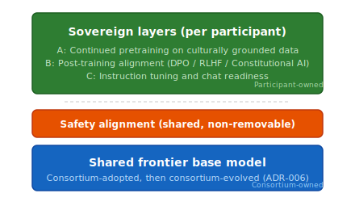

# ADR-001: Core-Plus-Sovereign Architecture

| Field | Value |
| :---- | :---- |
| Status | Proposed |
| Confidence | High (5/5) |
| Date | May 7, 2026 |
| Deciders | Christopher Nguyen (proposed), workshop participants (to ratify) |

## Context

Tapestry must deliver both frontier-class capability and sovereign cultural alignment. The fundamental architectural question is whether to build a single monolithic model, a fully distributed model with no shared base, or a layered model with shared and sovereign components.

## Decision

Tapestry adopts a **core-plus-sovereign architecture**: a frontier-competitive shared base model enriched by sovereign layers (continued pretraining, post-training alignment, domain adapters) produced by each participating node. The ratio starts at roughly 80/20 centralized-to-sovereign and shifts over time as the consortium matures.

*Read top-to-bottom as the deployed stack; the consortium loop ([ADR-004](adr-004-training-loop.md)) improves both layers over time.*

| Artifact | Who owns it | What it provides |
| :------- | :---------- | :--------------- |
| **Shared base** | Consortium-adopted then consortium-evolved (ADR-006) | Frontier-class starting capability; shared improvement via ADR-004 |
| **Safety alignment** | Consortium (shared, non-removable) | Baseline safety properties that sovereign layers add to but cannot subtract from (DG6) |
| **Sovereign layers** | Each participating node / community | Cultural alignment, domain fit, instruction norms — data and values stay local |

## Rationale

- Training a frontier model from scratch requires $200M+ and organizational maturity the consortium doesn't yet have. Starting with a strong base delivers value immediately.
- Sovereign alignment — the key differentiator — requires changing the model's deep representations (continued pretraining) and behavior (post-training alignment). Both can be layered on top of a shared base.
- A fully distributed model with no shared base (pure peer-to-peer from initialization) has no proven path to frontier quality at scale.
- The layered architecture means participants benefit from the shared base *and* from each other's sovereign contributions (via the consortium training loop), without sacrificing sovereignty over their own data or alignment.

## Confidence assessment

This is the foundational architectural choice. All subsequent decisions assume it. It is unlikely to be challenged at the workshop because the alternative — training from scratch with an immature consortium — is both riskier and slower. The core-plus-sovereign framing also matches what several participants are already doing independently (BharatGen, Swiss AI, SEA-LION), giving it empirical support.

## Alternatives considered

- **Train consortium base from scratch (Option B in Phase 5):** Full sovereignty but $200M+, 12–18 months, high failure risk. Deferred to roadmap Phase 3.
- **Pure federated from initialization:** No proven path to frontier quality. Cold-start problem is severe.
- **Adapter-only sovereignty (LoRA on frozen base):** Too shallow for cultural alignment. "Fluent but Foreign" (2026) demonstrates that surface-level adaptation fails to shift cultural values.

## Consequences

- Creates a temporary dependency on an external base model provider (tension with DG3 anti-capture). Mitigated by designing sovereign layers to be portable across bases.
- Requires a credible roadmap to consortium-trained bases, or the dependency becomes permanent.
- The "80/20" framing may understate the sovereign contribution's importance — alignment is what makes the model usable for each community, even if it's 20% of the compute.

## References

- ["Fluent but Foreign: Even Regional LLMs Lack Cultural Alignment." arXiv:2505.21548, 2026.](https://arxiv.org/html/2505.21548)
- ["Buy versus Build an LLM: A Decision Framework for Governments." arXiv:2602.13033, 2026.](https://arxiv.org/abs/2602.13033)
