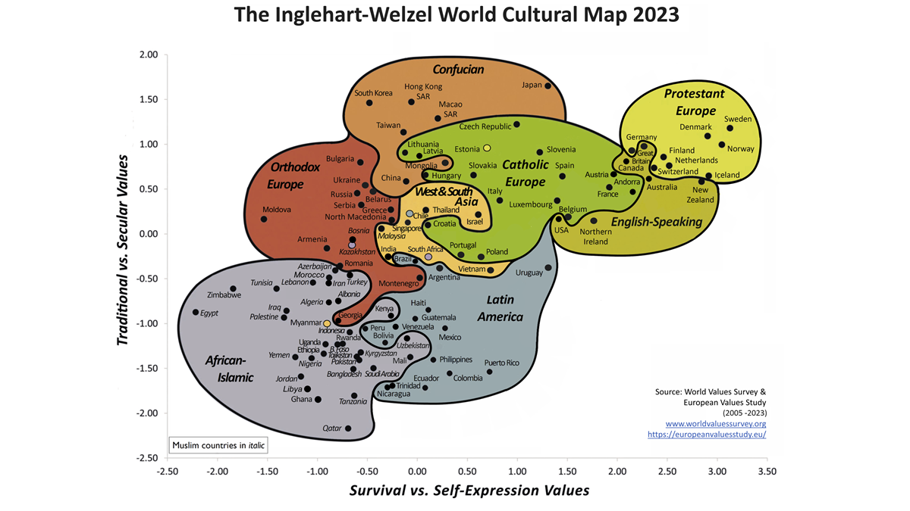
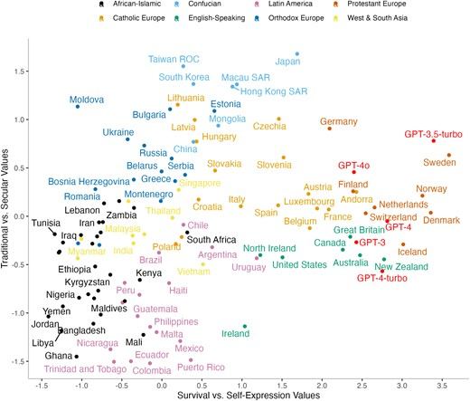

# ADR-003: Cultural Alignment as the Primary Differentiator

| Field | Value |
| :---- | :---- |
| Status | Proposed |
| Confidence | High (5/5) |
| Date | May 7, 2026 |
| Deciders | Christopher Nguyen (proposed), workshop participants (to ratify) |

## Context

Tapestry's value proposition must be framed around something that centralized labs structurally cannot replicate. Several candidates exist: multilingual capability, data sovereignty, training cost reduction, cultural alignment.

## Decision

Tapestry's primary differentiator is **sovereign cultural alignment** — the ability for each participating community to produce a model aligned to its own cultural, institutional, and national sensibilities. This is the one thing that is structurally impossible for a centralized lab to replicate, regardless of budget or intentions.

Multilingual capability is explicitly *not* the differentiator. The big labs will solve multilingual problems given sufficient data. A model that speaks Yoruba with Silicon Valley values is not a sovereign model.

*Left: fragile strategic framing; right: structural moat. Language fluency and cultural legitimacy are independent dimensions.*

| Positioning candidate | Can centralized labs eventually match? | Tapestry stance |
| :-------------------- | :--------------------------------------- | :---------------- |
| Multilingual capability | Yes, given scale and data | Useful, **not** the moat |
| Data sovereignty (residency, legal control) | Partially — commoditized cloud offerings | **Necessary constraint**, not unique value |
| Shared-training cost reduction | Yes — many pooling models exist | Helps smaller actors; **not** the differentiator |
| **Sovereign cultural alignment** | **No** — requires local legitimacy and participation | **Primary differentiator** |

## Rationale

- Cultural alignment requires local value judgments — what is appropriate, authoritative, respectful, true — that only the community itself can make. No external lab can do this for a community it doesn't belong to, no matter how well-intentioned.
- Tao et al. (2024) tested five GPT models against the World Values Survey across 107 countries and found that **all models cluster with English-speaking and Protestant European countries on the Inglehart-Welzel map**. This is the empirical proof: today's frontier models are culturally aligned to one cluster and structurally misaligned to most of the world.

*The Inglehart-Welzel Cultural Map. Source: [World Values Survey & European Values Study (2005–2022)](https://www.worldvaluessurvey.org/WVSContents.jsp?CMSID=Findings).*

*All five GPT models land in the Protestant Europe / English-speaking cluster. Source: Tao et al., [PNAS Nexus 3(9), 2024](https://academic.oup.com/pnasnexus/article/3/9/pgae346/7756548).*
- The "Fluent but Foreign" paper (2026) demonstrates that regional LLMs trained on local language data still reflect the base model's cultural values. Language fluency and cultural alignment are independent dimensions. Solving one does not solve the other.
- Framing around multilingual capability makes Tapestry's value proposition fragile — it can be undercut any time a big lab adds better support for another language. Cultural alignment cannot be undercut this way because it requires structural participation by the community.
- The Inglehart-Welzel Cultural Map (World Values Survey) provides a measurable evaluation framework for cultural alignment, making this differentiator testable rather than aspirational.

## Confidence assessment

This is the sharpest strategic insight in the design process. It reframes Tapestry from "distributed training platform" (a technical capability, replicable) to "sovereign cultural alignment infrastructure" (a structural property, unreplicable by centralized actors). The evidence base is strong and the framing has survived multiple rounds of challenge.

The one caveat: we hypothesize that continued pretraining on culturally *grounded* data (not just linguistically local data) shifts cultural alignment measurably. This hypothesis is supported by the "Fluent but Foreign" negative result (language data alone doesn't work, so something else is needed) but not yet by a positive result showing our approach does work. Validating this is a Phase 1 research priority.

## Alternatives considered

- **Frame around multilingual capability:** Fragile. Big labs are solving this. Does not create a structural moat.
- **Frame around data sovereignty:** Important but not unique. Many platforms offer data residency. Sovereignty is a constraint Tapestry must satisfy, not the value it creates.
- **Frame around cost reduction (shared training):** Relevant for smaller participants but not a differentiator. Many cost-sharing mechanisms exist.

## Consequences

- All documentation, presentations, and communications frame sovereignty in terms of cultural alignment, not language support.
- The sovereign alignment pipeline (continued pretraining on culturally grounded data + post-training alignment) becomes a first-class architectural component, not a downstream step.
- Evaluation frameworks must measure cultural alignment (Inglehart-Welzel, Hofstede, WVS-based benchmarks), not just linguistic accuracy.
- Validating the cultural alignment hypothesis is an early research deliverable, not a deferred aspiration.

## References

- [Tao et al. "Cultural Bias and Cultural Alignment of Large Language Models." *PNAS Nexus* 3(9), 2024.](https://academic.oup.com/pnasnexus/article/3/9/pgae346/7756548) — **All GPT models cluster with English-speaking / Protestant European countries on the Inglehart-Welzel map.**
- ["Fluent but Foreign: Even Regional LLMs Lack Cultural Alignment." arXiv:2505.21548, 2026.](https://arxiv.org/html/2505.21548)
- [Sukiennik. "An Evaluation of Cultural Value Alignment in LLM." arXiv:2504.08863, 2025.](https://arxiv.org/abs/2504.08863)
- ["Cultural Alignment in Large Language Models." COLING 2025.](https://aclanthology.org/2025.coling-main.567.pdf)
- ["CQ-Bench: Can LLMs Grasp Implicit Cultural Values?" arXiv:2504.01127, 2025.](https://arxiv.org/abs/2504.01127)
- [Inglehart & Welzel. "The WVS Cultural Map of the World." World Values Survey, 2005-2022.](https://www.worldvaluessurvey.org)
