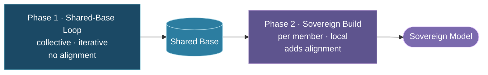
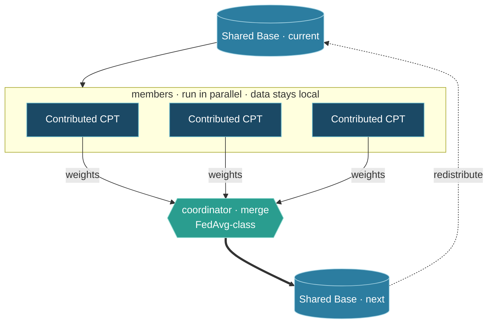
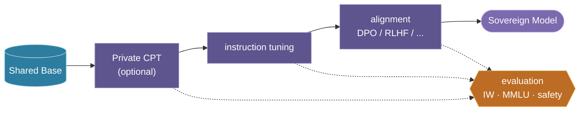

# TAP-004: The Consortium Training Loop

| Field | Value |
| :---- | :---- |
| Status | Proposed |
| Confidence | Strong (4/5) |
| Date | May 7, 2026 |
| Revised | Jun 17, 2026 — two-phase framing, diagrams, and terminology |
| Deciders | Christopher Nguyen (proposed), workshop participants (to resolve open questions) |

## Context

Given the core-plus-sovereign architecture ([TAP-001](adr-001-core-plus-sovereign.md)) and the consortium training model ([TAP-002](adr-002-consortium-training.md)), this ADR defines how training actually flows — and separates the **two distinct phases** that earlier drafts blurred together.

## The two phases

Consortium training has two phases, run in order:

1. **Shared-Base Loop** — collective and iterative. Members improve one shared base model together. Its output is a *base*, not a deployable product, and it carries **no cultural alignment**.
2. **Sovereign Build** — local and per-member. Each member takes the shared base and builds its own deployable model, including alignment. Nothing here is shared back.

The first is a *loop* (it repeats); the second is a *build* (it runs once per member, to completion). Only **weights** ever leave a node — never raw member data, never per-step gradients.

## Terminology

- **Shared-Base Loop** — Phase 1; the collective loop that produces the Shared Base.
- **Shared Base** — the common base model the loop produces (the "1" in N+1). No alignment.
- **Sovereign Build** — Phase 2; a member's local process that produces its own model.
- **Sovereign Model** — a member's deployable, culturally-aligned model (one of the "N").
- **Contributed CPT** — continued pre-training a member runs *inside the loop*; its weights are contributed back to the Shared Base.
- **Private CPT** — continued pre-training a member runs *inside its Sovereign Build*; it stays local and is never contributed.

## Phase 1 — Shared-Base Loop

Each cycle:

1. **Distribute** — every member starts from the current Shared Base.
2. **Contributed CPT** — each member continues pre-training the whole model on its own data; the data stays on the node.
3. **Contribute weights** — each member sends back only its post-CPT weight vector — not gradients, not data.
4. **Merge & redistribute** — the coordinator merges the contributions (quality-weighted FedAvg-class averaging by default) into the next Shared Base, and the loop repeats.

| Step | Where it runs | What crosses the network |
| :--- | :------------ | :----------------------- |
| Distribute | Coordinator → members | Shared Base checkpoint |
| Contributed CPT | Each member (data stays local) | Nothing |
| Contribute | Member → coordinator | Post-CPT weights only |
| Merge | Coordinator | Updated Shared Base |

Sync cadence is an operational choice, not architectural — frequent (cluster-like) or occasional (geo-distributed). Each cycle makes the next round of continued pre-training start from a better base.

## Phase 2 — Sovereign Build

Once a member is satisfied with a Shared Base, it builds its own model — independently, with no coordination and no contribution back:

- **Private CPT** (optional) — more continued pre-training on data the member keeps local.
- **Post-training** — instruction tuning, then alignment (DPO / RLHF / Constitutional AI).
- **Evaluation** runs throughout — cultural alignment on the Inglehart-Welzel map, capability on MMLU, and safety.

Members are free here: the steps above are the recommended path, not a requirement. A member may use any methods it likes to hit its own capability, cultural-alignment, and safety goals. None of it is merged into the Shared Base — which is what keeps each member's cultural specialization its own, and avoids averaging distinct cultures back toward a bland centroid.

## Aggregation (modular)

The default merge is quality-weighted FedAvg-class averaging of contributed weights. The mechanism is replaceable — DiLoCo-style outer optimization, model merging, or distillation — without changing the rest of the loop ([TAP-007](adr-007-architecture-comparison.md)).

## Confidence assessment

The two-phase structure follows naturally from TAP-001 and TAP-002 and is unlikely to be challenged. The 4/5 confidence reflects open questions about the loop's *parameters*, not its structure.

## Open questions

1. **Cycle cadence** — synchronized vs asynchronous cycling, and how differing rates skew a member's influence on the Shared Base.
2. **Contribution weighting** — uniform vs quality-weighted; simultaneously an optimization and a governance question (see Phase 5, Decision 8).
3. **Convergence** — members' data is deliberately non-IID (that is the point); convergence at frontier scale is unvalidated.

## Alternatives considered

- **One-shot (no contribution back):** distribute a base, customize, never improve the shared base — just "download and fine-tune."
- **Per-step gradient sharing (FedSGD):** tight step-locking and high bandwidth; rejected in favor of local-then-sync.
- **Pure peer-to-peer (no shared base):** no proven path to frontier quality from a cold start.
- **Contributing post-training back to the Shared Base:** would homogenize culturally specific alignment into the common model; rejected. This is precisely the boundary between Phase 1 and Phase 2.

## Consequences

- Requires a coordinator for the merge — a governed role, not a power center (see Phase 5, Decision 7).
- Per-cycle compute for each member is estimated at 5–10% of original base pretraining cost; must be validated empirically.
- The MVP deliverable is a Shared-Base Loop across 2–3 real members, not a generic fine-tuning system.

## References

- [McMahan et al. "Communication-Efficient Learning of Deep Networks from Decentralized Data." AISTATS 2017.](https://arxiv.org/abs/1602.05629)
- [Douillard et al. "DiLoCo: Distributed Low-Communication Training of Language Models." arXiv:2311.08105, 2023.](https://arxiv.org/abs/2311.08105)
- [Jaghouar et al. "OpenDiLoCo: An Open-Source Framework for Globally Distributed Low-Communication Training." arXiv:2407.07852, 2024.](https://arxiv.org/abs/2407.07852)
- ["Communication-Efficient Language Model Training Scales Reliably and Robustly: Scaling Laws for DiLoCo." arXiv:2503.09799, 2025.](https://arxiv.org/abs/2503.09799)
- [Zhu et al. "Deep Leakage from Gradients." NeurIPS 2019.]()
- [Geiping et al. "Inverting Gradients: How easy is it to break privacy in federated learning?" NeurIPS 2020.]()
