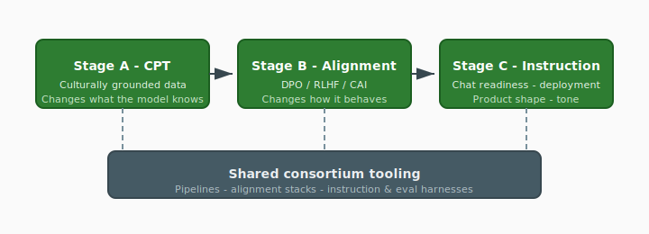

# ADR-005: Sovereign Alignment Pipeline

**Status:** Proposed
**Confidence:** Strong (4/5)
**Date:** May 7, 2026
**Deciders:** Christopher Nguyen (proposed), workshop participants (to resolve open questions)

## Context

Given that cultural alignment is the primary differentiator (ADR-003), the specific mechanism by which participants produce sovereign models must be defined.

## Decision

The sovereign alignment pipeline has three stages, each addressing a different layer of the model:

**Stage A: Continued pretraining on culturally grounded data.**
Changes what the model *knows* about the world. Training data is not just linguistically local but culturally grounded: local legal reasoning, medical practice, educational conventions, literary traditions, institutional knowledge, and community-authored content. Estimated compute: 5–10% of base pretraining cost.

**Stage B: Post-training alignment (DPO / RLHF / Constitutional AI).**
Changes how the model *behaves*. The community decides what is appropriate, authoritative, respectful, and true in their context. This is where cultural value judgments are encoded.

**Stage C: Instruction tuning and chat readiness.**
Makes the model deployable as a usable product — chat agent, coding assistant, domain-specific tool. Instruction tuning is itself culturally loaded (formality, directness, deference to authority, humor) and therefore belongs in the sovereign pipeline, not the shared base.

All three stages are sovereign — each participant runs them independently on their own data. The *tooling* for all three stages is consortium infrastructure, shared across participants.

*Vector figure [`sovereign-alignment-pipeline.svg`](../diagrams/sovereign-alignment-pipeline.svg). Export PNG with `make tech-docs-diagram-pngs` if your preview blocks SVG. Stages A–C change knowledge, behavior, and product shape; tooling is shared consortium infrastructure.*

| Stage | What changes | Examples | Consortium tooling (shared) |
| :---- | :----------- | :------- | :---------------------------- |
| **A** — CPT | World knowledge / representations | Culturally grounded corpora (law, medicine, literature, institutions) | Pipelines, data governance hooks |
| **B** — Alignment | Behavior / values | DPO, RLHF, Constitutional AI, local preference data | Alignment stacks, evaluation |
| **C** — Instruction | Deployable product | Chat, coding, domain assistants; tone and interaction norms | Instruction / deployment harnesses |

*All three stages execute on **sovereign data** at the participant; tooling is consortium infrastructure.*

## Rationale

- "Fluent but Foreign" (2026) demonstrates that language-focused continued pretraining fails to shift cultural alignment. Stage A specifically targets culturally *grounded* data to address this.
- Post-training alignment alone (Stage B without Stage A) fights the model's own world model — it can change surface behavior but underlying cultural dispositions leak through in edge cases.
- Without Stage C, the model is not deployable. Participants will ask "when do I get a chatbot?" and the answer must be part of the pipeline, not an afterthought.
- All three stages are sovereign concerns because cultural values affect knowledge, behavior, *and* interaction style.

## Confidence assessment

The pipeline structure is sound and well-motivated. The 4/5 confidence reflects two open questions:

1. **Does Stage A actually work?** The hypothesis that continued pretraining on culturally *grounded* data (as opposed to merely linguistically local data) measurably shifts cultural alignment is supported by the negative result in "Fluent but Foreign" but not yet by a positive result. This is the foundational research question. If the answer is no, the pipeline must be redesigned.

2. **What constitutes "culturally grounded" data?** Legal texts? Literature? Community-authored content? Social media? Religious texts? The answer likely varies by community. The training pipeline needs clear guidance on data selection, and this guidance must come from the communities themselves, not from the platform architects.

The overall shape — pretraining for knowledge, alignment for behavior, instruction tuning for usability — is standard practice. What's novel is making all three stages sovereign and providing consortium-level tooling.

## Alternatives considered

- **Adapters only (LoRA/QLoRA):** Too shallow for cultural alignment. Modifies behavior without changing deep representations.
- **Post-training alignment only (no continued pretraining):** "Fluent but Foreign" shows this doesn't shift cultural values at the representation level.
- **Continued pretraining only (no post-training alignment):** The model would know the culture but might still behave according to the base alignment. Both stages needed.

## Consequences

- Continued pretraining on the full model requires meaningful compute (5–10% of base pretraining). Smaller participants may need compute support from the consortium.
- The alignment tooling (value elicitation, alignment data pipelines, cultural evaluation frameworks) is novel infrastructure that doesn't exist yet. This is the area requiring the most original work.
- Safety properties from the base model may be affected by continued pretraining (unlike adapters, which leave the base frozen). Mechanisms for preserving safety through continued pretraining are an open design question.
