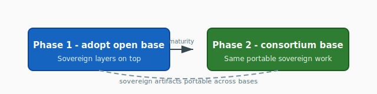

# ADR-006: Phased Base Model Strategy

**Status:** Proposed
**Confidence:** Strong (4/5)
**Date:** May 7, 2026
**Deciders:** Christopher Nguyen (proposed), workshop participants (to resolve open questions)

## Context

The core-plus-sovereign architecture (ADR-001) requires a frontier-competitive base model. The question is where it comes from.

## Decision

Phased approach:

**Phase 1 (now):** Adopt the best available open-weights model as the starting base. Sovereign layers are built on top.

**Phase 2 (when ready):** Transition to a consortium-trained base when the organization has the maturity, compute, data, and governance to do it well.

Sovereign contributions (continued pretraining outputs, alignment layers, domain adapters) are designed to be **portable across base models**, so the transition from Phase 1 to Phase 2 does not discard participants' work.

*Vector figure [`phased-base-model-strategy.svg`](../diagrams/phased-base-model-strategy.svg). Export PNG with `make tech-docs-diagram-pngs` if your preview blocks SVG. Solid path: maturity toward a consortium-trained base. Dashed curve: sovereign artifacts remain portable across base generations.*

| Phase | Base model source | Sovereign work | Sovereignty story |
| :---- | :---------------- | :------------- | :---------------- |
| **1** — Now | Adopt best available **open-weights** base | Build portable sovereign layers on top (ADR-005); join loop (ADR-004) | Honest dependency; layers designed to migrate |
| **2** — When ready | **Consortium-trained** base | Same sovereign layers and tooling; contribution shapes the shared core | Reduced reliance on a single external provider |

## Rationale

- Training a frontier model from scratch requires $200M+, 12–18 months, and organizational maturity the consortium doesn't yet have.
- Adopting an existing base delivers frontier capability immediately, enabling participants to start the consortium training loop (ADR-004) and sovereign alignment pipeline (ADR-005) now.
- Portability of sovereign layers across bases makes the dependency replaceable — the anti-capture principle (DG3) is satisfied in the temporal sense ("we can switch") even if not in the instantaneous sense ("we're currently independent").
- This is the honest version of sovereignty: acknowledge the dependency, design it to be replaceable, commit to a timeline for independence.

## Confidence assessment

The phased approach is pragmatic and likely uncontested. The 4/5 confidence reflects two open questions:

1. **Which base model?** This is a politically charged decision. Llama (Meta, US corporate), Mistral (French, EU alignment), Qwen (Alibaba, geopolitically complicated for some participants). The choice of starting base sends a signal about alignment. The answer may be "test with multiple bases" or "the architecture is base-agnostic, so each node can start with whichever base it prefers." The workshop should discuss this.

2. **Will Phase 2 actually happen?** If participants are satisfied with the adopted base + sovereign layers, the transition to a consortium-trained base may never happen. "Eventually" becomes "never." The consortium needs concrete criteria for when to trigger Phase 2 (e.g., base model provider changes license terms, consortium compute pool exceeds threshold, governance vote).

## Alternatives considered

- **Train from scratch immediately (Option B in Phase 5):** Full sovereignty but high risk, high cost, and nothing ships for 12–18 months.
- **Permanent dependency on external base:** Simpler but violates DG3. The base provider could change terms, deprecate the model, or comply with sanctions.

## Consequences

- Phase 1 creates a dependency on the chosen base model's provider. This must be acknowledged in all communications — not hidden.
- The portability requirement constrains how sovereign layers are implemented. They must use standard interfaces and formats, not provider-specific APIs.
- Criteria for triggering Phase 2 should be defined at the workshop or shortly after — this prevents the "never" problem.
