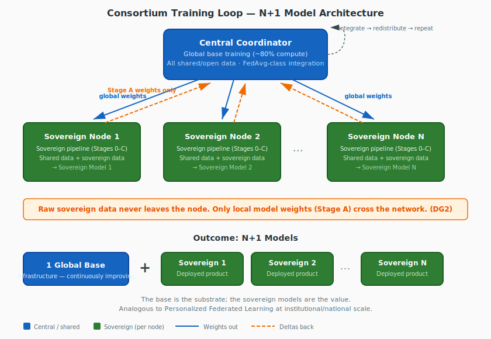

# TAP-007: Training Architecture Comparison

| Field | Value |
| :---- | :---- |
| Status | Proposed |
| Confidence | Strong (4/5) |
| Date | May 7, 2026 |
| Deciders | Christopher Nguyen (proposed), workshop participants (to validate and refine) |

## Why this ADR exists

Each prior ADR makes localized comparisons: TAP-001 compares core-plus-sovereign against alternatives, TAP-004 compares the training loop against alternatives, and so on. But no document asks the cross-cutting question: **given our design goals, what are the fundamentally different training architectures that could work, and why are we proposing this one?**

This matters for the workshop because architectural discussions can drift into scope creep and bikeshedding. Every alternative considered here is evaluated against the same design goals. If a suggestion doesn't serve these goals better than the proposed architecture, it's out of scope.

## What we are solving

Before evaluating architectures, we recall the problem. These are the design goals from Phase 4 that the training architecture must satisfy:

| Goal | Requirement | Why it matters |
| :--- | :---------- | :------------- |
| **DG1** | Frontier capability *with* sovereign cultural alignment | A capable model with the wrong alignment is unusable; a well-aligned model without frontier capability loses to commercial alternatives. These are inseparable. |
| **DG2** | Data sovereignty through architecture | Raw sovereign data never leaves the participant's infrastructure. The guarantee is technical, not just contractual. |
| **DG3** | Anti-capture | No single entity controls the model, the weights, or the governance. Participants can exit with their sovereign work intact. |
| **DG4** | Incremental value delivery | Each roadmap phase is independently useful. Nothing requires waiting 18 months before participants see value. |
| **DG5** | Strategic rationality for participants | Every participant gets value commensurate with contribution — value legible to their board or government. |
| **DG6** | Safety in the shared base | Sovereign layers add to but cannot subtract from baseline safety. |
| **DG9** | Extensible to new architectures/modalities | Not locked to transformers or a single model family. |

Any proposed architecture must satisfy DG1–DG3 (primary goals) without compromise, and should satisfy DG4–DG9 (secondary/tertiary) as well as possible.

## The design space

The training architecture is not a single choice but a combination of three independent decisions:

**1. Sovereignty mechanism:** How does each node produce a culturally sovereign model?

- Full-model continued pre-training (train all parameters on sovereign data)
- Adapter-only training (LoRA/QLoRA on a frozen base)
- Expert module training (train a dedicated expert that routes by cultural context)

**2. Contribution mechanism:** How do sovereign contributions flow back to improve the shared base?

- Weight delta aggregation (nodes send parameter differences to coordinator)
- Model merging (nodes train independently; weights combined post-hoc)
- Knowledge distillation (sovereign models as teachers; shared model as student)
- No contribution back (one-shot: distribute base, nodes customize, no loop)

**3. Base model source:** Where does the shared base come from?

- Adopted external open weights (Phase 1 per TAP-006)
- Consortium-trained from scratch (Phase 2 per TAP-006)
- No shared base (fully independent training per node)

The current proposed architecture is one point in this space: **full-model CPT + weight delta aggregation + adopted base (evolving to consortium-trained base)**. Below, we evaluate the viable alternatives.

## Proposed architecture: Consortium training with weight delta aggregation

This is the architecture described across TAP-001, TAP-004, and TAP-005. Here we present it as an integrated whole.

### How it works

**Step 1 — Centralized base training.** A frontier-competitive model is trained (or initially adopted) on large-scale open data. This is the "80%" of compute. All available shared data — open datasets, consortium-contributed non-sovereign corpora — feeds into the global base. The result is a strong, general-purpose model that lacks cultural specificity.

**Step 2 — Distribute to nodes.** The global model weights are sent to each participating node. Each node receives the same checkpoint.

**Step 3 — Sovereign pipeline (TAP-005).** Each node runs the full sovereign model pipeline on the global base: data preparation (Stage 0), continued pre-training on shared *plus* sovereign data (Stage A), post-training alignment (Stage B), instruction tuning (Stage C), with evaluation throughout. Sovereign data stays on the node; nothing raw crosses the network.

**Step 4 — Weight delta contribution.** Each node computes the difference between its locally-trained model and the global model it started from. Only these weight deltas are sent to the central coordinator — not per-step gradients, not raw data.

**Step 5 — Central integration.** The coordinator aggregates weight deltas into an updated global model. This is the step with the most open design questions (see below).

**Step 6 — Redistribute and repeat.** The updated global model goes back to Step 2. Each cycle, the base improves with sovereign knowledge from all participants.

### The N+1 model outcome

At any point in time, the consortium has **N+1 models**:

- **1 global base model** — the shared infrastructure, continuously improved
- **N sovereign models** — the deployed products, one per participant, each culturally aligned

The global base is the substrate; the sovereign models are the value. This parallels Personalized Federated Learning (PFL), but at institutional/national scale with shared governance.

### Integration step: Choices and open questions

The aggregation of weight deltas (Step 5) is the most technically uncertain part of the architecture. Options include:

| Method | Description | Pros | Cons | Status |
| :----- | :---------- | :--- | :--- | :----- |
| **Simple averaging** (FedAvg-style) | Uniform weight across all node deltas | Simple, well-understood | Ignores quality differences; large nodes dominate implicitly via data scale | Baseline |
| **Quality-weighted averaging** | Weight deltas by evaluation score or data quality metrics | Better models contribute more; aligns with DG5 | Requires agreed quality metrics; governance implications (who defines "quality"?) | Leading candidate |
| **Selective merging** (TIES / DARE) | Prune redundant or conflicting delta components before merging | Reduces interference between culturally divergent updates | Newer technique; frontier-scale validation missing | Research candidate |
| **Contribution thresholding** | Minimum quality bar; deltas below threshold excluded | Prevents degradation from low-quality contributions | Exclusionary; governance tension with DG5 | To discuss |

The choice of aggregation method is simultaneously a technical and governance question. Quality-weighted averaging is the leading candidate, but the definition of "quality" is itself culturally loaded and must be consortium-governed. This is a key workshop discussion topic.

**Additional open questions:**

- **Cycle frequency.** Synchronized or asynchronous? Monthly, quarterly, or per-node choice?
- **Convergence with non-IID data.** Sovereign data is deliberately non-IID — that's the sovereignty point. What are the convergence properties? DiLoCo provides theoretical grounding at small scale; frontier-scale validation is missing.
- **Safety preservation.** Does weight delta aggregation from culturally diverse nodes degrade safety properties of the base? What safeguards are needed?

## Alternative architectures

### Alternative 1: Independent training + model merging

**How it works:** Each node trains its sovereign model independently on the global base. Instead of contributing weight deltas to a coordinator, nodes train to completion. The global base is updated by *merging* the independently trained models using techniques like TIES-Merging, DARE, or Model Soups.

**Advantages:** No coordination during training — each node is fully independent. No central coordinator needed during the training phase. Nodes can use different hyperparameters, training durations, and approaches.

**Disadvantages:** Merge quality degrades as models diverge. With culturally diverse training data (deliberately non-IID), divergence is expected to be high. Theoretical grounding for merging frontier-scale models with radically different training distributions is weak. Does not create the virtuous cycle where each round starts from a better base — the base only improves post-hoc.

| Goal | Assessment |
| :--- | :--------- |
| DG1 | **Partial.** Frontier quality uncertain after merging divergent models. |
| DG2 | **Met.** Data stays on node. |
| DG3 | **Met.** No central coordinator during training (stronger anti-capture). |
| DG4 | **Met.** Each node gets a usable model immediately. |
| DG5 | **Weakened.** No continuous improvement cycle; value of contribution less legible. |
| DG6 | **Uncertain.** Merging may unpredictably affect safety properties. |

**Verdict:** Viable as a fallback if the consortium training loop proves technically infeasible at scale, but weaker on the primary goal (DG1) due to merge quality concerns.

### Alternative 2: Mixture of Experts (MoE) federation

**How it works:** Each node trains an expert module (not the full model) specialized in its cultural domain. A shared routing mechanism directs inputs to the appropriate expert(s) based on cultural context. The result is a single MoE model with culturally specialized experts.

**Advantages:** Natural fit for multi-cultural models — no interference between cultural domains. Each expert can be highly specialized. The routing mechanism makes cultural awareness explicit and interpretable.

**Disadvantages:** N experts means N× the memory at inference time (or complex load-balancing). Routing by "cultural context" is itself a hard problem — culture is not a clean categorical variable. The shared base (non-expert parameters) still needs a training strategy. Does not produce N+1 independent sovereign models — produces one model with N cultural modes, which is a fundamentally different sovereignty story. Participants don't "own" a model; they own an expert within a shared model.

| Goal | Assessment |
| :--- | :--------- |
| DG1 | **Partial.** Expert quality may be high, but routing accuracy is uncertain. |
| DG2 | **Met.** Expert training data stays on node. |
| DG3 | **Weakened.** The MoE model is a shared artifact; participants can't meaningfully exit with "their" model. Violates the portability aspect of anti-capture. |
| DG4 | **Weakened.** Requires all experts + routing before the system is useful. Less incremental. |
| DG5 | **Weakened.** Participants don't get a standalone sovereign model — they get an expert in a shared system. Harder to justify to a board. |
| DG6 | **Uncertain.** Safety may vary by expert route; evaluation complexity increases. |

**Verdict:** Intellectually appealing but fails the sovereignty test. The N+1 model outcome — where each participant has a standalone, deployable sovereign model — is a core value proposition, and MoE doesn't deliver it. May be useful as a *technique within* a sovereign model (e.g., domain routing within a single participant's model), but not as the consortium architecture.

### Alternative 3: Knowledge distillation cascade

**How it works:** Each node trains a full sovereign model (like the proposed architecture). Instead of sending weight deltas, each sovereign model serves as a *teacher*. The central coordinator trains an updated global base as a *student* that learns from all N teachers via knowledge distillation.

**Advantages:** Flexible — each node can use any training approach, any architecture variant. The student model can be smaller or architecturally different from the teachers. Better privacy properties than weight deltas (only soft labels or logits cross the wire, not parameter differences).

**Disadvantages:** Information loss in distillation is significant, especially for subtle cultural knowledge. Multi-teacher distillation at frontier scale is an active research area without proven recipes. Each cycle requires substantial compute at the coordinator (training the student). More complex than weight delta aggregation.

| Goal | Assessment |
| :--- | :--------- |
| DG1 | **Partial.** Distillation loses information; cultural nuances may not survive. |
| DG2 | **Strong.** Only soft labels/logits cross the wire — better privacy than weight deltas. |
| DG3 | **Met.** Participants own full teacher models. |
| DG4 | **Met.** Each node has a usable teacher model immediately. |
| DG5 | **Met.** Standalone sovereign models with clear ownership. |
| DG6 | **Uncertain.** Student model's safety depends on distillation process. |

**Verdict:** Interesting for its privacy properties (DG2) and could be considered as a future evolution. But the information loss concern makes it weaker on DG1 than weight delta aggregation, and the compute overhead at the coordinator is substantial. Worth monitoring as distillation techniques mature.

### Alternative 4: Adapter-only federation

**How it works:** The global base is frozen. Each node trains only lightweight adapters (LoRA, QLoRA, DoRA) on sovereign data. Adapter weights (not full model deltas) are shared and aggregated.

**Advantages:** Minimal compute per node — orders of magnitude cheaper than full-model CPT. Composable — adapters from different domains/cultures can potentially be stacked. Well-understood technically. Base model safety is preserved (the base is frozen).

**Disadvantages:** Too shallow for cultural alignment. "Fluent but Foreign" (2026) demonstrates that surface-level adaptation fails to shift cultural values at the representation level. Adapters modify behavior without changing deep representations. This is the foundational empirical finding that motivates Stage A (full-model CPT) in the first place.

| Goal | Assessment |
| :--- | :--------- |
| DG1 | **Fails.** Adapters cannot deliver deep cultural alignment — the primary differentiator. |
| DG2 | **Met.** Data stays on node. |
| DG3 | **Met.** Adapters are portable. |
| DG4 | **Strong.** Cheapest to deploy; fastest to value. |
| DG5 | **Partial.** Low cost is good; shallow alignment is bad. |
| DG6 | **Strong.** Frozen base preserves safety. |

**Verdict:** Fails on DG1, which is the primary design goal. However, adapter-only training may serve as a **Phase 0.5** — a way to deliver initial value quickly while full-model CPT infrastructure is being built. The question is whether it delivers *enough* alignment to be useful as a stepping stone, even if it's not the final architecture. Newer adapter techniques (DoRA, LoRA+, full fine-tuning of attention layers) may narrow the gap, and this should be revisited as the field evolves.

### Alternative 5: No contribution back (one-shot distribution)

**How it works:** The consortium trains or adopts a global base. Each node downloads it, customizes it via the sovereign pipeline, and that's it. No weight deltas, no loop, no continuous improvement of the shared base.

**Advantages:** Simple. No coordination infrastructure needed beyond initial distribution. Each node is fully independent.

**Disadvantages:** The global base never improves from sovereign contributions. This is just "download open weights and fine-tune" — it's what organizations already do today without a consortium. The consortium adds no continuous value beyond the initial base. No virtuous cycle. No reason for participants to stay engaged beyond Phase 1.

| Goal | Assessment |
| :--- | :--------- |
| DG1 | **Partial.** Initial base is frontier; no improvement over time. |
| DG2 | **Met.** |
| DG3 | **Met.** |
| DG4 | **Fails.** No value beyond Phase 1. Why have a consortium? |
| DG5 | **Fails.** No ongoing exchange of value. No reason to contribute. |

**Verdict:** Not viable as a consortium architecture. This is the status quo — what any organization can already do with Llama or Mistral. The consortium training loop is what makes Tapestry more than "a governance wrapper around open weights."

### Alternative 6: Peer-to-peer weight exchange (no central coordinator)

**How it works:** Same as the proposed architecture, but without a central coordinator. Nodes exchange weight deltas directly with each other in a peer-to-peer topology. The global model emerges from decentralized gossip-style aggregation rather than hub-and-spoke coordination.

**Advantages:** Strongest possible anti-capture — no coordinator role to concentrate power. No single point of failure. Pure decentralization aligns philosophically with sovereignty.

**Disadvantages:** Convergence is harder without a coordinator managing aggregation order and quality. Systems engineering is significantly more complex — gossip protocols, consistency guarantees, stale-delta handling. The coordinator in the proposed architecture is a governed role, not a power center (constrained by DG3's governance mechanisms); the engineering cost of removing it may not be justified by the marginal anti-capture benefit.

| Goal | Assessment |
| :--- | :--------- |
| DG1 | **Uncertain.** Convergence properties of decentralized aggregation with non-IID data at frontier scale are unexplored. |
| DG2 | **Met.** Data stays on node. |
| DG3 | **Strong.** No central coordinator at all — strongest anti-capture of any option. |
| DG4 | **Weakened.** More complex to bootstrap; requires critical mass of active peers. |
| DG5 | **Met.** Standalone sovereign models with clear ownership. |
| DG6 | **Uncertain.** Decentralized aggregation makes safety enforcement harder. |

**Verdict:** Conceptually appealing but engineering complexity is high and convergence properties are unknown. Worth exploring as a long-term evolution if the coordinator role proves to be a governance bottleneck. Not recommended as the starting architecture.

### Alternative 7: Synthetic data relay

**How it works:** Each node generates synthetic data from its sovereign corpus (using the sovereign model itself or a dedicated generator). The synthetic data — not the raw sovereign data — is shared centrally and used to improve the global base through standard centralized training.

**Advantages:** Privacy mechanism is fundamentally different from weight deltas: instead of sharing model artifacts (which have known reconstruction risks), the node shares generated content. The central trainer uses standard techniques on a larger, more diverse corpus. Easier to audit — you can inspect synthetic data; you can't easily inspect what's encoded in a weight delta.

**Disadvantages:** Synthetic data quality for cultural nuance is the critical question. Cultural alignment is encoded in subtleties of framing, reference, value judgment, and implicit knowledge. Can synthetic data preserve these? There's a real risk that synthetic generation flattens the cultural signal — keeping surface-level patterns while losing the deep representational grounding that Stage A is designed to achieve. Also, if the synthetic data is too faithful, it may still leak information about the sovereign corpus.

| Goal | Assessment |
| :--- | :--------- |
| DG1 | **Uncertain.** Depends entirely on whether synthetic data preserves cultural nuance — an open question. |
| DG2 | **Partial.** Synthetic data is shared, not raw data, but information leakage through high-fidelity synthetic data is a real concern. The sovereignty guarantee is weaker than weight deltas. |
| DG3 | **Met.** |
| DG4 | **Met.** Each node gets a usable model; synthetic data generation is relatively lightweight. |
| DG5 | **Met.** Contributions are visible and auditable. |
| DG6 | **Met.** Centralized training allows standard safety alignment. |

**Verdict:** An interesting alternative that trades DG2 strength for auditability and simplicity. The fundamental question — whether synthetic data preserves deep cultural alignment — has no answer yet. This could be a viable alternative *or* a dead end depending on that empirical result. Worth investigating as a research track, particularly for participants whose sovereignty requirements permit sharing synthetic (but not raw) data.

## Summary comparison

A note on DG1 assessments: DG1 (frontier capability with sovereign cultural alignment) is rated against current empirical evidence. For the proposed architecture, DiLoCo provides small-scale validation and there is supporting theory. For model merging and knowledge distillation, the techniques work in simpler settings but frontier-scale validation with culturally non-IID data is missing. **The same empirical uncertainty applies to all approaches** — none have been validated at the target scale with deliberately divergent cultural data. The proposed architecture has the most supporting evidence, but the gap is one of degree, not kind.

| Architecture | DG1 Frontier + Alignment | DG2 Data Sovereignty | DG3 Anti-capture | DG4 Incremental | DG5 Strategic | N+1 Models |
| :----------- | :----------------------- | :------------------- | :--------------- | :-------------- | :------------ | :--------- |
| **Consortium + weight deltas** (proposed) | **Strongest evidence** | Met | Met | Met | Met | **Yes** |
| Independent + merging | Plausible (unvalidated) | Met | **Strong** | Met | Weak | Yes |
| Mixture of Experts | Partial | Met | Weak | Weak | Weak | **No** |
| Knowledge distillation | Plausible (unvalidated) | **Strong** | Met | Met | Met | Yes |
| Adapter-only | **Fails** (empirical) | Met | Met | **Strong** | Partial | Yes |
| No loop (one-shot) | Partial (static) | Met | Met | Fails | Fails | Yes (static) |
| Peer-to-peer exchange | Uncertain | Met | **Strongest** | Weakened | Met | Yes |
| Synthetic data relay | Uncertain | Partial | Met | Met | Met | Yes |

## Three viable contenders

Three architectures could plausibly satisfy all primary design goals (DG1–DG3):

**1. Consortium training + weight deltas (proposed).** Has the most theoretical and small-scale empirical support (DiLoCo scaling laws, FedAvg convergence theory). Continuous improvement cycle creates a virtuous loop. Systems engineering is well-understood. The central coordinator is a mild anti-capture concern, mitigated by governance.

**2. Independent training + periodic model merging.** Each node trains to completion independently; models are merged post-hoc. Has *stronger* anti-capture properties (no coordinator during training). The critical question is whether merge quality holds up with radically divergent cultural training distributions at frontier scale. TIES-Merging and DARE are advancing rapidly. If merge quality proves acceptable, this is a genuine competitor — simpler operationally, with a better DG3 story.

**3. Knowledge distillation cascade.** Has *stronger* DG2 properties (only soft labels/logits cross the wire, not weight deltas, which have known reconstruction attack surfaces). The critical question is whether multi-teacher distillation preserves subtle cultural nuances at frontier scale. Information loss in distillation is real but the technique is maturing. If distillation fidelity proves sufficient, this offers a better privacy story than weight deltas.

The advantage of the proposed architecture over these two alternatives is empirical, not structural. All three could work. We are betting on the one with the most supporting evidence today — while designing the system so that the contribution mechanism (weight deltas vs. merging vs. distillation) can be swapped without redesigning the overall pipeline (TAP-005) or governance model.

Two additional approaches — **peer-to-peer exchange** and **synthetic data relay** — are worth tracking as research directions but are not yet mature enough to serve as the primary architecture.

Two approaches are **ruled out**: MoE federation (fails the standalone sovereignty test — participants don't get their own model) and adapter-only (empirical evidence from "Fluent but Foreign" shows it's too shallow for cultural alignment). One-shot distribution is the status quo, not a consortium architecture.

## Decision

Tapestry adopts **consortium training with weight delta aggregation** as the initial training architecture, as defined in TAP-004. It is the preferred candidate given current evidence — not because it is the only viable option, but because it has the strongest theoretical and empirical support (DiLoCo scaling laws, FedAvg convergence theory) and the most straightforward systems engineering.

The architecture is designed so that the **contribution mechanism is modular**: the sovereign pipeline (TAP-005), the N+1 model outcome, and the governance model do not depend on whether contributions flow as weight deltas, merged models, or distilled knowledge. If model merging or knowledge distillation proves superior as those techniques mature, the contribution mechanism can be swapped without redesigning the rest of the system.

Adapter-only training (Alternative 4) may serve as a **Phase 0.5** rapid-deployment mechanism while full-model CPT infrastructure is being built, with clear criteria for transition.

## Confidence assessment

The comparison is well-grounded in the design goals and supported by empirical evidence (especially "Fluent but Foreign" for ruling out adapter-only approaches). The 4/5 confidence reflects:

1. **All three viable architectures share the same empirical gap.** None have been validated at frontier scale with culturally non-IID data. The proposed architecture has the most supporting evidence, but the advantage is one of degree, not certainty. The foundational systems research question is: does *any* of these contribution mechanisms converge to a useful global model when nodes have deliberately divergent cultural training distributions?

2. **The integration step has significant open questions** (aggregation method, cycle frequency, convergence properties) that could affect viability — and the answers may favor a different contribution mechanism than weight deltas.

3. **The field is moving fast.** Model merging techniques (TIES, DARE, evolutionary model merging) and multi-teacher distillation are advancing rapidly. This comparison should be revisited at least annually, with specific trigger criteria for reconsidering the choice of contribution mechanism.

## Consequences

- The **contribution mechanism should be treated as a replaceable module** in the system architecture. The training loop infrastructure should not be so tightly coupled to weight delta aggregation that switching to model merging or distillation requires a ground-up redesign.
- The workshop should discuss whether to **invest research effort in parallel** across the three viable mechanisms, or concentrate on validating weight deltas first. The answer depends on available research bandwidth.
- A Phase 0.5 adapter-only rapid deployment should be evaluated as a stepping stone, with clear criteria for transition to full-model CPT.
- The integration step's design (aggregation method, governance of "quality" metrics) is the most urgent unresolved technical-governance question and should be a workshop priority.
- This comparison should be maintained as a living document, updated as evidence accumulates. Specific empirical results that would change the recommendation should be named and tracked.

## References

- [Douillard et al. "DiLoCo: Distributed Low-Communication Training of Language Models." arXiv:2311.08105, 2023.](https://arxiv.org/abs/2311.08105)
- [Yadav et al. "TIES-Merging: Resolving Interference When Merging Models." NeurIPS 2023.](https://arxiv.org/abs/2306.01708)
- [Yu et al. "Language Models are Super Mario: Absorbing Abilities from Homologous Models as a Free Lunch." ICML 2024.](https://arxiv.org/abs/2311.03099)
- [Wortsman et al. "Model Soups: Averaging Weights of Multiple Fine-tuned Models Improves Accuracy without Increasing Inference Time." ICML 2022.](https://arxiv.org/abs/2203.05482)
- [Hinton et al. "Distilling the Knowledge in a Neural Network." NeurIPS Workshop 2014.](https://arxiv.org/abs/1503.02531)
- [Hu et al. "LoRA: Low-Rank Adaptation of Large Language Models." ICLR 2022.](https://arxiv.org/abs/2106.09685)
- ["Fluent but Foreign: Even Regional LLMs Lack Cultural Alignment." arXiv:2505.21548, 2026.](https://arxiv.org/html/2505.21548)
- [McMahan et al. "Communication-Efficient Learning of Deep Networks from Decentralized Data." AISTATS 2017.](https://arxiv.org/abs/1602.05629)
