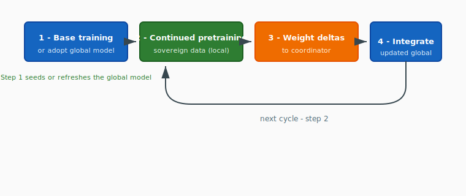

# Training Approaches: Centralized, Federated, and Consortium

*Reference document — May 2026*

---

## Purpose

Three distinct approaches to training large models are relevant to Tapestry's design. They are often conflated. This document defines each, explains when it is appropriate, and clarifies which approach Tapestry uses and why.

## At-a-glance comparison

| Dimension | Centralized training | Federated learning | Consortium training |
| :-------- | :------------------- | :----------------- | :------------------ |
| **Typical participants** | One organization, one cluster | Very many small clients (phones, hospitals, …) | Few large nodes (national labs, HPC, sovereign AI programs) |
| **Data location** | All training data colocated | Small shards per node | Large sovereign corpora per node |
| **What crosses the network** | Data moves to the compute center | Gradients or frequent small updates | Infrequent **weight deltas** (not raw data) |
| **Communication pattern** | Fast interconnect; sync every step or few steps | Frequent, bandwidth-sensitive | Periodic; tolerates WAN latency |
| **Dominant motive** | Throughput and single-owner control | Individual / edge **privacy** | National or institutional **sovereignty** and cultural alignment |
| **Governance** | Single owner | Aggregator plus clients | Consortium with shared voice and rules |
| **Model scale (typical)** | Frontier | Often modest | Frontier-class shared model |
| **Primary goal** | Maximum capability | Learn without centralizing raw data | Frontier capability **and** culturally aligned outcomes |
| **Tapestry** | Incompatible (colocation, capture) | Wrong fit (scale, motive, update pattern) | **This is Tapestry’s paradigm** ([TAP-002](../architecture/decisions/adr-002-consortium-training.md)) |

The sections below spell out each column in prose. The consortium training loop is specified in [TAP-004](../architecture/decisions/adr-004-training-loop.md).

---

## Centralized Training

**What it is:** All training data is collected in one location. One organization controls the compute cluster, the data pipeline, the architecture, and the training process. The resulting model belongs to that organization.

**Communication:** Nodes within the cluster communicate via fast interconnect (NVLink, InfiniBand) — TB/s bandwidth, microsecond latency. Synchronization happens every step or every few steps.

**When it's appropriate:**
- A single organization has sufficient data, compute, and expertise
- Data can legally and practically be collected in one place
- Speed of training is the primary constraint
- One entity owns the result

**Examples:** GPT-4 (OpenAI), Claude (Anthropic), Llama (Meta), Gemini (Google)

**Limitations for Tapestry's goals:** Requires all data in one place (violates data sovereignty). One organization controls everything (violates anti-capture). Only organizations with $200M+ budgets can participate (violates access goals).

---

## Federated Learning

**What it is:** Many distributed nodes (often millions) train locally on their own data and share model updates with a central aggregator. The raw data never leaves the nodes. Originally designed for privacy-preserving learning across edge devices.

**Communication:** Nodes share gradients or small model updates frequently. Designed for settings where each node has very little data and limited compute.

**When it's appropriate:**
- Many small clients with private local data (mobile phones, hospitals, edge devices)
- Individual data protection is the primary motive
- The model is small or the updates are lightweight (e.g., fine-tuning)
- Statistical heterogeneity across nodes is moderate

**Examples:** Google's keyboard prediction (Gboard), hospital networks sharing medical model updates without sharing patient data

**Key techniques:** FedAvg, FedProx, SCAFFOLD

**Limitations for Tapestry's goals:** Designed for millions of small clients, not dozens of large GPU clusters. The privacy motive (individual data protection) is different from Tapestry's (national/institutional sovereignty). Communication patterns assume frequent small updates, not infrequent large ones. The term "federated" carries connotations of edge/mobile settings that don't match Tapestry's reality.

---

## Consortium Training

**What it is:** A small number of large, trusted, heterogeneous nodes — national labs, sovereign AI initiatives, HPC centers, research institutions — collaboratively train a shared model. Each node trains the entire model on its sovereign data for extended periods, then contributes the resulting weight deltas back to a central coordinator for integration. The updated global model is redistributed and the cycle repeats.

**Communication:** Nodes share **weight deltas** (the difference between their locally-trained model and the global model) infrequently — every hundreds or thousands of training steps. This is fundamentally different from sharing per-step gradients:

| | Per-step gradients | Weight deltas |
| :--- | :--- | :--- |
| **Sync frequency** | Every step or few steps | Every hundreds/thousands of steps |
| **Bandwidth requirement** | High, continuous | Low, periodic |
| **Latency tolerance** | Requires fast interconnect | Tolerates WAN (public internet) |
| **Privacy properties** | Higher risk — tightly coupled to specific training examples | Lower risk — signal from individual examples diluted across many steps |
| **Node autonomy** | Nodes are step-locked | Nodes train independently between syncs |

The choice of weight deltas over gradients is a design decision within consortium training — it is not what *defines* consortium training. Consortium training is defined by the participants (few, large, sovereign), the purpose (cultural alignment + frontier capability), and the governance model (consortium with shared ownership). Weight deltas are the preferred communication mechanism because they align well with sovereignty goals (infrequent sync, better privacy, WAN-compatible), but a consortium could in theory share gradients if it chose to.

**When it's appropriate:**
- A small number of large nodes with massive, culturally or institutionally specific datasets
- National/institutional sovereignty is a first-order constraint
- Nodes have heterogeneous hardware, data distributions, and governance requirements
- The goal is both frontier capability and cultural alignment
- Participants want shared ownership of the result

**The consortium training loop:**

**Key techniques:** DiLoCo-class outer optimization (the weight delta aggregation step is effectively the outer optimizer), continued pretraining, post-training cultural alignment

**This is what Tapestry uses.**

---

## Comparison

| | Centralized Training | Federated Learning | Consortium Training |
| :--- | :--- | :--- | :--- |
| **Participants** | One organization, one cluster | Many clients (phones, hospitals, edge) | Dozens of large institutional nodes |
| **Data per node** | All data centralized | Small (one user's or site's data) | Massive (national/institutional corpora) |
| **Sovereignty motive** | N/A — one owner | Individual / site-level data protection | National/institutional sovereignty + cultural alignment |
| **What crosses the network** | N/A — internal interconnect | Gradients, weight updates, or deltas (varies by method) | Weight deltas (aggregated over many steps) |
| **Communication** | Every step; fast interconnect | Varies: frequent (FedAvg) to infrequent (DiLoCo) | Infrequent; WAN-tolerant |
| **Model scale** | Frontier | Typically small to medium | Frontier |
| **Governance** | Single owner decides all | Aggregator-driven; clients have no architectural voice | Consortium with shared ownership and governance rights |
| **Each node's outcome** | N/A — one model | Same global model (or personalized variant in PFL) | Sovereign model: shared base + community-specific alignment |

Consortium training borrows techniques from the federated learning literature — including DiLoCo (infrequent sync) and ideas from Personalized Federated Learning (per-node model variants). The distinction is not technical novelty in the optimization algorithm but in the *context*: who participates, at what scale, with what governance, and toward what goal.

---

## Related decisions

| Document | Role |
| :------- | :--- |
| [TAP-002: Consortium training model](../architecture/decisions/adr-002-consortium-training.md) | Names the paradigm and contrasts it with federated and centralized training. |
| [TAP-004: The consortium training loop](../architecture/decisions/adr-004-training-loop.md) | Defines the four-step loop (base → CPT → deltas → integrate). |

## References

**Centralized training** — no single foundational paper; standard practice across OpenAI (GPT-4), Anthropic (Claude), Meta (Llama), Google (Gemini).

**Federated learning:**
- [McMahan et al. "Communication-Efficient Learning of Deep Networks from Decentralized Data." AISTATS 2017.](https://arxiv.org/abs/1602.05629) — foundational FedAvg paper.
- [Tan et al. "Towards Personalized Federated Learning." IEEE Trans. Neural Networks, 2023.]() — survey of Personalized FL approaches.

**DiLoCo (infrequent-sync distributed training):**
- [Douillard et al. "DiLoCo: Distributed Low-Communication Training of Language Models." arXiv:2311.08105, 2023.](https://arxiv.org/abs/2311.08105) — the method Tapestry's weight-delta communication builds on.
- [Jaghouar et al. "OpenDiLoCo: An Open-Source Framework for Globally Distributed Low-Communication Training." arXiv:2407.07852, 2024.](https://arxiv.org/abs/2407.07852) — open-source implementation, cross-continent validation.
- ["Communication-Efficient Language Model Training Scales Reliably and Robustly: Scaling Laws for DiLoCo." arXiv:2503.09799, 2025.](https://arxiv.org/abs/2503.09799) — scaling behavior at larger model sizes.

**Gradient privacy:**
- [Zhu et al. "Deep Leakage from Gradients." NeurIPS 2019.]() — demonstrates training data reconstruction from per-step gradients.
- [Geiping et al. "Inverting Gradients: How easy is it to break privacy in federated learning?" NeurIPS 2020.]() — improved gradient inversion attacks.
