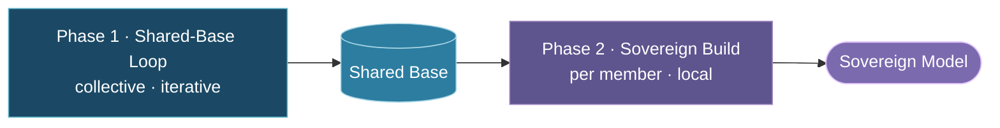

# Training Approaches: Centralized, Federated, and Consortium

*Reference document — May 2026*

---

## Purpose

Three distinct approaches to training large models are relevant to Tapestry's design. They are often conflated. This document defines each, explains when it is appropriate, and clarifies which approach Tapestry uses and why.

## At-a-glance comparison

| Dimension | Centralized training | Federated learning | Consortium training |
| :-------- | :------------------- | :----------------- | :------------------ |
| **Typical participants** | One organization, one cluster | Very many small clients (phones, hospitals, …) | Few large nodes (national labs, HPC, sovereign AI programs) |
| **Data location** | All training data colocated | Small shards per node | Large sovereign corpora per node |
| **What crosses the network** | Data moves to the compute center | Per-step gradients (FedSGD) or **local model weight vectors** after local training (FedAvg) | **Local model weight vectors** after **Contributed CPT**; not raw data |
| **Communication pattern** | Fast interconnect; sync every step or few steps | Varies by method and deployment (frequent to infrequent) | **Cadence is operational** — fast/frequent (cluster-like) or slower (geo-distributed) |
| **Dominant motive** | Throughput and single-owner control | Individual / edge **privacy** | National or institutional **sovereignty** and cultural alignment |
| **Governance** | Single owner | Aggregator plus clients | Consortium with shared voice and rules |
| **Model scale (typical)** | Frontier | Often modest | Frontier-class shared model |
| **Primary goal** | Maximum capability | Learn without centralizing raw data | Frontier capability **and** culturally aligned outcomes |
| **Tapestry** | Incompatible (colocation, capture) | Wrong fit (scale, motive, governance) | **This is Tapestry’s paradigm** ([TAP-002](../architecture/decisions/adr-002-consortium-training.md)) |

The sections below spell out each column in prose. Consortium training runs in two phases — the **Shared-Base Loop** and the **Sovereign Build** — specified in [TAP-004](../architecture/decisions/adr-004-training-loop.md).

---

## Centralized Training

**What it is:** All training data is collected in one location. One organization controls the compute cluster, the data pipeline, the architecture, and the training process. The resulting model belongs to that organization.

**Communication:** Nodes within the cluster communicate via fast interconnect (NVLink, InfiniBand) — TB/s bandwidth, microsecond latency. Synchronization happens every step or every few steps.

**When it's appropriate:**
- A single organization has sufficient data, compute, and expertise
- Data can legally and practically be collected in one place
- Speed of training is the primary constraint
- One entity owns the result

**Examples:** GPT-4 (OpenAI), Claude (Anthropic), Llama (Meta), Gemini (Google)

**Limitations for Tapestry's goals:** Requires all data in one place (violates data sovereignty). One organization controls everything (violates anti-capture). Only organizations with $200M+ budgets can participate (violates access goals).

---

## Federated Learning

**What it is:** Many distributed nodes (often millions) train locally on their own data and share model updates with a central aggregator. The raw data never leaves the nodes. Originally designed for privacy-preserving learning across edge devices.

**Communication:** Two common patterns:

| Pattern | What crosses the network | Sync cadence |
| :------ | :----------------------- | :----------- |
| **FedSGD** | Per-step gradients | Every step (or few steps) |
| **FedAvg** | **Local model weight vectors** after multiple local epochs | After local training completes — cadence varies by deployment |

FedAvg is *not* the same as per-step gradient sharing. Each client trains locally, then sends its updated weights; the server averages them.

**When it's appropriate:**
- Many small clients with private local data (mobile phones, hospitals, edge devices)
- Individual data protection is the primary motive
- The model is small or the updates are lightweight (e.g., fine-tuning)
- Statistical heterogeneity across nodes is moderate

**Examples:** Google's keyboard prediction (Gboard), hospital networks sharing medical model updates without sharing patient data

**Key techniques:** FedAvg, FedProx, SCAFFOLD, DiLoCo (variant with outer optimizer on parameter deltas)

**Limitations for Tapestry's goals:** Designed for millions of small clients, not dozens of large GPU clusters. The privacy motive (individual data protection) is different from Tapestry's (national/institutional sovereignty). The term "federated" carries connotations of edge/mobile settings that don't match Tapestry's reality.

---

## Consortium Training

> A consolidated glossary of these and other Tapestry terms lives in [`glossary.md`](glossary.md).

**What it is:** A small number of large, trusted, heterogeneous nodes — national labs, sovereign AI initiatives, HPC centers, research institutions — collaboratively train a shared model (as defined in [TAP-002](../architecture/decisions/adr-002-consortium-training.md)). This happens in two phases ([TAP-004](../architecture/decisions/adr-004-training-loop.md)).

In the **Shared-Base Loop** (Phase 1), each node performs **Contributed CPT** — full-model continued pre-training on its member data (not adapters-only) — then uploads its **locally trained model weight vector** to a central coordinator. The coordinator performs **quality-weighted model averaging** (FedAvg-class aggregation by default) and redistributes the updated **Shared Base**. The cycle repeats.

In the **Sovereign Build** (Phase 2), each node takes the Shared Base and runs **Private CPT** plus post-training (instruction tuning and alignment) locally to produce its deployable **Sovereign Model** ([TAP-005](../architecture/decisions/adr-005-sovereign-pipeline.md)). **Only Contributed CPT weights feed the Shared Base**; everything in the Sovereign Build stays local.

**Communication:** Nodes share **local model weight vectors** after local CPT — not per-step gradients, not raw data. This is fundamentally different from FedSGD-style gradient sharing:

| | Per-step gradients (FedSGD) | Local model weight vectors (FedAvg / Tapestry) |
| :--- | :--- | :--- |
| **Payload** | Gradient tensors | Full model weights after local training |
| **Typical sync** | Every step or few steps | After a local training phase — **cadence is a deployment choice** |
| **Node autonomy** | Nodes are step-locked to the aggregator | Nodes train independently between syncs |

**Sync cadence is not fixed by the architecture.** Deployments may sync frequently (cluster-like, high-bandwidth interconnect) or less often (geo-distributed nodes over WAN). What defines consortium training is *who* participates, *what* crosses the wire (weight vectors after Contributed CPT), and *how* governance works — not a particular sync interval.

The coordinator may compute parameter deltas internally (`θ_local − θ_start`); that is an implementation detail, not the communicated artifact. Yann LeCun's correction: nodes communicate **weight vectors**, not per-step gradients and not deltas as the primary abstraction.

**Aggregation (modular):** The default integration step is **FedAvg-class weighted averaging** of contributed weight vectors. The architecture treats the outer aggregation step as **replaceable** — DiLoCo-style outer optimization on aggregated pseudo-gradients, model merging, or distillation may be substituted without redesigning the Sovereign Build or governance model ([TAP-007](../architecture/decisions/adr-007-architecture-comparison.md)).

**When it's appropriate:**
- A small number of large nodes with massive, culturally or institutionally specific datasets
- National/institutional sovereignty is a first-order constraint
- Nodes have heterogeneous hardware, data distributions, and governance requirements
- The goal is both frontier capability and cultural alignment
- Participants want shared ownership of the result

**The Shared-Base Loop:**

**Key techniques:** FedAvg-class model averaging (default), Contributed CPT (full-model continued pre-training), optional DiLoCo-class outer optimizers; the Sovereign Build's Private CPT and post-training alignment (local only)

**This is what Tapestry uses.**

## Assumptions (read before designing)

Tapestry consortium training assumes a **collaborative** arrangement among institutional participants — shared goals, governed process, and distributed (not singular) authority. It does **not** assume an adversarial multi-party setting by default. Design for clarity of objectives, explicit assumptions, and the **least-resistance path** to them; add stronger technical defenses when a traced requirement or threat model demands it.

Data sovereignty may be satisfied through **legal and organizational agreements** as well as technical controls. See [Design principles for architecture work](../architecture/0-tva-methodology.md#design-principles-for-architecture-work) and [TAP-008](../architecture/decisions/adr-008-data-sovereignty.md).

---

## Related decisions

| Document | Role |
| :------- | :--- |
| [TAP-002: Consortium training model](../architecture/decisions/adr-002-consortium-training.md) | Names the paradigm and contrasts it with federated and centralized training. |
| [TAP-004: The consortium training loop](../architecture/decisions/adr-004-training-loop.md) | Defines the two phases: the **Shared-Base Loop** (Contributed CPT → weight vectors → integrate) and the **Sovereign Build**. |
| [TAP-005: The Sovereign Build](../architecture/decisions/adr-005-sovereign-pipeline.md) | The Sovereign Build in detail (Stages 0–C); only Contributed CPT feeds the Shared-Base Loop. |

## References

**Centralized training** — no single foundational paper; standard practice across OpenAI (GPT-4), Anthropic (Claude), Meta (Llama), Google (Gemini).

**Federated learning:**
- [McMahan et al. "Communication-Efficient Learning of Deep Networks from Decentralized Data." AISTATS 2017.](https://arxiv.org/abs/1602.05629) — foundational FedAvg paper (local weight vectors averaged by the server).
- [Tan et al. "Towards Personalized Federated Learning." IEEE Trans. Neural Networks, 2023.]() — survey of Personalized FL approaches.

**DiLoCo (optional outer-optimizer variant):**
- [Douillard et al. "DiLoCo: Distributed Low-Communication Training of Language Models." arXiv:2311.08105, 2023.](https://arxiv.org/abs/2311.08105) — outer optimization on aggregated parameter deltas; reduces to FedAvg when the outer optimizer is SGD with step size 1.
- [Jaghouar et al. "OpenDiLoCo: An Open-Source Framework for Globally Distributed Low-Communication Training." arXiv:2407.07852, 2024.](https://arxiv.org/abs/2407.07852) — open-source implementation, cross-continent validation.
- ["Communication-Efficient Language Model Training Scales Reliably and Robustly: Scaling Laws for DiLoCo." arXiv:2503.09799, 2025.](https://arxiv.org/abs/2503.09799) — scaling behavior at larger model sizes.

**Gradient privacy:**
- [Zhu et al. "Deep Leakage from Gradients." NeurIPS 2019.]() — demonstrates training data reconstruction from per-step gradients.
- [Geiping et al. "Inverting Gradients: How easy is it to break privacy in federated learning?" NeurIPS 2020.]() — improved gradient inversion attacks.
