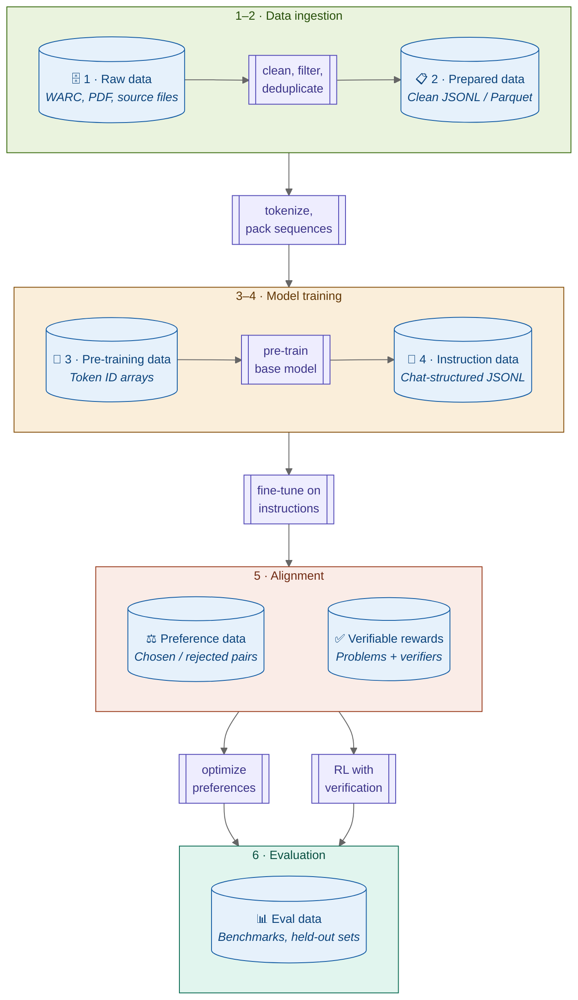

# LLM Training Pipeline: Stages, Data Types, and Quality

*Reference document — May 2026*

---

## Purpose

Training a large language model is a multi-stage pipeline, and the data at each stage is fundamentally different — in format, structure, quality criteria, and governance implications. Tapestry's consortium model depends on nodes contributing data at various pipeline stages, which means the consortium needs a shared vocabulary for describing what kind of data is being contributed, at what stage, and to what quality standard.

This document defines that vocabulary. It walks through the modern LLM training pipeline end-to-end, classifies the data types at each stage, provides concrete examples of what the data looks like (good and bad), and establishes a quality framework. The final section maps these concepts to Tapestry's consortium training model, where the data taxonomy becomes the foundation of governance — you cannot negotiate contributions, quality standards, or cultural representation without a shared language for describing data.

---

## Pipeline overview

The modern LLM training pipeline has six stages. Data enters as messy, heterogeneous blobs and becomes progressively more structured and purpose-specific as it moves through the pipeline.



*Diagram convention: **blue cylinders** = data artifacts; **violet double-bordered boxes** = pipeline steps. Phase bands (green, amber, peach, teal) group stages only.*

The pipeline is not strictly linear. Evaluation data is used throughout (not just at the end). Alignment may loop back through SFT. And in Tapestry's consortium model, the pipeline forks — some stages happen at individual nodes, others at the coordinator, and post-training may diverge into sovereign branches. These dynamics are discussed in [Implications for Tapestry](#implications-for-tapestry).

### Data type summary

| Data type | Pipeline stage | Typical format | Human-readable? | Primary quality signal |
| :-------- | :------------- | :------------- | :--------------- | :--------------------- |
| `raw` | 1 · Collection | .warc.gz, PDF, XML, source files | Yes (heterogeneous) | Source diversity and coverage |
| `prepared` | 2 · Preparation | JSONL or Parquet (text + metadata) | Yes | Quality-classifier score, dedup ratio |
| `pre-training` | 3 · Tokenization | Parquet or binary (token ID arrays) | No (numerical) | Data mix ratios, tokenizer coverage |
| `sft` | 4 · SFT | JSONL (chat messages format) | Yes | Accuracy, instruction-following, completeness |
| `preference` | 5 · Alignment | JSONL (prompt, chosen, rejected) | Yes | Annotator agreement, margin clarity |
| `reward-verifiable` | 5 · Alignment | Problems + verification functions | Partially | Verifier correctness, difficulty calibration |
| `validation` | All stages | Same as its training stage | Varies | Held-out integrity (no leakage) |
| `eval` | 6 · Evaluation | Task-specific (MCQ, code, open-gen) | Yes | Contamination resistance, discriminative power |

---

## Stage 1: Raw data collection

Raw data is whatever you scraped, crawled, downloaded, or received before any processing. It is the starting material for the entire pipeline.

### What it looks like

A Common Crawl WARC record:

```
WARC/1.0
WARC-Type: response
WARC-Target-URI: https://en.wikipedia.org/wiki/Transformer_(deep_learning_architecture)
Content-Type: text/html
Content-Length: 84291

<!DOCTYPE html>
<html>
<head><title>Transformer (deep learning architecture) - Wikipedia</title>
<script>var wgPageName="Transformer_(deep_learning_architecture)";</script>
<link rel="stylesheet" href="/w/load.php?modules=site.styles&only=styles"/>
</head>
<body>
<div id="mw-navigation">
  <nav id="mw-head"><!-- 200+ lines of navigation HTML --></nav>
</div>
<div id="content">
  <h1>Transformer (deep learning architecture)</h1>
  <p>The <b>Transformer</b> is a <a href="/wiki/Deep_learning">deep learning</a>
  architecture based on the <a href="/wiki/Attention_mechanism">multi-head attention</a>
  mechanism, proposed in the 2017 paper
  <i><a href="/wiki/Attention_Is_All_You_Need">"Attention Is All You Need"</a></i>...</p>
  <!-- thousands more lines of content, sidebars, references, footers -->
</div>
<div id="mw-footer"><!-- footer HTML --></div>
</body>
</html>
```

This is mostly noise: HTTP headers, JavaScript, CSS references, navigation chrome, footers. The actual informational content is a small fraction of the file.

Other raw formats include PDF documents (binary, may need OCR), source code repositories (directory trees with build files, configs, and actual code), books (EPUB or plain text with front matter, copyright pages, indices), and structured data dumps (Wikipedia XML, Wikidata JSON-LD).

### Good vs. bad quality at this stage

Quality at the raw stage is really about **source selection** — deciding what to crawl or acquire in the first place.

**Good raw data** (valuable sources):
- Wikipedia article dumps — consistently well-structured, factually reviewed, broad coverage
- Peer-reviewed papers and textbooks — high information density, domain expertise
- Well-maintained open-source repositories — real working code with documentation
- Government and institutional publications — authoritative, often public domain

**Bad raw data** (low-value or harmful sources):
- SEO content farms — text designed to rank in search engines, not to inform
- Auto-generated product listings — repetitive templated text with no informational value
- Scraped social media with no quality signal — high noise ratio, privacy concerns
- Pirated or license-violating content — legal liability, often OCR artifacts

The raw stage is the only stage where *what you choose not to collect* matters as much as what you do collect.

---

## Stage 2: Data preparation

Preparation transforms raw data into clean, structured, deduplicated text with metadata. This is where most of the data engineering effort lives.

### What it looks like

After extraction, cleaning, deduplication, and quality filtering, each document becomes a single JSONL record:

```json
{
  "text": "The Transformer is a deep learning architecture based on the multi-head attention mechanism, proposed in the 2017 paper 'Attention Is All You Need'. Unlike recurrent neural networks, the Transformer processes all positions in a sequence simultaneously, using self-attention to model dependencies regardless of distance. The architecture consists of an encoder and decoder, each built from stacked layers of multi-head attention and position-wise feed-forward networks...",
  "source": "wikipedia",
  "url": "https://en.wikipedia.org/wiki/Transformer_(deep_learning_architecture)",
  "language": "en",
  "quality_score": 0.94,
  "token_count": 2847,
  "content_type": "encyclopedia",
  "dedup_hash": "a3f8c2e19b",
  "extraction_date": "2026-03-15"
}
```

All the HTML, navigation, scripts, and boilerplate are gone. What remains is clean text plus metadata that supports downstream filtering and mixing decisions.

### The preparation pipeline

The key processing steps, in typical order:

1. **Text extraction** — Pull readable text out of HTML (using tools like trafilatura or resiliparse), PDF (OCR if needed), or other container formats. Remove boilerplate, navigation, ads.
2. **Language identification** — Tag each document with its language. Discard or route documents that don't match the target language(s).
3. **Unicode normalization** — Standardize character encodings. Remove control characters, fix encoding artifacts (mojibake).
4. **Quality filtering** — Score each document using a quality classifier (typically trained on "known good" text like Wikipedia vs. random web scrapes) and/or heuristic filters: minimum length, alphabetic character ratio, sentence structure, presence of actual prose vs. keyword lists.
5. **Deduplication** — Remove exact duplicates (hash-based) and near-duplicates (MinHash / SimHash). This is critical — Common Crawl contains enormous amounts of near-identical content, and training on duplicates wastes compute and causes memorization.
6. **PII and safety filtering** — Remove or redact personally identifiable information. Filter content that violates safety policies.
7. **Domain tagging** — Classify documents by domain (science, law, code, news, conversation, etc.) to support the data mixing decisions in Stage 3.

### Good vs. bad quality at this stage

**Good prepared data:**

```json
{
  "text": "Mitochondria generate most of the cell's supply of adenosine triphosphate (ATP), used as a source of chemical energy. They are sometimes described as 'the powerhouse of the cell'. Mitochondria have their own DNA, separate from the nuclear DNA, which is thought to have originated from an ancient endosymbiotic event...",
  "source": "textbook",
  "language": "en",
  "quality_score": 0.96,
  "token_count": 1842,
  "content_type": "biology"
}
```

This is well-formed prose. Factually dense. Coherent paragraph structure. High quality-classifier score.

**Bad prepared data** (should have been filtered but wasn't):

```json
{
  "text": "Best mitochondria supplements 2024!!! Click here for AMAZING deals on CoQ10. Top 10 mitochondria boosters reviewed. Buy now free shipping. As an Amazon Associate I earn from qualifying purchases. Related: best vitamins best supplements best health products...",
  "source": "web",
  "language": "en",
  "quality_score": 0.31,
  "token_count": 847,
  "content_type": "unknown"
}
```

This is SEO spam. It contains the word "mitochondria" but teaches nothing about mitochondria. If this survives into pre-training, the model learns to associate the topic with marketing language rather than biological knowledge.

---

## Stage 3: Tokenization and packing

Clean text gets converted into the numerical sequences the model actually consumes during pre-training. This stage also determines the **data mix** — what proportion of each domain, language, and content type the model trains on.

### What it looks like

```json
{
  "input_ids": [464, 39185, 318, 257, 2769, 4673, 10959, 1912, 319, 262, 5765, 12, 2256, 3241, 9030, 1724, 11, 5150, 287, 262, 2177, 3348, 705, 8347, 3004, 1148, 1439, 921, 10664, 6, 13, 50256, 15878, 78, 354, 623, 7496, 7716, 749, 286, 262, 2685, 338, 5765],
  "attention_mask": [1, 1, 1, 1, 1, 1, 1, 1, 1, 1, 1, 1, 1, 1, 1, 1, 1, 1, 1, 1, 1, 1, 1, 1, 1, 1, 1, 1, 1, 1, 1, 1, 1, 1, 1, 1, 1, 1, 1, 1, 1, 1, 1]
}
```

These are dense arrays of integers — 2048, 4096, or 8192 tokens long depending on the model's context window. Multiple documents are concatenated end-to-end with separator tokens (like `50256` in the example above, which is GPT-2's end-of-text token) to fill each sequence completely, minimizing wasted compute. This is called **sequence packing**.

The data is no longer human-readable without the tokenizer to decode it. It is stored in formats optimized for streaming: Parquet with token ID columns, memory-mapped binary arrays (as used by Megatron-LM), or HuggingFace `datasets` format with disk-backed caching.

### The tokenizer

The tokenizer is trained separately, before this stage, on a representative sample of the prepared data. Common approaches include Byte-Pair Encoding (BPE), SentencePiece, and WordPiece. The tokenizer determines:

- **Vocabulary size** — typically 32K to 128K tokens. Larger vocabularies represent more concepts as single tokens but increase the embedding table size.
- **Subword granularity** — common words get single tokens, rare words are split into subword pieces. The word "mitochondria" might be one token in a science-heavy vocabulary or three tokens (`mit`, `och`, `ondria`) in a general one.
- **Language efficiency** — a tokenizer trained primarily on English will tokenize Japanese or Arabic text into many more tokens per concept, wasting context window and compute. This is a critical equity issue for multilingual models.

### The data mix

At this stage, prepared documents from different domains get mixed into the training sequences at specific ratios. This is one of the most consequential and least well-understood decisions in the entire pipeline. Typical choices:

- **Code** is upsampled (often 2-5x its natural frequency in web crawls) because code training improves reasoning even on non-code tasks.
- **Wikipedia and textbooks** are upsampled for factual density.
- **Conversational text** gets moderate representation for fluency.
- **Low-quality web text** is downsampled or excluded entirely.

The "quality" of pre-training data is really about this recipe. Two datasets with identical individual document quality can produce very different models if the mix ratios differ.

### Good vs. bad quality at this stage

Quality problems here are usually invisible in individual records — they show up in aggregate.

**Good pre-training data characteristics:**
- Near-duplicate documents removed (not just exact duplicates)
- Data mix deliberately designed with domain ratios informed by ablation experiments
- Tokenizer trained on a representative sample of all target languages
- Sequences packed efficiently with proper separator tokens
- No data from the evaluation sets leaked into training

**Bad pre-training data characteristics:**
- Heavy duplication remaining — the model memorizes specific passages instead of learning general patterns
- Accidental domain skew — e.g., 60% of the corpus is low-quality web text because that's what's most abundant, drowning out higher-quality sources
- Tokenizer undertrained on minority languages — Japanese text requires 3x more tokens than English for equivalent content, penalizing Japanese-language knowledge
- Evaluation contamination — benchmark questions present in training data, inflating scores without real capability gains

---

## Stage 4: Supervised fine-tuning (SFT)

After pre-training produces a base model that can predict next tokens, SFT teaches the model to follow instructions and converse in a structured format. The base model knows a lot but doesn't know how to be helpful — SFT bridges that gap.

### What it looks like

The canonical format is chat-structured JSONL:

```json
{
  "messages": [
    {"role": "system", "content": "You are a helpful assistant with expertise in molecular biology."},
    {"role": "user", "content": "What is the role of mitochondria in apoptosis?"},
    {"role": "assistant", "content": "Mitochondria play a central role in the intrinsic pathway of apoptosis (programmed cell death). When a cell receives internal stress signals — such as DNA damage, oxidative stress, or growth factor withdrawal — the outer mitochondrial membrane becomes permeabilized. This releases cytochrome c into the cytoplasm, which activates caspase-9, triggering the caspase cascade that dismantles the cell.\n\nThe key regulatory proteins are the Bcl-2 family: pro-apoptotic members (Bax, Bak) promote membrane permeabilization, while anti-apoptotic members (Bcl-2, Bcl-xL) prevent it. The balance between these determines whether the cell lives or dies.\n\nThis mitochondrial pathway is distinct from the extrinsic pathway, which is triggered by external death receptor signals (like Fas ligand) and does not require mitochondrial involvement in its initial signaling steps."}
  ]
}
```

Multi-turn conversations look the same but with more message pairs:

```json
{
  "messages": [
    {"role": "user", "content": "What's the difference between mitosis and meiosis?"},
    {"role": "assistant", "content": "Mitosis produces two genetically identical daughter cells and is used for growth and repair. Meiosis produces four genetically unique cells with half the chromosome count and is used to create gametes (sex cells). The key difference is that meiosis includes two rounds of division and introduces genetic variation through crossing over and independent assortment."},
    {"role": "user", "content": "Why does crossing over matter?"},
    {"role": "assistant", "content": "Crossing over shuffles genetic material between homologous chromosomes during meiosis I. This means each gamete carries a unique combination of alleles, rather than an exact copy of either parent chromosome. This genetic recombination is one of the main sources of heritable variation in sexually reproducing organisms — it's a major reason siblings aren't genetically identical despite having the same parents."}
  ]
}
```

### Good vs. bad quality at this stage

SFT data quality has the most direct impact on user-facing model behavior. The dimensions that matter: factual accuracy, instruction-following, completeness, appropriate detail level, and tone.

**Good SFT example:**

```json
{
  "messages": [
    {"role": "user", "content": "Explain the CAP theorem in simple terms."},
    {"role": "assistant", "content": "The CAP theorem says that a distributed database can provide at most two of three guarantees at the same time: consistency (every read gets the most recent write), availability (every request gets a response), and partition tolerance (the system works even when network messages are lost between nodes).\n\nIn practice, network partitions are unavoidable in distributed systems, so the real choice is between consistency and availability during a partition. A system like a traditional relational database with synchronous replication chooses consistency — it may reject writes during a partition rather than risk serving stale data. A system like Cassandra or DynamoDB chooses availability — it keeps serving requests but may return slightly stale data until the partition heals.\n\nMost real systems don't make a binary choice but tune the trade-off on a per-operation basis."}
  ]
}
```

This response is accurate, appropriately simplified without being wrong, addresses the "simple terms" instruction, and adds practical context.

**Bad SFT example:**

```json
{
  "messages": [
    {"role": "user", "content": "Explain the CAP theorem in simple terms."},
    {"role": "assistant", "content": "The CAP theorem, also known as Brewer's theorem, was conjectured by computer scientist Eric Brewer in 2000 and formally proved by Seth Gilbert and Nancy Lynch in 2002 (published in ACM SIGACT News, Volume 33 Issue 2). It states that it is impossible for a distributed data store to simultaneously provide more than two out of the following three guarantees:\n\n1. Consistency: Every read receives the most recent write or an error, formally defined as linearizability in the context of distributed computing theory.\n2. Availability: Every request received by a non-failing node in the system must result in a response, as defined in the formal proof by Gilbert and Lynch.\n3. Partition tolerance: The system continues to operate despite an arbitrary number of messages being dropped or delayed by the network between nodes.\n\nThe formal proof relies on the asynchronous network model and demonstrates that in any network subject to partitioning, a system implementing an atomic read/write register cannot guarantee both safety (consistency) and liveness (availability). For a rigorous treatment, refer to Gilbert and Lynch (2002) and Brewer's keynote at PODC 2000."}
  ]
}
```

This response ignores the "simple terms" instruction. It front-loads citation details the user didn't ask for, uses jargon it was asked to avoid, and fails to provide the practical intuition that would actually help someone understand the concept. It's not *wrong* — but it demonstrates poor instruction-following, which is exactly what SFT is supposed to teach.

---

## Stage 5: Preference optimization and alignment

After SFT, the model can follow instructions, but it doesn't yet have a refined sense of *which* response a human would prefer when there are multiple reasonable options. Alignment training teaches this.

The technique landscape has evolved significantly. The major approaches, each with distinct data requirements:

### 5a. Preference data (DPO, SimPO, KTO)

The format is a prompt paired with two responses — one that humans preferred ("chosen") and one they didn't ("rejected"):

```json
{
  "prompt": "Explain quantum entanglement to a 10-year-old.",
  "chosen": "Imagine you have two magic coins. When you flip them, they always land on opposite sides — if one is heads, the other is always tails, even if your friend takes one to the other side of the world. Nobody is sending a secret message between the coins; they just 'know' what the other one is doing. Scientists call this quantum entanglement. The spooky part is that you can't predict which side either coin will land on — you only know they'll be opposites.",
  "rejected": "Quantum entanglement is a phenomenon in quantum mechanics where two or more particles become correlated in such a way that the quantum state of each particle cannot be described independently of the others. When a measurement is made on one particle, the state of the other particle is instantaneously determined, regardless of the spatial separation between them. This non-local correlation was famously described by Einstein as 'spooky action at a distance' and has been experimentally verified through Bell test experiments."
}
```

Both responses are factually correct, but the "chosen" response actually addresses a 10-year-old audience while the "rejected" one ignores the instruction.

### 5b. Reward model training data (RLHF with PPO)

In classical RLHF, preference pairs are first used to train a separate **reward model** — a model that takes a prompt and response and outputs a scalar score. The reward model then provides the training signal during reinforcement learning.

The reward model's training data looks identical to preference pairs. Its output, however, is a score used during RL:

```json
{
  "prompt": "Write a haiku about machine learning.",
  "response": "Data flows like streams\nPatterns emerge from the noise\nMachines learn to see",
  "reward_score": 0.87
}
```

### 5c. Verifiable rewards (GRPO, DAPO, RLVR)

This is the 2025-2026 frontier. For tasks where correctness is objectively verifiable — math, code, formal reasoning — you skip human preference labels entirely. A unit test, proof checker, or mathematical verifier provides a binary signal that's faster, cheaper, and more consistent than any human annotator.

```json
{
  "problem": "Write a function that returns the nth Fibonacci number. It should handle n=0 and n=1 as base cases.",
  "test_cases": [
    {"input": {"n": 0}, "expected": 0},
    {"input": {"n": 1}, "expected": 1},
    {"input": {"n": 10}, "expected": 55},
    {"input": {"n": 20}, "expected": 6765}
  ],
  "verifier": "def verify(fn_output, expected): return fn_output == expected"
}
```

```json
{
  "problem": "Find all integers n in the range [-100, 100] such that n² + 3n + 5 is divisible by 121.",
  "ground_truth": [-58, -63, 52, 57],
  "verifier": "def verify(response, truth): return set(parse_integers(response)) == set(truth)"
}
```

The model generates multiple attempts per problem. The verifier scores each attempt. RL (typically GRPO) optimizes the model to produce more correct solutions. This approach powered DeepSeek-R1's emergent reasoning capabilities — including self-correction and chain-of-thought — without any human-labeled reasoning traces.

### Good vs. bad quality at this stage

**Good preference data:**
- Clear margin between chosen and rejected — the preference is unambiguous
- The reason chosen is better aligns with what you want the model to learn (not just "it's longer")
- Diverse prompt coverage — different domains, difficulty levels, and failure modes
- High inter-annotator agreement — different humans would make the same choice

**Bad preference data:**

```json
{
  "prompt": "What is the capital of France?",
  "chosen": "The capital of France is Paris. Paris is the largest city in France and serves as the country's political, economic, and cultural center. Located in north-central France on the Seine River, Paris has a population of approximately 2.1 million in the city proper and over 12 million in the metropolitan area.",
  "rejected": "Paris."
}
```

The preference here is based on **length**, not quality. The rejected response is actually a perfectly good answer to the question. Training on this teaches the model to be verbose, not better. This is one of the most common failure modes in preference data — annotators unconsciously equate thoroughness with quality.

**Good verifiable reward data:**
- Problems at the right difficulty level — the model succeeds 10-50% of the time (enough signal to learn from, hard enough to push capabilities)
- Verifiers are actually correct — unit tests have good coverage, math checkers don't accept wrong answers
- Problem diversity — different problem types, not just variations on the same template

**Bad verifiable reward data:**
- Problems too easy (model always succeeds — no learning signal) or too hard (model never succeeds — training stalls)
- Buggy verifiers that accept incorrect solutions or reject correct ones
- Narrow problem distribution — e.g., all problems are simple arithmetic, so the model learns arithmetic tricks but not general reasoning

---

## Stage 6: Evaluation

Evaluation data serves two distinct purposes, and the distinction matters for both the data format and the quality criteria.

### Validation data

Validation data is held out from training and used *during* training to monitor loss, detect overfitting, and tune hyperparameters. It is in the **same format as the training data** for whatever stage it belongs to:

- For pre-training: held-out tokenized sequences, used to compute validation perplexity
- For SFT: held-out instruction-response pairs, used to compute validation loss on the response tokens
- For alignment: held-out preference pairs or problems, used to monitor reward accuracy or solve rates

The cardinal rule: validation data must never leak into training data. If it does, validation metrics become meaningless — you're measuring memorization, not learning.

### Eval / benchmark data

Benchmark data is structured specifically for measuring capabilities after training. The formats vary by what's being measured:

**Multiple-choice (knowledge and reasoning):**

```json
{
  "question": "What is the primary function of the mitochondria?",
  "choices": ["DNA replication", "Protein synthesis", "ATP production", "Cell division"],
  "answer": "C",
  "subject": "biology",
  "difficulty": "introductory"
}
```

Used in benchmarks like MMLU (57 academic subjects), MMLU-Pro (harder questions, 10 choices), and GPQA (graduate-level science).

**Code generation:**

```python
def has_close_elements(numbers: List[float], threshold: float) -> bool:
    """Check if in given list of numbers, are any two numbers
    closer to each other than given threshold.
    >>> has_close_elements([1.0, 2.0, 3.0], 0.5)
    False
    >>> has_close_elements([1.0, 2.8, 3.0, 4.0, 5.0, 2.0], 0.3)
    True
    """
    # Model must complete this function.
    # Evaluated by running unit tests against the completion.
```

Used in HumanEval (164 problems, pass@1 metric) and MBPP (974 problems).

**Open-ended generation (judged by humans or LLM-as-judge):**

```json
{
  "prompt": "Write a persuasive email to your team about adopting a new code review process.",
  "rubric": {
    "persuasiveness": "Does the email make a compelling case?",
    "tone": "Is the tone appropriate for a professional team setting?",
    "actionability": "Does it include clear next steps?",
    "length": "Is it concise (under 300 words)?"
  }
}
```

Used in MT-Bench, AlpacaEval, and similar. These are increasingly judged by strong LLMs rather than humans, which introduces its own biases (LLM judges tend to prefer responses from their own model family).

### Good vs. bad quality at this stage

**Good eval data:**
- Questions are not present in any training data (contamination-free)
- Questions actually discriminate between model capabilities — trivial questions that all models get right are useless
- Answer keys are verified correct (MMLU's original dataset had incorrect answers for ~5% of questions)
- Coverage across difficulty levels and domains
- Temporally gated where possible — using content published after training data cutoffs

**Bad eval data:**
- Present in Common Crawl or other training corpora — models "memorize" the answers without real understanding
- Saturated — all frontier models score >95%, so the benchmark no longer distinguishes capabilities
- Incorrect answer keys — models get penalized for correct reasoning
- Narrow domain coverage — e.g., testing only English-language Western knowledge, which systematically undervalues models trained on diverse cultural corpora

---

## Data type taxonomy

This section formalizes the classification system. Each data type has a name, a definition, required metadata fields, and a relationship to the pipeline stages described above.

### Core data types

**`raw`** — Unprocessed data as collected from its source. No cleaning, filtering, or format normalization has been applied. May be in any format: compressed web archives, PDFs, source code files, database dumps, XML exports.

Required metadata: `source_type` (web crawl, repository, publication, etc.), `collection_date`, `estimated_size`, `license` (if known).

**`prepared`** — Text extracted, cleaned, deduplicated, and annotated with metadata. Human-readable. Ready for tokenization or direct use in downstream stages.

Required metadata: `source`, `language`, `quality_score`, `content_type` (domain classification), `dedup_hash`, `token_count`, `extraction_date`, `preparation_pipeline_version`.

**`pre-training`** — Tokenized and packed into fixed-length sequences of token IDs. Not human-readable without the corresponding tokenizer. Includes the data mix specification.

Required metadata: `tokenizer_id`, `sequence_length`, `mix_ratios` (at the dataset level), `source_distribution`, `total_tokens`.

**`sft`** — Instruction-response pairs or multi-turn conversations in chat format. Human-readable.

Required metadata: `turn_count`, `domain`, `source` (human-written, human-edited, synthetic), `generator_model` (if synthetic), `quality_review` (whether human-reviewed).

**`preference`** — Prompt with chosen and rejected responses, annotated by humans or AI judges.

Required metadata: `annotator_type` (human, AI judge, or hybrid), `annotator_agreement` (if multiple annotators), `margin_score` (how clear the preference is), `domain`.

**`reward-verifiable`** — Problems with ground-truth answers or verification functions. Used for RL with verifiable rewards (GRPO, DAPO, RLVR).

Required metadata: `problem_type` (math, code, formal logic, etc.), `difficulty_estimate`, `verifier_type` (unit test, proof checker, exact match, etc.), `verifier_coverage` (how thorough the verification is).

**`validation`** — Held-out data in the same format as its corresponding training stage. Used to monitor training dynamics, not to train.

Required metadata: `corresponding_stage`, `split_method` (random, temporal, domain-stratified), `leakage_check` (whether contamination with training data has been verified absent).

**`eval`** — Benchmark and test data structured for measuring specific capabilities.

Required metadata: `benchmark_name`, `task_type` (MCQ, code generation, open-ended, etc.), `metric` (accuracy, pass@k, human judgment, etc.), `contamination_status` (clean, suspected, unknown), `temporal_gate` (if the data is date-restricted to avoid training overlap).

### Emerging data types

**`synthetic`** — Data generated by an LLM rather than written by humans. Can appear at any post-preparation stage (SFT, preference, even pre-training augmentation). The critical additional metadata is provenance: which model generated it, what prompt or seed was used, and whether it was human-filtered after generation.

**`continual-pretraining`** — Domain-specific corpora in prepared or tokenized format, curated for specialization rather than general pre-training. Formatted like `prepared` or `pre-training` data but with a narrower domain scope and typically higher quality within that domain. Examples: medical literature corpora, legal document collections, scientific paper archives.

---

## Quality framework

Quality means different things at each pipeline stage. This section provides a per-stage summary of quality dimensions, measurement approaches, and common failure modes.

### Stage 1 — Raw: Source quality

| Dimension | What to measure | How to measure | Failure mode |
| :-------- | :-------------- | :------------- | :----------- |
| Source authority | Is the source known for accurate, well-edited content? | Source reputation lists, domain allowlists/blocklists | Including content farms, spam domains |
| Coverage | Does the collection cover the domains and languages needed? | Distribution analysis across domains and languages | Severe skew toward one domain or language |
| Legal status | Is the data legally usable for training? | License auditing, terms of service review | Training on copyrighted material without license |
| Freshness | Is the content current enough to be useful? | Collection date analysis, temporal distribution | Corpus dominated by outdated information |

### Stage 2 — Prepared: Document quality

| Dimension | What to measure | How to measure | Failure mode |
| :-------- | :-------------- | :------------- | :----------- |
| Textual coherence | Is the extracted text well-formed prose or code? | Quality classifier (perplexity-based or learned), heuristic filters | Garbled extraction, encoding errors, boilerplate remnants |
| Deduplication | Are near-duplicates removed? | MinHash/SimHash dedup ratio, manual spot-checks | Model memorizes repeated content, wasted compute |
| Information density | Does the text teach something or just fill space? | Quality classifier score, domain classification | SEO content, auto-generated filler |
| PII removal | Is personally identifiable information scrubbed? | PII detection pipeline, manual audits | Privacy violations, legal exposure |

### Stage 3 — Pre-training: Composition quality

| Dimension | What to measure | How to measure | Failure mode |
| :-------- | :-------------- | :------------- | :----------- |
| Data mix | Are domain ratios deliberately chosen? | Mix ratio specification, ablation experiments | Accidental skew toward abundant low-quality sources |
| Tokenizer coverage | Does the tokenizer handle all target languages efficiently? | Tokens-per-concept ratio across languages | Minority languages penalized by poor tokenization |
| Packing efficiency | Are sequences fully utilized? | Padding token ratio, separator token analysis | Wasted compute on padding tokens |
| Contamination | Is eval data excluded from training? | N-gram overlap analysis with known benchmarks | Inflated benchmark scores that don't reflect real capability |

### Stage 4 — SFT: Response quality

| Dimension | What to measure | How to measure | Failure mode |
| :-------- | :-------------- | :------------- | :----------- |
| Accuracy | Are the responses factually correct? | Expert review, automated fact-checking | Model learns to produce confident-sounding but wrong answers |
| Instruction-following | Does the response do what was asked? | Instruction adherence scoring (human or LLM judge) | Model ignores format, audience, or scope constraints |
| Completeness | Does the response address all parts of the question? | Checklist comparison against instruction components | Responses that address only the first part of multi-part questions |
| Tone and style | Is the response appropriate for the context? | Style classifiers, human evaluation | Overly formal, overly casual, or condescending responses |
| Diversity | Does the dataset cover a wide range of tasks and domains? | Distribution analysis over task types and domains | Model excels at narrow task types, fails on others |

### Stage 5 — Alignment: Preference quality

| Dimension | What to measure | How to measure | Failure mode |
| :-------- | :-------------- | :------------- | :----------- |
| Margin clarity | Is the preference between chosen and rejected clear? | Annotator confidence scores, margin analysis | Ambiguous preferences that teach nothing |
| Agreement | Do different annotators agree? | Inter-annotator agreement (Cohen's kappa, Fleiss' kappa) | Noisy labels that confuse the model |
| Preference basis | Are preferences based on genuine quality, not superficial features? | Analysis of chosen/rejected length distributions, format patterns | Length bias — model learns verbosity instead of quality |
| Verifier correctness | Do verification functions accept correct answers and reject wrong ones? | Test coverage analysis, adversarial verification | Buggy verifiers that reward incorrect solutions |
| Difficulty calibration | Are problems at the right difficulty for the model? | Solve rate analysis (target: 10-50% baseline success) | Too easy (no learning) or too hard (no signal) |

### Stage 6 — Eval: Benchmark quality

| Dimension | What to measure | How to measure | Failure mode |
| :-------- | :-------------- | :------------- | :----------- |
| Contamination resistance | Is the benchmark free from training data overlap? | Overlap analysis, temporal gating, canary strings | Scores measure memorization, not capability |
| Discriminative power | Does the benchmark distinguish between model capabilities? | Score distribution analysis, ceiling effects | Saturated benchmarks where all models score >95% |
| Answer correctness | Are the answer keys right? | Expert review of answer keys | Models penalized for correct reasoning |
| Coverage | Does the benchmark test the capabilities we care about? | Domain and difficulty distribution analysis | Narrow benchmarks that miss important capabilities |

---

## Implications for Tapestry

The LLM training pipeline described above assumes centralized training — one organization controls data, compute, and the full pipeline. Tapestry's consortium model changes nearly every assumption. This section maps the data taxonomy to Tapestry's architecture, as defined in [TAP-002](../architecture/decisions/adr-002-consortium-training.md) and [TAP-004](../architecture/decisions/adr-004-training-loop.md).

### Which stages happen where

In a centralized pipeline, all stages run in one place. In Tapestry, stages split across nodes and the coordinator:

| Stage | Where it happens | What crosses the network |
| :---- | :--------------- | :----------------------- |
| 1 · Raw collection | Each node locally | Nothing — raw data never leaves the node |
| 2 · Preparation | Each node locally | Nothing — prepared data stays sovereign |
| 3 · Tokenization | Each node locally, using **shared tokenizer** | Tokenizer specification (shared); tokenized data stays local |
| 4 · SFT | Each node (sovereign) + coordinator (shared) | SFT data may optionally be shared; models (weight deltas) are shared |
| 5 · Alignment | Each node (sovereign) + coordinator (shared) | Preference/reward data may optionally be shared; models are shared |
| 6 · Evaluation | Both — shared benchmarks + sovereign benchmarks | Eval datasets and scores are shared; results inform governance |

The key insight is that **data stays local but models (weight deltas) travel.** The data taxonomy lets nodes describe what they have without exposing the data itself.

### Data type as the unit of contribution

Nodes in the consortium aren't just contributing compute — they're contributing data at specific pipeline stages. The data taxonomy provides the vocabulary for this. A node can describe its contribution as:

> "We have 800GB of `prepared` data: quality-filtered (0.91 average classifier score), covering legal and scientific domains in Hindi, deduplicated via MinHash, PII-scrubbed, collected 2024-2026."

This tells the consortium exactly what the node brings — domain, language, quality, volume — without sharing a single document. It enables the coordinator to make informed decisions about data mix, identify gaps in coverage, and ensure quality standards are met.

The consortium can then negotiate contributions using data types as the unit of exchange: "We need more `prepared` data in underrepresented languages," or "Node X's `sft` data in Japanese cultural norms is critical for the alignment phase."

### Shared quality gates

If one node's "prepared" data includes aggressive quality filtering (quality score > 0.85, MinHash dedup, PII scrubbing) and another node's doesn't, the model gets an inconsistent training signal. Worse, low-quality data from one node can degrade the model for everyone.

The consortium needs agreed minimum quality standards per data type:

- **`prepared`**: minimum quality-classifier threshold, required dedup method, required PII scrubbing
- **`sft`**: minimum response quality criteria (accuracy verification, instruction-following score), required human review for at least a sample
- **`preference`**: minimum inter-annotator agreement, required margin analysis, prohibition on length-only preferences
- **`eval`**: required contamination checks, required answer-key verification

These standards are governance decisions, not just technical ones. They should be negotiated by the consortium and versioned alongside the training protocol. The quality framework defined earlier in this document provides the measurement vocabulary for these negotiations.

### Cultural alignment lives in the data

The central promise of Tapestry is that sovereign communities get models that reflect their values and knowledge. That alignment does not come from the training algorithm — it comes from the data. Specifically:

- **`prepared` data** determines what the model knows. A model trained without Yoruba-language scientific literature simply will not know how to discuss science in Yoruba, regardless of how sophisticated the training algorithm is.
- **`sft` data** determines what "good" responses look like. The qualities that make a response helpful vary across cultures — appropriate formality levels, expected depth of explanation, assumptions about shared context, whether directness or indirectness is valued.
- **`preference` data** determines what the model prefers. What counts as a "better" response is culturally situated. Preference data annotated by one cultural group may encode values that don't apply to another.

Understanding which data types carry cultural signal is essential for nodes to participate meaningfully. A node that contributes raw web crawls but no culturally-specific SFT or preference data is contributing volume but not cultural alignment.

### Culturally-specific evaluation data

Standard benchmarks are systematically biased toward English-language, Western knowledge. MMLU tests American history, Western philosophy, and English-language science. HumanEval tests code in English-documented programming. Even math benchmarks assume Western mathematical notation and problem-framing conventions.

If Tapestry's goal is culturally aligned models, the consortium needs evaluation data that can actually verify cultural alignment. This means:

- **Knowledge benchmarks** that test understanding of local history, law, science, and cultural practices — not just translated versions of MMLU, but genuinely culturally-grounded questions
- **Instruction-following benchmarks** that test culturally-appropriate response styles — the right level of formality, appropriate use of honorifics, culturally-relevant examples
- **Safety benchmarks** that test culturally-specific safety concerns — what's offensive varies across cultures, and a safety benchmark designed in Silicon Valley will miss concerns that matter in other contexts

Culturally-specific `eval` data may be one of the most valuable contributions a node can make — even more so than training data, because without it, the consortium has no way to measure whether cultural alignment is actually working.

### The shared tokenizer problem

A tokenizer trained primarily on English text will represent Japanese, Arabic, Hindi, or Yoruba text inefficiently — more tokens per concept means wasted context window and wasted compute for those languages. This is not just a performance issue; it's a structural disadvantage that compounds through every subsequent pipeline stage.

The consortium must collaboratively decide on tokenizer training data composition. This is one of the earliest and most consequential governance decisions:

- What languages are represented in the tokenizer training corpus, and at what ratios?
- How is vocabulary budget allocated across scripts and writing systems?
- Is there a minimum tokenization efficiency guarantee for all represented languages?
- How often is the tokenizer retrained as new languages or nodes join the consortium?

A tokenizer that allocates vocabulary fairly across the consortium's languages is a precondition for equitable participation. Without it, some nodes' data is structurally less efficient to train on, undermining the sovereignty promise.

### Post-training sovereignty

Tapestry's consortium training loop ([TAP-004](../architecture/decisions/adr-004-training-loop.md)) produces a shared base model through collaborative pre-training and weight-delta integration. But the pipeline doesn't end there.

After the shared base model is produced, each node may perform its own post-training:

1. **Sovereign SFT** — Fine-tuning on culturally-specific instruction data to shape the model's conversational behavior for the node's community
2. **Sovereign alignment** — Preference optimization using the node's own annotators and cultural values
3. **Sovereign evaluation** — Benchmarking against culturally-specific eval data to verify that alignment actually worked

This means the pipeline forks after the base model merge into N sovereign branches. The data types used in these branches — sovereign `sft`, `preference`, and `eval` — have different governance properties from consortium-shared data:

- They may contain culturally sensitive material that the node does not wish to share
- Their quality standards may legitimately differ from the consortium baseline (a node may set a higher bar)
- Their content reflects the node's values, which may differ from other nodes' values

The data taxonomy should distinguish between **consortium data** (used in the shared training loop, subject to consortium quality standards) and **sovereign data** (used in the node's post-training branch, subject to the node's own standards). Both use the same type classifications (`sft`, `preference`, `eval`, etc.) but carry different governance metadata: who controls the data, who sets the quality standards, and whether the data can be shared.

---

## References

### LLM training pipeline

- Hoffmann et al., "Training Compute-Optimal Large Language Models" (Chinchilla). arXiv:2203.15556, 2022. — Scaling laws for data and compute.
- Touvron et al., "LLaMA: Open and Efficient Foundation Language Models." arXiv:2302.13971, 2023. — Influential open pre-training pipeline.
- Penedo et al., "The FineWeb Datasets: Decanting the Web for the Finest Text Data at Scale." arXiv:2406.17557, 2024. — Modern data preparation pipeline for pre-training.

### Post-training and alignment

- Ouyang et al., "Training language models to follow instructions with human feedback." arXiv:2203.02155, 2022. — Foundational RLHF paper (InstructGPT).
- Rafailov et al., "Direct Preference Optimization: Your Language Model Is Secretly a Reward Model." arXiv:2305.18290, 2023. — DPO as an alternative to RLHF.
- DeepSeek-AI, "DeepSeek-R1: Incentivizing Reasoning Capability in LLMs via Reinforcement Learning." arXiv:2501.12948, 2025. — RLVR and emergent reasoning.
- Shao et al., "DeepSeekMath: Pushing the Limits of Mathematical Reasoning in Open Language Models." arXiv:2402.03300, 2024. — GRPO (Group Relative Policy Optimization).
- Yu et al., "DAPO: An Open-Source LLM Reinforcement Learning System." arXiv:2503.14476, 2025. — DAPO techniques for reasoning model training.

### Evaluation

- Hendrycks et al., "Measuring Massive Multitask Language Understanding." ICLR 2021. — MMLU benchmark.
- Chen et al., "Evaluating Large Language Models Trained on Code." arXiv:2107.03374, 2021. — HumanEval benchmark.
- Rein et al., "GPQA: A Graduate-Level Google-Proof Q&A Benchmark." arXiv:2311.12022, 2023. — High-difficulty science evaluation.

### Tokenization

- Sennrich et al., "Neural Machine Translation of Rare Words with Subword Units." ACL 2016. — BPE tokenization.
- Kudo and Richardson, "SentencePiece: A simple and language independent subword tokenizer and detokenizer for Neural Text Processing." EMNLP 2018.
- Petrov et al., "Language Model Tokenizers Introduce Unfairness Between Languages." arXiv:2305.15425, 2023. — Tokenizer inequity across languages.

### Tapestry architecture

- [TAP-002: Consortium training model](../architecture/decisions/adr-002-consortium-training.md)
- [TAP-004: The consortium training loop](../architecture/decisions/adr-004-training-loop.md)
- [Training Approaches: Centralized, Federated, and Consortium](training-approaches.md)
