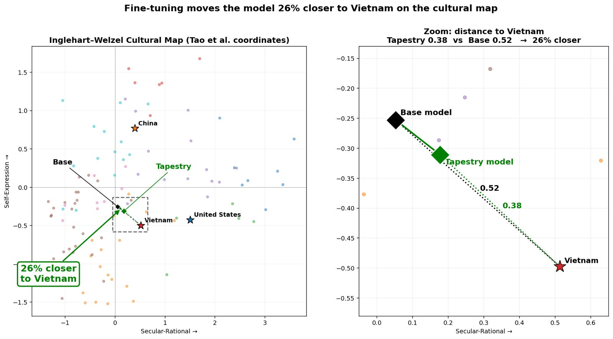

# Base Model Selection

## Purpose

This document focuses on the selection of an open-weights base model family (or perhaps more than one), which is covered by [Issue #25: Select the initial base model](https://github.com/The-AI-Alliance/tapestry/issues/25), part of [TAP-006: Phased Base Model Strategy](../../architecture/decisions/adr-006-phased-base-model.md)

> [!NOTE]
> Some of the following content is taken and adapted from the above sources. As always, please suggest improvements!

## References

* A comprehensive list of models (open and closed) and details about them: [https://models.dev/](https://models.dev/) ([GitHub repo](https://github.com/anomalyco/models.dev)).

## Requirements

What are the requirements the choice has to meet? 

It's important to remember that we intend for the choice of a third-party base model to be temporary while we develop our own FMs (foundation models) from scratch. It's also true that downstream model improvements, continued pre-training (CPT), fine tuning (FT), and reinforcement learning (RL - and variants), should be relatively portable to other models.

However, what is unknown is how long it will take for us to create our own competitive FMs, and so how long will we need to use the third-party models?

> [!NOTE]
> The requirements use a trial numbering scheme **BMS-R#**, for _Base Model Selection, Requirement #_. The intent is support a possible need to aggregate all requirements into one place. Feedback welcome.

### BMS-R1: Weights Are Open

How is _open weights_ (OW) defined exactly? For example,

* BMS-R1A: Zero restrictions on any use - Or will we accept a model with some restrictions on use? 

For 1A, it's useful to consider the [gpt-oss usage policy](https://github.com/openai/gpt-oss/blob/main/USAGE_POLICY), which states:

> We aim for our tools to be used safely, responsibly, and democratically, while maximizing your control over how you use them. By using OpenAI gpt-oss-120b and gpt-oss-20b, you agree to comply with all applicable law.

Most of the models, even those with Apache 2.0 licenses, have policies like this one that explicitly prohibit use of the models to violate any laws. Many also prohibit uses like defamation, misrepresentation, unauthorized impersonation, etc., which may or may not be covered by applicable law.

For our purposes, we consider such restrictions to be equivalent to "zero restrictions", because a reasonable baseline assumption is that no model can be used to violate any laws of the jurisdiction where it is used, even if the model family has no such explicitly-stated policy limitations. We consider "nonzero restrictions" to include prohibitions against unrestricted use of models commercially, in military applications, etc. For example, some models may only allow unrestricted, non-commercial use, whereas commercial use requires a contract of some kind with the model developer.

For reference, here is a summary of kinds of restrictions to consider, adapted from the [this DeepWiki page on IBM Granite Code models](https://deepwiki.com/ibm-granite/granite-code-models/1.2-licensing-and-intended-use):

#### Permissions

| Permission | Description |
| :--------- | :---------- |
| **Commercial Use** | Models can be used in commercial products and services |
| **Modification** | Users can modify the models (e.g., fine-tuning) |
| **Distribution** | Modified versions can be distributed |
| **Patent** | Use	License provides express grant of patent rights from contributors |
| **Private** | Use	Models can be used and modified privately without distribution |

#### Conditions

| Condition | Description |
| :-------- | :---------- |
| **License and Copyright Notice** | Copy of the license and copyright notice must be included with the models |
| **State Changes** | Significant changes made to the models must be documented |

#### Limitations

| Limitation | Description |
| :--------- | :---------- |
| **Trademark Use** | License does not grant trademark rights |
| **Liability** | No liability for damages arising from use |
| **Warranty**  | No warranty provided |

### BMS-R2: Multiple Sizes Are Available

Ultimately, models will be needed that span deployments from edge devices to large data center clusters, with their corresponding application requirements. 

Some open questions:

* BMS-R2A: All model sizes available are open weight - What if a desirable model family keeps its largest-sized models closed?

### BMS-R3: Under Active Development

Given the possibility that we may have to use this model choice for several years, we should focus on candidate model families that remain under active development with no known plans to change to closed weight licensing.

### BMS-R4: Performance Is Competitive

We don't require models to be the very best at all the common, general-purpose benchmarks, but they should be competitive, as one of the general problems Project Tapestry seeks to solve is the challenge previous sovereign models have faced when adoption was poor in part due to insufficiently-strong benchmark performance.

### BMS-R5: Can Be Culturally Aligned

The work of [Issue #22: PoC for alignment based on Ingelhart-Wenzel Cultural Map](https://github.com/The-AI-Alliance/tapestry/issues/22) (part of [TAP-003: Cultural Alignment as the Primary Differentiator]( ../../architecture/decisions/adr-003-cultural-alignment.md)), is exploring the feasibility of tuning for cultural alignment. We anticipate that some model families or architectures will respond better than others at this form of post-training alignment that is a key capability for Project Tapestry.
 
## Candidate Model Families

A starting list of candidates. _Please correct any errors, add additional model families, etc.!_

Key for icons:
| Icon  | Description |
| :---: | :---------- |
| ✅    | Satisfied |
| ⚠️    | Some limitations  |
| ❌    | Requirement not satisfied |
| **?** | To be determined (either we need to find the answer or determine it experimentally) |

| Family   | [R1](#bms-r1-weights-are-open "BMS-R1: Weights Are Open") | [R1A](#bms-r1-weights-are-open "BMS-R1A: Zero restrictions on any use") | [R2](#bms-r2-multiple-sizes-are-available "BMS-R2: Multiple Sizes Are Available") | [R2A](#bms-r2-multiple-sizes-are-available "BMS-R2A: All model sizes available are open weight") | [R3](#bms-r3-under-active-development "BMS-R3: Under Active Development") | [R4](#bms-r4-performance-is-competitive "BMS-R4: Performance Is Competitive") | [R5](#bms-r5-can-be-culturally-aligned "BMS-R5: Can Be Culturally Aligned") | Comments |
| :------- | :--- | :--- | :--- | :--- | :--- | :--- | :--- | :------- |
| Llama    | ✅ | ⚠️ - Some limitations on use | ✅ | ⚠️ - Largest Llama4 models not OW | ❌ - Meta has stopped developing Llama | ✅ | ✅ - See below | Very familiar and widely used, but its future is dim |
| Mistral  | ✅ | ✅ | ✅ | ✅ | ✅ | ✅ | **?** | Built in France with strong EU alignment |
| Qwen     | ✅ | ✅ | ✅ | ✅ | ✅ | ✅ | **?** | Built in China; possible geopolitical concerns |
| DeepSeek | ✅ | ✅ | ⚠️ - Large only | ✅ | ✅ | ✅ | **?** | Built in China; possible geopolitical concerns |
| K2       | ✅ | ✅ | ✅ | **?** | ✅ | **?** | **?** | Built by MBZUI. Strong on Middle East languages | 
| GPT OSS  | ✅ | ✅ | ⚠️ - Limited size choices | ✅ - Larger models not in this family are proprietary | ⚠️ - Will OpenAI keep releasing open-weight versions of GPT OSS? | ✅ | **?** | Built by OpenAI. Is GPT OSS a "one-shot" release or a longer-term strategy? |
| Gemma4   | ✅ | ✅ | ⚠️ - Smaller sizes only today; will Google expand the size choices? | ⚠️ - Larger Google models are proprietary | ⚠️ - Will Google keep releasing updated versions of OW Gemma? | ✅ | **?** | Built by Google |
| Granite  | ✅ | ✅ | ⚠️ - Smaller sizes only | ✅ | ❌ - Granite models program is pivoting to research only | ⚠️ - Constrained because larger sizes not available | **?** | Built by IBM - Good performance and strong data governance, but future development is unlikely |

## Feasibility Study on Cultural Alignment Shift

[Issue #22: PoC for alignment based on Ingelhart-Wenzel Cultural Map](https://github.com/The-AI-Alliance/tapestry/issues/22), part of 
[TAP-003: Cultural Alignment as the Primary Differentiator](../../architecture/decisions/adr-003-cultural-alignment.md), is using Llama 3 models for its experiments, with the goal of producing a feasibility study paper that demonstrates simultaneous (a) socio-cultural alignment shift and (b) no performance (e.g., MMLU) shift. They chose Llama simply because it is available and is simple to post-train, due to its permissive license, it is a densce model (not MoE - mixture of experts), etc.

More generally, we want to iterate on the model choice based on what gives us the lowest resistance path towards the strategic objectives of (a) high/leading performance while (b) affording sovereignty (national, socio-cultural,industrial). Medium-term, we aim to perform CPT (continued pre-training) and ultimately PT from scratch.

Here are some interesting preliminary results (as of June 2026) from work performed by [@nguyennm1024](https://github.com/nguyennm1024), which involves techniques such as rehearsal to avoid catastrophic forgetting.

